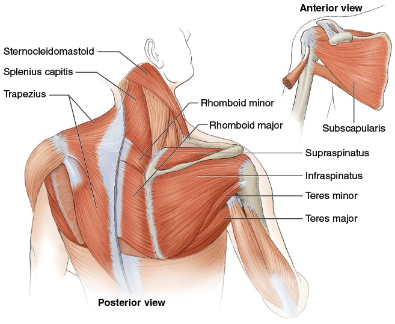
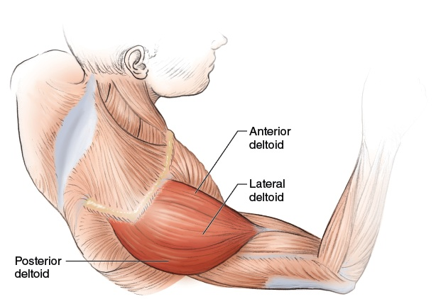
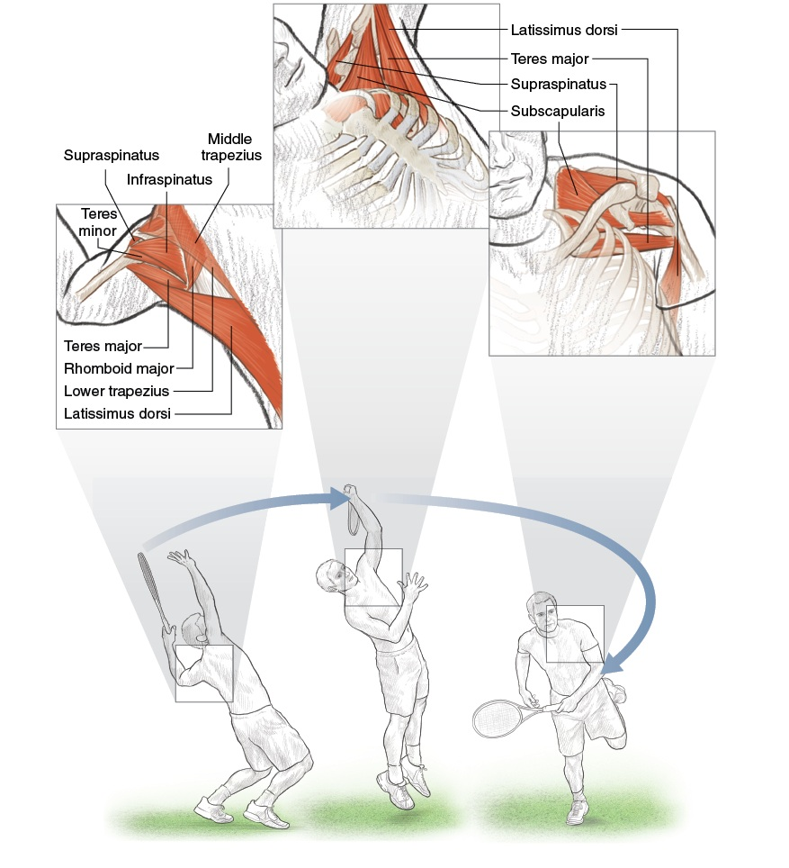

# DD2 — Shoulders | Vai

*Rotator Cuff, Scapular Plane, and Why the Serve Owns Your Shoulder*

---

## 📋 DOCUMENT MAP / BẢN ĐỒ TÀI LIỆU

| 🇺🇸 English | 🇻🇳 Tiếng Việt |
|---|---|
| The shoulder is **the most mobile AND the most injured** joint in tennis. This DD explains why: the anatomy that gives you 180°+ of arm motion is the SAME anatomy that gives you impingement, rotator cuff tears, and biceps tendinitis. | Vai là khớp **di động nhất VÀ hay chấn thương nhất** trong tennis. DD này giải thích vì sao: giải phẫu cho bạn 180°+ tầm vận động cánh tay cũng CHÍNH là giải phẫu cho bạn hội chứng kẹt chóp xoay, rách gân cơ xoay, viêm gân biceps. |
| **What it covers:** the 4-joint shoulder complex, the 4 rotator cuff muscles + their tendons, scapular plane vs frontal plane, why the serve stresses the shoulder 7× more than groundstrokes, shoulder rotation speeds (1,074–2,300°/sec), impingement prevention, and the 6 shoulder exercises the pros use. | **Nội dung:** phức hợp vai 4 khớp, 4 cơ chóp xoay + gân của chúng, scapular plane vs frontal plane, vì sao giao bóng gây stress gấp 7 lần groundstrokes, tốc độ xoay vai (1.074–2.300°/giây), phòng hội chứng kẹt, và 6 bài tập vai của pro. |
| **What it does NOT cover:** the arm/wrist/hand (DD3), upper-back muscle balance (DD4), or hitting mechanics (Forehand/Backhand deep dives). | **Không bao gồm:** cánh tay/cổ tay/bàn tay (DD3), cân bằng cơ lưng trên (DD4), cơ học đánh (Forehand/Backhand deep dives). |
| **Reading time:** 30–40 minutes. | **Thời gian đọc:** 30–40 phút. |

---

## 📑 TABLE OF CONTENTS / MỤC LỤC

| # | English | Tiếng Việt |
|---|---|---|
| 1 | The 4-Joint Shoulder Complex | Phức Hợp Vai 4 Khớp |
| 2 | The Rotator Cuff — 4 Small Muscles, Big Job | Chóp Xoay — 4 Cơ Nhỏ, Việc Lớn |
| 3 | Scapular Plane vs Frontal Plane — Why 30° Forward Matters | Scapular Plane vs Frontal Plane — Vì Sao 30° Về Trước Quan Trọng |
| 4 | The Serve Anatomy — Why It Owns Your Shoulder | Giải Phẫu Giao Bóng — Vì Sao Nó Làm Chủ Vai Bạn |
| 5 | Impingement — The Most Common Tennis Shoulder Injury | Hội Chứng Kẹt — Chấn Thương Vai Phổ Biến Nhất Tennis |
| 6 | The 6 Pro Exercises for Shoulder Longevity | 6 Bài Tập Pro Cho Vai Lâu Bền |

---

* * *

## Chapter 1 — The 4-Joint Shoulder Complex | Chương 1 — Phức Hợp Vai 4 Khớp

| 🇺🇸 English | 🇻🇳 Tiếng Việt |
|---|---|
| **Friend, the "shoulder" you think of is actually 4 joints working together.** Each joint moves slightly differently. Together they give you the largest range of motion in the body. Alone, each joint has limited motion. | **Bạn ơi, "vai" bạn nghĩ thực ra là 4 khớp làm việc cùng nhau.** Mỗi khớp di chuyển hơi khác nhau. Cùng nhau chúng cho bạn tầm vận động lớn nhất cơ thể. Riêng lẻ, mỗi khớp có tầm giới hạn. |
| **The 4 joints:** sternoclavicular (collarbone–breastbone), acromioclavicular (collarbone–shoulder blade tip), glenohumeral (upper arm ball–shoulder socket), scapulothoracic (shoulder blade sliding on rib cage). The glenohumeral alone only gives ~120° of arm elevation. The scapulothoracic adds another ~60°. Without scapular motion, you can't raise your arm fully. | **4 khớp:** ức-đòn (đòn-trên ức), cùng-đòn (đòn-mỏm cùng vai), ổ chảo-cánh tay (chỏm xương cánh tay-ổ chảo), vai-ngực (xương bả vai trượt trên lồng ngực). Chỉ ổ chảo-cánh tay cho ~120° nâng tay. Vai-ngực thêm ~60° nữa. Không có chuyển động bả vai, bạn không nâng tay hết được. |

### The 4-Joint Shoulder Anatomy | Giải Phẫu 4 Khớp Vai

| Joint | Bones | Main Movement | Tennis Role |
|---|---|---|---|
| **Sternoclavicular** (SC) | Clavicle + Sternum | Elevation/depression, protraction/retraction, rotation | First link in kinetic chain. SC retraction + depression starts the backswing. |
| **Acromioclavicular** (AC) | Clavicle + Acromion | Elevation/depression, gliding | Links clavicle to scapula. AC joint stress = "shoulder separation" injury. |
| **Glenohumeral** (GH) | Humerus + Glenoid fossa | Flexion/extension, abduction/adduction, internal/external rotation, circumduction | The "main" shoulder joint. Ball-and-socket. Most mobile, least stable joint in body. |
| **Scapulothoracic** (ST) | Scapula + Rib cage | Elevation/depression, protraction/retraction, upward/downward rotation | Adds 60° to arm elevation. The "platform" for the GH joint. |

### The Scapulohumeral Rhythm — A Key Number | Nhịp Vai-Cánh Tay — Con Số Quan Trọng

| 🇺🇸 English | 🇻🇳 Tiếng Việt |
|---|---|
| **The normal ratio is 2:1.** For every 3° of arm elevation, 2° comes from the glenohumeral joint and 1° comes from scapulothoracic upward rotation. So at 90° arm elevation: ~60° from GH + ~30° from ST. At 180° (arm straight up): ~120° from GH + ~60° from ST. | **Tỉ lệ bình thường là 2:1.** Cứ mỗi 3° nâng tay, 2° đến từ khớp ổ chảo-cánh tay và 1° đến từ scapulothoracic xoay lên. Vậy ở 90° nâng tay: ~60° từ GH + ~30° từ ST. Ở 180° (tay thẳng lên): ~120° từ GH + ~60° từ ST. |
| **The tennis trap:** if the scapula doesn't rotate (weak serratus anterior, tight pec minor), the glenohumeral joint has to make up the difference. The humerus jams into the acromion → impingement. | **Cái bẫy tennis:** nếu bả vai không xoay (serratus anterior yếu, pec minor căng), khớp ổ chảo-cánh tay phải bù. Chỏm xương cánh tay chèn vào mỏm cùng vai → hội chứng kẹt. |
| **The drill:** wall slides. Stand with back to wall, arms in "goalpost" position. Slide arms up overhead maintaining wall contact. If you can't keep contact, your scapula isn't rotating → serratus weakness. | **Bài tập:** wall slide. Đứng lưng tựa tường, tay ở vị trí "goalpost." Trượt tay lên qua đầu duy trì tiếp xúc tường. Nếu bạn không giữ tiếp xúc được, bả vai không xoay → serratus yếu. |

*Source: Roetert & Kovacs, Tennis Anatomy, Ch.2 (Shoulders). All 4 joints and the 2:1 rhythm are detailed in Ch.2 pages 44–50.*

---

* * *

## Chapter 2 — The Rotator Cuff (4 Small Muscles, Big Job) | Chương 2 — Chóp Xoay (4 Cơ Nhỏ, Việc Lớn)

| 🇺🇸 English | 🇻🇳 Tiếng Việt |
|---|---|
| **The rotator cuff is 4 small muscles whose tendons wrap around the head of the humerus.** They are not power producers. They are STABILIZERS. They keep the ball of the humerus centered in the socket during every stroke. | **Chóp xoay là 4 cơ nhỏ có gân quấn quanh chỏm xương cánh tay.** Chúng không phải cơ tạo lực. Chúng là CƠ ỔN ĐỊNH. Chúng giữ chỏm humerus ở trung tâm ổ chảo trong mọi cú đánh. |
| **The mnemonic SITS:** **S**upraspinatus (top), **I**nfraspinatus (back), **T**eres minor (back, lower), **S**ubscapularis (front). Each has a specific job. Together they form a "cuff" around the humeral head. | **Ghi nhớ SITS:** **S**upraspinatus (trên), **I**nfraspinatus (sau), **T**eres minor (sau, dưới), **S**ubscapularis (trước). Mỗi cái có việc riêng. Cùng nhau tạo thành "vòng" quanh chỏm humerus. |

### The 4 Rotator Cuff Muscles | 4 Cơ Chóp Xoay

| # | Muscle | Location | Primary Action | Tennis Role |
|---|---|---|---|---|
| 1 | **Supraspinatus** | Top of scapula, above spine | Initiates arm abduction (first 15°) | First muscle to fire on any overhead motion. Most commonly torn in tennis. |
| 2 | **Infraspinatus** | Back of scapula, below spine | External rotation of shoulder | Critical for deceleration after forehand and serve follow-through. |
| 3 | **Teres minor** | Lower back of scapula | External rotation (with infraspinatus) | Assists infraspinatus. Smaller contribution. |
| 4 | **Subscapularis** | Front of scapula (under surface) | Internal rotation of shoulder | Active during serve acceleration phase. Strongest internal rotator. |

### The Injury Hierarchy — Which One Goes First? | Thứ Tự Chấn Thương — Cái Nào Hỏng Trước?

| Order | Muscle | Why First | Typical Tennis Story |
|---|---|---|---|
| 1 | **Supraspinatus** | Passes through narrow subacromial space (7 mm). Any inflammation → impingement. | "I reached for an overhead and felt a sharp pain." |
| 2 | **Infraspinatus** | Eccentrically loaded during deceleration. Over time, micro-tears accumulate. | "My shoulder aches after long forehand sessions." |
| 3 | **Subscapularis** | Compressed during cocking phase of serve. Repetitive compression → tendinopathy. | "I feel a deep ache in the front of my shoulder after serving." |
| 4 | **Teres minor** | Less commonly injured. Same role as infraspinatus. | Usually injured WITH infraspinatus, not alone. |

### The "Cuff vs Deltoid" Partnership — A 50+ Warning | Quan Hệ "Chóp Xoay vs Deltoid" — Cảnh Báo Cho 50+

| 🇺🇸 English | 🇻🇳 Tiếng Việt |
|---|---|
| **The deltoid is the BIG muscle** that produces arm motion. It can produce up to 300 N of force. The rotator cuff TOTAL produces only ~80 N. So the deltoid is 3–4× stronger than the cuff. | **Deltoid là cơ LỚN** tạo chuyển động cánh tay. Nó có thể tạo tới 300 N lực. Chóp xoay TỔNG chỉ tạo ~80 N. Vậy deltoid mạnh gấp 3–4 lần chóp xoay. |
| **If the cuff is weak:** the deltoid pulls the humerus UP. Without cuff opposition, the humerus translates up, jams into the acromion → impingement → tear. The 50+ cuff is naturally weaker (motor unit loss + sarcopenia). The deltoid is also weaker — but not as much. The ratio shifts. | **Nếu chóp yếu:** deltoid kéo humerus LÊN. Không có chóp chống lại, humerus trượt lên, chèn vào mỏm cùng vai → kẹt → rách. Chóp xoay của 50+ vốn yếu hơn (mất đơn vị vận động + sarcopenia). Deltoid cũng yếu — nhưng không nhiều bằng. Tỉ lệ thay đổi. |
| **The fix:** BEFORE you strengthen the deltoid with overhead pressing, strengthen the cuff. Otherwise the deltoid wins the tug-of-war. Always: cuff first, deltoid second. | **Cách sửa:** TRƯỚC khi bạn tăng sức deltoid với đẩy tạ qua đầu, tăng sức chóp xoay trước. Nếu không deltoid thắng cuộc kéo co. Luôn luôn: chóp trước, deltoid sau. |

*Source: Roetert & Kovacs, Tennis Anatomy, Ch.2 (Shoulders), pages 44–47. Supraspinatus impingement anatomy on page 48.*

---

* * *

## Chapter 3 — Scapular Plane vs Frontal Plane (Why 30° Forward Matters) | Chương 3 — Scapular Plane vs Frontal Plane (Vì Sao 30° Về Trước Quan Trọng)

| 🇺🇸 English | 🇻🇳 Tiếng Việt |
|---|---|
| **Pure frontal plane (arm straight out to the side, 90° abduction)** is the WRONG position for hitting tennis strokes. It puts the humerus in direct conflict with the acromion — impingement waiting to happen. | **Frontal plane thuần (tay duỗi thẳng sang bên, dạng 90°)** là vị trí SAI cho đánh tennis. Nó đặt humerus xung đột trực tiếp với mỏm cùng vai — hội chứng kẹt chờ xảy ra. |
| **Scapular plane** is the position ~30° forward of pure frontal. It is the natural alignment of the glenoid fossa. The humerus sits in the socket with the least bony stress. | **Scapular plane** là vị trí ~30° về trước so với frontal thuần. Nó là sự căn chỉnh tự nhiên của ổ chảo. Humerus ngồi trong ổ với ít stress xương nhất. |

### The Plane Comparison | So Sánh Các Mặt Phẳng

| Plane | Arm Position | Glenohumeral Stress | Tennis Reality |
|---|---|---|---|
| **Frontal plane** | Arm 90° straight out to side | Maximum — humerus compressed against acromion | Bad. Impingement risk. |
| **Scapular plane (30° forward)** | Arm 90° out and slightly forward | Minimum — natural alignment of socket | The IDEAL position for all overhead tennis motions. |
| **Sagittal plane** | Arm straight forward | Moderate — natural for serve toss and follow-through | Used in serving but not in groundstrokes. |

### The Scapular Plane Cue | Câu Nhắc Scapular Plane

| 🇺🇸 English | 🇻🇳 Tiếng Việt |
|---|---|
| **Imagine you're holding a tray of drinks.** Your arms are out in front of you, hands at 11 and 1 o'clock positions. That's roughly the scapular plane — 30° forward of pure frontal. This is where your arm wants to be for any overhead motion. | **Hình dung bạn đang bưng khay nước.** Tay bạn ở phía trước, tay ở vị trí 11 và 1 giờ. Đó là xấp xỉ scapular plane — 30° về trước so với frontal thuần. Đây là nơi cánh tay bạn muốn ở cho mọi chuyển động qua đầu. |
| **The amateur mistake:** the recreational player reaches overhead with the arm in pure frontal plane. The shoulder hurts within 10 shots. The fix: rotate the body so the arm is 30° forward. This is what the pros do naturally. | **Sai lầm nghiệp dư:** người chơi phong trào vươn tay qua đầu ở frontal plane thuần. Vai đau trong 10 cú. Cách sửa: xoay thân để tay ở 30° về trước. Đây là điều pro làm tự nhiên. |

### The "Scaption" Exercise — Training the Plane Right | Bài Tập "Scaption" — Tập Đúng Mặt Phẳng

| Detail | Description |
|---|---|
| **What** | Raise arm in scapular plane (thumb up) instead of pure frontal (palm down). |
| **Why** | Scapular plane recruits middle deltoid AND supraspinatus with minimum impingement. Pure frontal plane over-recruits anterior deltoid, under-recruits supraspinatus. |
| **How** | Hold light dumbbell (<5 lb / 2.3 kg). Raise to shoulder height in 30° forward position. Lower slowly. 2 sets × 12 reps. |
| **Cue** | "Thumb pointing up, lead with the elbow, not the hand." |

*Source: Roetert & Kovacs, Tennis Anatomy, Ch.2 pages 47–48 and exercises on page 50 onward.*

---

* * *

## Chapter 4 — The Serve Anatomy (Why It Owns Your Shoulder) | Chương 4 — Giải Phẫu Giao Bóng (Vì Sao Nó Làm Chủ Vai Bạn)

| 🇺🇸 English | 🇻🇳 Tiếng Việt |
|---|---|
| **The serve is the most demanding stroke in tennis for the shoulder.** It is the only stroke that starts from a stationary position. It combines maximal external rotation (the "loading" phase), explosive internal rotation (the "acceleration" phase), and eccentric deceleration (the "follow-through" phase). | **Giao bóng là cú đòi hỏi vai nhiều nhất tennis.** Đó là cú duy nhất khởi đầu từ vị trí đứng yên. Nó kết hợp xoay ngoài cực đại (pha "nạp"), xoay trong bùng nổ (pha "tăng tốc"), và giảm tốc ly tâm (pha "follow-through"). |
| **The shoulder rotation speed in a serve is 1,074 to 2,300 degrees per second.** That's faster than any other human joint motion in sport. After contact, the cuff must eccentrically decelerate this rotation. If the cuff is weak, the deceleration fails → micro-tears → tendinopathy → tear. | **Tốc độ xoay vai trong giao bóng là 1.074 đến 2.300 độ mỗi giây.** Nhanh hơn bất kỳ chuyển động khớp nào của người trong thể thao. Sau tiếp xúc, chóp xoay phải giảm tốc ly tâm. Nếu chóp yếu, sự giảm tốc thất bại → rách vi thể → bệnh gân → đứt. |

### The 3 Phases of the Serve — Muscle Activity | 3 Pha Giao Bóng — Hoạt Động Cơ

| Phase | Shoulder Position | Primary Muscles Active | % MVC* |
|---|---|---|---|
| **Loading (preparation)** | Maximal external rotation, abduction ~110°, elbow flexed | Supraspinatus, infraspinatus, subscapularis, biceps brachii, serratus anterior | 50–70% |
| **Acceleration (drive to contact)** | Rapid internal rotation, shoulder extension | Pectoralis major, subscapularis, latissimus dorsi, serratus anterior | 70–90% |
| **Follow-through (deceleration)** | Across body, internal rotation completing | Posterior deltoid, infraspinatus, teres minor, trapezius, biceps, latissimus dorsi | 60–80% (eccentric) |

*MVC = Maximum Voluntary Contraction. Numbers from Tennis Anatomy Ch.2 page 47.*

### The Biceps Brachii's Hidden Role | Vai Trò Ẩn Của Biceps

| 🇺🇸 English | 🇻🇳 Tiếng Việt |
|---|---|
| **The long head of biceps brachii** crosses the shoulder joint AND the elbow joint. It originates on the supraglenoid tubercle of the scapula (above the socket). It inserts on the radial tuberosity (below the elbow). When the arm is loaded in external rotation, the long head of biceps is stretched. It provides anterior stability to the shoulder. | **Đầu dài của biceps brachii** bắt chéo khớp vai VÀ khớp khuỷu. Nó nguyên ủy từ supraglenoid tubercle của xương bả vai (phía trên ổ chảo). Nó bám vào radial tuberosity (dưới khuỷu). Khi tay được nạp ở xoay ngoài, đầu dài biceps bị kéo căng. Nó cung cấp ổn định phía trước cho vai. |
| **Tennis implication:** the biceps is not just an elbow flexor. It is a shoulder stabilizer. Heavy biceps curls do NOT substitute for shoulder-specific stabilization work. The "External Rotation" exercise (page 61) is more specific. | **Hệ quả tennis:** biceps không chỉ là cơ gập khuỷu. Nó là cơ ổn định vai. Cuốn tạ biceps nặng KHÔNG thay thế cho bài tập ổn định vai cụ thể. Bài tập "External Rotation" (trang 61) cụ thể hơn. |

### The 3 Numbers Every Server Should Know | 3 Con Số Mỗi Người Giao Bóng Nên Biết

| Number | What It Means | Why It Matters |
|---|---|---|
| **1,074 °/sec** | Average professional serve shoulder rotation speed | If your internal rotation falls below this, your serve has noticeably less pace. |
| **2,300 °/sec** | Top professional serve shoulder rotation speed | The upper limit. Most recreational players max at ~600–800 °/sec. |
| **0.2 sec** | The contact-to-follow-through window | The cuff has 0.2 sec to decelerate the rotation. Any weakness in infraspinatus/teres minor → micro-tear accumulation. |

*Source: Roetert & Kovacs, Tennis Anatomy, Ch.2 pages 47–48. The 1,074–2,300°/sec range is from biomechanical studies cited in Ch.2.*

---

* * *

## Chapter 5 — Impingement (The Most Common Tennis Shoulder Injury) | Chương 5 — Hội Chứng Kẹt (Chấn Thương Vai Phổ Biến Nhất Tennis)

| 🇺🇸 English | 🇻🇳 Tiếng Việt |
|---|---|
| **Impingement = the supraspinatus tendon gets pinched between the humeral head and the acromion.** The subacromial space is normally 7–14 mm wide. Any inflammation reduces it. Repetitive overhead motions (serves, overheads, high volleys) push the humerus up into the acromion. | **Hội chứng kẹt = gân supraspinatus bị kẹp giữa chỏm humerus và mỏm cùng vai.** Khoang dưới mỏm cùng vai bình thường rộng 7–14 mm. Bất kỳ viêm nào cũng giảm nó. Chuyển động qua đầu lặp đi lặp lại (giao bóng, overhead, volley cao) đẩy humerus lên vào mỏm cùng vai. |
| **The pain pattern:** sharp pain on overhead reaches, aching after long sessions, pain lying on the affected side at night. The "painful arc" — pain between 60° and 120° of arm elevation — is the classic sign. | **Mô hình đau:** đau nhói khi vươn qua đầu, nhức sau buổi chơi dài, đau nằm nghiêng bên bị ảnh hưởng ban đêm. "Cung đau" — đau giữa 60° và 120° nâng tay — là dấu hiệu kinh điển. |

### The 5 Causes of Impingement (and the 50+ Reality) | 5 Nguyên Nhân Gây Kẹt (Và Thực Tế 50+)

| # | Cause | Mechanism | 50+ Reality |
|---|---|---|---|
| 1 | **Weak rotator cuff** | Deltoid pulls humerus up; cuff can't oppose | Cuff motor units decline 30–50% by age 70. The 50+ cuff is naturally weaker. |
| 2 | **Tight pectoralis minor** | Pulls scapula forward and down; reduces ST rotation | Sitting at desk all day → pec minor shortens. Worse after 50. |
| 3 | **Poor scapular control** | Scapula doesn't upward-rotate; humerus jams | Serratus anterior weakness. Common in recreational players. |
| 4 | **Subacromial bursitis** | Inflammation of bursa (lubricating sac); takes up space | Repetitive overhead → bursitis → less space → impingement. |
| 5 | **Acromion shape** | Type III "hooked" acromion reduces subacromial space | Genetic. Cannot be changed. Manage around it. |

### The Neer Test — A Simple Self-Check | Test Neer — Tự Kiểm Tra Đơn Giản

| 🇺🇸 English | 🇻🇳 Tiếng Việt |
|---|---|
| **Stand facing a mirror. Raise your affected arm overhead in the scapular plane (30° forward). Have someone press down on your arm just above the elbow while you resist.** Pain = positive test. | **Đứng đối diện gương. Nâng tay bị ảnh hưởng qua đầu trong scapular plane (30° về trước). Nhờ ai đó ấn xuống cánh tay ngay trên khuỷu trong khi bạn kháng.** Đau = test dương tính. |
| **If positive:** don't panic. Impingement is reversible in most cases. The fix is NOT to stop playing. The fix is to (a) strengthen the cuff, (b) stretch the pec minor, (c) train serratus anterior. 6–12 weeks of consistent work usually resolves it. | **Nếu dương tính:** đừng hoảng. Hội chứng kẹt hồi phục được trong hầu hết trường hợp. Cách sửa KHÔNG PHẢI ngừng chơi. Cách sửa là (a) tăng sức chóp xoay, (b) giãn pec minor, (c) tập serratus anterior. 6–12 tuần tập đều thường giải quyết. |

### The 50+ Impingement Truth — Don't Reach Up Like a 25-Year-Old | Sự Thật Về Kẹt Ở 50+ — Đừng Vươn Lên Như Người 25 Tuổi

| 🇺🇸 English | 🇻🇳 Tiếng Việt |
|---|---|
| **Your subacromial space narrows with age** because the supraspinatus tendon degenerates and the bursa thickens. A 60-year-old shoulder has 2–4 mm less clearance than a 25-year-old shoulder. | **Khoang dưới mỏm cùng vai của bạn hẹp lại theo tuổi** vì gân supraspinatus thoái hóa và bao hoạt dịch dày lên. Vai người 60 tuổi có ít hơn 2–4 mm khoảng trống so với vai người 25. |
| **The implication:** the high overhead serve that worked at 25 may cause impingement at 60. The fix is NOT to give up the overhead. The fix is to (a) warm up the cuff specifically before serving, (b) reduce the number of serves per session, (c) use a kick serve instead of a flat serve (less shoulder stress), (d) strengthen the cuff between sessions. | **Hệ quả:** cú giao bóng cao qua đầu làm việc ở 25 tuổi có thể gây kẹt ở 60. Cách sửa KHÔNG PHẢI bỏ overhead. Cách sửa là (a) khởi động chóp xoay cụ thể trước khi giao, (b) giảm số cú giao mỗi buổi, (c) dùng kick serve thay flat serve (ít stress vai hơn), (d) tăng sức chóp giữa các buổi. |

*Source: Roetert & Kovacs, Tennis Anatomy, Ch.10 (Common Tennis Injuries), page 263 onward.*

---

* * *

## Chapter 6 — The 6 Pro Exercises for Shoulder Longevity | Chương 6 — 6 Bài Tập Pro Cho Vai Lâu Bền

| 🇺🇸 English | 🇻🇳 Tiếng Việt |
|---|---|
| **These are the 6 exercises from Tennis Anatomy Chapter 2 that the pros use to keep the shoulder healthy.** They focus on cuff strength, scapular control, and balanced front/back development. | **Đây là 6 bài tập từ Chương 2 Tennis Anatomy mà pro dùng để giữ vai khỏe.** Chúng tập trung vào sức chóp xoay, kiểm soát bả vai, và phát triển cân bằng trước/sau. |
| **The principle:** the shoulder is balanced when (a) cuff is 70–80% as strong as deltoid, (b) scapular stabilizers can hold the scapula still against perturbation, (c) external rotators (infraspinatus + teres minor) match internal rotators (subscapularis + pec). Most recreational players have over-strong pec and under-strong external rotators. This ratio is the seed of impingement. | **Nguyên lý:** vai cân bằng khi (a) chóp xoay mạnh bằng 70–80% deltoid, (b) cơ ổn định bả vai giữ bả vai yên khi bị xáo trộn, (c) cơ xoay ngoài (infraspinatus + teres minor) ngang với cơ xoay trong (subscapularis + pec). Hầu hết người chơi phong trào có pec quá mạnh và cơ xoay ngoài quá yếu. Tỉ lệ này là hạt giống của hội chứng kẹt. |

### The 6 Pro Shoulder Exercises | 6 Bài Tập Vai Pro

| # | Exercise | Target | Tennis Role | How To |
|---|---|---|---|---|
| **1** | **Front Raise** | Anterior deltoid + lateral deltoid | Forehand acceleration, high balls | Stand, dumbbells (<10 lb / 4.5 kg), palms down. Raise to shoulder height. Hold 2 sec. 2×12 reps. |
| **2** | **Lateral Raise** | Lateral deltoid | Backhand groundstroke acceleration, serve backswing | Stand, palms facing thighs. Raise arms out to sides to shoulder height. Hold 2 sec. 2×12 reps. |
| **3** | **Bent-Over Rear Raise** | Posterior deltoid + teres major + rhomboids | DECELERATION after every stroke | Bend at waist, back straight. Raise forearms with 90° elbow to shoulder height. Hold 2 sec. 2×12 reps. |
| **4** | **Elbow-to-Hip Scapular Retraction** | Trapezius + infraspinatus + rhomboids | Scapular stability for ALL strokes | Arms at 90°/90°. Slowly lower elbows to hips by squeezing shoulder blades together. Hold 2–4 sec. 2×12 reps. |
| **5** | **External Rotation** | Infraspinatus + teres minor (CUFF) | DECELERATION, forehand backswing | Tubing, elbow at side at 90°. Rotate forearm outward against resistance. Hold 2 sec. 2×10–12 reps each side. |
| **6** | **Low Row** | Posterior deltoid + rhomboids + lower trapezius | One-handed backhand, posture, deceleration | Tubing attached low. Push hands back keeping arms straight, squeeze shoulder blades. Hold 2 sec. 2×12 reps. |

### The Critical 50+ Progression — Cuff First | Tiến Trình Quan Trọng Cho 50+ — Chóp Trước

| 🇺🇸 English | 🇻🇳 Tiếng Việt |
|---|---|
| **The order of exercises MATTERS.** If you do Front Raise (#1) and Lateral Raise (#2) BEFORE you do External Rotation (#5), the deltoid fatigue will inhibit the cuff. The cuff needs to be fresh when you train it. | **Thứ tự bài tập QUAN TRỌNG.** Nếu bạn làm Front Raise (#1) và Lateral Raise (#2) TRƯỚC External Rotation (#5), deltoid mỏi sẽ ức chế chóp xoay. Chóp xoay cần tươi khi bạn tập nó. |
| **The 50+ recommended order:** (5) External Rotation → (4) Elbow-to-Hip → (3) Bent-Over Rear Raise → (6) Low Row → (2) Lateral Raise → (1) Front Raise. Cuff work FIRST, then scapular, then posterior, then anterior. | **Thứ tự khuyến nghị cho 50+:** (5) External Rotation → (4) Elbow-to-Hip → (3) Bent-Over Rear Raise → (6) Low Row → (2) Lateral Raise → (1) Front Raise. Chóp xoay TRƯỚC, rồi bả vai, rồi sau, rồi trước. |
| **Frequency:** 2 sessions per week. NOT 5. The cuff is small. It needs 48–72 hours to recover. Train it too often → it gets weaker, not stronger. | **Tần suất:** 2 buổi mỗi tuần. KHÔNG 5. Chóp xoay nhỏ. Nó cần 48–72 giờ để hồi phục. Tập quá thường xuyên → nó yếu đi, không mạnh lên. |

### The 5-Color Tagging for Shoulder Health | Hệ Thẻ 5 Màu Cho Sức Khỏe Vai

| Color | Tag | Meaning | Action |
|---|---|---|---|
| 🔴 | **Cuff strength** | The 4 small muscles working | Train 2×/week, External Rotation first |
| 🟠 | **Scapular control** | Serratus anterior + lower trapezius | Elbow-to-Hip, wall slides daily |
| 🟡 | **Posterior deltoid** | The "brake" muscle | Bent-Over Rear Raise, Low Row |
| 🟢 | **Anterior deltoid + pec** | The "gas pedal" muscle | Front Raise, last in the routine |
| 🔵 | **Thoracic mobility** | The bucket-handle rotation | Thoracic rotation drill before serving |

*Source: Roetert & Kovacs, Tennis Anatomy, Ch.2 pages 50–73. The 6 exercises are from pages 50 (Front Raise), 53 (Lateral Raise), 56 (Bent-Over Rear Raise), 59 (Elbow-to-Hip), 61 (External Rotation), 71 (Low Row).*

---

* * *

## 📋 DD2 CARD — Printable / THẺ IN ĐƯỢC DD2

╔═══════════════════════════════════════════════════════════╗
║  DD2 CARD — SHOULDERS                                     ║
║  THẺ DD2 — VAI                                            ║
╠═══════════════════════════════════════════════════════════╣
║                                                            ║
║  🎯 ONE BIG IDEA / Ý TƯỞNG CỐT LÕI:                      ║
║     The shoulder is the most mobile AND the most injured  ║
║     joint. The 4 rotator cuff muscles stabilize the       ║
║     humeral head during every stroke. Train the cuff       ║
║     BEFORE the deltoid, and you'll play pain-free past 70.║
║                                                            ║
║     Vai là khớp di động nhất VÀ hay chấn thương nhất.     ║
║     4 cơ chóp xoay ổn định chỏm humerus trong mọi cú.   ║
║     Tập chóp TRƯỚC deltoid, bạn sẽ chơi không đau qua 70.║
║                                                            ║
║  ────────────────────────────────────────────────────────  ║
║  KEY NUMBERS / CÁC CON SỐ CHÍNH:                          ║
║  • Scapulohumeral rhythm 2:1 (GH:ST ratio for elevation)  ║
║  • Subacromial space 7–14 mm (50+ reduces by 2–4 mm)     ║
║  • Shoulder rotation 1,074–2,300°/sec in serve           ║
║  • Deltoid:Cuff force ratio 3–4:1 (must keep cuff >70%)   ║
║  • Scapular plane = 30° forward of pure frontal plane     ║
║                                                            ║
║  ────────────────────────────────────────────────────────  ║
║  ⚠️ TOP MISTAKE / LỖI PHỔ BIẾN NHẤT:                     ║
║     Training the deltoid (Front Raise, Overhead Press)    ║
║     BEFORE the cuff (External Rotation). The deltoid      ║
║     pulls the humerus up; if the cuff can't oppose it,    ║
║     the humerus jams into the acromion → impingement.     ║
║                                                            ║
║  ────────────────────────────────────────────────────────  ║
║  🔁 DRILL / BÀI TẬP:                                       ║
║     The "50+ Cuff-First" routine (2×/week):                ║
║     1. External Rotation with tubing, 2×12 each arm        ║
║     2. Elbow-to-Hip scapular retraction, 2×12             ║
║     3. Bent-Over Rear Raise, 2×12                         ║
║     4. Low Row, 2×12                                       ║
║     5. Lateral Raise, 2×12                                ║
║     6. Front Raise, 2×12                                  ║
║     Always cuff first (5→4→3→6→2→1).                       ║
║                                                            ║
║  ────────────────────────────────────────────────────────  ║
║  💭 MASTER CUE / CÂU NHẮC TỔNG:                           ║
║     "Cuff first, deltoid second."                          ║
║     "Chóp trước, deltoid sau."                            ║
║                                                            ║
╚═══════════════════════════════════════════════════════════╝

╔═══════════════════════════════════════════════════════════╗
║  DD2 CARD — SHOULDERS                                     ║
║  THẺ DD2 — VAI                                            ║
╠═══════════════════════════════════════════════════════════╣
║                                                            ║
║  🎯 ONE BIG IDEA / Ý TƯỞNG CỐT LÕI:                      ║
║     The shoulder is the most mobile AND the most injured  ║
║     joint. The 4 rotator cuff muscles stabilize the       ║
║     humeral head during every stroke. Train the cuff       ║
║     BEFORE the deltoid, and you'll play pain-free past 70.║
║                                                            ║
║     Vai là khớp di động nhất VÀ hay chấn thương nhất.     ║
║     4 cơ chóp xoay ổn định chỏm humerus trong mọi cú.   ║
║     Tập chóp TRƯỚC deltoid, bạn sẽ chơi không đau qua 70.║
║                                                            ║
║  ────────────────────────────────────────────────────────  ║
║  KEY NUMBERS / CÁC CON SỐ CHÍNH:                          ║
║  • Scapulohumeral rhythm 2:1 (GH:ST ratio for elevation)  ║
║  • Subacromial space 7–14 mm (50+ reduces by 2–4 mm)     ║
║  • Shoulder rotation 1,074–2,300°/sec in serve           ║
║  • Deltoid:Cuff force ratio 3–4:1 (must keep cuff >70%)   ║
║  • Scapular plane = 30° forward of pure frontal plane     ║
║                                                            ║
║  ────────────────────────────────────────────────────────  ║
║  ⚠️ TOP MISTAKE / LỖI PHỔ BIẾN NHẤT:                     ║
║     Training the deltoid (Front Raise, Overhead Press)    ║
║     BEFORE the cuff (External Rotation). The deltoid      ║
║     pulls the humerus up; if the cuff can't oppose it,    ║
║     the humerus jams into the acromion → impingement.     ║
║                                                            ║
║  ────────────────────────────────────────────────────────  ║
║  🔁 DRILL / BÀI TẬP:                                       ║
║     The "50+ Cuff-First" routine (2×/week):                ║
║     1. External Rotation with tubing, 2×12 each arm        ║
║     2. Elbow-to-Hip scapular retraction, 2×12             ║
║     3. Bent-Over Rear Raise, 2×12                         ║
║     4. Low Row, 2×12                                       ║
║     5. Lateral Raise, 2×12                                ║
║     6. Front Raise, 2×12                                  ║
║     Always cuff first (5→4→3→6→2→1).                       ║
║                                                            ║
║  ────────────────────────────────────────────────────────  ║
║  💭 MASTER CUE / CÂU NHẮC TỔNG:                           ║
║     "Cuff first, deltoid second."                          ║
║     "Chóp trước, deltoid sau."                            ║
║                                                            ║
╚═══════════════════════════════════════════════════════════╝

---

## 🖼️ ILLUSTRATIONS / HÌNH MINH HỌA

*All 20 images sourced from the Tennis Anatomy PDF (Roetert & Kovacs, 2011), Chapter 2: Shoulders. Located in `Anatomy_Lab/images/DD2_shoulders/`.*

### Figure 1 — Muscles of the Scapula and Rotator Cuff | Hình 1 — Cơ Bả Vai và Chóp Xoay

*Shows the 4 rotator cuff muscles (supraspinatus, infraspinatus, teres minor, subscapularis) and surrounding scapular muscles.*

 (Tennis Anatomy Ch.2, Figure 2.1)

### Figure 2 — Deltoid Muscle (Anterior, Lateral, Posterior Heads) | Hình 2 — Cơ Deltoid (3 Phần)

 (Figure 2.2)

### Figure 3 — Changes in Humeral Head Position During Serve | Hình 3 — Thay Đổi Vị Trí Chỏm Humerus Trong Giao Bóng

*Critical image — shows how the humeral head translates UP if the cuff is weak, JAMMING into the acromion. This is impingement visualized.*

 (Figure 2.3)

### Figures 4–20 — Exercise Demonstrations | Hình 4–20 — Minh Họa Bài Tập

| Exercise | Image | Tennis Anatomy Figure |
|---|---|---|
| Front Raise (anterior deltoid) | `DD2_shoulders_pdf04.jpeg` | Figure 2.4 |
| Front Raise — step-by-step | `DD2_shoulders_pdf05.jpeg` | Figure 2.5 |
| Lateral Raise (lateral deltoid) | `DD2_shoulders_pdf06.jpeg` | Figure 2.6 |
| Lateral Raise — arm position | `DD2_shoulders_pdf07.jpeg` | Figure 2.7 |
| Bent-Over Rear Raise | `DD2_shoulders_pdf08.jpeg` | Figure 2.8 |
| Bent-Over Rear Raise — elbows at 90° | `DD2_shoulders_pdf09.jpeg` | Figure 2.9 |
| Elbow-to-Hip Scapular Retraction | `DD2_shoulders_pdf10.jpeg` | Figure 2.10 |
| Elbow-to-Hip — squeezing shoulder blades | `DD2_shoulders_pdf11.jpeg` | Figure 2.11 |
| External Rotation with tubing | `DD2_shoulders_pdf12.jpeg` | Figure 2.12 |
| External Rotation — full extension | `DD2_shoulders_pdf13.jpeg` | Figure 2.13 |
| External Rotation with towel between elbow and side | `DD2_shoulders_pdf14.jpeg` | Figure 2.14 (variation) |
| 90/90 External Rotation With Abduction | `DD2_shoulders_pdf15.jpeg` | Figure 2.15 |
| 90/90 External Rotation — end range | `DD2_shoulders_pdf16.jpeg` | Figure 2.16 |
| 90/90 Internal Rotation With Abduction | `DD2_shoulders_pdf17.jpeg` | Figure 2.17 |
| 90/90 Internal Rotation — start position | `DD2_shoulders_pdf18.jpeg` | Figure 2.18 |
| Low Row (posterior deltoid + rhomboids) | `DD2_shoulders_pdf19.jpeg` | Figure 2.19 |
| Low Row — end position | `DD2_shoulders_pdf20.jpeg` | Figure 2.20 |

*All image filenames verified to exist in `Anatomy_Lab/images/DD2_shoulders/`.*

---

## 🔗 CROSS-REFERENCES / THAM CHIẾU CHÉO

| Topic in DD2 | See Also |
|---|---|
| Shoulder abduction 90° in scapular plane | **DD1 Player in Motion** — the 6 critical angles at contact |
| Biceps brachii shoulder stabilization | **DD3 Arms, Wrists & Hands** — cubital tunnel, ulnar nerve, tennis elbow |
| Scapular control / serratus anterior | **DD4 Trunk & Spine** — latissimus dorsi originates on T7–L5 |
| Thoracic rotation for serve | **DD4 Trunk & Spine** — 3-layer back, hip hinge |
| Serve deceleration stress | **DD1 Player in Motion** — kinetic chain, follow-through phase |
| Impingement after 50 | **DD8 Control System** — proprioception decline, vision changes |
| Wall slides for scapular control | **DD4 Trunk & Spine** — thoracic rotation drill |

---

## 📚 SOURCES / NGUỒN

| Source | Type | What It Contributed |
|---|---|---|
| `Tennis Knowledge/7.Tennis Books in pdf/Tennis Anatomy ( PDFDrive ).pdf` | Primary reference (Roetert & Kovacs, 2011) | Ch.2 entire content: 4-joint anatomy, SITS mnemonic, scapulohumeral rhythm 2:1, subacromial space 7–14 mm, 1,074–2,300°/sec, 6 exercises, all 20 illustrations |
| `Tennis Knowledge/7.Tennis Books in pdf/Tennis Anatomy ( PDFDrive ).pdf` Ch.10 (Injuries) | Same PDF | Impingement pathology, subacromial bursitis, cuff tears |

---

*End of DD2 — Shoulders | Hết DD2 — Vai*

*Next: DD3 — Arms, Wrists & Hands (Grip Anatomy, Ulnar Nerve, 27 Hand Bones) | Tiếp: DD3 — Cánh Tay, Cổ Tay & Bàn Tay (Giải Phẫu Grip, Thần Kinh Trụ, 27 Xương Bàn Tay)*