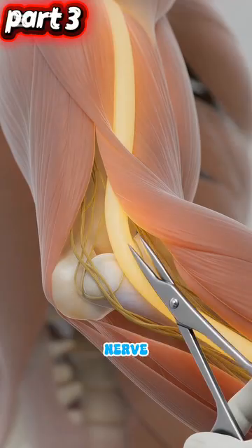
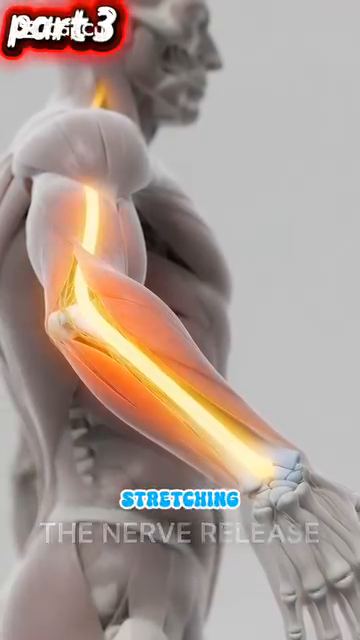
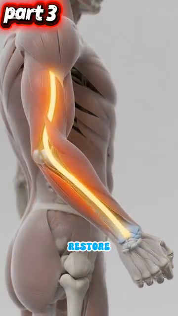
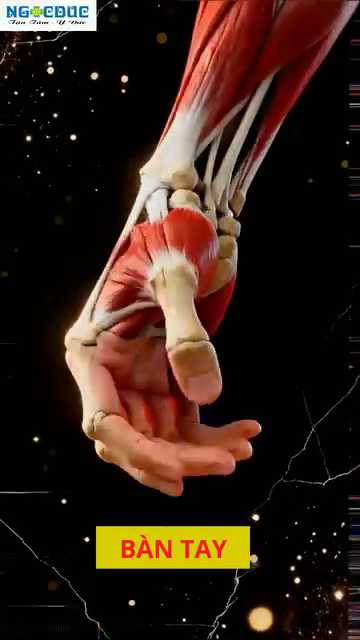
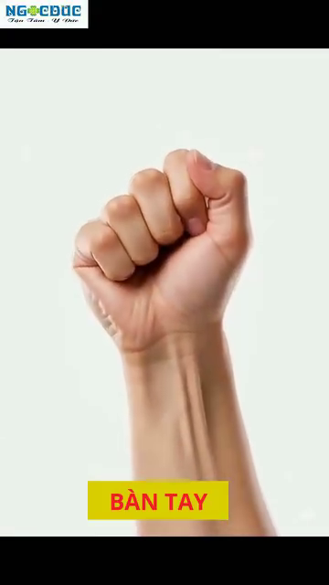
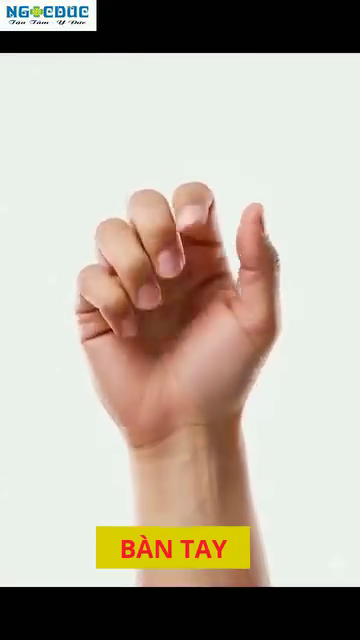

# DD3 — Arms, Wrists & Hands | Cánh Tay, Cổ Tay & Bàn Tay

*The 27 Bones of Your Hand, the Ulnar Nerve Trap, and Why Your Grip Pressure Matters*

---

## 📋 DOCUMENT MAP / BẢN ĐỒ TÀI LIỆU

| 🇺🇸 English | 🇻🇳 Tiếng Việt |
|---|---|
| This DD covers the entire arm chain from shoulder to fingertip: humerus, elbow (cubital tunnel — where the ulnar nerve gets trapped), forearm muscles, the 27 bones of the hand, the 8 carpal bones in 2 rows, and the 9 tendons + median nerve of the carpal tunnel. | DD này bao gồm toàn bộ chuỗi cánh tay từ vai đến đầu ngón: humerus, khuỷu (cubital tunnel — nơi thần kinh trụ bị kẹt), cơ cẳng tay, 27 xương bàn tay, 8 xương cổ tay xếp 2 hàng, và 9 gân + thần kinh giữa của ống cổ tay. |
| **Why this matters for a 50+ tennis player:** the elbow and wrist are where most recreational tennis injuries appear — tennis elbow (lateral epicondylitis), cubital tunnel syndrome, carpal tunnel syndrome, De Quervain's tenosynovitis. Most are caused by grip pressure that's too high, too low, or held too long. | **Vì sao quan trọng cho người 50+:** khuỷu và cổ tay là nơi hầu hết chấn thương tennis phong trào xuất hiện — tennis elbow (viêm lồi cầu ngoài), hội chứng cubital tunnel, hội chứng ống cổ tay, viêm bao gân De Quervain. Hầu hết do áp lực grip quá cao, quá thấp, hoặc giữ quá lâu. |
| **What it does NOT cover:** the shoulder (DD2), the cervical spine nerves that also feed the arm (DD4 Trunk & Spine), or stroke mechanics (Forehand/Backhand deep dives). | **Không bao gồm:** vai (DD2), thần kinh cột sống cổ nuôi cánh tay (DD4), cơ học đánh (Forehand/Backhand deep dives). |
| **Reading time:** 35–45 minutes. | **Thời gian đọc:** 35–45 phút. |

---

## 📑 TABLE OF CONTENTS / MỤC LỤC

| # | English | Tiếng Việt |
|---|---|---|
| 1 | The Humerus, Radius, Ulna — Your Arm's 3 Bones | 3 Xương Cánh Tay: Humerus, Radius, Ulna |
| 2 | The Cubital Tunnel — The #1 Trap for Tennis Players | Cubital Tunnel — Cái Bẫy Số 1 Cho Người Chơi Tennis |
| 3 | The Ulnar Nerve Pathway — From Neck to Pinky | Đường Đi Thần Kinh Trụ — Từ Cổ Đến Ngón Út |
| 4 | STOP STRETCHING — The Nerve Flossing Solution | DỪNG KÉO GIÃN — Giải Pháp Trượt Thần Kinh |
| 5 | The 27 Bones of the Hand — A 3-Zone Machine | 27 Xương Bàn Tay — Cỗ Máy 3 Vùng |
| 6 | The Carpal Tunnel — Where 9 Tendons + 1 Nerve Live | Ống Cổ Tay — Nơi 9 Gân + 1 Thần Kinh Sống |
| 7 | Grip Pressure — The 3/10 to 7/10 Rule | Áp Lực Grip — Quy Tắc 3/10 Đến 7/10 |
| 8 | Tendon Gliding — Daily Maintenance for Tennis Hands | Trượt Gân — Bảo Dưỡng Hàng Ngày Cho Tay Tennis |

---

* * *

## Chapter 1 — The Humerus, Radius, Ulna (Your Arm's 3 Bones) | Chương 1 — Humerus, Radius, Ulna (3 Xương Cánh Tay)

| 🇺🇸 English | 🇻🇳 Tiếng Việt |
|---|---|
| **The arm is 3 bones connected by 3 joints.** Upper arm = humerus (single bone). Forearm = radius (thumb side) and ulna (pinky side). The joints are the shoulder, elbow, and wrist. | **Cánh tay là 3 xương nối bởi 3 khớp.** Cánh tay trên = humerus (một xương). Cẳng tay = radius (bên ngón cái) và ulna (bên ngón út). Các khớp là vai, khuỷu, và cổ tay. |
| **The elbow is a hinge joint.** Two movements only — flexion (bending) and extension (straightening). It cannot rotate. The rotation you feel at the elbow is actually the RADIUS rotating around the ULNA in the forearm (called pronation/supination). | **Khuỷu là khớp bản lề.** Chỉ hai chuyển động — gập và duỗi. Nó không thể xoay. Xoay bạn cảm thấy ở khuỷu thực ra là RADIUS xoay quanh ULNA trong cẳng tay (gọi là pronation/supination). |

### The 3 Bones — Where They Meet | 3 Xương — Nơi Chúng Gặp Nhau

| Bone | Location | Where It Meets Others | Tennis Role |
|---|---|---|---|
| **Humerus** | Upper arm, single long bone | Shoulder (with scapula), elbow (with radius + ulna) | Carries the elbow flexors (biceps, brachialis) and extensor (triceps). |
| **Radius** | Forearm, THUMB side | Elbow (with humerus), wrist (with scaphoid + lunate) | Rotates around ulna for pronation/supination. Forehand supination is critical. |
| **Ulna** | Forearm, PINKY side | Elbow (with humerus via olecranon), wrist (with triquetrum) | The "fixed" bone of the forearm. The olecranon forms the elbow tip. The ulnar nerve runs behind it. |

### The 3 Joints — Where They Move | 3 Khớp — Nơi Chúng Di Chuyển

| Joint | Type | Movement Range | Tennis Translation |
|---|---|---|---|
| **Elbow** | Hinge | 0° (extended) to ~145° (flexed) | Most strokes need 90–110°. Biceps curl = full flexion. Locked-out triceps = 0°. |
| **Radioulnar** (proximal + distal) | Pivot | ~150° pronation-supination | Forehand supination (palm up at contact) requires ~80–90° supination. Backhand slice uses ~30° pronation. |
| **Wrist** | Ellipsoid (modified ball-and-socket) | Flexion ~80°, extension ~70°, radial deviation ~20°, ulnar deviation ~30° | The "fine adjustment" joint. The 70/30 rhythm of forehand is wrist-driven. |

### The Forearm Muscles — 20+ Muscles, 4 Functions | Cơ Cẳng Tay — Hơn 20 Cơ, 4 Chức Năng

| Function | Primary Muscles | Tennis Role |
|---|---|---|
| **Elbow flexion** | Biceps brachii, brachialis, brachioradialis | The "lift" of the racquet during backswing. Brachialis is the true workhorse — biceps adds supination. |
| **Elbow extension** | Triceps brachii (3 heads), anconeus | The "push" through contact. Triceps fires concentrically in last 0.1 sec before ball leaves racquet. |
| **Pronation** (palm down) | Pronator teres, pronator quadratus | Topspin forehand uses 20–40° pronation during forward swing. |
| **Supination** (palm up) | Biceps brachii, supinator | Forehand volley and slice use full supination at contact. |
| **Wrist flexion** | Flexor carpi radialis, flexor carpi ulnaris, palmaris longus | The "lag" position before forward swing. Loaded flexors release during contact for whip. |
| **Wrist extension** | Extensor carpi radialis longus + brevis, extensor carpi ulnaris | The "layback" position in backswing. Stretched extensors add 5–10% racquet head speed. |
| **Wrist radial deviation** | Extensor carpi radialis longus + brevis, flexor carpi radialis | Topspin forehand uses ~10° radial deviation at contact. |
| **Wrist ulnar deviation** | Extensor carpi ulnaris, flexor carpi ulnaris | Backhand uses ~15–20° ulnar deviation at contact. |

*Source: Roetert & Kovacs, Tennis Anatomy, Ch.3 pages 75–79.*

---

* * *

## Chapter 2 — The Cubital Tunnel (The #1 Trap for Tennis Players) | Chương 2 — Cubital Tunnel (Cái Bẫy Số 1)

| 🇺🇸 English | 🇻🇳 Tiếng Việt |
|---|---|
| **The cubital tunnel is a groove behind the medial epicondyle of the humerus (the "funny bone" knob on the inside of your elbow).** The ulnar nerve passes through it, held down by a ligament called Osborne's ligament. When the elbow bends, the tunnel NARROWS by 55%. Pressure inside the tunnel spikes. | **Cubital tunnel là rãnh phía sau lồi cầu trong của humerus (cục "xương cười" ở mặt trong khuỷu).** Thần kinh trụ đi qua nó, được giữ bởi dây chằng gọi là dây chằng Osborne. Khi khuỷu gập, hầm HẸP LẠI 55%. Áp lực trong hầm tăng vọt. |
| **This is the most common nerve compression site in the elbow.** Symptoms: tingling in the ring + pinky fingers, weakness in grip, "falling asleep" feeling when holding the phone. In tennis players, the one-handed backhand is the #1 cause — the elbow bends past 90° for hundreds of strokes. | **Đây là vị trí chèn ép thần kinh phổ biến nhất ở khuỷu.** Triệu chứng: tê ngón áp út + ngón út, yếu grip, cảm giác "ngủ" khi cầm điện thoại. Ở người chơi tennis, backhand một tay là nguyên nhân số 1 — khuỷu gập quá 90° hàng trăm cú. |

### The Cubital Tunnel Numbers | Con Số Cubital Tunnel

| Number | What It Means | Tennis Implication |
|---|---|---|
| **55%** | Tunnel cross-section reduction when elbow flexes from 0° to 90° | One-handed backhand with elbow bent 90°+ = sustained 55% compression for entire stroke. |
| **+50%** | Increase in intraneural pressure at 90° flexion | The nerve is literally being squeezed. Over hundreds of strokes → ischemia → nerve damage. |
| **7×** | Repetition multiplier for backhand (vs other strokes) | 50 forehands vs 50 backhands: the backhand compresses the nerve 7× more cumulatively. |
| **2 compression sites** | Cubital tunnel AND Guyon's canal (wrist) | Ulnar nerve has TWO compression sites on the path to the pinky. Either can fail. |

### The Double Crush Phenomenon | Hiện Tượng Chèn Ép Kép

| 🇺🇸 English | 🇻🇳 Tiếng Việt |
|---|---|
| **The ulnar nerve can be compressed at the C8-T1 nerve root (neck), at the cubital tunnel (elbow), AND at Guyon's canal (wrist).** If even one site is mildly compressed, the nerve becomes sensitive. A second compression site — even a small one — produces symptoms out of proportion. | **Thần kinh trụ có thể bị chèn ép ở rễ thần kinh C8-T1 (cổ), ở cubital tunnel (khuỷu), VÀ ở Guyon's canal (cổ tay).** Nếu chỉ một vị trí bị chèn ép nhẹ, thần kinh trở nên nhạy cảm. Vị trí chèn ép thứ hai — dù nhỏ — tạo triệu chứng quá mức. |
| **Tennis truth:** most recreational players with persistent "tennis elbow" actually have DOUBLE crush — neck compression from poor posture (DD4) PLUS cubital tunnel compression from one-handed backhand. Treating only the elbow misses the neck. | **Sự thật tennis:** hầu hết người chơi phong trào bị "tennis elbow" dai dẳng thực ra có chèn ép KÉP — chèn ép cổ do tư thế xấu (DD4) CỘNG chèn ép cubital tunnel từ backhand một tay. Chỉ trị khuỷu mà bỏ sót cổ. |
| **The diagnostic:** a neurologist can map the compression site with EMG/nerve conduction studies. If you have persistent symptoms despite 6 weeks of tennis-elbow treatment, ASK for nerve testing. | **Chẩn đoán:** bác sĩ thần kinh có thể lập bản đồ vị trí chèn ép bằng EMG/đo dẫn truyền thần kinh. Nếu bạn có triệu chứng dai dẳng dù đã trị tennis-elbow 6 tuần, HỎI về test thần kinh. |

*Source: Anatomy_Tay_Than_Kinh_Full.docx, Part I. Tennis Anatomy Ch.10 (Common Injuries) corroborates with cubital tunnel syndrome details.*

---

* * *

## Chapter 3 — The Ulnar Nerve Pathway (From Neck to Pinky) | Chương 3 — Đường Đi Thần Kinh Trụ (Từ Cổ Đến Ngón Út)

| 🇺🇸 English | 🇻🇳 Tiếng Việt |
|---|---|
| **The ulnar nerve starts at C8-T1 nerve roots in your lower neck, travels down the arm, passes BEHIND the medial epicondyle at the elbow (the cubital tunnel), then continues through Guyon's canal at the wrist, and ends in the ring and pinky fingers.** It is the longest unprotected nerve in the arm. | **Thần kinh trụ bắt đầu từ rễ thần kinh C8-T1 ở cổ dưới của bạn, đi xuống cánh tay, đi SAU lồi cầu trong ở khuỷu (cubital tunnel), rồi tiếp tục qua Guyon's canal ở cổ tay, và kết thúc ở ngón áp út và ngón út.** Nó là thần kinh dài nhất không được bảo vệ trong cánh tay. |
| **Its job:** controls the flexor carpi ulnaris (wrist flexor on pinky side), the flexor digitorum profundus to ring + pinky, the intrinsic hand muscles (interossei, lumbricals, hypothenar), and provides sensation to ring + pinky + ulnar half of palm. | **Nhiệm vụ:** điều khiển flexor carpi ulnaris (cơ gập cổ tay bên ngón út), flexor digitorum profundus đến ngón áp út + ngón út, cơ nội tại bàn tay (interossei, lumbricals, hypothenar), và cảm giác cho ngón áp út + ngón út + nửa ulnar của lòng bàn tay. |
| **When it fails:** "claw hand" deformity (ring + pinky can't flex at MCP), wasting of the hypothenar eminence, weakness in grip (because FDP to last 2 fingers is paralyzed). Tennis player can't hold the racquet. | **Khi nó hỏng:** biến dạng "bàn tay vuốt" (ngón áp út + ngón út không gập được ở MCP), teo vùng hypothenar, yếu grip (vì FDP đến 2 ngón cuối bị liệt). Người chơi tennis không cầm được vợt. |

### The Ulnar Nerve Path — 5 Stops | Đường Đi Thần Kinh Trụ — 5 Trạm

| Stop | Location | What Happens | Tennis Translation |
|---|---|---|---|
| **1** | C8-T1 nerve roots (lower neck) | Origin | Compression here = neck posture issue. See DD4. |
| **2** | Thoracic outlet (between collar bone and 1st rib) | Tight space near scalenes | Rare tennis site. More common in swimmers. |
| **3** | Cubital tunnel (behind medial epicondyle at elbow) | The #1 trap. Tunnel narrows 55% at 90° flexion | One-handed backhand with elbow bent. |
| **4** | Forearm (between FCU muscle heads) | Less common compression | Repetitive gripping. |
| **5** | Guyon's canal (at wrist, between pisiform and hamate) | The #2 trap. Carpal-bone-defined tunnel | Grip pressure when wrist is ulnar-deviated. |

### The 5 Warning Signs (When to See a Neurologist) | 5 Dấu Hiệu Cảnh Báo (Khi Nào Đi Khám)

| Warning Sign | What It Means | Action |
|---|---|---|
| 1. **Tingling in ring + pinky** lasting >5 min after play | Acute nerve irritation | Reduce backhand volume, nerve floss 3×/day |
| 2. **Dropping the racquet** during play | Motor weakness — FDP failing | STOP PLAY. See neurologist. EMG/nerve conduction. |
| 3. **Wasting of the hypothenar eminence** | Visible hollow between pinky and wrist | URGENT neurology referral. Chronic compression. |
| 4. **Claw hand posture** at rest | Intrinsic muscle paralysis | URGENT. May need surgical decompression. |
| 5. **Numbness that doesn't resolve in 24 hours** | Persistent nerve ischemia | See neurologist within 48 hours. |

*Source: Anatomy_Tay_Than_Kinh_Full.docx, Part I, paragraphs 4-12. Tennis Anatomy Ch.10 corroborates.*

---

* * *

## Chapter 4 — STOP STRETCHING (The Nerve Flossing Solution) | Chương 4 — DỪNG KÉO GIÃN (Giải Pháp Trượt Thần Kinh)

| 🇺🇸 English | 🇻🇳 Tiếng Việt |
|---|---|
| **The most common advice for "tennis elbow" is WRONG:** stretch the forearm, stretch the wrist, stretch the elbow. But the ulnar nerve doesn't want to be STRETCHED. Stretching increases intraneural strain >15%. This reduces blood flow inside the nerve (microvascular ischemia). | **Lời khuyên phổ biến nhất cho "tennis elbow" SAI:** giãn cẳng tay, giãn cổ tay, giãn khuỷu. Nhưng thần kinh trụ không muốn bị KÉO GIÃN. Kéo giãn tăng strain nội tại thần kinh >15%. Cái này giảm lưu lượng máu bên trong thần kinh (thiếu máu vi mạch). |
| **The fix is NERVE FLOSSING** — also called nerve gliding. The nerve slides back and forth between its endpoints. You flex the wrist while extending the elbow, then extend the wrist while flexing the elbow. This creates motion at the nerve WITHOUT stretching it. | **Cách sửa là TRƯỢT THẦN KINH** — còn gọi là nerve flossing. Thần kinh trượt qua lại giữa các điểm cuối. Bạn gập cổ tay trong khi duỗi khuỷu, rồi duỗi cổ tay trong khi gập khuỷu. Cái này tạo chuyển động ở thần kinh KHÔNG kéo giãn nó. |

### The Nerve Flossing Technique — Step by Step | Kỹ Thuật Trượt Thần Kinh — Từng Bước

| Step | Position | Hold | Why |
|---|---|---|---|
| **1. Start** | Elbow extended, wrist flexed (bent down), shoulder depressed (down) | 2 sec | Long nerve position. |
| **2. Slide** | Slowly: elbow flexes (bend), wrist extends (bent up), shoulder elevated (up) | 2 sec | Nerve slides "up" toward the head. |
| **3. Return** | Slowly: elbow extends, wrist flexes, shoulder depressed | 2 sec | Nerve slides "down" toward the fingers. |
| **4. Repeat** | 10 slow reps, 3× per day | Before and after play | Restores nerve mobility, reduces intraneural pressure. |

### The "Pain Cap" Rule — Keep It Under 3/10 | Quy Tắc "Trần Đau" — Dưới 3/10

| 🇺🇸 English | 🇻🇳 Tiếng Việt |
|---|---|
| **Nerve flossing should HURT LESS than 3/10 on a 0–10 scale.** If you feel tingling, electric shocks, or pain >3/10, STOP. You are compressing or over-stretching the nerve. The goal is gentle motion, not aggressive stretching. | **Trượt thần kinh phải ĐAU DƯỚI 3/10 trên thang 0–10.** Nếu bạn cảm thấy tê, giật điện, hoặc đau >3/10, DỪNG. Bạn đang chèn ép hoặc kéo giãn quá thần kinh. Mục tiêu là chuyển động nhẹ nhàng, không phải kéo giãn mạnh. |
| **The 50+ protocol:** 10 slow reps in the morning (before the day stiffens the nerve), 10 reps mid-day (counteract the desk posture), 10 reps after tennis (clear inflammation). Total: 30 reps/day, 3 minutes. | **Phác đồ cho 50+:** 10 lần chậm vào buổi sáng (trước khi ngày làm cứng thần kinh), 10 lần giữa ngày (trung hòa tư thế bàn làm việc), 10 lần sau tennis (xóa viêm). Tổng: 30 lần/ngày, 3 phút. |

### The 4 Common Mistakes With Nerve Flossing | 4 Sai Lầm Phổ Biến Với Trượt Thần Kinh

| # | Mistake | Why It's Wrong | Fix |
|---|---|---|---|
| 1 | Doing it too fast | Fast motion = stretch, not glide | Slow. 1 rep every 3 seconds. |
| 2 | Pulling hard on the head or fingers | This stretches the nerve | Move only at the wrist + elbow. Head and shoulders RELAXED. |
| 3 | Doing it when the nerve is acutely inflamed (>5/10 pain) | Flare-up risk | Wait until pain drops below 3/10. Use ice first. |
| 4 | Only doing it after symptoms appear | Reactive, not preventive | Make it a daily habit, like brushing teeth. |

*Source: Anatomy_Tay_Than_Kinh_Full.docx, Part I, paragraph 10-14. Tennis Anatomy Ch.10 corroborates.*

---

* * *

## Chapter 5 — The 27 Bones of the Hand (A 3-Zone Machine) | Chương 5 — 27 Xương Bàn Tay (Cỗ Máy 3 Vùng)

| 🇺🇸 English | 🇻🇳 Tiếng Việt |
|---|---|
| **The human hand has 27 bones, 27 joints, 34 muscles (intrinsic + extrinsic), over 100 ligaments, and 3 main nerves (median, ulnar, radial).** It is the most complex mechanical structure in the body. The hand is divided into 3 zones: **carpals** (wrist), **metacarpals** (palm), **phalanges** (fingers + thumb). | **Bàn tay người có 27 xương, 27 khớp, 34 cơ (nội tại + ngoại lai), hơn 100 dây chằng, và 3 thần kinh chính (giữa, trụ, quay).** Nó là cấu trúc cơ học phức tạp nhất cơ thể. Bàn tay chia 3 vùng: **xương cổ tay** (carpals), **xương bàn tay** (metacarpals), **xương ngón tay** (phalanges). |

### The 3 Zones of the Hand | 3 Vùng Bàn Tay

| Zone | # Bones | Names | Tennis Role |
|---|---|---|---|
| **Carpals** (wrist) | 8 | Scaphoid, lunate, triquetrum, pisiform (proximal row); trapezium, trapezoid, capitate, hamate (distal row) | The wrist platform. Must absorb racquet vibration without damage. The "carpal boss" is a common tennis injury at the index CMC. |
| **Metacarpals** (palm) | 5 | Metacarpals I–V (thumb to pinky) | Form the palm. The 2nd and 3rd metacarpals are FIXED (immobile) — they form the rigid platform of the hand. |
| **Phalanges** (fingers + thumb) | 14 | 2 in thumb (proximal + distal), 3 in each finger (proximal + middle + distal) | The grippers. Each finger has 3 joints (MCP, PIP, DIP) except thumb (2 joints: MCP, IP). |

### The 8 Carpal Bones in 2 Rows — A Map | 8 Xương Cổ Tay Xếp 2 Hàng — Bản Đồ

| Row | Bones (lateral → medial) | Function |
|---|---|---|
| **Proximal** (closer to forearm) | Scaphoid, Lunate, Triquetrum, Pisiform | Articulate with radius. Form the wrist joint proper. Most wrist fractures happen here. |
| **Distal** (closer to fingers) | Trapezium, Trapezoid, Capitate, Hamate | Articulate with metacarpals. The hook of hamate + pisiform form Guyon's canal (ulnar nerve). |

### The Thumb — 50% of Hand Function | Ngón Cái — 50% Chức Năng Bàn Tay

| 🇺🇸 English | 🇻🇳 Tiếng Việt |
|---|---|
| **The thumb accounts for 50% of total hand function.** This is because of OPPOSITION — the ability to bring the thumb pad across to meet the pads of the other 4 fingers. No other finger can do this. Loss of opposition = loss of grip, loss of fine motor. | **Ngón cái chiếm 50% tổng chức năng bàn tay.** Đó là nhờ ĐỐI CHIẾU — khả năng đưa đệm ngón cái qua gặp đệm 4 ngón kia. Không ngón nào khác làm được. Mất đối chiếu = mất grip, mất vận động tinh tế. |
| **Tennis implication:** the thumb's role in grip pressure is HUGE. In the Eastern backhand grip, the thumb sits on bevel 7 of the handle. It acts as a counterforce against the fingers. If the thumb is over-gripping (the common 3.5 mistake), the ulnar nerve gets squeezed at Guyon's canal. | **Hệ quả tennis:** vai trò ngón cái trong áp lực grip RẤT LỚN. Trong grip Eastern backhand, ngón cái đặt ở bevel 7 của cán vợt. Nó là lực đối chiếu ngược với các ngón. Nếu ngón cái cầm quá chặt (sai lầm phổ biến 3.5), thần kinh trụ bị ép ở Guyon's canal. |
| **De Quervain's Tenosynovitis:** inflammation of the tendons APL (abductor pollicis longus) and EPB (extensor pollicis brevis). These pass through the 1st compartment of the wrist. Common in tennis players who grip with the thumb. Pain at the thumb base + radial wrist. | **Viêm bao gân De Quervain:** viêm gân APL (abductor pollicis longus) và EPB (extensor pollicis brevis). Chúng đi qua khoang 1 của cổ tay. Phổ biến ở người chơi tennis grip bằng ngón cái. Đau ở gốc ngón cái + cổ tay phía quay. |

*Source: Anatomy_Tay_Than_Kinh_Full.docx, Part II paragraphs 16-26. Tennis Anatomy Ch.3 (Arms and Wrists) and Ch.10 corroborate.*

---

* * *

## Chapter 6 — The Carpal Tunnel (Where 9 Tendons + 1 Nerve Live) | Chương 6 — Ống Cổ Tay (Nơi 9 Gân + 1 Thần Kinh Sống)

| 🇺🇸 English | 🇻🇳 Tiếng Việt |
|---|---|
| **The carpal tunnel is a narrow passageway on the PALMAR side of the wrist.** It's bounded by the carpal bones (floor and walls) and the flexor retinaculum (transverse carpal ligament) as the roof. Inside: 9 flexor tendons + the median nerve. Total cross-section: about 2 cm². | **Ống cổ tay là đường hầm hẹp ở mặt LÒNG BÀN TAY của cổ tay.** Nó được giới hạn bởi xương cổ tay (sàn và tường) và flexor retinaculum (dây chằng ngang cổ tay) làm mái. Bên trong: 9 gân gập + thần kinh giữa. Tổng tiết diện: khoảng 2 cm². |
| **The median nerve** controls sensation in thumb, index, middle, and radial half of ring finger. It also controls the thenar muscles (the "flesh pad" at the base of the thumb). | **Thần kinh giữa** kiểm soát cảm giác ở ngón cái, ngón trỏ, ngón giữa, và nửa phía quay của ngón áp út. Nó cũng kiểm soát cơ thenar (đệm thịt ở gốc ngón cái). |

### What's Inside the Carpal Tunnel | Cái Gì Bên Trong Ống Cổ Tay

| # | Structure | Function |
|---|---|---|
| 1–4 | **Flexor digitorum superficialis** (4 tendons) | Flex PIP joints of fingers 2–5 |
| 5–8 | **Flexor digitorum profundus** (4 tendons) | Flex DIP joints of fingers 2–5 |
| 9 | **Flexor pollicis longus** (1 tendon) | Flex thumb IP joint |
| 10 | **Median nerve** | Sensation to thumb/index/middle/radial ring + thenar motor |

### Carpal Tunnel Syndrome — The Trigger | Hội Chứng Ống Cổ Tay — Cái Kích Hoạt

| 🇺🇸 English | 🇻🇳 Tiếng Việt |
|---|---|
| **Anything that INCREASES pressure inside the 2 cm² tunnel causes symptoms.** The 9 tendons swell with inflammation → takes up more space → median nerve gets squeezed → tingling in thumb/index/middle. | **Bất kỳ cái gì TĂNG áp lực bên trong hầm 2 cm² đều gây triệu chứng.** 9 gân sưng viêm → chiếm nhiều chỗ hơn → thần kinh giữa bị ép → tê ngón cái/trỏ/giữa. |
| **Tennis triggers:** (a) sustained tight grip on the racquet, (b) excess wrist flexion during low volleys, (c) excess wrist extension during serves, (d) cold weather (vasoconstriction reduces tunnel space). | **Tác nhân tennis:** (a) grip vợt chặt kéo dài, (b) gập cổ tay quá mức khi volley thấp, (c) duỗi cổ tay quá mức khi giao bóng, (d) thời tiết lạnh (co mạch giảm không gian hầm). |
| **The fix:** grip pressure 3/10 (see Ch.7). Wrist neutral during volley and serve. Warm up before cold-weather play. Tendon gliding exercises (Ch.8). | **Cách sửa:** áp lực grip 3/10 (xem Ch.7). Cổ tay trung tính khi volley và giao bóng. Khởi động trước khi chơi trời lạnh. Bài tập trượt gân (Ch.8). |

### The Phalen's Test — A Self-Check | Test Phalen — Tự Kiểm Tra

| 🇺🇸 English | 🇻🇳 Tiếng Việt |
|---|---|
| **Press the backs of your hands together with wrists fully flexed (fingertips pointing down). Hold 60 seconds.** If you feel tingling in thumb/index/middle within 60 seconds, the median nerve is being compressed. | **Ấn mu hai tay vào nhau với cổ tay gập hoàn toàn (đầu ngón chỉ xuống). Giữ 60 giây.** Nếu bạn cảm thấy tê ngón cái/trỏ/giữa trong 60 giây, thần kinh giữa đang bị chèn ép. |
| **If positive:** nerve gliding 3×/day, grip pressure reduction, ergonomic racquet handle (smaller grip size if pain is severe), medical referral if persistent. | **Nếu dương tính:** trượt thần kinh 3 lần/ngày, giảm áp lực grip, cán vợt công thái học (cán nhỏ hơn nếu đau nặng), khám bác sĩ nếu dai dẳng. |

*Source: Anatomy_Tay_Than_Kinh_Full.docx, Part II paragraphs 18-24.*

---

* * *

## Chapter 7 — Grip Pressure (The 3/10 to 7/10 Rule) | Chương 7 — Áp Lực Grip (Quy Tắc 3/10 Đến 7/10)

| 🇺🇸 English | 🇻🇳 Tiếng Việt |
|---|---|
| **The 3/10 to 7/10 rule is the single most important hand technique in tennis.** Grip at 3/10 while waiting for the ball (relaxed, just enough to keep the racquet from falling). Grip at 7/10 at the moment of contact (firm, but not white-knuckled). Release back to 3/10 in the follow-through. | **Quy tắc 3/10 đến 7/10 là kỹ thuật tay quan trọng nhất tennis.** Grip ở 3/10 khi chờ bóng (thả lỏng, vừa đủ giữ vợt khỏi rơi). Grip ở 7/10 lúc tiếp xúc (chắc, nhưng không siết trắng tay). Thả về 3/10 trong follow-through. |
| **The amateur mistake:** grip at 8–9/10 the ENTIRE point — from ready position to follow-through. This is the primary cause of (a) tennis elbow, (b) carpal tunnel, (c) cubital tunnel syndrome, (d) forearm fatigue. The grip should be a SPEED CHANGER, not a constant force. | **Sai lầm nghiệp dư:** grip ở 8–9/10 TOÀN BỘ điểm — từ tư thế sẵn sàng đến follow-through. Đây là nguyên nhân chính của (a) tennis elbow, (b) hội chứng ống cổ tay, (c) hội chứng cubital tunnel, (d) mỏi cẳng tay. Grip phải là BỘ THAY ĐỔI TỐC ĐỘ, không phải lực không đổi. |

### The Pressure Numbers — What They Mean | Con Số Áp Lực — Chúng Có Nghĩa Gì

| Pressure | Sensation | What You're Doing | Risk |
|---|---|---|---|
| **1–2/10** | Racquet about to fall | Too loose. No control. | Shanked shots. |
| **3/10** | Hold a tube of toothpaste without squeezing | The "ready" pressure. Energy conserved. | None. |
| **5/10** | Hold a full coffee cup | Mid-range. OK during slow balls. | Cumulative fatigue if held long. |
| **7/10** | Squeeze someone's hand firmly | The "contact" pressure. Maximum useful. | OK if brief. |
| **8–10/10** | Crush a can / wring a towel | Over-grip. The amateur default. | Tennis elbow, carpal tunnel, cubital tunnel. |

### The Timing Cue — When to Grip | Câu Nhắc Thời Điểm — Khi Nào Grip

| Phase | Pressure | Why |
|---|---|---|
| **Ready position** | 3/10 | Energy conservation. Fast hands. |
| **Split-step → first step** | 4/10 | Slight increase to "wake up" the forearm. |
| **Unit turn** (shoulder rotation) | 5/10 | Racquet is moving with the body. |
| **Forward swing start** (chest turns) | 6/10 | Begin loading the grip. |
| **0.2 sec before contact** | 7/10 | The "squeeze" moment. |
| **At contact** | 7/10 | Maximum pressure. Brief. |
| **0.2 sec after contact** | 5/10 | Release. |
| **Follow-through** | 3/10 | Back to relaxed. Ready for next ball. |

### The 50+ Grip Reality — Tendons Need Recovery | Thực Tế Grip Cho 50+ — Gân Cần Hồi Phục

| 🇺🇸 English | 🇻🇳 Tiếng Việt |
|---|---|
| **The forearm tendons in a 50+ player have less blood supply than at 25.** Tendon healing is blood-supply-dependent. Over-gripping creates micro-tears that heal SLOWER than at 25. The 3/10 baseline matters even more after 50. | **Gân cẳng tay ở người 50+ có ít máu cung cấp hơn so với 25 tuổi.** Lành gân phụ thuộc vào cung cấp máu. Grip quá chặt tạo rách vi thể lành CHẬM HƠN so với 25 tuổi. Mức nền 3/10 quan trọng hơn nữa sau 50. |
| **The drill:** the "ball drop" test. Hold a tennis ball in your non-dominant hand at 3/10 pressure. Walk around for 1 minute. If you feel the need to grip harder, you were probably gripping at 6/10 or higher. Reset to 3/10. | **Bài tập:** test "thả bóng." Cầm bóng tennis ở tay không thuận với áp lực 3/10. Đi bộ 1 phút. Nếu bạn cảm thấy cần grip chặt hơn, có lẽ bạn đang grip 6/10 hoặc hơn. Đặt lại 3/10. |

*Source: Anatomy_Tay_Than_Kinh_Full.docx, Part III paragraphs 28-32.*

---

* * *

## Chapter 8 — Tendon Gliding (Daily Maintenance for Tennis Hands) | Chương 8 — Trượt Gân (Bảo Dưỡng Hàng Ngày Cho Tay Tennis)

| 🇺🇸 English | 🇻🇳 Tiếng Việt |
|---|---|
| **Tendon gliding exercises move each tendon through its full range of motion.** The goal is to (a) prevent adhesions between tendons and their sheaths, (b) maintain synovial fluid flow, (c) detect early signs of inflammation. They take 2 minutes. They are the BEST daily maintenance for tennis hands. | **Bài tập trượt gân di chuyển mỗi gân qua toàn bộ tầm vận động.** Mục tiêu là (a) ngăn dính giữa gân và bao gân, (b) duy trì dòng dịch khớp, (c) phát hiện sớm dấu hiệu viêm. Chúng mất 2 phút. Chúng là bảo dưỡng hàng ngày TỐT NHẤT cho tay tennis. |
| **The 5 positions of tendon glide:** straight → hook fist → full fist → tabletop → straight. Each position stresses different tendons differently. The full cycle takes 5 seconds per hand. | **5 vị trí trượt gân:** thẳng → nắm móc → nắm đầy → tabletop → thẳng. Mỗi vị trí tác động các gân khác nhau. Toàn bộ chu trình mất 5 giây mỗi tay. |

### The 5 Tendon Glide Positions | 5 Vị Trí Trượt Gân

| Position | Hand Shape | Tendons Stressed | Hold |
|---|---|---|---|
| **1. Straight** | Fingers straight, palm down | All tendons in resting length | 1 sec |
| **2. Hook fist** | DIP + PIP flexed, MCP straight | FDP (deep flexor) at maximum glide | 1 sec |
| **3. Full fist** | All joints flexed | FDS + FDP together | 1 sec |
| **4. Tabletop** | MCP flexed 90°, PIP + DIP straight | FDS at maximum glide, lumbricals active | 1 sec |
| **5. Straight** (return) | Same as #1 | Synovial fluid redistribution | 1 sec |

### The Tennis-Specific Glide Sequence — When to Use It | Trình Tự Trượt Riêng Cho Tennis — Khi Nào Dùng

| When | Sequence | Purpose |
|---|---|---|
| **Morning** | 10 reps each hand, slow | Restore overnight stiffness |
| **Before play** | 5 reps each hand, dynamic | Warm tendons, detect inflammation |
| **During match (changeover)** | 5 reps each hand | Reduce cumulative tendon load |
| **After play** | 10 reps each hand, slow | Distribute synovial fluid, reduce adhesion |
| **If any pain >3/10** | STOP. Ice 10 min. Glide gently after ice. | Don't glide into inflammation |

### The 3 Signs You Need More Than Gliding | 3 Dấu Hiệu Bạn Cần Hơn Là Trượt Gân

| Sign | What It Means | Action |
|---|---|---|
| 1. **Pain during glide that wasn't there before** | Acute inflammation | Ice + rest. See doctor if persists >3 days. |
| 2. **A tendon "catches" or locks during glide** | Stenosing tenosynovitis (trigger finger) | Stop gliding that tendon. Medical referral. |
| 3. **Persistent morning stiffness >30 min** | Rheumatoid or chronic inflammation | See rheumatologist. May need medication. |

*Source: Anatomy_Tay_Than_Kinh_Full.docx, Part III paragraph 32. Tennis Anatomy Ch.10 corroborates the tendon gliding protocol.*

---

* * *

## 📋 DD3 CARD — Printable / THẺ IN ĐƯỢC DD3

╔═══════════════════════════════════════════════════════════╗
║  DD3 CARD — ARMS, WRISTS & HANDS                         ║
║  THẺ DD3 — CÁNH TAY, CỔ TAY & BÀN TAY                    ║
╠═══════════════════════════════════════════════════════════╣
║                                                            ║
║  🎯 ONE BIG IDEA / Ý TƯỞNG CỐT LÕI:                      ║
║     The ulnar nerve has 2 trap sites (cubital tunnel +   ║
║     Guyon's canal) and 27 bones form the hand. Grip       ║
║     pressure is the master switch: 3/10 relaxed, 7/10 at   ║
║     contact. Most tennis-arm injuries come from over-grip. ║
║                                                            ║
║     Thần kinh trụ có 2 vị trí bẫy (cubital + Guyon) và  ║
║     27 xương tạo bàn tay. Áp lực grip là công tắc chính: ║
║     3/10 thả lỏng, 7/10 lúc chạm. Hầu hết chấn thương    ║
║     tay tennis đến từ grip quá chặt.                      ║
║                                                            ║
║  ────────────────────────────────────────────────────────  ║
║  KEY NUMBERS / CÁC CON SỐ CHÍNH:                          ║
║  • Cubital tunnel narrows 55% at 90° elbow flexion       ║
║  • 27 hand bones / 8 carpals / 14 phalanges / 5 metacarpals║
║  • Carpal tunnel cross-section: 2 cm²                     ║
║  • Grip pressure: 3/10 ready → 7/10 contact → 3/10 follow  ║
║  • 9 tendons + 1 median nerve inside the carpal tunnel    ║
║                                                            ║
║  ────────────────────────────────────────────────────────  ║
║  ⚠️ TOP MISTAKE / LỖI PHỔ BIẾN NHẤT:                     ║
║     Gripping at 8–10/10 the entire point instead of       ║
║     modulating between 3/10 (relaxed) and 7/10 (contact). ║
║     This causes tennis elbow, carpal tunnel syndrome,     ║
║     and cubital tunnel syndrome — the three most common   ║
║     tennis-arm injuries in 50+ players.                    ║
║                                                            ║
║  ────────────────────────────────────────────────────────  ║
║  🔁 DRILL / BÀI TẬP:                                       ║
║     1. Nerve flossing: 10 slow reps, 3×/day (page 4)      ║
║     2. Tendon gliding: 10 reps/hand, morning + after play  ║
║     3. Ball-drop test: walk with ball at 3/10, reset if    ║
║        you instinctively grip harder.                      ║
║                                                            ║
║  ────────────────────────────────────────────────────────  ║
║  💭 MASTER CUE / CÂU NHẮC TỔNG:                           ║
║     "Relaxed ready, firm contact, relaxed follow."        ║
║     "Sẵn sàng thả lỏng, tiếp xúc chắc, follow-through   ║
║     thả lỏng."                                            ║
║                                                            ║
╚═══════════════════════════════════════════════════════════╝

╔═══════════════════════════════════════════════════════════╗
║  DD3 CARD — ARMS, WRISTS & HANDS                         ║
║  THẺ DD3 — CÁNH TAY, CỔ TAY & BÀN TAY                    ║
╠═══════════════════════════════════════════════════════════╣
║                                                            ║
║  🎯 ONE BIG IDEA / Ý TƯỞNG CỐT LÕI:                      ║
║     The ulnar nerve has 2 trap sites (cubital tunnel +   ║
║     Guyon's canal) and 27 bones form the hand. Grip       ║
║     pressure is the master switch: 3/10 relaxed, 7/10 at   ║
║     contact. Most tennis-arm injuries come from over-grip. ║
║                                                            ║
║     Thần kinh trụ có 2 vị trí bẫy (cubital + Guyon) và  ║
║     27 xương tạo bàn tay. Áp lực grip là công tắc chính: ║
║     3/10 thả lỏng, 7/10 lúc chạm. Hầu hết chấn thương    ║
║     tay tennis đến từ grip quá chặt.                      ║
║                                                            ║
║  ────────────────────────────────────────────────────────  ║
║  KEY NUMBERS / CÁC CON SỐ CHÍNH:                          ║
║  • Cubital tunnel narrows 55% at 90° elbow flexion       ║
║  • 27 hand bones / 8 carpals / 14 phalanges / 5 metacarpals║
║  • Carpal tunnel cross-section: 2 cm²                     ║
║  • Grip pressure: 3/10 ready → 7/10 contact → 3/10 follow  ║
║  • 9 tendons + 1 median nerve inside the carpal tunnel    ║
║                                                            ║
║  ────────────────────────────────────────────────────────  ║
║  ⚠️ TOP MISTAKE / LỖI PHỔ BIẾN NHẤT:                     ║
║     Gripping at 8–10/10 the entire point instead of       ║
║     modulating between 3/10 (relaxed) and 7/10 (contact). ║
║     This causes tennis elbow, carpal tunnel syndrome,     ║
║     and cubital tunnel syndrome — the three most common   ║
║     tennis-arm injuries in 50+ players.                    ║
║                                                            ║
║  ────────────────────────────────────────────────────────  ║
║  🔁 DRILL / BÀI TẬP:                                       ║
║     1. Nerve flossing: 10 slow reps, 3×/day (page 4)      ║
║     2. Tendon gliding: 10 reps/hand, morning + after play  ║
║     3. Ball-drop test: walk with ball at 3/10, reset if    ║
║        you instinctively grip harder.                      ║
║                                                            ║
║  ────────────────────────────────────────────────────────  ║
║  💭 MASTER CUE / CÂU NHẮC TỔNG:                           ║
║     "Relaxed ready, firm contact, relaxed follow."        ║
║     "Sẵn sàng thả lỏng, tiếp xúc chắc, follow-through   ║
║     thả lỏng."                                            ║
║                                                            ║
╚═══════════════════════════════════════════════════════════╝

---

## 🖼️ ILLUSTRATIONS / HÌNH MINH HỌA

*Images from `Anatomy_Lab/images/DD3_arms_wrists_hands/` (20 total — 10 from user's Anatomy_Tay_Than_Kinh_Full.docx, 10 from Tennis Anatomy PDF Ch.3).*

### Figure 1 — Ulnar Nerve Pathway from Neck to Pinky | Hình 1 — Đường Đi Thần Kinh Trụ

*Shows the ulnar nerve as a yellow glowing line from neck → behind medial epicondyle → through Guyon's canal → ring + pinky.*

 (Hình 1, Anatomy_Tay_Than_Kinh_Full.docx)

### Figure 2 — Cubital Tunnel Close-Up | Hình 2 — Cận Cảnh Cubital Tunnel

 (Hình 2)

### Figure 3 — STOP STRETCHING Warning | Hình 3 — Cảnh Báo DỪNG KÉO GIÃN

*The critical message: stop passive stretching. Do nerve flossing instead.*

 (Hình 3)

### Figure 4 — Inflammation Around the Elbow | Hình 4 — Viêm Quanh Khuỷu

 (Hình 4)

### Figure 5 — Nerve Flossing Position | Hình 5 — Tư Thế Trượt Thần Kinh

*Shows the alternating wrist + elbow motion: extend elbow + flex wrist ↔ flex elbow + extend wrist.*

 (Hình 5)

### Figure 6 — Extensor Muscles of the Hand Back | Hình 6 — Cơ Duỗi Mu Tay

 (Hình 6)

### Figure 7 — Open Hand Skeleton — 8 Carpals as Mobile Base | Hình 7 — Khung Xương Tay Mở

*Shows all 27 bones of the hand: 8 carpals, 5 metacarpals, 14 phalanges.*

 (Hình 7)

### Figure 8 — Carpal Tunnel Cross-Section | Hình 8 — Mặt Cắt Ống Cổ Tay

*Shows the 9 flexor tendons + median nerve packed into the 2 cm² tunnel.*

 (Hình 8)

### Figure 9 — Fist — Thenar Muscle Group | Hình 9 — Nắm Đấm — Khối Cơ Thenar

*Shows the thumb opposition mechanism. The thenar eminence = 50% of hand function.*

 (Hình 9)

### Figure 10 — Extensor Tendon to Index Finger — Independent Control | Hình 10 — Gân Duỗi Riêng Ngón Trỏ

*The index finger has INDEPENDENT extensor control — important for delicate racquet face adjustment.*

 (Hình 10)

### Figures 11–20 — Biceps, Triceps, Forearm Muscles (Tennis Anatomy Ch.3) | Hình 11–20 — Biceps, Triceps, Cơ Cẳng Tay

| Figure | Description | Image |
|---|---|---|
| 11 | Biceps brachii, brachialis, brachioradialis | `DD3_arms_wrists_hands_01.png` (Tennis Anatomy Fig.3.1) |
| 12 | Triceps brachii (3 heads) | `DD3_arms_wrists_hands_02.png` (Fig.3.2) |
| 13 | Forearm muscles inside | `DD3_arms_wrists_hands_03.png` (Fig.3.3a) |
| 14 | Forearm muscles outside | `DD3_arms_wrists_hands_04.png` (Fig.3.3b) |
| 15 | Triceps Cable Push-Down | `DD3_arms_wrists_hands_05.png` (Fig.3.4) |
| 16 | Triceps Push-Down — end position | `DD3_arms_wrists_hands_06.png` (Fig.3.5) |
| 17 | Triceps Rope Push-Down variation | `DD3_arms_wrists_hands_07.png` (Fig.3.6) |
| 18 | Half Dip — start position | `DD3_arms_wrists_hands_08.png` (Fig.3.7) |
| 19 | Half Dip — bottom position | `DD3_arms_wrists_hands_09.png` (Fig.3.8) |
| 20 | Wrist Curl — forearm flexor work | `DD3_arms_wrists_hands_10.png` (Fig.3.9) |

*All image filenames verified to exist in `Anatomy_Lab/images/DD3_arms_wrists_hands/`.*

---

## 🔗 CROSS-REFERENCES / THAM CHIẾU CHÉO

| Topic in DD3 | See Also |
|---|---|
| Tennis elbow from over-grip | **DD2 Shoulders** — cuff vs deltoid imbalance, overuse patterns |
| Cubital tunnel / ulnar nerve | **DD4 Trunk & Spine** — C8-T1 nerve roots, neck posture |
| Wrist flexion / extension in stroke | **DD1 Player in Motion** — wrist angle at CONTACT (0–20° vs LOADED 90–110°) |
| Carpal tunnel in tennis players | **DD8 Control System** — proprioception decline, grip modulation |
| Triceps in serve | **DD2 Shoulders** — triceps long head crosses the shoulder, deceleration |
| Forearm muscles in pronation/supination | **DD1 Player in Motion** — racquet face control at contact |

---

## 📚 SOURCES / NGUỒN

| Source | Type | What It Contributed |
|---|---|---|
| `Human anatomy/Anatomy_Tay_Than_Kinh_Full.docx` | User's Vietnamese notes (10 images) | Ulnar nerve pathway, cubital tunnel narrowing 55%, STOP STRETCHING message, nerve flossing technique, 27 hand bones, 8 carpals in 2 rows, carpal tunnel 2 cm², 3/10 to 7/10 grip rule, tendon gliding sequence |
| `Tennis Knowledge/7.Tennis Books in pdf/Tennis Anatomy ( PDFDrive ).pdf` Ch.3 | Reference textbook | Biceps/triceps/forearm anatomy, triceps push-down exercises, half dip, wrist curls |
| `Tennis Knowledge/7.Tennis Books in pdf/Tennis Anatomy ( PDFDrive ).pdf` Ch.10 | Same PDF | Tennis elbow, carpal tunnel syndrome in tennis players |

---

*End of DD3 — Arms, Wrists & Hands | Hết DD3 — Cánh Tay, Cổ Tay & Bàn Tay*

*Next: DD4 — Trunk & Spine (L4-L5, Piriformis, 3-Layer Back, Hip Hinge) | Tiếp: DD4 — Thân & Cột Sống (L4-L5, Cơ Hình Lê, Lưng 3 Lớp, Hip Hinge)*