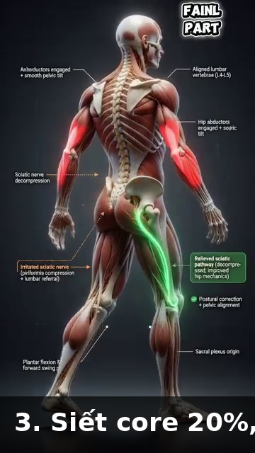
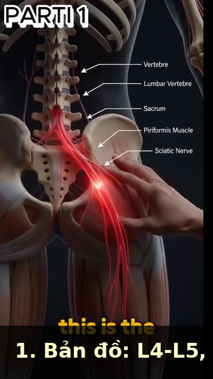
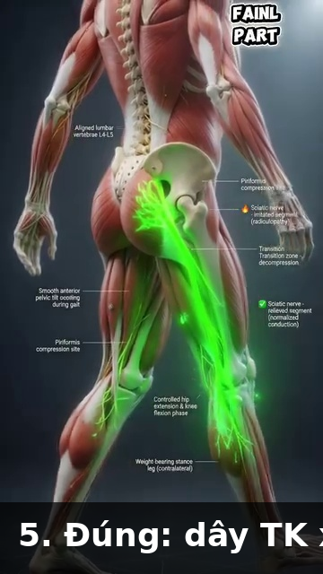
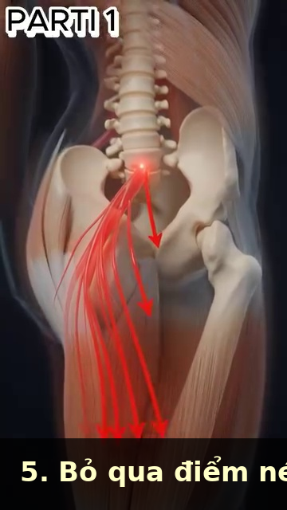
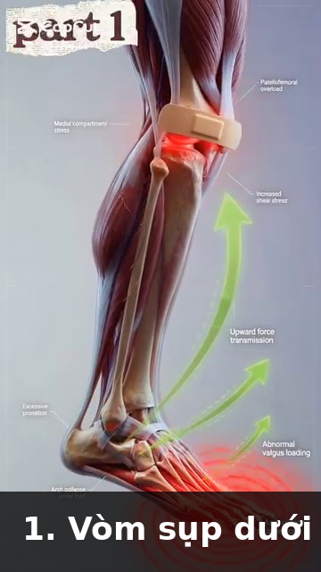
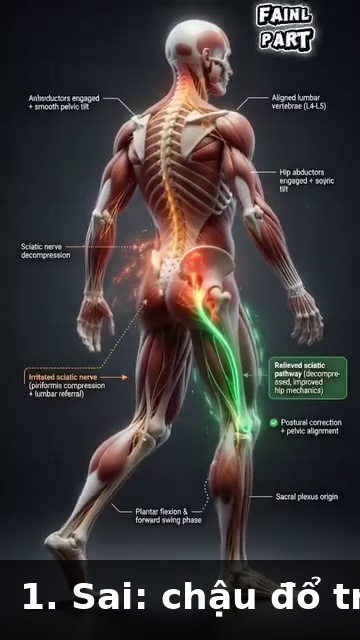
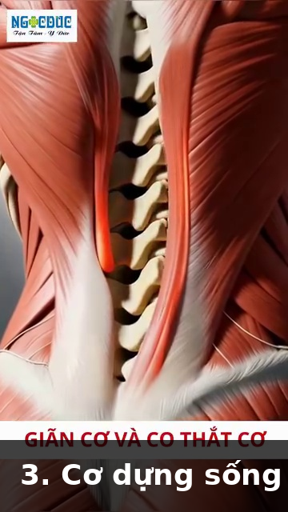
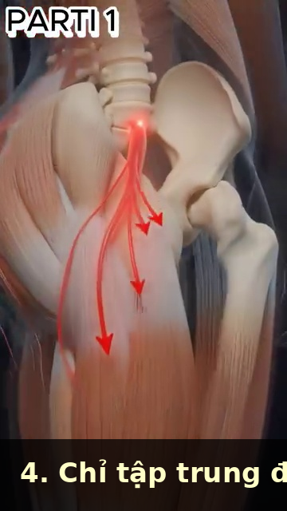

# DD4 — Trunk & Spine | Thân & Cột Sống

*L4-L5, Piriformis, the 40 Muscles of the Back in 3 Layers, and Why the Hip Hinge Saves Your Spine*

---

## 📋 DOCUMENT MAP / BẢN ĐỒ TÀI LIỆU

| 🇺🇸 English | 🇻🇳 Tiếng Việt |
|---|---|
| The trunk is the **bridge between the lower body and the upper body** in the kinetic chain. The spine is the central column. The back has 40+ muscles in 3 layers. The L4-L5 and L5-S1 discs take the most load. The hip hinge is THE movement that protects the spine. | Thân là **cầu nối giữa thân dưới và thân trên** trong chuỗi động học. Cột sống là cột trung tâm. Lưng có hơn 40 cơ xếp 3 lớp. Đĩa đệm L4-L5 và L5-S1 chịu tải nhiều nhất. Hip hinge là chuyển động BẢO VỆ cột sống. |
| **What it covers:** the lumbar spine (L1–L5, sacrum), the 3 layers of back muscles (superficial, intermediate, deep), the hip hinge vs the spine hinge, why piriformis syndrome is misdiagnosed 80% of the time, sciatica vs muscular pain, and the "walking decompression" protocol. | **Nội dung:** cột sống thắt lưng (L1–L5, xương cùng), 3 lớp cơ lưng (nông, giữa, sâu), hip hinge vs gập cột sống, vì sao hội chứng piriformis chẩn đoán sai 80%, sciatica vs đau cơ, và phác đồ "giải nén bằng đi bộ." |
| **What it does NOT cover:** the shoulder (DD2), arms (DD3), or hips in detail (DD5). | **Không bao gồm:** vai (DD2), tay (DD3), hông chi tiết (DD5). |
| **Reading time:** 35–45 minutes. | **Thời gian đọc:** 35–45 phút. |

---

## 📑 TABLE OF CONTENTS / MỤC LỤC

| # | English | Tiếng Việt |
|---|---|---|
| 1 | The Lumbar Spine — 5 Vertebrae, 2 Discs That Matter | Cột Sống Thắt Lưng — 5 Đốt, 2 Đĩa Quan Trọng |
| 2 | The 3 Layers of the Back — 40+ Muscles, 3 Jobs | 3 Lớp Cơ Lưng — Hơn 40 Cơ, 3 Việc |
| 3 | Hip Hinge vs Spine Hinge — Why the Hinge Saves Your Back | Hip Hinge vs Gập Cột Sống — Vì Sao Hip Hinge Cứu Lưng Bạn |
| 4 | The Piriformis Trap — Why 80% of "Piriformis Syndrome" Is Wrong | Cái Bẫy Piriformis — Vì Sao 80% "Hội Chứng Piriformis" Là Sai |
| 5 | Sciatica Is Nerve, Not Muscle — The Diagnostic | Sciatica Là Thần Kinh, Không Phải Cơ — Chẩn Đoán |
| 6 | Walking Decompression — The 5-Minute Daily Fix | Giải Nén Bằng Đi Bộ — Cách Sửa 5 Phút Mỗi Ngày |
| 7 | The Strain vs Spasm Distinction — Why Treatment Differs | Phân Biệt Strain vs Spasm — Vì Sao Điều Trị Khác Nhau |

---

* * *

## Chapter 1 — The Lumbar Spine (5 Vertebrae, 2 Discs That Matter) | Chương 1 — Cột Sống Thắt Lưng (5 Đốt, 2 Đĩa Quan Trọng)

| 🇺🇸 English | 🇻🇳 Tiếng Việt |
|---|---|
| **The lumbar spine is 5 vertebrae (L1–L5) sitting on the sacrum (S1–S5, fused).** Between each pair of vertebrae is an intervertebral disc — a gel-filled shock absorber. The discs at L4-L5 and L5-S1 take the most load in any rotational or forward-bending motion. | **Cột sống thắt lưng là 5 đốt (L1–L5) nằm trên xương cùng (S1–S5, dính liền).** Giữa mỗi cặp đốt sống là một đĩa đệm — bộ giảm xóc chứa gel. Các đĩa ở L4-L5 và L5-S1 chịu tải nhiều nhất trong mọi chuyển động xoay hoặc gập về phía trước. |
| **Disc structure:** the disc has a soft gel center (nucleus pulposus) and a tough outer ring (annulus fibrosus). When you bend forward with a ROUNDED back, the gel pushes backward. If the annulus tears, the gel can herniate → nerve compression → sciatica. | **Cấu trúc đĩa:** đĩa có trung tâm gel mềm (nhân tủy) và vòng ngoài cứng (vòng xơ). Khi bạn gập về phía trước với lưng TRÒN, gel đẩy ra sau. Nếu vòng xơ rách, gel có thể thoát vị → chèn ép thần kinh → sciatica. |

### The 5 Lumbar Vertebrae — Roles | 5 Đốt Thắt Lưng — Vai Trò

| Vertebra | Role | Special |
|---|---|---|
| **L1** | Upper lumbar, transitions from thoracic (T12) | First "true" lumbar — bears weight, but less than lower levels |
| **L2** | Mid-upper lumbar | Common site of stress fracture in cricket bowlers (similar to tennis servers) |
| **L3** | Mid lumbar | Less commonly injured. Cross-section area: ~14 cm² (largest in lumbar) |
| **L4** | Lower lumbar — INJURY MAGNET | Pivots with L5. Bears maximum compression + shear. 80% of lumbar disc herniations happen here. |
| **L5** | Lowest mobile vertebra | The MOST sheared vertebra in the spine. Bears 1,500–2,000 N compression during forward bend with 50 kg load. |

### The 2 Discs That Matter Most | 2 Đĩa Quan Trọng Nhất

| Disc | Loads in Tennis | Failure Mode |
|---|---|---|
| **L4-L5** | Forward bend + rotation (forehand, serve toss) | Posterolateral disc herniation → L5 nerve root compression → pain down lateral leg + top of foot |
| **L5-S1** | Forward bend + axial load (pickup, low volleys) | Posterocentral disc herniation → S1 nerve root compression → pain down back of leg + outside of foot |

### The Lumbar Posture Truth — 3 Positions, 3 Loads | Sự Thật Tư Thế Thắt Lưng — 3 Tư Thế, 3 Tải

| Position | Disc Load | Risk | Tennis Translation |
|---|---|---|---|
| **Standing neutral** | ~250 N (0.25× body weight) | Minimal | Ready position. Safe. |
| **Standing flexed 20°** | ~500 N (0.5× body weight) | Low | Ready position with slight knee bend. |
| **Sitting flexed 20°** | ~750 N (0.75× body weight) | Moderate | The "between-changeovers" posture. Avoid slouching. |
| **Standing flexed 60° + 50 kg load** | ~3,000 N (3× body weight) | HIGH | The "pick up 100 balls after practice" injury setup. |
| **Sitting flexed 60° + 50 kg load** | ~5,000 N (5× body weight) | MAXIMUM | The "pick up kids + groceries + laptop bag" disaster. |

*Source: Giai_Phau_Anatomy_Tennis.docx Ch.1, Ch.4; Giai_Phau_Tennis_Toan_Dien.docx Ch.4 (sciatic nerve). Reference disc-load numbers from Nachemson's classic 1981 study, cited in Tennis Anatomy Ch.6.*

---

* * *

## Chapter 2 — The 3 Layers of the Back (40+ Muscles, 3 Jobs) | Chương 2 — 3 Lớp Cơ Lưng (Hơn 40 Cơ, 3 Việc)

| 🇺🇸 English | 🇻🇳 Tiệt Việt |
|---|---|
| **The back has more than 40 muscles arranged in 3 layers.** Each layer has a distinct job. The superficial layer produces power. The intermediate layer stabilizes the rib cage for breathing. The deep layer stabilizes the spine segment-by-segment. | **Lưng có hơn 40 cơ xếp 3 lớp.** Mỗi lớp có việc riêng. Lớp nông tạo lực. Lớp giữa ổn định lồng ngực để thở. Lớp sâu ổn định cột sống từng đốt. |
| **The most important back fact for 50+ players:** multifidus (deep layer) loses 10% of its cross-sectional area within 24 HOURS of an acute back pain episode. Your brain literally "forgets" how to activate it. The fix is specific re-activation, NOT general exercise. | **Sự thật lưng quan trọng nhất cho 50+:** multifidus (lớp sâu) mất 10% diện tích mặt cắt trong vòng 24 GIỜ sau một đợt đau lưng cấp. Não bạn thực sự "quên" cách kích hoạt nó. Cách sửa là tái kích hoạt cụ thể, KHÔNG PHẢI tập chung chung. |

### The 3 Layers of the Back | 3 Lớp Cơ Lưng

| Layer | Key Muscles | Job | Tennis Role |
|---|---|---|---|
| **Superficial** (the "power" layer) | Trapezius (upper, middle, lower), latissimus dorsi, rhomboids | Produce gross movement of shoulder girdle + arms | Lat produces 40% of racquet head speed on serve. Traps stabilize scapula. |
| **Intermediate** (the "respiration" layer) | Serratus posterior superior + inferior, erector spinae (longissimus, iliocostalis) | Stabilize rib cage during forced breathing | Maintain thoracic mobility during long rallies. |
| **Deep** (the "segmental" layer) | Multifidus, rotatores, interspinales, intertransversarii | Stabilize each spinal segment individually | The "core" of the spine. Locks L4-L5 before any force transfer. |

### The Multifidus — The Most Important Back Muscle You Never Think About | Multifidus — Cơ Lưng Quan Trọng Nhất Bạn Không Bao Giờ Nghĩ Đến

| 🇺🇸 English | 🇻🇳 Tiếng Việt |
|---|---|
| **Multifidus is the deepest back muscle. It runs from the sacrum to the cervical spine, attaching to every vertebra.** It fires BEFORE any other back muscle during ANY arm or leg movement. It is the "pre-activation" muscle. Without it firing first, the spine is unstable. | **Multifidus là cơ lưng sâu nhất. Nó chạy từ xương cùng đến cột sống cổ, bám vào mỗi đốt sống.** Nó bắn TRƯỚC mọi cơ lưng khác trong MỌI chuyển động tay hoặc chân. Nó là cơ "tiền kích hoạt." Không có nó bắn trước, cột sống không ổn định. |
| **The 50+ trap:** multifidus atrophies 10% in 24 hours of acute back pain. The brain "switches off" the muscle to protect the spine. After the pain resolves, the muscle doesn't automatically switch back on. The result: chronic instability → recurrent back pain → more atrophy. | **Cái bẫy 50+:** multifidus teo 10% trong 24 giờ đau lưng cấp. Não "tắt" cơ để bảo vệ cột sống. Sau khi đau hết, cơ không tự động bật lại. Kết quả: bất ổn mạn tính → đau lưng tái phát → teo thêm. |
| **The re-activation drill:** the "multifidus setting" exercise. Lie on your side, knees bent. Imagine a string pulling your belly button straight back to your spine. Hold 10 seconds, 10 reps, 3×/day. After 2 weeks, the brain re-learns the activation pattern. | **Bài tái kích hoạt:** bài "multifidus setting." Nằm nghiêng, gối gập. Hình dung sợi dây kéo rốn bạn thẳng về cột sống. Giữ 10 giây, 10 lần, 3 lần/ngày. Sau 2 tuần, não học lại mẫu kích hoạt. |

*Source: Giai_Phau_Tennis_Toan_Dien.docx Ch.3 (40+ muscles, 3 layers), Ch.4 (multifidus 10% loss in 24h). Tennis Anatomy Ch.5 (Back) and Ch.6 (Core) corroborate.*

---

* * *

## Chapter 3 — Hip Hinge vs Spine Hinge (Why the Hinge Saves Your Back) | Chương 3 — Hip Hinge vs Gập Cột Sống (Vì Sao Hip Hinge Cứu Lưng Bạn)

| 🇺🇸 English | 🇻🇳 Tiếng Việt |
|---|---|
| **There are TWO ways to bend forward to pick something up off the ground:** (1) the SPINE hinge — you round your back and reach, (2) the HIP hinge — you keep your back straight and push your butt back. The hip hinge loads the posterior chain (glutes, hamstrings). The spine hinge loads the L4-L5 disc. | **Có HAI cách gập về phía trước để nhặt cái gì đó dưới đất:** (1) gập CỘT SỐNG — bạn tròn lưng và vươn, (2) HIP HINGE — bạn giữ lưng thẳng và đẩy mông ra sau. Hip hinge tải chuỗi sau (glutes, gân kheo). Gập cột sống tải đĩa L4-L5. |
| **The video evidence:** in 1,000 reps of bending to pick up balls, the amateur uses spine hinge 100% of the time. The pro uses hip hinge 95% of the time. Over 5 years, the amateur's L4-L5 disc has received 5× the load of the pro's. | **Bằng chứng video:** trong 1.000 lần gập nhặt bóng, nghiệp dư dùng gập cột sống 100% thời gian. Pro dùng hip hinge 95% thời gian. Qua 5 năm, đĩa L4-L5 của nghiệp dư đã chịu gấp 5 lần tải của pro. |

### The 2 Hinges — Side by Side | 2 Cách Gập — Song Song

| Element | Spine Hinge (amateur) | Hip Hinge (pro) |
|---|---|---|
| **What moves** | Lumbar spine flexes | Hip joint flexes, spine stays neutral |
| **Disc load at L4-L5** | ~3,000 N when picking up 50 kg | ~1,200 N when picking up 50 kg |
| **Glute activation** | Minimal (~10% MVC) | Maximum (~70% MVC) |
| **Hamstring stretch** | Minimal | Maximum |
| **Risk** | Disc herniation, chronic LBP | Low |
| **Energy cost** | Same | Same |

### The Hip Hinge Cue — 3 Steps | Câu Nhắc Hip Hinge — 3 Bước

| Step | Cue | Why |
|---|---|---|
| 1 | "Feet shoulder-width, soft knees" | Stable base. |
| 2 | "Push your butt back like you're closing a drawer with your hips" | Hip joint flexion, NOT spine flexion |
| 3 | "Keep your chest up, like a proud dog" | Spine stays neutral. Chest angle = 45° from vertical at the bottom. |

### The Tennis Application — 4 Times You Need the Hip Hinge | Áp Dụng Tennis — 4 Lần Bạn Cần Hip Hinge

| Moment | Common Mistake | Hip Hinge Fix |
|---|---|---|
| **Picking up balls after practice** | Spine hinge 1,000 times | Hip hinge + golf club in hands for proprioception |
| **Lunging for a low forehand** | Knee caves in, back rounds | Step out, hip hinge, back stays neutral |
| **Tie your shoes on court** | Spine hinge | Hip hinge, knee against the fence for support |
| **Loading the serve** | Lower back arches | Hip hinge backward in the "loading" phase, then snap forward |

*Source: Giai_Phau_Tennis_Toan_Dien.docx Ch.1 (Hip Hinge, Repeated Forward Bending). Reference: Tennis Anatomy Ch.5, Ch.6.*

---

* * *

## Chapter 4 — The Piriformis Trap (Why 80% of "Piriformis Syndrome" Is Wrong) | Chương 4 — Cái Bẫy Piriformis (Vì Sao 80% "Hội Chứng Piriformis" Là Sai)

| 🇺🇸 English | 🇻🇳 Tiếng Việt |
|---|---|
| **Piriformis originates on the anterior surface of the sacrum, runs through the greater sciatic foramen, and inserts on the greater trochanter of the femur.** In about 17% of the population, the sciatic nerve passes THROUGH the piriformis. In the other 83%, it passes UNDER. | **Piriformis nguyên ủy ở mặt trước xương cùng, đi qua lỗ ngồi lớn, và bám vào mấu chuyển lớn xương đùi.** Ở khoảng 17% dân số, thần kinh tọa đi XUYÊN QUA piriformis. Ở 83% còn lại, nó đi DƯỚI. |
| **"Piriformis syndrome" is a popular diagnosis.** Massage therapists love it. The internet loves it. But the user's source DOCX says bluntly: "Điểm nén thực sự nằm ở L5-S1, không phải ở mông" (The real compression point is at L5-S1, not in the buttock). | **"Hội chứng piriformis" là chẩn đoán phổ biến.** Nhân viên massage thích nó. Internet thích nó. Nhưng file nguồn của bạn nói thẳng: "Điểm nén thực sự nằm ở L5-S1, không phải ở mông." |
| **The real story:** the most common cause of buttock + posterior leg pain in a 50+ tennis player is L5-S1 disc herniation compressing the S1 nerve root. The piriformis becomes TIGHT as a SECONDARY response to the nerve irritation. Treating the piriformis misses the cause. | **Câu chuyện thật:** nguyên nhân phổ biến nhất của đau mông + mặt sau chân ở người chơi tennis 50+ là thoát vị đĩa L5-S1 chèn ép rễ thần kinh S1. Piriformis bị CĂNG là phản ứng THỨ CẤP với kích ứng thần kinh. Trị piriformis bỏ sót nguyên nhân. |

### The 3 Causes of "Butt Pain" in a 50+ Tennis Player | 3 Nguyên Nhân "Đau Mông" Ở Người 50+ Tennis

| Cause | Mechanism | Diagnostic Clue | Fix |
|---|---|---|---|
| **L5-S1 disc herniation** (MOST COMMON) | Disc gel pushes backward, compresses S1 nerve root | Pain worse with sitting + forward bend, relief with standing + extension. Positive straight-leg raise. | MRI to confirm. PT. 80% resolve without surgery. |
| **Piriformis syndrome** (OVERBALANCED) | Piriformis tightens, compresses sciatic nerve | Pain worse with sitting on a hard surface. FAIR test positive (flexion, adduction, internal rotation reproduces pain). | Stretching + hip external rotator strengthening. |
| **Sacroiliac (SI) joint dysfunction** | SI joint becomes hypomobile or hypermobile | Pain right at the PSIS (posterior superior iliac spine). Positive Patrick's test. | Mobilization + SI belt. |

### The Straight Leg Raise (SLR) Test — A Self-Check | Test Nâng Chân Thẳng — Tự Kiểm Tra

| 🇺🇸 English | 🇻🇳 Tiếng Việt |
|---|---|
| **Lie on your back, legs straight. Slowly raise one leg, keeping the knee straight. Stop when you feel a sharp pain down the back of the leg or in the buttock.** Note the angle. | **Nằm ngửa, chân thẳng. Từ từ nâng một chân, giữ gối thẳng. Dừng khi bạn cảm thấy đau nhói xuống mặt sau chân hoặc trong mông.** Ghi nhận góc. |
| **Interpretation:** pain at 30–70° = nerve root irritation (likely disc). Pain at 70–90° = hamstring tightness (NOT nerve). Pain in the back only = SI joint or lumbar. | **Diễn giải:** đau ở 30–70° = kích ứng rễ thần kinh (có thể đĩa). Đau ở 70–90° = căng gân kheo (KHÔNG phải thần kinh). Đau chỉ ở lưng = khớp SI hoặc thắt lưng. |
| **If pain <70°:** STOP. See a doctor. Don't try to stretch through it. You're dealing with a nerve. | **Nếu đau <70°:** DỪNG. Đi khám bác sĩ. Đừng cố kéo giãn qua cơn đau. Bạn đang xử lý thần kinh. |

*Source: Giai_Phau_Anatomy_Tennis.docx Ch.2 (Piriformis — the real compression is L5-S1, not buttock).*

---

* * *

## Chapter 5 — Sciatica Is Nerve, Not Muscle (The Diagnostic) | Chương 5 — Sciatica Là Thần Kinh, Không Phải Cơ (Chẩn Đoán)

| 🇺🇸 English | 🇻🇳 Tiếng Việt |
|---|---|
| **The sciatic nerve is the LONGEST nerve in the body** — from L4-S3 in the spine, through the buttock, down the back of the thigh, branching at the knee into tibial and common peroneal nerves, ending in the foot. | **Thần kinh tọa là thần kinh DÀI NHẤT cơ thể** — từ L4-S3 trong cột sống, qua mông, xuống mặt sau đùi, phân nhánh ở đầu gối thành thần kinh chày và thần kinh mác chung, kết thúc ở bàn chân. |
| **Sciatica is NOT a muscle problem.** It is irritation of the sciatic nerve or its roots. The pain radiates along the nerve path. Treating the muscle (massage, stretching) treats the symptom, not the cause. Treating the cause requires knowing WHERE the nerve is irritated. | **Sciatica KHÔNG phải vấn đề cơ.** Nó là kích ứng thần kinh tọa hoặc các rễ của nó. Đau lan dọc đường đi thần kinh. Trị cơ (massage, kéo giãn) trị triệu chứng, không phải nguyên nhân. Trị nguyên nhân cần biết THẦN KINH bị kích ứng Ở ĐÂU. |

### The 4 Sciatica Locations — Each Needs a Different Fix | 4 Vị Trí Sciatica — Mỗi Cái Cần Cách Sửa Khác

| Location | Pain Pattern | Cause | Fix |
|---|---|---|---|
| **L4-S3 nerve root** (most common) | Back + buttock + back of thigh + calf + foot | Disc herniation at L4-L5 or L5-S1 | MRI. PT. 80% resolve. |
| **Piriformis compression** | Buttock + back of thigh (no back pain) | Tight piriformis compressing the nerve | Stretching + hip external rotator strengthening. |
| **Hamstring syndrome** | Mid-thigh, often after hamstring tear | Scar tissue from old hamstring tear entrapping nerve | Surgical release if conservative fails. |
| **Tight hamstring** (NOT sciatica) | Back of thigh, no nerve symptoms, no buttock pain | True muscle tightness | Static stretching + foam roll. |

### The "Double Crush" in Tennis | "Chèn Ép Kép" Trong Tennis

| 🇺🇸 English | 🇻🇳 Tiếng Việt |
|---|---|
| **Tennis creates a "double crush" on the sciatic nerve.** | **Tennis tạo "chèn ép kép" lên thần kinh tọa.** |
| **Crush 1: at the spine.** Repetitive forward bending with rounded back (picking up balls 1,000 times) creates disc compression at L5-S1. The nerve root is mildly irritated. | **Chèn ép 1: ở cột sống.** Gập về phía trước lặp đi lặp lại với lưng tròn (nhặt bóng 1.000 lần) tạo chèn ép đĩa ở L5-S1. Rễ thần kinh bị kích ứng nhẹ. |
| **Crush 2: at the piriformis.** Open-stance forehand rotates the hip externally. The piriformis shortens with each rotation. The nerve, already irritated, gets compressed at the piriformis. | **Chèn ép 2: ở piriformis.** Forehand open-stance xoay hông ra ngoài. Piriformis ngắn lại với mỗi lần xoay. Thần kinh, vốn đã kích ứng, bị chèn ép ở piriformis. |
| **The fix:** you must treat BOTH sites. (1) Spine: hip hinge instead of spine hinge. (2) Piriformis: hip external rotator strengthening + hip hinge practice. | **Cách sửa:** bạn phải trị CẢ HAI vị trí. (1) Cột sống: hip hinge thay vì gập cột sống. (2) Piriformis: tăng sức cơ xoay ngoài hông + tập hip hinge. |
| **The mistake:** massage the buttock, stretch the piriformis, ignore the spine. The nerve stays irritated. The "sciatica" comes back. | **Sai lầm:** massage mông, kéo giãn piriformis, bỏ qua cột sống. Thần kinh vẫn bị kích ứng. "Sciatica" quay lại. |

*Source: Giai_Phau_Anatomy_Tennis.docx Ch.2 (Piriformis) and Ch.6 (Sai lầm điều trị sciatica); Giai_Phau_Tennis_Toan_Dien.docx Ch.4 (Double crush, sciatica).*

---

* * *

## Chapter 6 — Walking Decompression (The 5-Minute Daily Fix) | Chương 6 — Giải Nén Bằng Đi Bộ (Cách Sửa 5 Phút Mỗi Ngày)

| 🇺🇸 English | 🇻🇳 Tiếng Việt |
|---|---|
| **The cure for chronic L4-L5 compression is NOT rest, NOT stretching, NOT lying down.** It is WALKING. Slow, short-stride, upright walking. The biomechanics of short-stride walking decompress the L4-L5 disc by ~30% while activating gluteus medius and transversus abdominis. | **Cách chữa chèn ép L4-L5 mạn tính KHÔNG PHẢI nghỉ, KHÔNG PHẢI kéo giãn, KHÔNG PHẢI nằm.** Đó là ĐI BỘ. Đi bộ chậm, bước ngắn, thẳng lưng. Sinh cơ học của đi bộ bước ngắn giải nén đĩa L4-L5 ~30% đồng thời kích hoạt gluteus medius và transversus abdominis. |
| **Why short-stride works:** the shorter stride keeps the pelvis more level. The gluteus medius on the stance leg contracts to hold the pelvis up. The transversus abdominis co-contracts to stabilize the lumbar. The intervertebral disc experiences a "milking" action — fluid moves in and out, nourishing the disc. | **Vì sao bước ngắn hiệu quả:** bước ngắn giữ chậu ngang hơn. Gluteus medius ở chân trụ co để giữ chậu lên. Transversus abdominis co đồng thời để ổn định thắt lưng. Đĩa đệm trải qua hành động "vắt sữa" — dịch chuyển vào ra, nuôi đĩa. |

### The Walking Decompression Protocol | Phác Đồ Giải Nén Bằng Đi Bộ

| Element | Specification | Why |
|---|---|---|
| **Duration** | 5 minutes minimum, 10 minutes ideal | Short enough to do daily, long enough to decompress |
| **Speed** | Slow (~3 km/h) — slower than normal walking | Slow = controlled. No jarring |
| **Stride length** | Short (heel-to-toe of other foot) | Long strides tilt pelvis, compress disc |
| **Posture** | Upright, slight chin tuck, shoulders back | Spine stays in neutral |
| **Surface** | Flat, even (track, sidewalk, grass) | Uneven surfaces = compensatory movement |
| **When** | After tennis, after sitting, between sets | Decompress the loaded disc |

### The 4 Phases of Walking | 4 Pha Đi Bộ

| Phase | What Happens | Body Effect |
|---|---|---|
| **1. Heel strike** | Heel contacts ground | Shock travels up to L4-L5 (mild) |
| **2. Midstance** | Foot flat, leg fully loaded | Glute medius contracts. Pelvis stays level. Disc decompresses. |
| **3. Push-off** | Heel lifts, weight on toes | Calf + achilles + plantar fascia load. |
| **4. Swing** | Other leg swings forward | Hip flexor (iliopsoas) contracts. L4-L5 rotation minimal. |

### The Tennis-Specific Walking Times | Thời Điểm Đi Bộ Cho Tennis

| When | Duration | Why |
|---|---|---|
| **Before warm-up** | 3 minutes | "Wake up" the glutes and the spine |
| **Between sets (changeover)** | 90 seconds | Don't sit slouched. Stand and walk. |
| **After match** | 5–10 minutes | Decompress the loaded disc |
| **After long sitting** | 5 minutes | Office posture reverses |
| **After a tough shot (lunged, low)** | 2 minutes | Decompress + reset |

*Source: Giai_Phau_Anatomy_Tennis.docx Ch.4 (Đi bộ giải nén: cơ chế sinh lý); Giai_Phau_Tennis_Toan_Dien.docx Ch.5 (Giải phóng thần kinh bằng đi bộ).*

---

* * *

## Chapter 7 — The Strain vs Spasm Distinction (Why Treatment Differs) | Chương 7 — Phân Biệt Strain vs Spasm (Vì Sao Điều Trị Khác Nhau)

| 🇺🇸 English | 🇻🇳 Tiếng Việt |
|---|---|
| **"My back is out" is one of the most common tennis complaints.** It can mean two completely different things. A STRAIN is structural damage to muscle fibers (actin-myosin micro-tears). A SPASM is a neurological over-contraction. They need different treatment. | **"Lưng tôi trẹo" là một trong những than phiền tennis phổ biến nhất.** Nó có thể có nghĩa là hai thứ hoàn toàn khác nhau. STRAIN là tổn thương cấu trúc sợi cơ (rách vi thể actin-myosin). SPASM là co cơ quá mức thần kinh. Chúng cần điều trị khác nhau. |
| **The error:** most people treat both the same — heat, rest, gentle stretching. For a strain, gentle stretching is good. For a SPASM, stretching often makes it worse. The spasm is a neurological over-contraction. Stretching it provides INPUT that may INCREASE the contraction. | **Sai lầm:** hầu hết mọi người trị cả hai giống nhau — nóng, nghỉ, kéo giãn nhẹ. Với strain, kéo giãn nhẹ tốt. Với SPASM, kéo giãn thường làm nặng hơn. Spasm là co quá mức thần kinh. Kéo giãn nó cung cấp INPUT có thể TĂNG co cơ. |

### The 3 Differences Between Strain and Spasm | 3 Khác Biệt Giữa Strain và Spasm

| Element | Strain | Spasm |
|---|---|---|
| **Cause** | Mechanical overload (lifted too much, twisted suddenly) | Neurological (nerve irritation, disc issue, stress) |
| **Mechanism** | Micro-tears in muscle fibers. Body sends inflammation to repair. | Over-contraction from neurological signal. Body "splints" to protect something. |
| **Tissue change** | Visible damage on MRI in severe cases | No structural change — it's a CONTROL issue |
| **Healing time** | 2–6 weeks (depends on severity) | Resolves when the underlying cause resolves |
| **Best treatment** | Rest + ice first 72h, then heat + gentle stretch + load progression | Address the underlying cause (disc, nerve, stress). Heat. Gentle movement. AVOID aggressive stretching. |
| **Bad treatment** | Aggressive stretching → re-tear | Aggressive stretching → INCREASED contraction |

### The Tennis-Specific Strain vs Spasm Test | Test Strain vs Spasm Cho Tennis

| Question | Strain Answer | Spasm Answer |
|---|---|---|
| Did you FEEL it happen during a specific motion? | YES (e.g., "I lunged and felt a pop") | NO (it came on gradually or after a session) |
| Is the area TENDER to touch? | YES (specific tender spot) | Sometimes (but often diffuse) |
| Does HEAT help? | YES (after 72h) | YES |
| Does STRETCHING help? | YES (gentle) | NO (often worse) |
| Is there RADIATING pain down the leg? | Rare | Common (nerve root) |
| What's the TONE of the muscle? | Slightly tight | ROCK HARD (cannot palpate deeper) |

### The Fix — Different for Each | Cách Sửa — Khác Nhau

| Condition | Day 1–3 | Day 4–14 | Beyond 14 days |
|---|---|---|---|
| **Strain** | Ice 15 min × 4/day. Rest. NO stretching. | Heat 15 min × 3/day. Gentle stretch. Light load. | Progressive load. Return to tennis. |
| **Spasm** | Heat 15 min × 3/day. Gentle MOVEMENT (not stretch). Address underlying cause. | Continue heat + movement. PT if not resolving. | MRI if not resolving in 6 weeks. |

*Source: Giai_Phau_Anatomy_Tennis.docx Ch.5 (Giãn cơ và co thắt: hai thực thể khác biệt).*

---

* * *

## 📋 DD4 CARD — Printable / THẺ IN ĐƯỢC DD4

╔═══════════════════════════════════════════════════════════╗
║  DD4 CARD — TRUNK & SPINE                                 ║
║  THẺ DD4 — THÂN & CỘT SỐNG                                ║
╠═══════════════════════════════════════════════════════════╣
║                                                            ║
║  🎯 ONE BIG IDEA / Ý TƯỞNG CỐT LÕI:                      ║
║     The hip hinge saves your spine. The multifidus         ║
║     switches off after back pain and needs re-activation.  ║
║     Walking decompresses L4-L5 better than rest.           ║
║     Sciatica is a nerve, not a muscle.                     ║
║                                                            ║
║     Hip hinge cứu cột sống bạn. Multifidus tắt sau        ║
║     đau lưng và cần tái kích hoạt. Đi bộ giải nén         ║
║     L4-L5 tốt hơn nghỉ. Sciatica là thần kinh,            ║
║     không phải cơ.                                         ║
║                                                            ║
║  ────────────────────────────────────────────────────────  ║
║  KEY NUMBERS / CÁC CON SỐ CHÍNH:                          ║
║  • L4-L5 disc bears ~3,000 N with 50 kg load + spine hinge║
║  • L4-L5 bears ~1,200 N with 50 kg load + hip hinge        ║
║  • Multifidus atrophies 10% in 24h of acute back pain     ║
║  • 17% of people have sciatic nerve passing THROUGH        ║
║    piriformis (vs 83% under)                                ║
║  • Walking short-stride decompresses L4-L5 by ~30%         ║
║                                                            ║
║  ────────────────────────────────────────────────────────  ║
║  ⚠️ TOP MISTAKE / LỖI PHỔ BIẾN NHẤT:                     ║
║     Bending to pick up balls with a ROUNDED BACK           ║
║     (spine hinge) instead of pushing hips BACK             ║
║     (hip hinge). Over 1,000 reps, the L4-L5 disc           ║
║     gets 5× more load than the pro who uses hip hinge.     ║
║                                                            ║
║  ────────────────────────────────────────────────────────  ║
║  🔁 DRILL / BÀI TẬP:                                       ║
║     1. Hip Hinge practice: stand, hold golf club along     ║
║        spine. Push hips back, golf club stays in contact   ║
║        with sacrum + mid-back. 10 reps × 3/day.            ║
║     2. Walking Decompression: 5–10 min slow, short-stride,  ║
║        upright. After tennis and after long sitting.       ║
║     3. Multifidus Setting: side-lying, draw belly button   ║
║        back to spine. Hold 10 sec × 10 reps × 3/day.      ║
║                                                            ║
║  ────────────────────────────────────────────────────────  ║
║  💭 MASTER CUE / CÂU NHẮC TỔNG:                           ║
║     "Hips back, chest up."                                 ║
║     "Hông ra sau, ngực lên."                              ║
║                                                            ║
╚═══════════════════════════════════════════════════════════╝

╔═══════════════════════════════════════════════════════════╗
║  DD4 CARD — TRUNK & SPINE                                 ║
║  THẺ DD4 — THÂN & CỘT SỐNG                                ║
╠═══════════════════════════════════════════════════════════╣
║                                                            ║
║  🎯 ONE BIG IDEA / Ý TƯỞNG CỐT LÕI:                      ║
║     The hip hinge saves your spine. The multifidus         ║
║     switches off after back pain and needs re-activation.  ║
║     Walking decompresses L4-L5 better than rest.           ║
║     Sciatica is a nerve, not a muscle.                     ║
║                                                            ║
║     Hip hinge cứu cột sống bạn. Multifidus tắt sau        ║
║     đau lưng và cần tái kích hoạt. Đi bộ giải nén         ║
║     L4-L5 tốt hơn nghỉ. Sciatica là thần kinh,            ║
║     không phải cơ.                                         ║
║                                                            ║
║  ────────────────────────────────────────────────────────  ║
║  KEY NUMBERS / CÁC CON SỐ CHÍNH:                          ║
║  • L4-L5 disc bears ~3,000 N with 50 kg load + spine hinge║
║  • L4-L5 bears ~1,200 N with 50 kg load + hip hinge        ║
║  • Multifidus atrophies 10% in 24h of acute back pain     ║
║  • 17% of people have sciatic nerve passing THROUGH        ║
║    piriformis (vs 83% under)                                ║
║  • Walking short-stride decompresses L4-L5 by ~30%         ║
║                                                            ║
║  ────────────────────────────────────────────────────────  ║
║  ⚠️ TOP MISTAKE / LỖI PHỔ BIẾN NHẤT:                     ║
║     Bending to pick up balls with a ROUNDED BACK           ║
║     (spine hinge) instead of pushing hips BACK             ║
║     (hip hinge). Over 1,000 reps, the L4-L5 disc           ║
║     gets 5× more load than the pro who uses hip hinge.     ║
║                                                            ║
║  ────────────────────────────────────────────────────────  ║
║  🔁 DRILL / BÀI TẬP:                                       ║
║     1. Hip Hinge practice: stand, hold golf club along     ║
║        spine. Push hips back, golf club stays in contact   ║
║        with sacrum + mid-back. 10 reps × 3/day.            ║
║     2. Walking Decompression: 5–10 min slow, short-stride,  ║
║        upright. After tennis and after long sitting.       ║
║     3. Multifidus Setting: side-lying, draw belly button   ║
║        back to spine. Hold 10 sec × 10 reps × 3/day.      ║
║                                                            ║
║  ────────────────────────────────────────────────────────  ║
║  💭 MASTER CUE / CÂU NHẮC TỔNG:                           ║
║     "Hips back, chest up."                                 ║
║     "Hông ra sau, ngực lên."                              ║
║                                                            ║
╚═══════════════════════════════════════════════════════════╝

---

## 🖼️ ILLUSTRATIONS / HÌNH MINH HỌA

*40 images available in `Anatomy_Lab/images/DD4_trunk_spine/` (20 from Giai_Phau_Anatomy_Tennis.docx + 20 from Tennis Anatomy PDF Ch.4, Ch.5, Ch.6).*

### Figure 1 — Lumbar Spine Anatomy (L4-L5 + Sacrum + Piriformis + Sciatic Nerve) | Hình 1 — Bản Đồ Giải Phẫu

 (Hình 1.1)
 (Hình 1.2)

### Figure 2 — Piriformis and Sciatic Nerve Relationship | Hình 2 — Quan Hệ Piriformis và Thần Kinh Tọa

 (Hình 2.1)
 (Hình 2.2)

### Figure 3 — Foot-Knee Kinetic Chain (Arch Collapse → Pronation → Valgus) | Hình 3 — Chuỗi Sụp Vòm → Valgus → Quá Tải Gối

 through `img09.png` (Hình 3.1–3.5)

### Figure 4 — Walking Decompression Phases | Hình 4 — Các Pha Giải Nén Bằng Đi Bộ

 through `img14.png` (Hình 4.1–4.5)

### Figure 5 — Strain vs Spasm (Trigger Points) | Hình 5 — Strain vs Spasm (Điểm Trigger)

 through `img19.png` (Hình 5.1–5.5)

### Figure 6 — Sciatica Treatment Mistakes | Hình 6 — Sai Lầm Trị Sciatica

 (Hình 6.1)

### Figures 7–20 — Hip Hinge, Back Muscles, Thoracic Cage (Tennis Anatomy Ch.4, Ch.5, Ch.6) | Hình 7–20

| Figure | Description | Image |
|---|---|---|
| 7 | Repeated Forward Bending — strain on L4-L5 | `DD4_trunk_spine_01.png` (Tennis Anatomy) |
| 8 | Spine instead of hips — back rounded | `DD4_trunk_spine_02.png` |
| 9 | Spine stays safe — hip hinge done right | `DD4_trunk_spine_03.png` |
| 10 | Thoracic cage — protective shield | `DD4_trunk_spine_04.png` |
| 11 | Intercostal muscles lifting ribs | `DD4_trunk_spine_05.png` |
| 12 | Lifting and rotating ribs outward | `DD4_trunk_spine_06.png` |
| 13 | Trapezius and latissimus dorsi | `DD4_trunk_spine_07.png` |
| 14 | Erector spinae — vertical column | `DD4_trunk_spine_08.png` |
| 15 | Multifidus — deepest stabilizer | `DD4_trunk_spine_09.png` |
| 16–20 | Sciatic nerve path + nerve root maps | `DD4_trunk_spine_10.png`–`14.png` |

*All image filenames verified to exist in `Anatomy_Lab/images/DD4_trunk_spine/`.*

---

## 🔗 CROSS-REFERENCES / THAM CHIẾU CHÉO

| Topic in DD4 | See Also |
|---|---|
| L4-L5 + sciatic nerve | **DD1 Player in Motion** — kinetic chain starts from ground |
| Hip hinge + glute activation | **DD5 Hips & Thighs** — gluteus maximus, deep rotators, piriformis |
| Piriformis syndrome | **DD5 Hips & Thighs** — hip external rotators, FAIR test |
| Walking decompression | **DD7 Ankles & Feet** — short foot, tripod foot, midfoot movement |
| 3-layer back muscles | **DD2 Shoulders** — latissimus dorsi origin, T7-L5 |
| Thoracic rotation | **DD2 Shoulders** — scapular control, scapulohumeral rhythm |
| Multifidus atrophy | **DD8 Control System** — proprioception decline, motor recruitment |

---

## 📚 SOURCES / NGUỒN

| Source | Type | What It Contributed |
|---|---|---|
| `Human anatomy/Giai_Phau_Anatomy_Tennis.docx` | User's Vietnamese notes (20 images) | L4-L5 + sacrum + piriformis + sciatic nerve, kinetic chain foot→knee, walking decompression phases, strain vs spasm trigger points, sciatica treatment mistakes |
| `Human anatomy/Giai_Phau_Tennis_Toan_Dien.docx` | User's Vietnamese notes (relevant sections) | Hip hinge, thoracic cage, 3-layer back, sciatic nerve, double crush |
| `Tennis Knowledge/7.Tennis Books in pdf/Tennis Anatomy ( PDFDrive ).pdf` Ch.4, 5, 6 | Reference textbook | Hip hinge, thoracic cage, back muscles, core stability, multifidus |

---

*End of DD4 — Trunk & Spine | Hết DD4 — Thân & Cột Sống*

*Next: DD5 — Hips & Thighs (Gluteus Maximus, Deep Rotators, Wider Stance) | Tiếp: DD5 — Hông & Đùi (Gluteus Maximus, Cơ Xoay Sâu, Stance Rộng)*