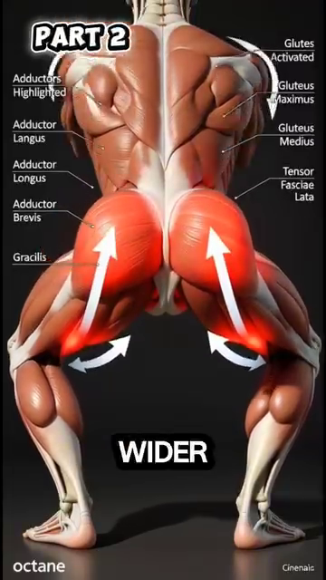
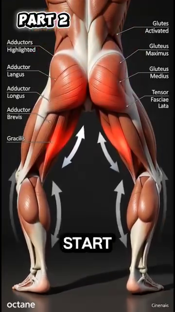
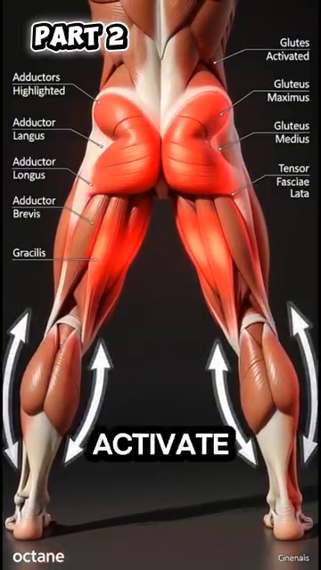
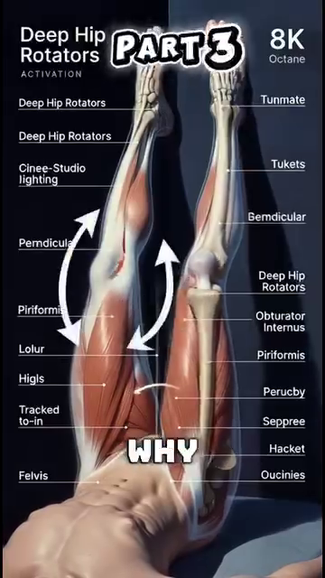
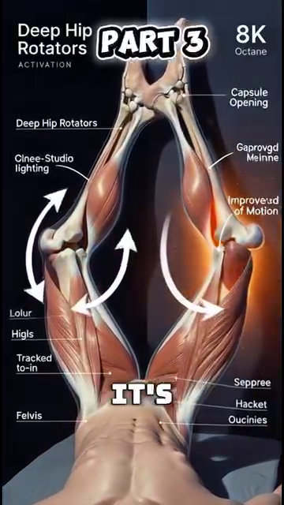
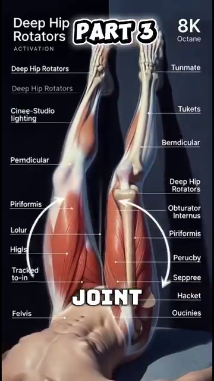
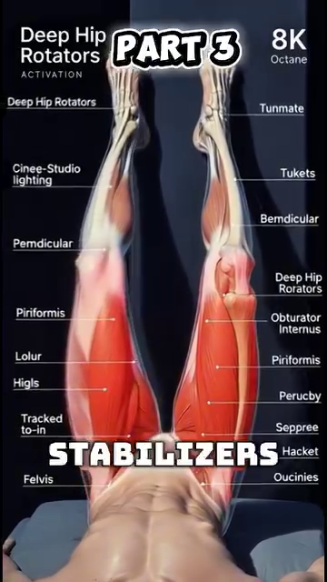
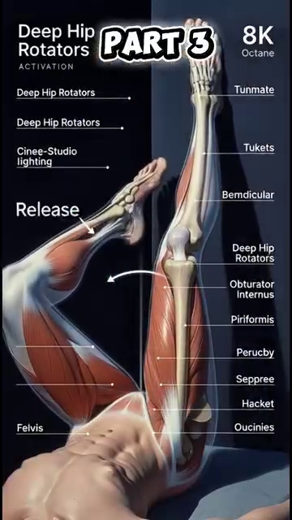
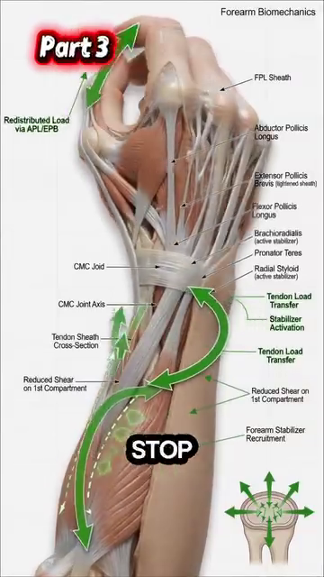

# DD5 — Hips & Thighs | Hông & Đùi

*Gluteus Maximus, the 6 Deep Rotators, and Why Wider Stance Saves Your 50+ Knees*

---

## 📋 DOCUMENT MAP / BẢN ĐỒ TÀI LIỆU

| 🇺🇸 English | 🇻🇳 Tiếng Việt |
|---|---|
| The hip is the **largest joint in the body**. The gluteus maximus is the **largest muscle**. The 6 deep external rotators control the femoral head in the socket. Tennis requires the hip to rotate 40–50° per stroke — the hip must be both MOBILE (to rotate) and STABLE (to protect the lumbar). | Hông là **khớp lớn nhất cơ thể**. Gluteus maximus là **cơ lớn nhất**. 6 cơ xoay ngoài sâu kiểm soát chỏm xương đùi trong ổ cối. Tennis yêu cầu hông xoay 40–50° mỗi cú — hông phải vừa DI ĐỘNG (để xoay) vừa ỔN ĐỊNH (để bảo vệ thắt lưng). |
| **What it covers:** the 3 gluteal muscles (max, med, min), the 6 deep external rotators (piriformis, obturator internus/externus, gemellus sup/inf, quadratus femoris), the femoral-acetabular joint, the wider-stance transformation, and the hip CARs (Controlled Articular Rotations) drill. | **Nội dung:** 3 cơ mông (max, med, min), 6 cơ xoay ngoài sâu (piriformis, obturator internus/externus, gemellus sup/inf, quadratus femoris), khớp ổ cối-đùi, sự chuyển đổi sang stance rộng, và bài tập hip CARs (Controlled Articular Rotations). |
| **What it does NOT cover:** the knee (DD6), the ankle/foot (DD7), or sciatica (DD4 — already covered). | **Không bao gồm:** gối (DD6), cổ chân/bàn chân (DD7), sciatica (DD4 — đã bao gồm). |
| **Reading time:** 30–40 minutes. | **Thời gian đọc:** 30–40 phút. |

---

## 📑 TABLE OF CONTENTS / MỤC LỤC

| # | English | Tiếng Việt |
|---|---|---|
| 1 | The Hip Joint — Ball-and-Socket, Femoroacetabular | Khớp Hông — Ổ Cối-Chỏm |
| 2 | Gluteus Maximus — The Largest Muscle in Your Body | Gluteus Maximus — Cơ Lớn Nhất Cơ Thể |
| 3 | The 6 Deep External Rotators — Centering the Femoral Head | 6 Cơ Xoay Ngoài Sâu — Căn Chỉnh Chỏm Xương Đùi |
| 4 | The Wider Stance Transformation — Quads to Glutes | Sự Chuyển Đổi Stance Rộng — Từ Đùi Trước Sang Mông |
| 5 | Hip Stiffness — The Restricted Outflow Problem | Cứng Hông — Vấn Đề Restricted Outflow |
| 6 | Hip CARs — The Daily 2-Minute Mobility Drill | Hip CARs — Bài Tập Di Động 2 Phút Mỗi Ngày |
| 7 | The Thigh Compartment — Quads, Hamstrings, Adductors | Khoang Đùi — Đùi Trước, Gân Kheo, Khép |

---

* * *

## Chapter 1 — The Hip Joint (Ball-and-Socket, Femoroacetabular) | Chương 1 — Khớp Hông (Ổ Cối-Chỏm)

| 🇺🇸 English | 🇻🇳 Tiếng Việt |
|---|---|
| **The hip is a ball-and-socket joint** — the head of the femur (ball) sits in the acetabulum of the pelvis (socket). Unlike the shoulder, the hip is built for STABILITY. The socket is deeper, the ligaments are tighter, the surrounding muscles are larger. | **Hông là khớp chỏm-ổ cối** — chỏm xương đùi (bi) ngồi trong ổ cối của chậu (hốc). Khác với vai, hông được tạo cho ỔN ĐỊNH. Ổ sâu hơn, dây chằng chặt hơn, cơ xung quanh lớn hơn. |
| **The price of stability is range of motion.** The hip can flex 120°, extend 30°, abduct 45°, adduct 30°, internally rotate 45°, and externally rotate 45°. This is LESS than the shoulder (which has ~180° flexion and ~90° rotation in any direction). | **Giá của sự ổn định là tầm vận động.** Hông có thể gập 120°, duỗi 30°, dạng 45°, khép 30°, xoay trong 45°, và xoay ngoài 45°. Cái này ÍT hơn vai (vai có ~180° gập và ~90° xoay theo mọi hướng). |
| **Tennis needs:** the modern open-stance forehand needs 40–50° hip rotation. If the hip can't rotate that much, the body finds rotation elsewhere — the lumbar spine. The lumbar disc pays. | **Tennis cần:** forehand open-stance hiện đại cần 40–50° xoay hông. Nếu hông không xoay được nhiều như vậy, cơ thể tìm xoay ở nơi khác — cột sống thắt lưng. Đĩa thắt lưng trả giá. |

### The Hip Range of Motion Numbers | Con Số Tầm Vận Động Hông

| Movement | Normal ROM | Tennis Needs | 50+ Decline | Tennis Impact |
|---|---|---|---|---|
| **Flexion** (knee to chest) | 120° | 90° (lunge position) | -10 to -20° | Knee can't go deep in low volleys |
| **Extension** (leg behind) | 30° | 20° (serve loading) | -5 to -10° | Reduced serve power |
| **Abduction** (leg out to side) | 45° | 30° (split-step) | -10° | Slower side shuffle |
| **Adduction** (leg across) | 30° | 20° (recovery) | -5° | Cross-over shuffle harder |
| **External rotation** (toes out) | 45° | 40° (open-stance forehand) | -10 to -15° | Forces lumbar rotation |
| **Internal rotation** (toes in) | 45° | 30° (closed-stance backhand) | -10 to -15° | Forces lumbar rotation |

### The Femoroacetabular Impingement (FAI) Reality | Thực Tế Chèn Mép Ổ Cối-Đùi (FAI)

| 🇺🇸 English | 🇻🇳 Tiếng Việt |
|---|---|
| **FAI happens when extra bone grows along one or both surfaces of the hip joint.** The ball and socket don't fit perfectly. They rub against each other during movement. Over time, the cartilage tears. | **FAI xảy ra khi xương thừa mọc dọc một hoặc cả hai bề mặt của khớp hông.** Chỏm và ổ không vừa hoàn hảo. Chúng cọ vào nhau khi di chuyển. Qua thời gian, sụn rách. |
| **The 50+ reality:** by age 50, ~30% of people have some FAI changes visible on X-ray. Most are asymptomatic. The 50+ tennis player may feel a sharp groin pinch when lunging for a low forehand. That's FAI. | **Thực tế 50+:** đến 50 tuổi, ~30% người có thay đổi FAI nào đó thấy được trên X-quang. Hầu hết không triệu chứng. Người chơi tennis 50+ có thể cảm thấy kẹp nhói ở bẹn khi lao ra forehand thấp. Đó là FAI. |
| **The fix:** avoid end-range hip flexion under load. The hip hinge (DD4) keeps you OUT of the FAI zone. The wider stance (this DD) keeps the hip in mid-range. | **Cách sửa:** tránh gập hông hết tầm dưới tải. Hip hinge (DD4) giữ bạn RA KHỎI vùng FAI. Stance rộng (DD này) giữ hông ở tầm giữa. |

*Source: Tennis Anatomy Ch.7 (Legs), pages 181–185. Reference for ROM: AAOS (American Academy of Orthopaedic Surgeons) standards.*

---

* * *

## Chapter 2 — Gluteus Maximus (The Largest Muscle in Your Body) | Chương 2 — Gluteus Maximus (Cơ Lớn Nhất Cơ Thể)

| 🇺🇸 English | 🇻🇳 Tiếng Việt |
|---|---|
| **Gluteus maximus is the LARGEST muscle in the human body** — up to 30 kg of potential force in a trained adult. It originates on the posterior ilium, sacrum, and coccyx. It inserts on the gluteal tuberosity of the femur AND the iliotibial tract (IT band). | **Gluteus maximus là cơ LỚN NHẤT cơ thể người** — lên tới 30 kg lực tiềm năng ở người lớn tập luyện. Nó nguyên ủy ở mào chậu sau, xương cùng, và xương cụt. Nó bám vào gluteal tuberosity của xương đùi VÀ iliotibial tract (IT band). |
| **The gluteus maximus has TWO parts:** the SUPERFICIAL part (65% of the mass) is for powerful extension — climbing, jumping, sprinting. The DEEP part (35% of the mass) is for fine control of the hip. Most people only train the superficial. The deep part is what the 50+ player needs. | **Gluteus maximus có HAI phần:** phần NÔNG (65% khối lượng) cho duỗi mạnh — leo, nhảy, chạy nước rút. Phần SÂU (35% khối lượng) cho kiểm soát tinh tế hông. Hầu hết mọi người chỉ tập phần nông. Phần sâu là cái người chơi 50+ cần. |
| **The 50+ decline:** by age 50, the gluteus maximus has typically lost 10–15% of its cross-sectional area. By 70, it's 25–30%. The result: a) reduced power, b) the hip becomes "lazy" — the body finds extension from the lumbar (back pain) or the hamstrings (hamstring strain). | **Suy giảm ở 50+:** đến 50 tuổi, gluteus maximus thường đã mất 10–15% diện tích mặt cắt. Đến 70, mất 25–30%. Kết quả: a) giảm sức mạnh, b) hông trở nên "lười" — cơ thể tìm duỗi từ thắt lưng (đau lưng) hoặc gân kheo (căng gân kheo). |

### Gluteus Maximus — The 3 Gluteal Muscles

| Muscle | Location | Primary Action | Tennis Role | 50+ Decline |
|---|---|---|---|---|
| **Gluteus maximus** | Posterior hip, large | Hip extension + external rotation | Generates power in forehand, backhand, serve | 10–15% by 50, 25–30% by 70 |
| **Gluteus medius** | Lateral hip, upper | Hip abduction, pelvic stabilization | Keeps pelvis level during split-step and side shuffle | 10% by 50, weak lateral stability |
| **Gluteus minimus** | Lateral hip, deep | Hip abduction + internal rotation | Deep stabilization of the femoral head | 5–10% by 50 |

### The Glute Med "Pelvis Drop" Test — A Self-Check | Test Glute Med "Rơi Chậu" — Tự Kiểm Tra

| 🇺🇸 English | 🇻🇳 Tiếng Việt |
|---|---|
| **Stand on one leg. Have a friend watch your pelvis from behind.** The free-side hip should stay level or slightly UP (because the stance-side glute med is working). If the free-side hip DROPS, your glute med is weak. | **Đứng một chân. Nhờ bạn nhìn chậu bạn từ phía sau.** Hông bên tự do phải giữ ngang hoặc hơi LÊN (vì glute med bên trụ đang làm việc). Nếu hông bên tự do RƠI, glute med bạn yếu. |
| **The fix:** the clamshell exercise. Side-lying, knees bent 45°, feet together. Open the top knee like a clamshell. 2×15 each side, daily. After 4 weeks, retest the pelvis drop. | **Cách sửa:** bài clamshell. Nằm nghiêng, gối gập 45°, bàn chân chạm nhau. Mở gối trên như vỏ nghêu. 2×15 mỗi bên, hàng ngày. Sau 4 tuần, test lại rơi chậu. |
| **The 50+ tennis rule:** if your glute med is weak, you will lean your torso to the side during every side shuffle. The lean compresses the L4-L5 disc laterally. Over time, scoliosis-like compensation. | **Quy tắc tennis 50+:** nếu glute med yếu, bạn sẽ nghiêng thân sang bên trong mỗi lần side shuffle. Cái nghiêng nén đĩa L4-L5 ngang. Qua thời gian, bù trừ giống vẹo cột sống. |

*Source: Anatomy_Tennis_Full_.docx, Part I (Wider stance → glutes), Part II (Deep rotators). Tennis Anatomy Ch.7 (Legs) corroborates.*

---

* * *

## Chapter 3 — The 6 Deep External Rotators (Centering the Femoral Head) | Chương 3 — 6 Cơ Xoay Ngoài Sâu (Căn Chỉnh Chỏm Xương Đùi)

| 🇺🇸 English | 🇻🇳 Tiếng Việt |
|---|---|
| **The 6 deep external rotators are the unsung heroes of hip stability.** From superficial to deep: piriformis, gemellus superior, obturator internus, gemellus inferior, obturator externus, quadratus femoris. They are small. They sit deep. Their main job is NOT to produce movement. It is to CENTER the femoral head in the acetabulum. | **6 cơ xoay ngoài sâu là những bạn hùng thầm lặng của ổn định hông.** Từ nông đến sâu: piriformis, gemellus superior, obturator internus, gemellus inferior, obturator externus, quadratus femoris. Chúng nhỏ. Chúng nằm sâu. Việc chính KHÔNG PHẢI tạo chuyển động. Là CĂN CHỈNH chỏm xương đùi trong ổ cối. |
| **The key insight from the user's source:** "Chức năng chính là định tâm khớp, không phải tạo lực. Khi thiếu kích hoạt, chỏm xương đùi di lệch nhẹ về phía trước, kích thích thụ thể nociceptive trong bao khớp." (The main function is joint centering, not force production. When activation is lacking, the femoral head shifts slightly forward, stimulating nociceptive receptors in the joint capsule.) | **Hiểu biết chính từ nguồn của bạn:** "Chức năng chính là định tâm khớp, không phải tạo lực. Khi thiếu kích hoạt, chỏm xương đùi di lệch nhẹ về phía trước, kích thích thụ thể nociceptive trong bao khớp." |
| **The translation:** the brain interprets the slight forward shift of the femoral head as PAIN. It doesn't know the cause. It just knows the hip feels "stiff." The brain then tenses the SURFACE muscles (TFL, rectus femoris) to "protect" the joint. This is the "restricted outflow" pattern — the deep stabilizers are silent, the surface muscles are overworked. | **Dịch:** não diễn giải sự dịch chuyển về phía trước nhẹ của chỏm xương đùi là ĐAU. Nó không biết nguyên nhân. Nó chỉ biết hông cảm thấy "cứng." Não sau đó căng các cơ NÔNG (TFL, rectus femoris) để "bảo vệ" khớp. Đây là mô hình "restricted outflow" — cơ ổn định sâu im lặng, cơ nông làm việc quá sức. |

### The 6 Deep External Rotators | 6 Cơ Xoay Ngoài Sâu

| # | Muscle | Origin | Insertion | Action |
|---|---|---|---|---|
| 1 | **Piriformis** | Anterior sacrum | Greater trochanter (apex) | External rotation + abduction when flexed |
| 2 | **Gemellus superior** | Ischial spine | Greater trochanter (medial) | External rotation |
| 3 | **Obturator internus** | Inner surface of obturator membrane | Greater trochanter (medial) | External rotation |
| 4 | **Gemellus inferior** | Ischial tuberosity | Greater trochanter (medial) | External rotation |
| 5 | **Obturator externus** | Outer surface of obturator membrane | Trochanteric fossa | External rotation |
| 6 | **Quadratus femoris** | Ischial tuberosity | Intertrochanteric crest | External rotation + adduction |

### The Restricted Outflow Pattern — How It Feels | Mô Hình Restricted Outflow — Cảm Giác Thế Nào

| 🇺🇸 English | 🇻🇳 Tiếng Việt |
|---|---|
| **The "stiff hip" of a 50+ player is almost NEVER a flexibility problem.** It is a CONTROL problem. The deep rotators are silent. The capsule feels tight because the femoral head is in the wrong position. | **"Hông cứng" của người 50+ gần như KHÔNG BAO GIỜ là vấn đề linh hoạt.** Đó là vấn đề KIỂM SOÁT. Cơ xoay sâu im lặng. Bao khớp cảm thấy căng vì chỏm xương đùi ở sai vị trí. |
| **The fix is NOT aggressive stretching.** Aggressive stretching of a "tight hip capsule" in this state actually destabilizes the joint further. The fix is RE-ACTIVATION: controlled hip rotations (CARs) that wake up the deep rotators. | **Cách sửa KHÔNG PHẢI kéo giãn mạnh.** Kéo giãn mạnh "bao khớp hông căng" trong trạng thái này thực sự bất ổn khớp thêm. Cách sửa là TÁI KÍCH HOẠT: xoay hông có kiểm soát (CARs) đánh thức cơ xoay sâu. |
| **The result:** after 2–3 weeks of CARs, internal rotation increases 12–18° WITHOUT static stretching. The capsule feels "more open" — not because it's been stretched, but because the femoral head is now centered. The brain re-allocates tension. | **Kết quả:** sau 2–3 tuần CARs, xoay trong tăng 12–18° KHÔNG CẦN kéo giãn tĩnh. Bao khớp cảm thấy "mở hơn" — không phải vì bị kéo giãn, mà vì chỏm xương đùi giờ đã căn chỉnh. Não phân bổ lại trương lực. |

*Source: Anatomy_Tennis_Full_.docx, Part II (Deep rotators, restricted outflow). Tennis Anatomy Ch.7 corroborates.*

---

* * *

## Chapter 4 — The Wider Stance Transformation (Quads to Glutes) | Chương 4 — Sự Chuyển Đổi Stance Rộng (Từ Đùi Trước Sang Mông)

| 🇺🇸 English | 🇻🇳 Tiếng Việt |
|---|---|
| **Opening the stance WIDER than the shoulders does 3 things simultaneously:** (1) externally rotates the femur, (2) stretches the gluteus maximus + medius + TFL, (3) brings the ADDUCTORS (inner thigh) into play. | **Mở chân RỘNG hơn vai làm 3 việc đồng thời:** (1) xoay ngoài xương đùi, (2) kéo giãn gluteus maximus + medius + TFL, (3) đưa ADDUCTORS (đùi trong) vào cuộc chơi. |
| **The adductors' new role:** they create a CENTRIPETAL force — pulling the femoral head INTO the acetabulum. The glute medius no longer has to work alone. The wider stance DISTRIBUTES the hip centering load across 3 muscle groups. The result: a more stable, more powerful, less painful hip. | **Vai trò mới của adductors:** chúng tạo lực HƯỚNG TÂM — kéo chỏm xương đùi VÀO trong ổ cối. Glute medius không còn phải làm việc một mình. Stance rộng PHÂN PHỐI tải căn chỉnh hông qua 3 nhóm cơ. Kết quả: hông ổn định hơn, mạnh hơn, ít đau hơn. |
| **The user's source explains the moment of lifting:** "Mở chân rộng hơn vai làm xương đùi xoay ngoài, kéo căng gluteus maximus, gluteus medius và tensor fasciae latae. Cùng lúc, adductor longus, brevis và magnus được kích hoạt..." (Opening the feet wider than the shoulders externally rotates the femur, stretching glute max, glute med and TFL. Simultaneously, the adductor longus, brevis, and magnus are activated.) | **Nguồn của bạn giải thích khoảnh khắc nâng:** "Mở chân rộng hơn vai làm xương đùi xoay ngoài, kéo căng gluteus maximus, gluteus medius và tensor fasciae latae. Cùng lúc, adductor longus, brevis và magnus được kích hoạt..." |

### The Wider Stance — The 3 Muscle Groups | Stance Rộng — 3 Nhóm Cơ

| Group | Action | Why It's Critical |
|---|---|---|
| **Glute max + med + TFL** (lateral hip) | STRETCHED by external rotation | Stretched = elastic energy stored. When you push off, the elastic recoil adds power. |
| **Adductors** (inner thigh) | ACTIVATED by the wider base | The adductors become hip CENTERERS, not hip addductors. This is their new role. |
| **Deep external rotators** (6 small muscles) | ACTIVATED to center femoral head | All 6 fire as the hip rotates externally. This is the centering pattern. |

### The Moment of Lifting — A Sequence | Khoảnh Khắc Nâng — Một Trình Tự

| Phase | What Happens | Muscles |
|---|---|---|
| 1. WIDER stance | Feet shoulder-width → 1.5× shoulder-width | No contraction yet. Just position. |
| 2. Knee flex ~65° | Hip drops, knee bends | Glutes lengthen, adductors begin to fire |
| 3. Hip externally rotates | Pelvis tilts slightly forward | Glute max stretches, TFL stretches, obturator internus contracts |
| 4. Adductors activate | Inner thigh "kisses" the midline | Adductor longus + brevis + magnus contract |
| 5. Quads REDUCE tone | Quadriceps relax slightly | This is the moment of "lift" — the body shifts load from knee to hip |
| 6. Glute max becomes prime mover | Hip extension ready | The 30 kg of potential force is now loaded |

### The Net Effect — What Changes | Hiệu Ứng Ròng — Cái Gì Thay Đổi

| 🇺🇸 English | 🇻🇳 Tiếng Việt |
|---|---|
| **The "moment of lifting" transfers load from the quadriceps to the gluteus maximus.** | **"Khoảnh khắc nâng" chuyển tải từ quadriceps sang gluteus maximus.** |
| **Quadriceps** (front of thigh): small cross-section in 50+ player, prone to tendonitis, cannot generate 30 kg of force safely. | **Quadriceps** (trước đùi): diện tích mặt cắt nhỏ ở người 50+, dễ viêm gân, không thể tạo 30 kg lực an toàn. |
| **Gluteus maximus** (back of hip): largest muscle, prime mover, designed for 30 kg of force. | **Gluteus maximus** (sau hông): cơ lớn nhất, prime mover, thiết kế cho 30 kg lực. |
| **The result:** lower pressure on the patellar tendon (knee), lower pressure on the L4-L5 disc (back), higher force production. This is the "wide stance" magic. | **Kết quả:** áp lực thấp hơn lên gân bánh chè (gối), áp lực thấp hơn lên đĩa L4-L5 (lưng), sản xuất lực cao hơn. Đây là phép màu của "stance rộng." |

*Source: Anatomy_Tennis_Full_.docx, Part I (Wider stance transformation).*

---

* * *

## Chapter 5 — Hip Stiffness (The Restricted Outflow Problem) | Chương 5 — Cứng Hông (Vấn Đề Restricted Outflow)

| 🇺🇸 English | 🇻🇳 Tiếng Việt |
|---|---|
| **The most common "hip problem" in a 50+ tennis player is NOT arthritis, NOT a labral tear, NOT a tight IT band.** It is restricted outflow. The deep rotators are silent. The capsule feels tight. The brain allocates tension to the surface muscles. The hip FEELS stiff, but the actual joint ROM is fine. | **Vấn đề hông phổ biến nhất ở người chơi tennis 50+ KHÔNG PHẢI viêm khớp, KHÔNG PHẢI rách sụn viền, KHÔNG PHẢI IT band căng.** Đó là restricted outflow. Cơ xoay sâu im lặng. Bao khớp cảm thấy căng. Não phân bổ trương lực cho cơ nông. Hông CẢM THẤY cứng, nhưng ROM khớp thực sự ổn. |
| **The 4 telltale signs of restricted outflow (NOT arthritis):** | **4 dấu hiệu nhận biết restricted outflow (KHÔNG PHẢI viêm khớp):** |
| 1. Stiffness is WORSE in the morning, IMPROVES with movement | 1. Cứng NẶNG hơn buổi sáng, CẢI THIỆN khi vận động |
| 2. Stiffness is ASYMMETRIC (one hip worse than the other) | 2. Cứng KHÔNG ĐỐI XỨNG (một hông nặng hơn hông kia) |
| 3. No actual pain AT REST | 3. Không đau THỰC SỰ khi NGHỈ |
| 4. Movement patterns show "lazy" hip — body finds alternative rotation | 4. Mô hình vận động cho thấy hông "lười" — cơ thể tìm xoay thay thế |

### The Restricted Outflow Fix — 3 Layers | Cách Sửa Restricted Outflow — 3 Lớp

| Layer | Action | Frequency | Time to Effect |
|---|---|---|---|
| **1. Re-activation** | Hip CARs (next chapter), 2 min/day | Daily | 2–3 weeks for 12–18° IR gain |
| **2. Centering** | Single-leg balance with knee drives, 2×10 each side | 3×/week | 4–6 weeks for pelvic stability |
| **3. Integration** | Side lunges with control, 2×8 each side | 2×/week | 6–8 weeks for tennis-specific pattern |

### The 50+ Hip Truth — Don't Stretch, Activate | Sự Thật Hông 50+ — Đừng Kéo Giãn, Hãy Kích Hoạt

| 🇺🇸 English | 🇻🇳 Tiếng Việt |
|---|---|
| **Friend, the worst thing you can do for a "stiff 50+ hip" is static stretching.** It destabilizes the joint further. The capsule doesn't need length — the femoral head needs to be CENTERED. The fix is activation, not stretching. | **Bạn ơi, điều tệ nhất bạn có thể làm cho "hông 50+ cứng" là kéo giãn tĩnh.** Nó bất ổn khớp thêm. Bao khớp không cần dài — chỏm xương đùi cần được CĂN CHỈNH. Cách sửa là kích hoạt, không phải kéo giãn. |
| **The test:** lie on your back. Bend one knee to chest. The other leg stays flat. If the bent knee can reach the chest with the OPPOSITE leg staying flat, your hip flexors are fine. The "stiffness" is in the CENTRATORS, not the flexors. | **Test:** nằm ngửa. Gập một gối về ngực. Chân kia giữ thẳng. Nếu gối gập chạm ngực với chân ĐỐI DIỆN giữ thẳng, cơ gập hông bạn ổn. "Cứng" nằm ở CƠ CĂN CHỈNH, không phải cơ gập. |

*Source: Anatomy_Tennis_Full_.docx, Part II (Restricted outflow).*

---

* * *

## Chapter 6 — Hip CARs (The Daily 2-Minute Mobility Drill) | Chương 6 — Hip CARs (Bài Tập Di Động 2 Phút Mỗi Ngày)

| 🇺🇸 English | 🇻🇳 Tiếng Việt |
|---|---|
| **CARs = Controlled Articular Rotations.** A CAR is a slow, deliberate rotation of a joint through its FULL range of motion, with TENSION applied at the end range to "teach" the nervous system that the new range is safe. | **CARs = Controlled Articular Rotations (Xoay Khớp Có Kiểm Soát).** CAR là xoay chậm, cố ý của khớp qua TOÀN BỘ tầm vận động, với LỰC CĂNG áp dụng ở cuối tầm để "dạy" hệ thần kinh rằng tầm mới an toàn. |
| **Why CARs work for the hip:** the hip's stiffness is often a CONTROL problem. The capsule has range, but the brain doesn't trust it. CARs take the joint to the end range, hold tension there for 2–3 seconds, and return. The brain learns: this is safe. The brain releases its protective tension. Range increases. | **Vì sao CARs hiệu quả cho hông:** cứng hông thường là vấn đề KIỂM SOÁT. Bao khớp có tầm, nhưng não không tin. CARs đưa khớp đến cuối tầm, giữ lực căng ở đó 2–3 giây, và quay lại. Não học: cái này an toàn. Não giải phóng trương lực bảo vệ. Tầm tăng. |

### The Hip CAR Protocol — Step by Step | Phác Đồ Hip CAR — Từng Bước

| Step | Position | Movement | Tension |
|---|---|---|---|
| **1. Start** | On hands and knees (quadruped) | Lift one leg, knee at 90° | 20% effort |
| **2. Rotate OUT** (away from body) | Knee traces a circle outward | Slow, 5 sec | 50% effort at end range |
| **3. Hold** | At maximum external rotation | Hold 2–3 seconds | 70% effort |
| **4. Rotate IN** (across body) | Knee traces a circle inward | Slow, 5 sec | 50% effort at end range |
| **5. Hold** | At maximum internal rotation | Hold 2–3 seconds | 70% effort |
| **6. Repeat** | Same side | 3 reps each side | Daily |

### The 5 Rules of Hip CARs | 5 Quy Tắc Của Hip CARs

| # | Rule | Why |
|---|---|---|
| 1 | **Go SLOW.** 5 seconds per direction. | Slow = control. Fast = momentum (cheating). |
| 2 | **Maximum EFFORT at end range.** | Tension at end range teaches the brain the new range is safe. |
| 3 | **NO pain.** Discomfort = OK. Pain = STOP. | Pain means the brain is NOT ready for that range yet. |
| 4 | **Same speed BOTH directions.** | Symmetric loading. |
| 5 | **DAILY.** 2 minutes total. | Consistency beats intensity. |

### The Tennis Application — 4 Times to Use Hip CARs | Áp Dụng Tennis — 4 Lần Dùng Hip CARs

| When | Why |
|---|---|
| **Morning** | Wake up the hip centring pattern. Counter overnight stiffness. |
| **Before play** | Pre-activate the deep rotators. Reduce the "lunge goes wrong" risk. |
| **Between sets** | Re-set the hip after repeated forehand rotations. |
| **After play** | Reset. Prevent next-day stiffness. |

*Source: Anatomy_Tennis_Full_.docx, Part II (Re-activation). Reference: standard CARs protocol from Dr. Andreo Spina's Functional Range Conditioning.*

---

* * *

## Chapter 7 — The Thigh Compartment (Quads, Hamstrings, Adductors) | Chương 7 — Khoang Đùi (Đùi Trước, Gân Kheo, Khép)

| 🇺🇸 English | 🇻🇳 Tiếng Việt |
|---|---|
| **The thigh has 3 compartments separated by fascia.** The ANTERIOR compartment (front) holds the quadriceps. The POSTERIOR compartment (back) holds the hamstrings. The MEDIAL compartment (inner) holds the adductors. Each has a different role. Tennis needs all 3 to work in coordination. | **Đùi có 3 khoang ngăn bởi cân.** Khoang TRƯỚC giữ quadriceps. Khoang SAU giữ gân kheo. Khoang TRONG giữ adductors. Mỗi cái có vai trò khác nhau. Tennis cần cả 3 phối hợp. |

### The 3 Thigh Compartments | 3 Khoang Đùi

| Compartment | Main Muscles | Primary Action | Tennis Role | Injury Risk if Imbalanced |
|---|---|---|---|---|
| **Anterior** (quads) | Rectus femoris, vastus lateralis, medialis, intermedius | Knee extension + hip flexion (rectus femoris only) | Push-off, lunges, knee stability | Patellar tendonitis |
| **Posterior** (hamstrings) | Biceps femoris, semitendinosus, semimembranosus | Knee flexion + hip extension | Deceleration, lunges, sprinting | Hamstring strain, "tweaked" hamstring |
| **Medial** (adductors) | Adductor longus, brevis, magnus, gracilis, pectineus | Hip adduction + some flexion | Hip centering in wider stance, side shuffling | Groin pull, adductor strain |

### The Quadriceps — The 4 Muscles | Quadriceps — 4 Cơ

| Muscle | Origin | Insertion | Special |
|---|---|---|---|
| **Rectus femoris** | Anterior inferior iliac spine (AIIS) | Patella + tibial tuberosity via patellar tendon | The ONLY quad that crosses BOTH the hip and knee. Can be tight if hips are overworked. |
| **Vastus lateralis** | Lateral femur (linea aspera) | Patella + tibial tuberosity | The largest of the 4. Most commonly strained quad. |
| **Vastus medialis** | Medial femur (linea aspera) | Patella + tibial tuberosity | The VMO (vastus medialis oblique) is critical for the last 20° of knee extension. |
| **Vastus intermedius** | Anterior femur | Patella + tibial tuberosity | The deepest. Under rectus femoris. |

### The Hamstrings — The 3 Muscles | Gân Kheo — 3 Cơ

| Muscle | Origin | Insertion | Special |
|---|---|---|---|
| **Biceps femoris** | Ischial tuberosity + linea aspera | Head of fibula | The lateral hamstring. Knee flexion + external rotation. |
| **Semitendinosus** | Ischial tuberosity | Medial tibia (pes anserinus) | The "half-tendon." Knee flexion + internal rotation + hip extension. |
| **Semimembranosus** | Ischial tuberosity | Posteromedial tibia | The "half-membrane." Deepest hamstring. Main knee flexion power. |

### The Adductors — The 5 Muscles | Adductors — 5 Cơ

| Muscle | Origin | Insertion | Tennis Role |
|---|---|---|---|
| **Adductor longus** | Pubis | Middle linea aspera | The most commonly strained adductor (groin pull). |
| **Adductor brevis** | Pubis | Upper linea aspera | Deep to longus. |
| **Adductor magnus** | Ischiopubic ramus + ischial tuberosity | Linea aspera + adductor tubercle | The largest adductor. Hip centering in wider stance. |
| **Gracilis** | Pubis | Medial tibia (pes anserinus) | Hip adduction + knee flexion. Longest adductor. |
| **Pectineus** | Pubis | Pectineal line of femur | Hip flexion + adduction. |

### The Tennis Thigh Truth — All 3 Compartments Must Coordinate | Sự Thật Đùi Tennis — Cả 3 Khoang Phải Phối Hợp

| 🇺🇸 English | 🇻🇳 Tiếng Việt |
|---|---|
| **A forehand in wider stance requires:** quads (push off), glute max (hip extension), adductors (centering), hamstrings (deceleration). If one is weak or tight, the others compensate. Compensation = injury. | **Forehand ở stance rộng cần:** quads (đẩy), glute max (duỗi hông), adductors (căn chỉnh), gân kheo (giảm tốc). Nếu một cái yếu hoặc căng, các cái khác bù. Bù = chấn thương. |
| **The fix:** balance training. Don't just do quad exercises (squats, leg press). Do hip-dominant exercises (hip hinge, single-leg deadlift). Do adductor work (side lunge, Copenhagen plank). Do hamstring eccentric work (Nordic curl, Romanian deadlift). | **Cách sửa:** tập cân bằng. Đừng chỉ tập quad (squat, leg press). Tập bài chiếm ưu thế hông (hip hinge, single-leg deadlift). Tập adductor (side lunge, Copenhagen plank). Tập gân kheo eccentric (Nordic curl, Romanian deadlift). |

*Source: Tennis Anatomy Ch.7 (Legs), pages 181–195.*

---

* * *

## 📋 DD5 CARD — Printable / THẺ IN ĐƯỢC DD5

╔═══════════════════════════════════════════════════════════╗
║  DD5 CARD — HIPS & THIGHS                                 ║
║  THẺ DD5 — HÔNG & ĐÙI                                     ║
╠═══════════════════════════════════════════════════════════╣
║                                                            ║
║  🎯 ONE BIG IDEA / Ý TƯỞNG CỐT LÕI:                      ║
║     "Hip stiffness" in 50+ players is a CONTROL           ║
║     problem, not a flexibility problem. The 6 deep        ║
║     external rotators center the femoral head. When       ║
║     they go silent, the capsule feels tight. The fix      ║
║     is ACTIVATION (Hip CARs), not stretching.             ║
║                                                            ║
║     "Hông cứng" ở người 50+ là vấn đề KIỂM SOÁT,         ║
║     không phải linh hoạt. 6 cơ xoay ngoài sâu căn         ║
║     chỉnh chỏm xương đùi. Khi chúng im lặng, bao          ║
║     khớp cảm thấy căng. Cách sửa là KÍCH HOẠT            ║
║     (Hip CARs), không phải kéo giãn.                       ║
║                                                            ║
║  ────────────────────────────────────────────────────────  ║
║  KEY NUMBERS / CÁC CON SỐ CHÍNH:                          ║
║  • Gluteus maximus = largest muscle, ~30 kg potential     ║
║  • 6 deep external rotators center the femoral head       ║
║  • Hip needs 40–50° rotation for open-stance forehand     ║
║  • Glute max declines 10–15% by 50, 25–30% by 70         ║
║  • Wider stance transfers load: quads → gluteus max       ║
║  • Hip CARs gain 12–18° internal rotation in 2–3 weeks     ║
║                                                            ║
║  ────────────────────────────────────────────────────────  ║
║  ⚠️ TOP MISTAKE / LỖI PHỔ BIẾN NHẤT:                     ║
║     Aggressively stretching a "stiff hip" with the        ║
║     Pigeon pose for 5 minutes. The deep rotators are     ║
║     silent; aggressive stretching destabilizes the        ║
║     joint further. Use Hip CARs to RE-ACTIVATE,           ║
║     not stretch.                                            ║
║                                                            ║
║  ────────────────────────────────────────────────────────  ║
║  🔁 DRILL / BÀI TẬP:                                       ║
║     1. Hip CARs: 3 reps each side, 2 min total, daily     ║
║        (5 sec out, hold 2 sec, 5 sec in, hold 2 sec)      ║
║     2. Wider stance transformation: practice 90/90 hip   ║
║        CARs + side lunges 2×/week                          ║
║     3. Clamshell: 2×15 each side, daily for glute med    ║
║                                                            ║
║  ────────────────────────────────────────────────────────  ║
║  💭 MASTER CUE / CÂU NHẮC TỔNG:                           ║
║     "Activate, don't stretch."                            ║
║     "Kích hoạt, đừng kéo giãn."                           ║
║                                                            ║
╚═══════════════════════════════════════════════════════════╝

╔═══════════════════════════════════════════════════════════╗
║  DD5 CARD — HIPS & THIGHS                                 ║
║  THẺ DD5 — HÔNG & ĐÙI                                     ║
╠═══════════════════════════════════════════════════════════╣
║                                                            ║
║  🎯 ONE BIG IDEA / Ý TƯỞNG CỐT LÕI:                      ║
║     "Hip stiffness" in 50+ players is a CONTROL           ║
║     problem, not a flexibility problem. The 6 deep        ║
║     external rotators center the femoral head. When       ║
║     they go silent, the capsule feels tight. The fix      ║
║     is ACTIVATION (Hip CARs), not stretching.             ║
║                                                            ║
║     "Hông cứng" ở người 50+ là vấn đề KIỂM SOÁT,         ║
║     không phải linh hoạt. 6 cơ xoay ngoài sâu căn         ║
║     chỉnh chỏm xương đùi. Khi chúng im lặng, bao          ║
║     khớp cảm thấy căng. Cách sửa là KÍCH HOẠT            ║
║     (Hip CARs), không phải kéo giãn.                       ║
║                                                            ║
║  ────────────────────────────────────────────────────────  ║
║  KEY NUMBERS / CÁC CON SỐ CHÍNH:                          ║
║  • Gluteus maximus = largest muscle, ~30 kg potential     ║
║  • 6 deep external rotators center the femoral head       ║
║  • Hip needs 40–50° rotation for open-stance forehand     ║
║  • Glute max declines 10–15% by 50, 25–30% by 70         ║
║  • Wider stance transfers load: quads → gluteus max       ║
║  • Hip CARs gain 12–18° internal rotation in 2–3 weeks     ║
║                                                            ║
║  ────────────────────────────────────────────────────────  ║
║  ⚠️ TOP MISTAKE / LỖI PHỔ BIẾN NHẤT:                     ║
║     Aggressively stretching a "stiff hip" with the        ║
║     Pigeon pose for 5 minutes. The deep rotators are     ║
║     silent; aggressive stretching destabilizes the        ║
║     joint further. Use Hip CARs to RE-ACTIVATE,           ║
║     not stretch.                                            ║
║                                                            ║
║  ────────────────────────────────────────────────────────  ║
║  🔁 DRILL / BÀI TẬP:                                       ║
║     1. Hip CARs: 3 reps each side, 2 min total, daily     ║
║        (5 sec out, hold 2 sec, 5 sec in, hold 2 sec)      ║
║     2. Wider stance transformation: practice 90/90 hip   ║
║        CARs + side lunges 2×/week                          ║
║     3. Clamshell: 2×15 each side, daily for glute med    ║
║                                                            ║
║  ────────────────────────────────────────────────────────  ║
║  💭 MASTER CUE / CÂU NHẮC TỔNG:                           ║
║     "Activate, don't stretch."                            ║
║     "Kích hoạt, đừng kéo giãn."                           ║
║                                                            ║
╚═══════════════════════════════════════════════════════════╝

---

## 🖼️ ILLUSTRATIONS / HÌNH MINH HỌA

*26 images available in `Anatomy_Lab/images/DD5_hips_thighs/` (13 from Anatomy_Tennis_Full_.docx + 13 from Tennis Anatomy PDF Ch.7).*

### Figure 1 — Wider Stance → Glutes Activated | Hình 1 — Stance Rộng → Glutes Hoạt Động

 (Hình 1)

### Figure 2 — Inner Thighs Start Doing the Work (Adductors) | Hình 2 — Đùi Trong Bắt Đầu Làm Việc

 (Hình 2)

### Figure 3 — Glutes Stronger, Quads Lose Tension | Hình 3 — Glutes Mạnh Hơn, Quads Giảm Trương Lực

 (Hình 3)

### Figure 4 — Deep Rotators Marked (The 6 Hidden Muscles) | Hình 4 — 6 Cơ Xoay Sâu Được Đánh Dấu

 (Hình 4)

### Figure 5 — Lack of Control (Restricted Outflow) | Hình 5 — Mất Kiểm Soát

 (Hình 5)

### Figure 6 — Loss of Control Inside Joint | Hình 6 — Mất Kiểm Soát Trong Khớp

 (Hình 6)

### Figure 7 — Activate Deep Stabilizers | Hình 7 — Kích Hoạt Cơ Ổn Định Sâu

 (Hình 7)

### Figure 8 — Capsule Opening (After CARs) | Hình 8 — Bao Khớp Mở

 (Hình 8)

### Figure 9–13 — Forearm/Thumb Integration (Reference to DD3) | Hình 9–13

 through `img13.png`

### Figures 14–26 — Tennis Anatomy Ch.7 (Legs) | Hình 14–26

| Figure | Description | Image |
|---|---|---|
| 14 | Muscles of the front of the leg | `DD5_hips_thighs_01.png` (Tennis Anatomy Fig.7.1) |
| 15 | Muscles of the back of the leg | `DD5_hips_thighs_02.png` (Fig.7.2) |
| 16 | Lower leg: back and front | `DD5_hips_thighs_03.png` (Fig.7.3) |
| 17 | Squat — start position | `DD5_hips_thighs_04.png` (Fig.7.4) |
| 18 | Squat — bottom position | `DD5_hips_thighs_05.png` (Fig.7.5) |
| 19 | Squat — knees over second toe alignment | `DD5_hips_thighs_06.png` (Fig.7.6) |
| 20 | Front squat variation | `DD5_hips_thighs_07.png` (Fig.7.7) |
| 21 | Romanian deadlift — start | `DD5_hips_thighs_08.png` (Fig.7.8) |
| 22 | Romanian deadlift — bottom | `DD5_hips_thighs_09.png` (Fig.7.9) |
| 23 | Hamstring buck — setup | `DD5_hips_thighs_10.png` (Fig.7.10) |
| 24 | Hamstring buck — extension | `DD5_hips_thighs_11.png` (Fig.7.11) |
| 25 | Gluteal muscles detail | `DD5_hips_thighs_12.png` |
| 26 | Hip external rotators anatomical drawing | `DD5_hips_thighs_13.png` |

*All image filenames verified to exist in `Anatomy_Lab/images/DD5_hips_thighs/`.*

---

## 🔗 CROSS-REFERENCES / THAM CHIẾU CHÉO

| Topic in DD5 | See Also |
|---|---|
| Hip rotation for forehand | **DD1 Player in Motion** — the 6 critical angles at contact |
| Hip hinge (chest up, hips back) | **DD4 Trunk & Spine** — the spine-protecting hinge |
| Piriformis and sciatic nerve | **DD4 Trunk & Spine** — the piriformis trap, double crush |
| Glute activation for serve | **DD2 Shoulders** — kinetic chain starts from glute max |
| Knee loads in wider stance | **DD6 Knees** — patellar tendon, ACL shear, valgus |
| Thigh compartment balance | **DD1 Player in Motion** — big muscles first, small muscles last |
| Hip stiffness in 50+ | **DD8 Control System** — proprioception decline, motor recruitment |

---

## 📚 SOURCES / NGUỒN

| Source | Type | What It Contributed |
|---|---|---|
| `Human anatomy/Anatomy_Tennis_Full_.docx` | User's Vietnamese notes (13 images) | Wider stance transformation, adductor activation, deep rotators, restricted outflow pattern, capsule reopening after CARs |
| `Tennis Knowledge/7.Tennis Books in pdf/Tennis Anatomy ( PDFDrive ).pdf` Ch.7 (Legs) | Reference textbook | Hip anatomy, gluteal muscles, quadriceps 4 muscles, hamstrings 3 muscles, adductors 5 muscles, squat and Romanian deadlift exercises |
| Functional Range Conditioning (FRC) literature | Reference for Hip CARs protocol | Controlled Articular Rotations concept, tension at end range, daily 2-min drill |

---

*End of DD5 — Hips & Thighs | Hết DD5 — Hông & Đùi*

*Next: DD6 — Knees (Patella, Meniscus, ACL, the 50–80° Loading Rule) | Tiếp: DD6 — Gối (Bánh Chè, Sụn Chêm, ACL, Quy Tắc Nạp 50–80°)*