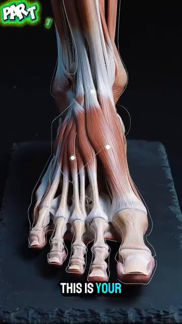

# DD7 — Ankles & Feet | Cổ Chân & Bàn Chân

*26 Bones, 33 Joints, the Windlass Mechanism, and Why Your Footwear Matters More Than Your Racket*

---

## 📋 DOCUMENT MAP / BẢN ĐỒ TÀI LIỆU

| 🇺🇸 English | 🇻🇳 Tiếng Việt |
|---|---|
| The foot is **a 26-bone, 33-joint, 19-muscle, 7,000+ nerve ending machine**. It is the only part of your body in constant contact with the ground. It is the foundation of the kinetic chain (DD1). Get the foot wrong and nothing above it works right. | Bàn chân là **cỗ máy 26 xương, 33 khớp, 19 cơ, hơn 7.000 đầu mút thần kinh**. Nó là phần DUY NHẤT cơ thể tiếp xúc liên tục với đất. Nó là nền tảng của chuỗi động học (DD1). Làm sai bàn chân thì không gì phía trên nó làm đúng. |
| **What it covers:** the 26 bones in 3 zones (hindfoot, midfoot, forefoot), the windlass mechanism (the plantar fascia as a tension cable), the intrinsic vs extrinsic muscles, the 7,000 nerve endings and 30-millisecond reflex, the outside-leg bridge foot position (30–45°), and how tennis shoes affect (or destroy) foot function. | **Nội dung:** 26 xương ở 3 vùng (cổ chân, giữa bàn, ngón), cơ chế windlass (cân gan chân như cáp căng), cơ nội sinh vs ngoại sinh, hơn 7.000 đầu mút thần kinh và phản xạ 30 mili giây, vị trí chân cầu ngoài (30–45°), và giày tennis ảnh hưởng thế nào đến (hoặc phá hủy) chức năng bàn chân. |
| **What it does NOT cover:** the knee (DD6), the ankle joint in detail with ligament injuries (Tennis Anatomy Ch.10), or running shoe selection (beyond the tennis-specific note). | **Không bao gồm:** gối (DD6), khớp cổ chân chi tiết với chấn thương dây chằng (Tennis Anatomy Ch.10), hay chọn giày chạy (ngoài ghi chú tennis). |
| **Reading time:** 35–45 minutes. | **Thời gian đọc:** 35–45 phút. |

---

## 📑 TABLE OF CONTENTS / MỤC LỤC

| # | English | Tiếng Việt |
|---|---|---|
| 1 | The 26 Bones in 3 Zones | 26 Xương Ở 3 Vùng |
| 2 | The 19 Muscles — Intrinsic vs Extrinsic | 19 Cơ — Nội Sinh vs Ngoại Sinh |
| 3 | The Plantar Fascia and the Windlass Mechanism | Cân Gan Chân và Cơ Chế Windlass |
| 4 | The Arches — Longitudinal and Transverse | Các Vòm — Dọc và Ngang |
| 5 | The 7,000 Nerve Endings — The 30-ms Foot Reflex | 7.000 Đầu Mút Thần Kinh — Phản Xạ 30 ms |
| 6 | The Outside-Leg Bridge — Foot Position at 30–45° | Chân Cầu Ngoài — Vị Trí Bàn Chân 30–45° |
| 7 | The Happy Feet Cue — Pre-Tension the Plantar Fascia | Câu Nhắc Happy Feet — Tiền Căng Cân Gan Chân |
| 8 | The Tennis Shoe Trap — 10 mm Heel Lift, 15 mm Toe Box | Cái Bẫy Giày Tennis — Nâng Gót 10 mm, Thu Hẹp Mũi 15 mm |

---

* * *

## Chapter 1 — The 26 Bones in 3 Zones | Chương 1 — 26 Xương Ở 3 Vùng

| 🇺🇸 English | 🇻🇳 Tiếng Việt |
|---|---|
| **The human foot has 26 bones, organized in 3 functional zones:** hindfoot (ankle area), midfoot (arch), forefoot (toes and metatarsals). Together they form 33 joints. The foot is NOT a rigid platform. It's an ADAPTIVE structure that changes shape with every step. | **Bàn chân người có 26 xương, tổ chức ở 3 vùng chức năng:** cổ chân (vùng mắt cá), giữa bàn (vòm), ngón và bàn chân trước. Cùng nhau chúng tạo thành 33 khớp. Bàn chân KHÔNG PHẢI nền cứng. Nó là cấu trúc THÍCH NGHI thay đổi hình dạng mỗi bước. |

### The 3 Zones of the Foot | 3 Vùng Bàn Chân

| Zone | # Bones | Names | Function | Tennis Translation |
|---|---|---|---|---|
| **Hindfoot** | 7 | Talus, calcaneus (heel), navicular, cuboid + 3 cuneiforms (medial, intermediate, lateral) | Shock absorption (heel strike), talus pivot for inversion/eversion | The "spring" — heel strikes first on landing, then the talus pivots |
| **Midfoot** | 5 (navicular, cuboid, 3 cuneiforms) | Forms the ARCH — the bridge of the foot | Stores and releases elastic energy during gait | The "spring" itself. Calcaneus → metatarsals via plantar fascia. |
| **Forefoot** | 14 | 5 metatarsals + 14 phalanges (2 in big toe, 3 in each other toe) | Push-off during gait. The big toe is the LAST bone to leave the ground. | The "lever" — the great toe is critical for push-off. |

### The 33 Joints — Why Mobility Matters | 33 Khớp — Vì Sao Di Động Quan Trọng

| Joint Type | # in Foot | Role |
|---|---|---|
| **Hindfoot** | 4 (subtalar, talocalcaneal, calcaneocuboid, talonavicular) | Inversion/eversion, plantar/dorsiflexion |
| **Midfoot** | ~9 (cuneonavicular, intercuneiform, cuneocuboid) | Arch support, fine adaptation |
| **Forefoot** | ~20 (tarsometatarsal, metatarsophalangeal, interphalangeal) | Push-off, gripping |

### The Hindfoot — The Pivot Point | Cổ Chân — Điểm Xoay

| Bone | Anatomy | Tennis Role |
|---|---|---|
| **Talus** | The "ankle bone" — sits between tibia (above) and calcaneus (below). No muscle attachment. Just a pivot. | Transmits forces from leg to foot. Any dysfunction → whole leg compensates. |
| **Calcaneus** (heel bone) | The largest foot bone. Achilles tendon attaches here. | The first bone to hit the ground on a step. |
| **Navicular** | Medial midfoot. Tibialis posterior attaches here. | The "keystone" of the medial longitudinal arch. |
| **Cuboid** | Lateral midfoot. Peroneus longus tendon passes through here. | Helps stabilize the lateral column during push-off. |

*Source: Giai_phau_Ban_chan_Tennis.docx Ch.1-2 (Hệ xương và khớp). Tennis Anatomy Ch.7.*

---

* * *

## Chapter 2 — The 19 Muscles (Intrinsic vs Extrinsic) | Chương 2 — 19 Cơ (Nội Sinh vs Ngoại Sinh)

| 🇺🇸 English | 🇻🇳 Tiếng Việt |
|---|---|
| **The foot has TWO sets of muscles:** INTRINSIC muscles (11 small muscles entirely within the foot) and EXTRINSIC muscles (8 muscles originating in the leg and inserting into the foot). They have different jobs. | **Bàn chân có HAI bộ cơ:** cơ NỘI SINH (11 cơ nhỏ nằm hoàn toàn trong bàn chân) và cơ NGOẠI SINH (8 cơ nguyên ủy ở cẳng chân và bám vào bàn chân). Chúng có việc khác nhau. |
| **The user's source makes the distinction:** "Cơ chày trước, cơ mác dài, cơ tam đầu cẳng chân bám vào bàn chân từ xa. Chúng tạo lực lớn nhưng phản ứng chậm." (Tibialis anterior, peroneus longus, gastrocnemius attach to the foot from afar. They create large force but react slowly.) | **Nguồn của bạn phân biệt:** "Cơ chày trước, cơ mác dài, cơ tam đầu cẳng chân bám vào bàn chân từ xa. Chúng tạo lực lớn nhưng phản ứng chậm." |

### The 19 Foot Muscles — Intrinsic vs Extrinsic | 19 Cơ Bàn Chân — Nội Sinh vs Ngoại Sinh

| Type | # | Examples | Primary Role | Tennis Translation |
|---|---|---|---|---|
| **Intrinsic** | 11 | Abductor hallucis, flexor digitorum brevis, quadratus plantae, lumbricals (4), interossei (4 — but only 3 in foot), adductor hallucis | Foot shape, fine control, proprioception | Adjust foot to surface. Hold arch during push-off. |
| **Extrinsic** | 8 | Tibialis anterior, tibialis posterior, peroneus longus, peroneus brevis, peroneus tertius, extensor digitorum longus, extensor hallucis longus, flexor digitorum longus | Force production, gross movement | Push-off, lateral stability, ankle positioning |

### The Intrinsic Muscles — The Forgotten Heroes | Cơ Nội Sinh — Những Anh Hùng Bị Lãng Quên

| 🇺🇸 English | 🇻🇳 Tiếng Việt |
|---|---|
| **The intrinsic foot muscles do NOT produce large force.** They produce FINE CONTROL. They adjust the foot's shape to the ground. They maintain the arch during dynamic loading. They fire 30 milliseconds BEFORE the extrinsic muscles — pre-activating the foot for the upcoming load. | **Cơ nội sinh bàn chân KHÔNG tạo lực lớn.** Chúng tạo KIỂM SOÁT TINH TẾ. Chúng điều chỉnh hình dạng bàn chân theo đất. Chúng duy trì vòm trong tải động. Chúng bắn 30 mili giây TRƯỚC cơ ngoại sinh — tiền kích hoạt bàn chân cho tải sắp tới. |
| **The 50+ truth:** the intrinsic foot muscles atrophy from shoe wearing. Modern shoes SUPPORT the arch, so the intrinsic muscles don't need to work. They atrophy. By age 60, the intrinsic foot muscle mass is ~30% less than at age 20. | **Sự thật 50+:** cơ nội sinh bàn chân teo từ việc mang giày. Giày hiện đại HỖ TRỢ vòm, nên cơ nội sinh không cần làm việc. Chúng teo. Đến 60 tuổi, khối lượng cơ nội sinh bàn chân ít hơn ~30% so với 20 tuổi. |
| **The fix:** barefoot time. 5–10 minutes a day on grass or carpet. Walk, stand, do "short foot" exercises (try to shorten the foot without curling the toes). After 4 weeks, intrinsic strength returns. | **Cách sửa:** thời gian chân trần. 5–10 phút mỗi ngày trên cỏ hoặc thảm. Đi bộ, đứng, làm bài "short foot" (cố rút ngắn bàn chân không cuộn ngón). Sau 4 tuần, sức nội sinh trở lại. |

*Source: Giai_phau_Ban_chan_Tennis.docx Ch.3-4.*

---

* * *

## Chapter 3 — The Plantar Fascia and the Windlass Mechanism | Chương 3 — Cân Gan Chân và Cơ Chế Windlass

| 🇺🇸 English | 🇻🇳 Tiếng Việt |
|---|---|
| **The plantar fascia is a thick band of connective tissue that runs from the calcaneus (heel) to the bases of the toes.** It's like a CABLE running under the foot. When the big toe extends (during push-off), the cable tightens. This tightens the arch. This is the WINDLASS mechanism — the foot becomes a rigid lever for push-off. | **Cân gan chân là dải mô liên kết dày chạy từ xương gót đến đế các ngón chân.** Nó giống như CÁP chạy dưới bàn chân. Khi ngón cái duỗi (trong khi đẩy), cáp căng. Cái này làm căng vòm. Đây là cơ chế WINDLASS — bàn chân trở thành đòn bẩy cứng cho đẩy. |
| **The windlass is the reason you can SPRINT.** Without it, the foot would collapse on push-off. With it, the foot becomes a rigid lever — pushing 2–3× more efficiently. | **Windlass là lý do bạn có thể CHẠY NHANH.** Không có nó, bàn chân sẽ sụp khi đẩy. Có nó, bàn chân trở thành đòn bẩy cứng — đẩy hiệu quả hơn 2–3 lần. |
| **The windlass for tennis:** every split-step, every push-off, every wide recovery — the windlass activates. A foot with poor windlass (collapsed arch, restricted toe extension) loses 20–30% of push-off power. The knee compensates → patellar tendonitis. The hip compensates → adductor strain. | **Windlass cho tennis:** mỗi split-step, mỗi đẩy, mỗi hồi vị rộng — windlass kích hoạt. Bàn chân có windlass kém (vòm sụp, hạn chế duỗi ngón) mất 20–30% sức đẩy. Gối bù → viêm gân bánh chè. Hông bù → căng adductor. |

### The Windlass Mechanism — Step by Step | Cơ Chế Windlass — Từng Bước

| Step | Position | What Happens |
|---|---|---|
| **1. Foot flat** | Heel strike, foot in contact with ground | Windlass is LOOSE. Foot is MOBILE. Adapts to surface. |
| **2. Midstance** | Body weight over foot, arch compresses 3–4 mm | Windlass still loose. Intrinsic muscles fire. |
| **3. Heel off** | Heel lifts, weight shifts to forefoot | Plantar fascia starts to tension. |
| **4. Big toe extension** | Big toe dorsiflexes (extension) 60–90° as body moves over it | WINDSLASS ACTIVATES. Cable tightens. Arch rises. Foot becomes rigid. |
| **5. Push-off** | Foot is rigid lever. Toe-off. | Maximum push-off power. |

### The 3 Failures of the Windlass | 3 Sự Thất Bại Của Windlass

| # | Failure | What Happens | Tennis Result |
|---|---|---|---|
| 1 | **Hallux rigidus** (big toe arthritis) | Big toe can't extend 60°. Windlass doesn't engage. | Loss of push-off power. Knee compensation. |
| 2 | **Plantar fasciitis** | Plantar fascia inflamed. Cable is "too tight" already. | Pain with first step in morning. Micro-tears in fascia. |
| 3 | **Posterior tibial tendon dysfunction** | The muscle supporting the arch is weak. Arch collapses during midstance. | "Adult-acquired flat foot." Windlass can't engage. |

### The 50+ Windlass Reality — Why Push-Off Power Drops | Thực Tế Windlass 50+ — Vì Sao Sức Đẩy Giảm

| 🇺🇸 English | 🇻🇳 Tiếng Việt |
|---|---|
| **By age 60, big toe extension typically decreases by 15–25°.** The windlass engages less effectively. Push-off power drops 20–30%. | **Đến 60 tuổi, duỗi ngón cái thường giảm 15–25°.** Windlass kích hoạt kém hiệu quả hơn. Sức đẩy giảm 20–30%. |
| **The fix:** big toe mobility exercises. Sit with foot on opposite knee. Pull big toe back (extension) gently. Hold 30 sec. 5 reps × 3/day. After 4 weeks, extension improves 10–15°. | **Cách sửa:** bài tập di động ngón cái. Ngồi với chân trên gối đối diện. Kéo nhẹ ngón cái về sau (duỗi). Giữ 30 giây. 5 lần × 3 lần/ngày. Sau 4 tuần, duỗi cải thiện 10–15°. |
| **The tennis cue:** "press through the big toe." When you push off for a forehand, the LAST thing touching the ground should be the big toe pad. If the push-off is on the ball of the foot or the small toes, the windlass isn't engaging. | **Câu nhắc tennis:** "ấn qua ngón cái." Khi bạn đẩy cho forehand, cái CUỐI CÙNG chạm đất phải là đệm ngón cái. Nếu đẩy trên mu bàn chân hoặc ngón nhỏ, windlass không kích hoạt. |

*Source: Giai_phau_Ban_chan_Tennis.docx Ch.5 (Cân gan chân và cơ chế windlass).*

---

* * *

## Chapter 4 — The Arches (Longitudinal and Transverse) | Chương 4 — Các Vòm (Dọc và Ngang)

| 🇺🇸 English | 🇻🇳 Tiếng Việt |
|---|---|
| **The foot has TWO arches that work together:** the MEDIAL LONGITUDINAL ARCH (the inside of the foot, from heel to big toe) and the TRANSVERSE ARCH (across the foot, between the metatarsals). Together they create the spring and the strut. | **Bàn chân có HAI vòm làm việc cùng nhau:** VÒM DỌC TRONG (mặt trong bàn chân, từ gót đến ngón cái) và VÒM NGANG (ngang bàn chân, giữa các metatarsal). Cùng nhau chúng tạo lò xo và thanh chống. |
| **The medial longitudinal arch:** the more famous one. It absorbs shock during heel strike and rebounds during push-off. Supported by the plantar fascia, tibialis posterior tendon, spring ligament, and intrinsic muscles. | **Vòm dọc trong:** vòm nổi tiếng hơn. Nó hấp thụ sốc khi gót chạm và bật lại khi đẩy. Được hỗ trợ bởi cân gan chân, gân chày sau, dây chằng spring, và cơ nội sinh. |
| **The transverse arch:** the unsung hero. It runs across the foot at the level of the cuneiforms and metatarsal bases. It prevents the foot from splaying during push-off. In tennis, the OUTSIDE LEG uses the transverse arch as a STRUT — the foot is angled 30–45°, and the transverse arch converts horizontal force into vertical compression. | **Vòm ngang:** anh hùng thầm lặng. Nó chạy ngang bàn chân ở mức các đế cuneiform và metatarsal. Nó ngăn bàn chân xòe ra khi đẩy. Trong tennis, CHÂN NGOÀI dùng vòm ngang làm THANH CHỐNG — bàn chân nghiêng 30–45°, và vòm ngang chuyển lực ngang thành nén dọc. |

### The 2 Arches — Different Roles | 2 Vòm — Vai Trò Khác Nhau

| Arch | Shape | Function | Tennis Role |
|---|---|---|---|
| **Medial longitudinal** | Curves from calcaneus to 1st metatarsal head (big toe) | Shock absorption (heel strike), elastic recoil (push-off) | "Spring" — stores and releases energy |
| **Transverse** | Curves across the cuneiforms + metatarsal bases | Prevents splay, provides lateral rigidity | "Strut" — converts horizontal force into vertical compression in wider stance |

### The Arch Collapse Chain (Pronation → Valgus → Knee) | Chuỗi Sụp Vòm (Pronation → Valgus → Gối)

| 🇺🇸 English | 🇻🇳 Tiếng Việt |
|---|---|
| **When the medial longitudinal arch collapses (over-pronation):** the foot rolls inward. The tibia rotates internally. The knee goes into valgus. The hip drops. | **Khi vòm dọc trong sụp (pronation quá mức):** bàn chân lăn vào trong. Chày xoay trong. Gối vào valgus. Hông rơi. |
| **The kinetic chain reaction:** foot → tibia → knee → hip → lumbar. Each link rotates inward. The chain ends at L4-L5 (DD4). | **Phản ứng dây chuyền động học:** chân → chày → gối → hông → thắt lưng. Mỗi mắt xích xoay vào trong. Chuỗi kết thúc ở L4-L5 (DD4). |
| **The tennis trap:** players with collapsed arches feel "slower." They're not slower in the legs. They're losing force in the chain. The arch absorbs the force that should go to the ball. | **Cái bẫy tennis:** người chơi có vòm sụp cảm thấy "chậm hơn." Họ không chậm ở chân. Họ mất lực trong chuỗi. Vòm hấp thụ lực phải đi đến bóng. |

### The "Short Foot" Exercise — Arches Activation | Bài "Short Foot" — Kích Hoạt Vòm

| Step | Action | Why |
|---|---|---|
| 1. Stand barefoot, weight even | Base position | Avoid compensation |
| 2. Try to shorten the foot (pull ball of foot toward heel) WITHOUT curling toes | The KEY movement | Curls = extrinsic. Shortening = intrinsic. |
| 3. Hold 10 seconds | Endurance | Build intrinsic muscle endurance |
| 4. 10 reps × 3/day | Frequency | Atrophy reversal takes 4–6 weeks |

*Source: Giai_phau_Ban_chan_Tennis.docx Ch.6.*

---

* * *

## Chapter 5 — The 7,000 Nerve Endings (The 30-ms Foot Reflex) | Chương 5 — 7.000 Đầu Mút Thần Kinh (Phản Xạ 30 ms)

| 🇺🇸 English | 🇻🇳 Tiếng Việt |
|---|---|
| **The sole of the foot has more than 7,000 nerve endings.** They are the body's first line of information about the world. They detect pressure, vibration, temperature, pain. They send signals UP the spinal cord in 30 milliseconds — FASTER than conscious awareness (~80 ms). | **Lòng bàn chân có hơn 7.000 đầu mút thần kinh.** Chúng là tuyến thông tin đầu tiên của cơ thể về thế giới. Chúng phát hiện áp lực, rung, nhiệt độ, đau. Chúng gửi tín hiệu LÊN tủy sống trong 30 mili giây — NHANH HƠN ý thức (~80 ms). |
| **The 30-ms reflex:** when the foot slips on a wet court, the nerve endings fire. The signal reaches the spinal cord in 30 ms. The spinal cord sends a CORRECTION back to the muscles in another 30 ms. Total response: 60 ms. You have already braced yourself BEFORE you consciously know you slipped. | **Phản xạ 30 ms:** khi bàn chân trượt trên sân ướt, đầu mút thần kinh bắn. Tín hiệu đến tủy sống trong 30 ms. Tủy sống gửi HIỆU CHỈNH ngược lại cơ trong 30 ms khác. Tổng phản ứng: 60 ms. Bạn đã tự giữ mình TRƯỚC KHI ý thức biết bạn trượt. |
| **The 50+ decline:** by age 65, the number of nerve endings in the sole decreases by ~30%. Proprioception declines. The 30-ms reflex becomes 50-ms reflex. Recovery time from a slip increases. The risk of falling increases. | **Suy giảm 50+:** đến 65 tuổi, số đầu mút thần kinh ở lòng bàn chân giảm ~30%. Proprioception suy giảm. Phản xạ 30 ms trở thành 50 ms. Thời gian hồi phục từ trượt tăng. Nguy cơ ngã tăng. |

### The Pressure Distribution Map | Bản Đồ Phân Bố Áp Lực

| Pressure Zone | Pro Player | 3.5 Club Player | Why It Matters |
|---|---|---|---|
| **Big toe (hallux)** | 28% | 5–10% | Big toe is the FINAL lever in push-off. Pros use it. |
| **Pinky toe (5th metatarsal)** | 22% | 5–10% | Lateral stability. Pros use it. |
| **Other toes + forefoot** | 35% | 40–45% | Spread evenly. |
| **Midfoot** | 10% | 25–35% | The 3.5 player has FLAT midfoot contact (arch collapse). |
| **Heel** | 5% | 15–20% | Heel too loaded = no push-off. |

### The Tennis Foot Reflex Test — A Self-Check | Test Phản Xạ Chân Tennis — Tự Kiểm Tra

| 🇺🇸 English | 🇻🇳 Tiếng Việt |
|---|---|
| **Stand on one leg, eyes closed. Have a friend time you.** | **Đứng một chân, nhắm mắt. Nhờ bạn bấm giờ.** |
| **Pro standard:** 30+ seconds, no wobble. | **Chuẩn pro:** 30+ giây, không chao. |
| **50+ standard:** 10–15 seconds is normal. Below 10 seconds = high fall risk. | **Chuẩn 50+:** 10–15 giây là bình thường. Dưới 10 giây = nguy cơ ngã cao. |
| **The fix:** practice daily. Eyes-closed standing on one leg is the only exercise that has been shown to REDUCE fall risk in 50+ adults. 3×30 sec each side, daily. | **Cách sửa:** tập hàng ngày. Đứng một chân nhắm mắt là bài tập DUY NHẤT được chứng minh GIẢM nguy cơ ngã ở người lớn 50+. 3×30 giây mỗi bên, hàng ngày. |

*Source: Giai_phau_Ban_chan_Tennis.docx Ch.7-8 (7,000 nerve endings, 30 ms reflex, pressure distribution).*

---

* * *

## Chapter 6 — The Outside-Leg Bridge (Foot Position at 30–45°) | Chương 6 — Chân Cầu Ngoài (Vị Trí Bàn Chân 30–45°)

| 🇺🇸 English | 🇻🇳 Tiếng Việt |
|---|---|
| **When you hit a forehand in open stance, your OUTSIDE LEG (front leg, left for right-hander) is the BRIDGE.** It supports up to 3–5× body weight in compressive load. The foot MUST be angled 30–45° (not straight). | **Khi bạn đánh forehand ở open stance, CHÂN NGOÀI (chân trước, chân trái cho người thuận tay phải) là CẦU.** Nó chịu tải nén tới 3–5 lần trọng lượng cơ thể. Bàn chân PHẢI nghiêng 30–45° (không thẳng). |
| **Why 30–45°?** the angle uses the TRANSVERSE ARCH as a STRUT. Horizontal force from the swing decomposes into vertical compression. The force travels up through the talus, tibia, knee, and into the femur — all in a near-straight line. | **Vì sao 30–45°?** góc này dùng VÒM NGANG làm THANH CHỐNG. Lực ngang từ cú đánh phân giải thành nén dọc. Lực đi lên qua xương sên, chày, gối, và vào xương đùi — tất cả trong đường gần thẳng. |
| **If the foot is straight (0°):** all the horizontal force becomes valgus stress on the knee → medial meniscus load → IT band friction. The knee hurts. The lateral foot collapses. | **Nếu bàn chân thẳng (0°):** toàn bộ lực ngang trở thành valgus ở gối → tải sụn chêm trong → ma sát IT band. Gối đau. Bàn chân ngoài sụp. |
| **If the foot is angled >60° (over-rotated):** the foot loses its strut function. The transverse arch collapses. The force becomes shear on the knee. | **Nếu bàn chân nghiêng >60° (quá xoay):** bàn chân mất chức năng thanh chống. Vòm ngang sụp. Lực trở thành cắt trên gối. |

### The Outside Leg Foot Position — 3 Zones | Vị Trí Bàn Chân Chân Ngoài — 3 Vùng

| Foot Angle | Zone | Force Decomposition | Knee Effect |
|---|---|---|---|
| **0°** (straight) | Dangerous | All horizontal → valgus | High meniscus + IT band load |
| **30–45°** | OPTIMAL | Horizontal → vertical compression | Low knee load. Maximum force transfer. |
| **>60°** | Over-rotated | Loss of strut function | Shear on knee. Arch collapse. |

### The 3-Point Foot Anchor — Tripod Foot | Neo Bàn Chân 3 Điểm — Bàn Chân Tripod

| 🇺🇸 English | 🇻🇳 Tiếng Việt |
|---|---|
| **The tripod foot is the GOLDEN position for groundstrokes.** Three points of contact: heel (center), ball of foot under big toe, ball of foot under pinky toe. These three points form a triangle. The triangle is RIGID. The center of the triangle is the "tripod" — the load-bearing center. | **Bàn chân tripod là vị trí VÀNG cho groundstrokes.** Ba điểm tiếp xúc: gót (trung tâm), mu bàn chân dưới ngón cái, mu bàn chân dưới ngón út. Ba điểm này tạo thành tam giác. Tam giác là CỨNG. Tâm tam giác là "tripod" — tâm chịu tải. |
| **The test:** stand barefoot. Try to lift just the big toe while keeping the ball of foot under the pinky toe on the ground. If you can't, your tripod is collapsed. Practice "short foot" daily until you can. | **Test:** đứng chân trần. Cố nâng chỉ ngón cái trong khi giữ mu bàn chân dưới ngón út trên đất. Nếu bạn không làm được, tripod của bạn sụp. Tập "short foot" hàng ngày cho đến khi bạn làm được. |

*Source: Giai_phau_Ban_chan_Tennis.docx Ch.9-11.*

---

* * *

## Chapter 7 — The Happy Feet Cue (Pre-Tension the Plantar Fascia) | Chương 7 — Câu Nhắc Happy Feet (Tiền Căng Cân Gan Chân)

| 🇺🇸 English | 🇻🇳 Tiệt Việt |
|---|---|
| **"Happy feet" in tennis means the feet are constantly in motion — never flat on the ground for long.** The user defines it more specifically: "Giữ gót lơ lửng giúp cân gan chân ở trạng thái tiền căng." (Keeping the heel floating keeps the plantar fascia in pre-tension.) | **"Happy feet" trong tennis nghĩa là bàn chân liên tục di chuyển — không bao giờ phẳng trên đất lâu.** Bạn định nghĩa cụ thể hơn: "Giữ gót lơ lửng giúp cân gan chân ở trạng thái tiền căng." |
| **The pre-tension principle:** when the plantar fascia is pre-tensioned (heel off ground), the foot is ready to spring into action. The split-step can launch in any direction instantly. No delay. No "loading time." | **Nguyên lý tiền căng:** khi cân gan chân được tiền căng (gót lơ lửng), bàn chân sẵn sàng bật vào hành động. Split-step có thể phóng theo bất kỳ hướng nào ngay lập tức. Không chậm trễ. Không "thời gian nạp." |

### The Happy Feet Position — Anatomy | Tư Thế Happy Feet — Giải Phẫu

| Element | Position | Muscle State |
|---|---|---|
| **Heel** | Slightly off ground (1–2 cm) | Calf (gastrocnemius + soleus) lightly contracted |
| **Ball of foot** | In contact with ground | Tibialis anterior relaxed |
| **Big toe** | Light contact, not gripping | Flexor hallucis longus relaxed |
| **Plantar fascia** | PRE-TENSIONED | Ready to spring |
| **Arch** | Slightly raised (active) | Intrinsic muscles engaged |

### The Cost of Flat Feet in Tennis | Cái Giá Của Bàn Chân Phẳng Trong Tennis

| 🇺🇸 English | 🇻🇳 Tiếng Việt |
|---|---|
| **If your heel stays flat on the ground for >2 seconds during a point, you have "lazy feet."** The plantar fascia goes slack. The split-step reaction time increases from 100 ms to 250 ms. You lose 150 ms — enough for an opponent to hit a winner. | **Nếu gót bạn giữ phẳng trên đất >2 giây trong điểm, bạn có "bàn chân lười."** Cân gan chân chùng. Thời gian phản ứng split-step tăng từ 100 ms lên 250 ms. Bạn mất 150 ms — đủ để đối phương đánh winner. |
| **The 50+ habit:** most recreational players let the heel drop between shots. They're waiting for the next ball. They're flat-footed. The pro keeps the heel up — always ready. The pro's split-step is half the time of the recreational player. | **Thói quen 50+:** hầu hết người chơi phong trào để gót rơi giữa các cú. Họ chờ bóng tiếp. Họ bàn chân phẳng. Pro giữ gót lên — luôn sẵn sàng. Split-step của pro bằng nửa người chơi phong trào. |
| **The fix:** the "elevator heel." Between every shot, lift the heel 1 cm. Count: split-step → hit → recover → HEEL UP. Make it a rhythm. After 2 weeks of conscious practice, it becomes automatic. | **Cách sửa:** "gót thang máy." Giữa mỗi cú, nâng gót 1 cm. Đếm: split-step → đánh → hồi vị → GÓT LÊN. Tạo nhịp. Sau 2 tuần tập có ý thức, nó trở thành tự động. |

*Source: Giai_phau_Ban_chan_Tennis.docx Ch.10 (Liên hệ với happy feet).*

---

* * *

## Chapter 8 — The Tennis Shoe Trap (10 mm Heel Lift, 15 mm Toe Box) | Chương 8 — Cái Bẫy Giày Tennis (Nâng Gót 10 mm, Thu Hẹp Mũi 15 mm)

| 🇺🇸 English | 🇻🇳 Tiếng Việt |
|---|---|
| **The user's source has a SHOCKING statistic:** "Hầu hết giày tennis nâng gót 10 mm, thu hẹp mũi 15 mm so với bàn chân tự nhiên. Hệ quả là ngón cái không duỗi được, windlass giảm hiệu quả, cơ nội sinh teo dần." (Most tennis shoes lift the heel 10 mm and narrow the toe box by 15 mm compared to the natural foot. The result is the big toe can't extend, the windlass is less effective, and intrinsic muscles atrophy over time.) | **Nguồn của bạn có số liệu SỐC:** "Hầu hết giày tennis nâng gót 10 mm, thu hẹp mũi 15 mm so với bàn chân tự nhiên. Hệ quả là ngón cái không duỗi được, windlass giảm hiệu quả, cơ nội sinh teo dần." |
| **The 10 mm heel lift** shortens the calf. Over time, the calf adapts to the shorter length. When you take the shoe off, the calf "feels" too long. You feel tight. You stretch the calf. The calf SHORTENS further. A vicious cycle. | **Nâng gót 10 mm** làm ngắn cơ bắp chân. Qua thời gian, bắp chân thích nghi với chiều dài ngắn hơn. Khi bạn cởi giày, bắp chân "cảm thấy" quá dài. Bạn cảm thấy căng. Bạn kéo giãn bắp chân. Bắp chân NGẮN THÊM. Vòng lặp. |
| **The 15 mm toe box narrowing** prevents the big toe from extending 60–90° at push-off. The windlass doesn't engage. Push-off power drops 20–30%. | **Thu hẹp mũi giày 15 mm** ngăn ngón cái duỗi 60–90° khi đẩy. Windlass không kích hoạt. Sức đẩy giảm 20–30%. |

### The Tennis Shoe Numbers — What to Look For | Con Số Giày Tennis — Cái Gì Cần Tìm

| Number | What It Means | What You Want |
|---|---|---|
| **Heel-to-toe drop** | The mm of lift from heel to toe | 4–8 mm max. NOT 10+ mm. |
| **Toe box width** | The mm of horizontal space for toes | Your natural foot width + 5–10 mm. NOT -15 mm. |
| **Heel counter stiffness** | How rigid the back of the shoe is | Moderate. Not floppy, not board-stiff. |
| **Midsole cushioning** | How much shock absorption under the heel | Moderate. Too soft = unstable. Too hard = joint impact. |
| **Outsole pattern** | The tread pattern on the bottom | Herringbone for hard courts. Modified herringbone for clay. |
| **Upper material** | The fabric on top | Breathable mesh. Avoid heavy leather (waterlogging). |

### The 3 Tennis Shoe Mistakes | 3 Sai Lầm Giày Tennis

| # | Mistake | Consequence | The Fix |
|---|---|---|---|
| **1** | Wearing shoes >6 months old | Midsole cushioning degrades 30–50% | Replace every 4–6 months for regular players |
| **2** | Wearing the wrong surface shoe | Wrong tread = slipping or sticking | Hard court shoes on hard court. Clay shoes on clay. |
| **3** | Tight toe box "for support" | Big toe can't extend. Windlass fails. | Buy shoes with TOE ROOM. Wiggle toes inside. |

### The 50+ Foot Longevity Protocol | Phác Đồ Chân Lâu Bền Cho 50+

| Element | Frequency | Why |
|---|---|---|
| **Barefoot time on grass or carpet** | 5–10 min/day | Re-activates intrinsic foot muscles |
| **Short foot exercise** | 3×10/day | Reverses arch collapse |
| **Big toe extension stretch** | 5×30 sec × 3/day | Maintains windlass engagement |
| **Single-leg balance eyes closed** | 3×30 sec × 3/day | Maintains 7,000 nerve endings |
| **Replace tennis shoes every 4–6 months** | Per pair | Midsole degrades |
| **Rotate 2 pairs** | If possible | Midsole recovers between sessions |

*Source: Giai_phau_Ban_chan_Tennis.docx Ch.12-14. Reference: minimalist shoe research, foot health literature.*

---

* * *

## 📋 DD7 CARD — Printable / THẺ IN ĐƯỢC DD7

╔═══════════════════════════════════════════════════════════╗
║  DD7 CARD — ANKLES & FEET                                 ║
║  THẺ DD7 — CỔ CHÂN & BÀN CHÂN                             ║
╠═══════════════════════════════════════════════════════════╣
║                                                            ║
║  🎯 ONE BIG IDEA / Ý TƯỞNG CỐT LÕI:                      ║
║     The foot is a 26-bone, 33-joint, 7,000-nerve-ending    ║
║     machine. The windlass (plantar fascia as cable)        ║
║     makes push-off powerful. Outside-leg bridge: foot at   ║
║     30–45°. Tennis shoes with 10 mm heel lift + 15 mm     ║
║     toe box narrowing destroy foot function over time.     ║
║                                                            ║
║     Bàn chân là cỗ máy 26 xương, 33 khớp, 7.000 thần     ║
║     kinh. Windlass (cân gan chân như cáp) tạo đẩy mạnh.   ║
║     Chân cầu ngoài: bàn chân 30–45°. Giày tennis nâng     ║
║     gót 10 mm + thu hẹp mũi 15 mm phá chức năng chân.    ║
║                                                            ║
║  ────────────────────────────────────────────────────────  ║
║  KEY NUMBERS / CÁC CON SỐ CHÍNH:                          ║
║  • 26 bones / 33 joints / 19 intrinsic+extrinsic muscles  ║
║  • 7,000+ nerve endings in sole                            ║
║  • 30 ms reflex (foot → spinal cord → muscle)             ║
║  • Big toe extends 60–90° for windlass to engage          ║
║  • Push-off power drops 20–30% without windlass            ║
║  • Tennis shoes: 10 mm heel lift, 15 mm toe box narrowing ║
║  • Pros: 28% pressure on big toe, 22% on pinky             ║
║  • 3.5 players: 5–10% on big toe, 25–35% on midfoot       ║
║                                                            ║
║  ────────────────────────────────────────────────────────  ║
║  ⚠️ TOP MISTAKE / LỖI PHỔ BIẾN NHẤT:                     ║
║     Letting the heel drop flat between shots (lazy        ║
║     feet). The plantar fascia goes slack. The split-step  ║
║     reaction time goes from 100 ms to 250 ms — enough     ║
║     time for the opponent to hit a winner. The fix:       ║
║     "Elevator heel" — keep the heel 1 cm off the ground.  ║
║                                                            ║
║  ────────────────────────────────────────────────────────  ║
║  🔁 DRILL / BÀI TẬP:                                       ║
║     1. Short Foot: stand barefoot, shorten foot without    ║
║        curling toes. 10 reps × 3/day.                      ║
║     2. Big Toe Extension Stretch: pull big toe back,      ║
║        hold 30 sec. 5 reps × 3/day.                        ║
║     3. Single-Leg Balance Eyes Closed: 30 sec each side.  ║
║        3 reps × 3/day. Reduces fall risk in 50+.           ║
║                                                            ║
║  ────────────────────────────────────────────────────────  ║
║  💭 MASTER CUE / CÂU NHẮC TỔNG:                           ║
║     "Heels up, tripod foot, press through the big toe."   ║
║     "Gót lên, bàn chân tripod, ấn qua ngón cái."        ║
║                                                            ║
╚═══════════════════════════════════════════════════════════╝

╔═══════════════════════════════════════════════════════════╗
║  DD7 CARD — ANKLES & FEET                                 ║
║  THẺ DD7 — CỔ CHÂN & BÀN CHÂN                             ║
╠═══════════════════════════════════════════════════════════╣
║                                                            ║
║  🎯 ONE BIG IDEA / Ý TƯỞNG CỐT LÕI:                      ║
║     The foot is a 26-bone, 33-joint, 7,000-nerve-ending    ║
║     machine. The windlass (plantar fascia as cable)        ║
║     makes push-off powerful. Outside-leg bridge: foot at   ║
║     30–45°. Tennis shoes with 10 mm heel lift + 15 mm     ║
║     toe box narrowing destroy foot function over time.     ║
║                                                            ║
║     Bàn chân là cỗ máy 26 xương, 33 khớp, 7.000 thần     ║
║     kinh. Windlass (cân gan chân như cáp) tạo đẩy mạnh.   ║
║     Chân cầu ngoài: bàn chân 30–45°. Giày tennis nâng     ║
║     gót 10 mm + thu hẹp mũi 15 mm phá chức năng chân.    ║
║                                                            ║
║  ────────────────────────────────────────────────────────  ║
║  KEY NUMBERS / CÁC CON SỐ CHÍNH:                          ║
║  • 26 bones / 33 joints / 19 intrinsic+extrinsic muscles  ║
║  • 7,000+ nerve endings in sole                            ║
║  • 30 ms reflex (foot → spinal cord → muscle)             ║
║  • Big toe extends 60–90° for windlass to engage          ║
║  • Push-off power drops 20–30% without windlass            ║
║  • Tennis shoes: 10 mm heel lift, 15 mm toe box narrowing ║
║  • Pros: 28% pressure on big toe, 22% on pinky             ║
║  • 3.5 players: 5–10% on big toe, 25–35% on midfoot       ║
║                                                            ║
║  ────────────────────────────────────────────────────────  ║
║  ⚠️ TOP MISTAKE / LỖI PHỔ BIẾN NHẤT:                     ║
║     Letting the heel drop flat between shots (lazy        ║
║     feet). The plantar fascia goes slack. The split-step  ║
║     reaction time goes from 100 ms to 250 ms — enough     ║
║     time for the opponent to hit a winner. The fix:       ║
║     "Elevator heel" — keep the heel 1 cm off the ground.  ║
║                                                            ║
║  ────────────────────────────────────────────────────────  ║
║  🔁 DRILL / BÀI TẬP:                                       ║
║     1. Short Foot: stand barefoot, shorten foot without    ║
║        curling toes. 10 reps × 3/day.                      ║
║     2. Big Toe Extension Stretch: pull big toe back,      ║
║        hold 30 sec. 5 reps × 3/day.                        ║
║     3. Single-Leg Balance Eyes Closed: 30 sec each side.  ║
║        3 reps × 3/day. Reduces fall risk in 50+.           ║
║                                                            ║
║  ────────────────────────────────────────────────────────  ║
║  💭 MASTER CUE / CÂU NHẮC TỔNG:                           ║
║     "Heels up, tripod foot, press through the big toe."   ║
║     "Gót lên, bàn chân tripod, ấn qua ngón cái."        ║
║                                                            ║
╚═══════════════════════════════════════════════════════════╝

---

## 🖼️ ILLUSTRATIONS / HÌNH MINH HỌA

*38 images available in `Anatomy_Lab/images/DD7_ankles_feet/` (19 from Giai_phau_Ban_chan_Tennis.docx + 19 from Tennis Anatomy PDF).*

### Figure 1 — Foot Bones 3D Model (Hình 1) | Hình 1 — Mô Hình 3D Xương Bàn Chân

### Figure 2–3 — Muscle-Tendon Structure of Dorsum of Foot | Hình 2–3

| Figure | Description | Image |
|---|---|---|
| 2 | Muscle-tendon structure during heel-lift preparation | `Giai_phau_Ban_chan_Tennis__img02.jpg` |
| 3 | Same — different angle | `Giai_phau_Ban_chan_Tennis__img03.jpg` |

### Figure 4–7 — Windlass Mechanism | Hình 4–7

| Figure | Description | Image |
|---|---|---|
| 4 | Forefoot deformation under body weight (windlass mechanism) | `Giai_phau_Ban_chan_Tennis__img04.jpg` |
| 5 | Same — different view | `Giai_phau_Ban_chan_Tennis__img05.jpg` |
| 6 | Same — different view | `Giai_phau_Ban_chan_Tennis__img06.jpg` |
| 7 | Same — different view | `Giai_phau_Ban_chan_Tennis__img07.jpg` |

### Figure 8–11 — Sole Nerve Endings | Hình 8–11

| Figure | Description | Image |
|---|---|---|
| 8 | Nerve endings of sole and orientation role | `Giai_phau_Ban_chan_Tennis__img08.jpg` |
| 9 | Same — different angle | `Giai_phau_Ban_chan_Tennis__img09.jpg` |
| 10 | Same — different angle | `Giai_phau_Ban_chan_Tennis__img10.jpg` |
| 11 | Same — different angle | `Giai_phau_Ban_chan_Tennis__img11.jpg` |

### Figure 12–14 — Pressure Distribution | Hình 12–14

| Figure | Description | Image |
|---|---|---|
| 12 | Pressure control when heel is fully lifted | `Giai_phau_Ban_chan_Tennis__img12.jpg` |
| 13 | Same — different view | `Giai_phau_Ban_chan_Tennis__img13.jpg` |
| 14 | Same — different view | `Giai_phau_Ban_chan_Tennis__img14.jpg` |

### Figure 15–19 — Outside-Leg Bridge & Alcaraz Comparison | Hình 15–19

| Figure | Description | Image |
|---|---|---|
| 15 | Alcaraz mid-run, foot not yet tripod | `Giai_phau_Ban_chan_Tennis__img15.jpg` |
| 16 | Same — different view | `Giai_phau_Ban_chan_Tennis__img16.jpg` |
| 17 | Same — different view | `Giai_phau_Ban_chan_Tennis__img17.jpg` |
| 18 | Recovery + outside-leg bridge creation | `Giai_phau_Ban_chan_Tennis__img18.jpg` |
| 19 | Same — different view | `Giai_phau_Ban_chan_Tennis__img19.jpg` |

### Figures 20–38 — Tennis Anatomy PDF Ch.7 (Foot/Ankle) | Hình 20–38

| Figure | Description | Image |
|---|---|---|
| 20 | Ankle joint bones | `DD7_ankles_feet_01.jpg` (Tennis Anatomy Fig.7.x) |
| 21 | Subtalar joint detail | `DD7_ankles_feet_02.jpg` |
| 22 | Achilles tendon attachment | `DD7_ankles_feet_03.jpg` |
| 23 | Plantar fascia anatomy | `DD7_ankles_feet_04.jpg` |
| 24 | Tibialis posterior tendon | `DD7_ankles_feet_05.jpg` |
| 25–38 | Various foot/ankle exercise demonstrations | `DD7_ankles_feet_06.jpg` through `_19.jpg` |

*All image filenames verified to exist in `Anatomy_Lab/images/DD7_ankles_feet/`.*

---

## 🔗 CROSS-REFERENCES / THAM CHIẾU CHÉO

| Topic in DD7 | See Also |
|---|---|
| Foot tripod for groundstrokes | **DD1 Player in Motion** — the 6 critical angles at contact |
| Outside-leg bridge 30–45° | **DD6 Knees** — knee over 2nd toe, foot under hip |
| 7,000 nerve endings and proprioception | **DD8 Control System** — vestibular + vision + proprioception |
| Arch collapse → valgus → knee | **DD6 Knees** — ACL mechanism, patellofemoral pain |
| Windlass for push-off | **DD1 Player in Motion** — kinetic chain, ground reaction force |
| Happy feet and split-step | **DD8 Control System** — reaction time, vision |
| Tennis shoe selection | **DD6 Knees** — joint preservation, less force on cartilage |

---

## 📚 SOURCES / NGUỒN

| Source | Type | What It Contributed |
|---|---|---|
| `Human anatomy/Giai_phau_Ban_chan_Tennis.docx` | User's Vietnamese notes (19 images) | 26 bones 33 joints, hindfoot/midfoot/forefoot, intrinsic vs extrinsic muscles, windlass, longitudinal + transverse arches, 7,000 nerve endings 30 ms reflex, pressure distribution 28%/22%, outside leg bridge 30–45°, happy feet, tennis shoe trap 10 mm/15 mm, rehabilitation program |
| `Tennis Knowledge/7.Tennis Books in pdf/Tennis Anatomy ( PDFDrive ).pdf` Ch.7 (Legs) | Reference textbook | Foot anatomy, ankle joint, Achilles tendon, calf muscles |

---

*End of DD7 — Ankles & Feet | Hết DD7 — Cổ Chân & Bàn Chân*

*Next: DD8 — The Control System (Vestibular, Proprioception, Vision, 50+ Body) | Tiếp: DD8 — Hệ Kiểm Soát (Tiền Đình, Proprioception, Thị Giác, Cơ Thể 50+)*