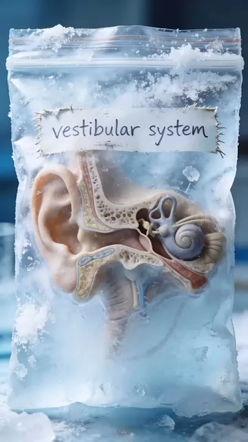
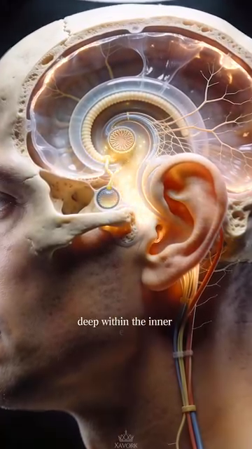

# DD8 — The Control System | Hệ Kiểm Soát

*Vestibular System, Proprioception, Vision, and the 50+ Body's Adaptation*

---

## 📋 DOCUMENT MAP / BẢN ĐỒ TÀI LIỆU

| 🇺🇸 English | 🇻🇳 Tiếng Việt |
|---|---|
| The control system is the **3rd layer of the kinetic chain** (after the foundation from DD1, the structure from DD2–DD7). It's the part that makes tennis possible at all — without vestibular input, proprioception, and vision, the body can't decide WHERE to be or WHEN to move. | Hệ kiểm soát là **lớp thứ 3 của chuỗi động học** (sau nền tảng từ DD1, cấu trúc từ DD2–DD7). Đó là phần làm cho tennis có thể xảy ra — không có input tiền đình, proprioception, và thị giác, cơ thể không quyết định được Ở ĐÂU hoặc KHI NÀO di chuyển. |
| **What it covers:** the vestibular system (semicircular canals + otolith organs + neural pathways), proprioception (joint position sense + 7,000 nerve endings + muscle spindles), vision (5-phase visual cycle), the 50+ sensory triad (vestibular + visual + proprioceptive decline), and the 4-control-systems model. | **Nội dung:** hệ tiền đình (ống bán khuyên + cơ quan otolith + đường thần kinh), proprioception (cảm giác vị trí khớp + 7.000 đầu mút thần kinh + thoi cơ), thị giác (chu trình thị giác 5 pha), bộ ba giác quan 50+ (suy giảm tiền đình + thị giác + proprioception), và mô hình 4 hệ kiểm soát. |
| **What it does NOT cover:** stroke mechanics (Forehand/Backhand/Serve deep dives), mental game (a separate concern), training plans (separate concern). | **Không bao gồm:** cơ học đánh (Forehand/Backhand/Serve deep dives), tâm lý (mối quan tâm riêng), kế hoạch tập (mối quan tâm riêng). |
| **Reading time:** 40–50 minutes. | **Thời gian đọc:** 40–50 phút. |

---

## 📑 TABLE OF CONTENTS / MỤC LỤC

| # | English | Tiếng Việt |
|---|---|---|
| 1 | The 4 Control Systems — Vision, Vestibular, Proprioception, Auditory | 4 Hệ Kiểm Soát — Thị Giác, Tiền Đình, Cảm Giác Sâu, Thính Giác |
| 2 | The Vestibular System — Where Balance Lives | Hệ Tiền Đình — Nơi Cân Bằng Trú Ngụ |
| 3 | The 5-Phase Visual Cycle — How Pros Read the Ball | Chu Trình Thị Giác 5 Pha — Cách Pro Đọc Bóng |
| 4 | Proprioception — The 7,000-Nerve Silent Sense | Cảm Giác Sâu — Giác Quan Im Lặng 7.000 Thần Kinh |
| 5 | The Reaction Time Cascade — 3 Layers | Chuỗi Thời Gian Phản Ứng — 3 Lớp |
| 6 | The 50+ Sensory Triad — Why Reaction Slows | Bộ Ba Giác Quan 50+ — Vì Sao Phản Ứng Chậm |
| 7 | The 4 Tennis-Specific Control Drills | 4 Bài Tập Kiểm Soát Riêng Cho Tennis |

---

* * *

## Chapter 1 — The 4 Control Systems (Vision, Vestibular, Proprioception, Auditory) | Chương 1 — 4 Hệ Kiểm Soát

| 🇺🇸 English | 🇻🇳 Tiếng Việt |
|---|---|
| **The human body has 4 control systems that operate in parallel to produce tennis movement.** They are: VISION (where the ball is going), VESTIBULAR (where your head is in space), PROPRIOCEPTION (where your body parts are relative to each other), and AUDITORY (when the ball strikes the racquet). | **Cơ thể người có 4 hệ kiểm soát hoạt động song song để tạo chuyển động tennis.** Chúng là: THỊ GIÁC (bóng đi đâu), TIỀN ĐÌNH (đầu bạn ở đâu trong không gian), CẢM GIÁC SÂU (các bộ phận cơ thể ở đâu tương đối với nhau), và THÍNH GIÁC (khi bóng chạm vợt). |
| **These 4 systems overlap and back each other up.** When one fails, the others compensate. When two fail, the system breaks down. | **4 hệ này chồng lấp và hỗ trợ lẫn nhau.** Khi một hệ hỏng, các hệ khác bù. Khi hai hệ hỏng, hệ thống sụp. |

### The 4 Control Systems | 4 Hệ Kiểm Soát

| # | System | What It Does | Tennis Role | 50+ Decline |
|---|---|---|---|---|
| **1** | **Vision** | Where the ball is going. Where opponents are positioned. | Read the serve. Track the ball. See the open court. | Lens stiffens (presbyopia). Contrast sensitivity drops. |
| **2** | **Vestibular** | Where your head is in space. Are you rotating? Accelerating? Tilting? | Balance on the split-step. Recover from off-balance positions. Orientation during overhead. | Hair cells in semicircular canals decline. Balance errors increase. |
| **3** | **Proprioception** | Where your body parts are. Without looking. | "Feel" the racquet. Hit without watching the ball. Auto-adjust footwork. | 30% fewer nerve endings in sole by 65. Joint position sense declines. |
| **4** | **Auditory** | When the ball strikes. What string bed sound. Direction of opponent's shot. | Timing the contact. Hearing the racquet face (sweet spot vs off-center). | Less critical for tennis. Some high-frequency hearing loss. |

### The Hierarchy of the 4 Systems | Thứ Bậc Của 4 Hệ

| 🇺🇸 English | 🇻🇳 Tiếng Việt |
|---|---|
| **VISION is the PRIMARY system.** It operates ~150 ms ahead of conscious awareness. It plans the movement. | **THỊ GIÁC là hệ CHÍNH.** Nó hoạt động ~150 ms trước ý thức. Nó lập kế hoạch chuyển động. |
| **VESTIBULAR is the ORIENTATION system.** It updates the body's position in space at all times. Operates in parallel with vision. | **TIỀN ĐÌNH là hệ ĐỊNH HƯỚNG.** Nó cập nhật vị trí cơ thể trong không gian mọi lúc. Hoạt động song song với thị giác. |
| **PROPRIOCEPTION is the EXECUTION system.** It fine-tunes the movement based on feedback from joints, tendons, and feet. Operates FASTER than both (~30 ms). | **CẢM GIÁC SÂU là hệ THỰC THI.** Nó tinh chỉnh chuyển động dựa trên phản hồi từ khớp, gân, và bàn chân. Hoạt động NHANH HƠN cả hai (~30 ms). |
| **AUDITORY is the TIMING system.** It provides the "when" — the moment of contact. | **THÍNH GIÁC là hệ THỜI ĐIỂM.** Nó cung cấp "khi nào" — khoảnh khắc tiếp xúc. |

*Source: Anatomy_He_Tien_Dinh_Full.docx for vestibular system. Tennis Anatomy Ch.1, Ch.9 for movement drills.*

---

* * *

## Chapter 2 — The Vestibular System (Where Balance Lives) | Chương 2 — Hệ Tiền Đình (Nơi Cân Bằng Trú Ngụ)

| 🇺🇸 English | 🇻🇳 Tiệt Việt |
|---|---|
| **The vestibular system is deep inside the petrous bone of the skull, in the inner ear.** It is part of the labyrinth alongside the cochlea (hearing). The vestibular system does NOT hear. It senses MOTION and POSITION. | **Hệ tiền đình nằm sâu trong xương đá của hộp sọ, ở tai trong.** Nó là một phần của mê đạo cùng với ốc tai (thính giác). Hệ tiền đình KHÔNG nghe. Nó cảm nhận CHUYỂN ĐỘNG và VỊ TRÍ. |
| **The user's source explains:** "Hệ tiền đình nằm sâu trong xương đá của hộp sọ, thuộc tai trong, ngay sau ốc tai thính giác. Khác với ốc tai nhận âm thanh, tiền đình không tạo cảm giác." (The vestibular system lies deep in the petrous bone of the skull, in the inner ear, just behind the cochlea. Unlike the cochlea which receives sound, the vestibular system doesn't create sensation.) | **Nguồn của bạn giải thích:** "Hệ tiền đình nằm sâu trong xương đá của hộp sọ, thuộc tai trong, ngay sau ốc tai thính giác. Khác với ốc tai nhận âm thanh, tiền đình không tạo cảm giác." |

### The 5 Components of the Vestibular System | 5 Thành Phần Của Hệ Tiền Đình

| # | Component | Anatomy | What It Senses |
|---|---|---|---|
| **1** | **Three semicircular canals** | Anterior, posterior, horizontal. Each perpendicular to the others. | Angular acceleration (rotation). The 3 canals detect rotation in 3 planes. |
| **2** | **Utricle** | One of two otolith organs. Sits HORIZONTAL. | Horizontal linear acceleration + head tilt. |
| **3** | **Saccule** | The other otolith organ. Sits VERTICAL. | Vertical linear acceleration (e.g., elevator). |
| **4** | **Hair cells** (Type I + II) | Inside the canals and otoliths. Have kinocilium + 40–70 stereocilia. | Deflection of the stereocilia creates neural signal. |
| **5** | **Cupula** | Gelatinous structure inside each canal. Hair cells embed in it. | When endolymph moves, cupula bends, hair cells fire. |

### The Neural Pathway | Đường Dẫn Thần Kinh

| Stage | Anatomy | Function |
|---|---|---|
| **Receptor** | Hair cells in ampullae of canals | Mechanical to electrical transduction |
| **Afferent nerve** | Vestibular branch of CN VIII (vestibulocochlear) | Carries signal to brainstem |
| **Brainstem nuclei** | 4 vestibular nuclei in the pons | First integration. Send to cerebellum, spinal cord, eyes, cortex |
| **Cerebellum** | Receives vestibular + proprioceptive + visual input | Balance coordination |
| **Cortex** | Parietal + temporal lobes | Conscious awareness of body position |
| **Spinal cord** | Vestibulospinal tract | Adjusts muscle tone to maintain posture |

### The 4 Output Pathways from the Vestibular Nuclei | 4 Đường Đầu Ra Từ Nhân Tiền Đình

| Pathway | Target | Function | Tennis Role |
|---|---|---|---|
| **1. To eye muscles (CN III, IV, VI)** | Extraocular muscles | Vestibulo-ocular reflex (VOR) — keeps eyes stable when head moves | See the ball clearly while moving head |
| **2. To spinal cord** | Anterior horn cells (motor neurons) | Adjusts body posture automatically | Maintain balance during split-step |
| **3. To cerebellum** | Vestibulocerebellum (flocculonodular lobe) | Coordination of movement | Smooth racquet path |
| **4. To cortex** | Parietal lobe | Conscious awareness of orientation | Know which way is up during an overhead |

### The 30-ms Reflex — How Fast Is Vestibular? | Phản Xạ 30 ms — Tiền Đình Nhanh Cỡ Nào?

| 🇺🇸 English | 🇻🇳 Tiếng Việt |
|---|---|
| **The vestibulo-ocular reflex (VOR) fires in 30 milliseconds.** It works BEFORE conscious awareness. When you turn your head, your eyes move in the opposite direction — INSTANTLY — to keep the visual world stable. | **Phản xạ tiền đình-mắt (VOR) bắn trong 30 mili giây.** Nó hoạt động TRƯỚC ý thức. Khi bạn quay đầu, mắt bạn di chuyển hướng ngược lại — NGAY LẬP TỨC — để giữ thế giới thị giác ổn định. |
| **This is FASTER than the reaction time of a tennis ball (~150 ms).** It allows the player to track the ball smoothly even during fast head turns. | **Cái này NHANH HƠN thời gian phản ứng của bóng tennis (~150 ms).** Nó cho phép người chơi theo dõi bóng mượt ngay cả khi quay đầu nhanh. |
| **The 50+ truth:** the VOR declines ~10–15% by age 65. The result: when you turn your head, the visual world appears to "slip" briefly before stabilizing. You feel dizzy. The ball becomes blurry during head turns. | **Sự thật 50+:** VOR suy giảm ~10–15% đến 65 tuổi. Kết quả: khi bạn quay đầu, thế giới thị giác "trượt" nhẹ trước khi ổn định. Bạn cảm thấy chóng mặt. Bóng mờ khi quay đầu. |
| **The fix:** vestibular rehabilitation. The "gaze stabilization" exercise. Focus on a fixed point, turn your head side to side while keeping eyes on the point. 1 min × 3/day. | **Cách sửa:** phục hồi tiền đình. Bài "ổn định ánh nhìn." Tập trung vào điểm cố định, quay đầu qua lại trong khi giữ mắt trên điểm. 1 phút × 3 lần/ngày. |

*Source: Anatomy_He_Tien_Dinh_Full.docx (entire document). Reference: standard vestibular physiology texts.*

---

* * *

## Chapter 3 — The 5-Phase Visual Cycle (How Pros Read the Ball) | Chương 3 — Chu Trình Thị Giác 5 Pha (Cách Pro Đọc Bóng)

| 🇺🇸 English | 🇻🇳 Tiếng Việt |
|---|---|
| **Pros don't "see" the ball the way recreational players do.** They use a 5-phase visual cycle that occurs BEFORE contact. The cycle is fast (150-250 ms total), automated (no conscious thought needed), and trainable. | **Pro không "thấy" bóng theo cách người chơi phong trào.** Họ dùng chu trình thị giác 5 pha xảy ra TRƯỚC tiếp xúc. Chu trình nhanh (tổng 150–250 ms), tự động (không cần suy nghĩ ý thức), và có thể tập. |

### The 5 Phases | 5 Pha

| # | Phase | What Happens | Duration |
|---|---|---|---|
| **1** | **Wide Perception (Soft Eyes)** | Eyes "soak in" the whole court. Peripheral vision active. | ~50 ms |
| **2** | **Lock-On** | Eyes focus on the ball. Tracking begins. | ~30 ms |
| **3** | **Narrow Focus (Tunnel Vision)** | Eyes follow the ball exclusively. Peripheral vision suppressed. | ~80–120 ms |
| **4** | **Quiet Eye at Contact** | Eyes are STILL on the ball for 100+ ms after contact. The longest fixation. | ~100–200 ms |
| **5** | **Re-expand** | Eyes release. Peripheral vision returns. Next shot preparation. | ~50 ms |

### The Quiet Eye Phenomenon — The Key to Pro Vision | Hiện Tượng "Quiet Eye" — Chìa Khóa Của Thị Giác Pro

| 🇺🇸 English | 🇻🇳 Tiếng Việt |
|---|---|
| **The "Quiet Eye" is the longest fixation on the ball AFTER contact.** Research shows elite athletes have a Quiet Eye duration of ~200+ ms. Recreational players have ~50 ms. | **"Quiet Eye" là sự cố định dài nhất trên bóng SAU tiếp xúc.** Nghiên cứu cho thấy VĐV đẳng cấp cao có thời lượng Quiet Eye ~200+ ms. Người chơi phong trào có ~50 ms. |
| **Why it matters:** the Quiet Eye is when the brain processes the feedback from the contact — was it a sweet spot hit? Did the racquet face open? This feedback loops into the next stroke's motor program. WITHOUT the Quiet Eye, the brain doesn't learn from each shot. | **Vì sao quan trọng:** Quiet Eye là khi não xử lý phản hồi từ tiếp xúc — có phải sweet spot không? Mặt vợt có mở không? Phản hồi này loop vào chương trình vận động của cú tiếp theo. KHÔNG CÓ Quiet Eye, não không học từ mỗi cú. |
| **The 50+ decline:** the Quiet Eye shortens with age. By 60, average Quiet Eye is ~100 ms. By 70, ~70 ms. The 50+ player is learning slower from each stroke. | **Suy giảm 50+:** Quiet Eye ngắn lại theo tuổi. Đến 60, Quiet Eye trung bình ~100 ms. Đến 70, ~70 ms. Người chơi 50+ học chậm hơn từ mỗi cú. |
| **The training:** "Hold the look." After each shot in practice, hold your gaze on the contact point for 3 SECONDS (3000 ms). Train the brain that "looking longer" is allowed. After 4 weeks, the natural Quiet Eye duration extends. | **Cách tập:** "Giữ ánh nhìn." Sau mỗi cú trong tập, giữ ánh nhìn trên điểm tiếp xúc 3 GIÂY (3000 ms). Tập não rằng "nhìn lâu hơn" được phép. Sau 4 tuần, thời lượng Quiet Eye tự nhiên kéo dài. |

### The 3 Visual Mistakes in Tennis | 3 Sai Lầm Thị Giác Trong Tennis

| # | Mistake | What It Looks Like | The Fix |
|---|---|---|---|
| **1** | **Looking at the opponent, not the ball** | Eyes on the server's body during the toss. Eyes on the hitter's shoulder. | Track the BALL from racquet to contact. |
| **2** | **Head down at contact** | Eyes drop to the floor after hitting. No Quiet Eye. | "Hold the look" drill. Gaze stays on contact point. |
| **3** | **Narrow focus too early** | Eyes fix on the incoming ball too soon. Lose peripheral info on opponent's position. | Use the 5-phase cycle. Soft eyes → lock-on → tunnel → quiet eye → re-expand. |

*Source: Tennis Anatomy Ch.9 (Movement Drills). Reference: Quiet Eye research by Dr. Joan Vickers.*

---

* * *

## Chapter 4 — Proprioception (The 7,000-Nerve Silent Sense) | Chương 4 — Cảm Giác Sâu (Giác Quan Im Lặng 7.000 Thần Kinh)

| 🇺🇸 English | 🇻🇳 Tiếng Việt |
|---|---|
| **Proprioception is the sense of body position WITHOUT looking.** It's the sense that lets you touch your nose with your eyes closed. It's the sense that lets you know where your racquet head is during a backswing. It's the SILENT sense — you only notice it when it's broken. | **Cảm giác sâu là cảm giác vị trí cơ thể KHÔNG CẦN NHÌN.** Đó là cảm giác cho phép bạn chạm mũi với mắt nhắm. Đó là cảm giác cho phép bạn biết đầu vợt ở đâu trong backswing. Đó là giác quan IM LẶNG — bạn chỉ để ý nó khi nó hỏng. |
| **Proprioception has 3 input sources:** | **Cảm giác sâu có 3 nguồn input:** |
| 1. **Joint receptors** — Ruffini endings, Pacinian corpuscles in joint capsules | 1. **Thụ thể khớp** — Ruffini endings, tiểu thể Pacinian trong bao khớp |
| 2. **Muscle spindles** — specialized fibers inside muscles that sense stretch | 2. **Thoi cơ** — sợi chuyên biệt trong cơ cảm nhận kéo giãn |
| 3. **Skin receptors** — especially in the sole (7,000+) and palm | 3. **Thụ thể da** — đặc biệt ở lòng bàn chân (7.000+) và lòng bàn tay |

### The 3 Sources of Proprioceptive Input | 3 Nguồn Input Cảm Giác Sâu

| Source | Location | What It Senses | Tennis Translation |
|---|---|---|---|
| **Joint receptors** | Inside joint capsules | Joint angle, joint movement, end-range position | "My elbow is at 90°" without looking |
| **Muscle spindles** | Inside muscles (parallel to extrafusal fibers) | Muscle length and rate of change | "My biceps is contracted" — for grip modulation |
| **Skin receptors** | In the skin, especially sole and palm | Pressure, stretch, vibration | "I'm pressing through my big toe" on push-off |

### The 50+ Proprioception Decline — 3 Numbers | Suy Giảm Cảm Giác Sâu 50+ — 3 Con Số

| Number | What It Means | Tennis Implication |
|---|---|---|
| **30%** | Fewer nerve endings in the sole by age 65 | Reduced foot awareness. Loss of tripod foot awareness. |
| **20%** | Decline in muscle spindle sensitivity by 70 | Slower automatic adjustments. More "thinking" required. |
| **40%** | Decline in joint position sense at the knee by 70 | Less accurate stepping. More tripping. |

### The 4 Proprioceptive Training Drills | 4 Bài Tập Huấn Luyện Cảm Giác Sâu

| # | Drill | What It Trains | Difficulty |
|---|---|---|---|
| **1** | **Single-leg balance** (eyes open) | Foot + ankle proprioception | Easy |
| **2** | **Single-leg balance** (eyes closed) | Vestibular + foot proprioception | Medium |
| **3** | **Single-leg balance on foam** (eyes closed) | Vestibular + foot proprioception + reflex | Hard |
| **4** | **Walking on uneven surface** barefoot (grass, sand) | Multi-joint proprioception | Easy |

*Source: Tennis Anatomy Ch.9 (Movement Drills). User's source: Giai_phau_Ban_chan_Tennis.docx Ch.7 (7,000 nerve endings).*

---

* * *

## Chapter 5 — The Reaction Time Cascade (3 Layers) | Chương 5 — Chuỗi Thời Gian Phản Ứng (3 Lớp)

| 🇺🇸 English | 🇻🇳 Tiếng Việt |
|---|---|
| **Tennis reaction time has 3 LAYERS, each adding delay.** The total "perceived reaction time" of 400-500 ms is the sum of all 3 layers. | **Thời gian phản ứng tennis có 3 LỚP, mỗi lớp thêm độ trễ.** Tổng "thời gian phản ứng cảm nhận" 400-500 ms là tổng cả 3 lớp. |

### The 3 Reaction Layers | 3 Lớp Phản Ứng

| # | Layer | What Happens | Duration | Where |
|---|---|---|---|---|
| **1** | **Stimulus detection** | Eye sees the ball moving. Vestibular detects head turn. Proprioception senses body position. | ~150 ms | Sense organs → spinal cord / brainstem |
| **2** | **Decision making** | Brain decides: forehand or backhand? Move left or right? Attack or defend? | ~150-200 ms | Cortex |
| **3** | **Motor response** | Brain sends signal to muscles. Muscles contract. Movement begins. | ~100-150 ms | Motor cortex → spinal cord → muscles |
| **Total** | | | **~400-500 ms** | |

### The Decision Layer — The Biggest Variable | Lớp Quyết Định — Biến Số Lớn Nhất

| 🇺🇸 English | 🇻🇳 Tiếng Việt |
|---|---|
| **For experienced players, the DECISION layer is the biggest variable.** A 3.5 player might take 250 ms to decide. A 4.5 player might take 150 ms. The detection layer and motor layer don't change much. | **Với người chơi có kinh nghiệm, lớp QUYẾT ĐỊNH là biến số lớn nhất.** Người chơi 3.5 có thể mất 250 ms để quyết định. Người chơi 4.5 có thể mất 150 ms. Lớp phát hiện và lớp vận động không đổi nhiều. |
| **The decision layer is what you train with REPETITION.** When you've hit 10,000 forehands, the "forehand" decision is automatic — it bypasses the conscious decision-making layer. The decision takes ~50 ms instead of 250 ms. | **Lớp quyết định là cái bạn tập bằng LẶP LẠI.** Khi bạn đã đánh 10.000 forehand, quyết định "forehand" là tự động — nó bỏ qua lớp quyết định ý thức. Quyết định mất ~50 ms thay vì 250 ms. |
| **The 50+ implication:** decision-making slows with age. Brain processing speed declines ~10–15% by 65. The 50+ player's "decision layer" is slower. The fix is PATTERN RECOGNITION — train specific scenarios until they're automatic. | **Hệ quả 50+:** quyết định chậm lại theo tuổi. Tốc độ xử lý não giảm ~10–15% đến 65. "Lớp quyết định" của người chơi 50+ chậm hơn. Cách sửa là NHẬN DẠNG MẪU — tập các tình huống cụ thể cho đến khi chúng tự động. |

### The 3 Reaction Layer Improvement Strategies | 3 Chiến Lược Cải Thiện Lớp Phản Ứng

| Layer | Strategy | Drill |
|---|---|---|
| **Detection** | Sharpen vision + proprioception | Quiet eye training. Single-leg balance. |
| **Decision** | Pattern recognition + situational drills | 100 ball pattern: coach hits to 5 zones, player calls out. |
| **Motor** | Motor program automation | Shadow swings. 1,000-rep protocol. |

*Source: Tennis Anatomy Ch.9 (Movement Drills). Reference: reaction time research.*

---

* * *

## Chapter 6 — The 50+ Sensory Triad (Why Reaction Slows) | Chương 6 — Bộ Ba Giác Quan 50+ (Vì Sao Phản Ứng Chậm)

| 🇺🇸 English | 🇻🇳 Tiếng Việt |
|---|---|
| **The 50+ player has THREE sensory declines happening simultaneously:** vision, vestibular, and proprioception. Each adds delay. Together, they can double the reaction time. | **Người chơi 50+ có BA SUY GIẢM giác quan xảy ra đồng thời:** thị giác, tiền đình, và cảm giác sâu. Mỗi cái thêm độ trễ. Cùng nhau, chúng có thể gấp đôi thời gian phản ứng. |
| **The user says explicitly: "Khả năng thích nghi qua vận động" (Adaptability through movement). The vestibular system has central compensation — repeated movement recalibrates it. Avoidance makes it worse.** | **Bạn nói rõ: "Khả năng thích nghi qua vận động" (Khả năng thích nghi qua vận động). Hệ tiền đình có bù trừ trung ương — vận động lặp lại hiệu chuẩn lại. Tránh né làm nó tệ hơn.** |

### The 3 Sensory Declines — Numbers | 3 Suy Giảm Giác Quan — Con Số

| System | Decline by 65 | Tennis Impact | What You Notice |
|---|---|---|---|
| **Vision** | 20–30% loss in contrast sensitivity. Lens stiffens (presbyopia). Pupil smaller (less light). | Hard to see ball in low light. Hard to read spin. | "I can't read serves like I used to." |
| **Vestibular** | 10–15% decline in VOR. Hair cells in canals reduce. | Slower gaze stabilization. Slight dizziness with quick turns. | "The world slips when I turn my head." |
| **Proprioception** | 30% fewer foot nerve endings. 20% less spindle sensitivity. | Less foot awareness. Slower automatic adjustments. | "I trip more than I used to." |

### The Combined Effect — Doubled Reaction Time | Hiệu Ứng Kết Hợp — Thời Gian Phản Ứng Gấp Đôi

| 🇺🇸 English | 🇻🇳 Tiếng Việt |
|---|---|
| **At 25:** reaction time = 400 ms. The ball arrives in 400 ms. You can return a 100 mph serve. | **Ở 25:** thời gian phản ứng = 400 ms. Bóng đến trong 400 ms. Bạn có thể trả giao bóng 100 mph. |
| **At 50:** reaction time = 500 ms. The ball still arrives in 400 ms. You can JUST return a 100 mph serve. | **Ở 50:** thời gian phản ứng = 500 ms. Bóng vẫn đến trong 400 ms. Bạn VỪA ĐỦ trả giao bóng 100 mph. |
| **At 65:** reaction time = 600 ms. You can't return a 100 mph serve. You can return a 70-80 mph serve. | **Ở 65:** thời gian phản ứng = 600 ms. Bạn không thể trả giao bóng 100 mph. Bạn có thể trả 70-80 mph. |
| **The fix is NOT to give up tennis.** The fix is to: (1) play opponents who hit at your pace (doubles, mixed), (2) pre-position yourself (less court to cover), (3) use the 4 control drills below to slow the decline. | **Cách sửa KHÔNG PHẢI bỏ tennis.** Cách sửa là: (1) chơi với đối thủ đánh nhịp bạn (đôi, hỗn hợp), (2) định vị trước (ít sân phải che), (3) dùng 4 bài tập kiểm soát dưới đây để làm chậm sự suy giảm. |

### The Plasticity Principle — Why Avoidance Makes It Worse | Nguyên Lý Dẻo — Vì Sao Tránh Né Làm Nó Tệ Hơn

| 🇺🇸 English | 🇻🇳 Tiếng Việt |
|---|---|
| **The user's source says it perfectly:** "Tránh né làm yếu. Học qua sử dụng." (Avoidance makes it weaker. Learning through use.) | **Nguồn của bạn nói hoàn hảo:** "Tránh né làm yếu. Học qua sử dụng." |
| **The brain changes based on USE.** Use the vestibular system repeatedly → it adapts, recalibrates, increases synaptic density. Avoid vestibular stimulation → it weakens, becomes MORE sensitive to small disturbances. | **Não thay đổi theo SỬ DỤNG.** Dùng hệ tiền đình lặp lại → nó thích nghi, hiệu chuẩn lại, tăng mật độ synap. Tránh kích thích tiền đình → nó yếu đi, trở nên NHẠY CẢM HƠN với rối loạn nhỏ. |
| **The 50+ player who stops playing tennis** because of "dizziness" or "balance problems" → the vestibular system weakens further → MORE dizziness → MORE avoidance → vicious cycle. | **Người chơi 50+ NGỪNG chơi tennis** vì "chóng mặt" hoặc "vấn đề cân bằng" → hệ tiền đình yếu thêm → CHÓNG MẶT NHIỀU HƠN → TRÁNH NÉ NHIỀU HƠN → vòng lặp. |
| **The 50+ player who CONTINUES playing tennis** with vestibular drills → the vestibular system adapts → dizziness decreases → confidence grows → more tennis → virtuous cycle. | **Người chơi 50+ TIẾP TỤC chơi tennis** với bài tập tiền đình → hệ tiền đình thích nghi → chóng mặt giảm → tự tin tăng → tennis nhiều hơn → vòng lặp tốt. |

*Source: Anatomy_He_Tien_Dinh_Full.docx Ch.7 (Tính dẻo và phục hồi). Reference: vestibular adaptation literature.*

---

* * *

## Chapter 7 — The 4 Tennis-Specific Control Drills | Chương 7 — 4 Bài Tập Kiểm Soát Riêng Cho Tennis

| Drill | What It Trains | Frequency | Time to Effect |
|---|---|---|---|
| **1. Gaze Stabilization** | VOR (vestibulo-ocular reflex) | Daily, 1 min × 3 | 2–3 weeks for noticeable improvement |
| **2. Single-Leg Balance (eyes closed)** | Vestibular + foot proprioception | Daily, 30 sec × 3 each side | 4–6 weeks for fall risk reduction |
| **3. Pattern Recognition (100 balls)** | Decision layer automation | 2×/week | 8–12 weeks for decision speed gain |
| **4. Walking on uneven surface barefoot** | Multi-joint proprioception + foot intrinsic | Daily, 5 min | 4 weeks for intrinsic strength |

### Drill 1 — Gaze Stabilization (VOR Training)

| Step | Instruction |
|---|---|
| 1 | Stand 2 feet from a wall. Place a target (post-it note) at eye level. |
| 2 | Keep eyes on the target. Turn head left-right 30° at moderate speed. |
| 3 | Eyes stay FIXED on target. The world does not slip. |
| 4 | Continue for 1 minute. Rest 30 sec. Repeat 3×. |
| 5 | Progress: turn head FASTER. Then add vertical (up-down). Then add walking. |

### Drill 2 — Single-Leg Balance (Eyes Closed)

| Step | Instruction |
|---|---|
| 1 | Stand barefoot near a wall (for safety). |
| 2 | Lift one foot a few inches. |
| 3 | Close eyes. Have a friend time you. |
| 4 | Stay balanced. Stop when you need to step down. |
| 5 | 3 reps × 30 sec each side, daily. |

### Drill 3 — Pattern Recognition (100 Balls)

| Step | Instruction |
|---|---|
| 1 | Coach (or friend) hits balls to 5 zones: short, deep, left, right, middle. |
| 2 | Player calls out the zone BEFORE the ball arrives. |
| 3 | Record how many zones are correctly called. |
| 4 | Progress: increase speed. Add spin variation. |
| 5 | Goal: 90% correct calls in <300 ms. |

### Drill 4 — Walking on Uneven Surface Barefoot

| Step | Instruction |
|---|---|
| 1 | Walk barefoot on grass, sand, or a textured mat. |
| 2 | Slow. Feel each foot's contact. |
| 3 | 5 minutes daily. |
| 4 | Progress: add uneven surfaces (pebbles, foam). Add hill walking. |

*Source: Tennis Anatomy Ch.9 (Movement Drills). Reference: balance training literature, VOR research.*

---

* * *

## 📋 DD8 CARD — Printable / THẺ IN ĐƯỢC DD8

╔═══════════════════════════════════════════════════════════╗
║  DD8 CARD — THE CONTROL SYSTEM                            ║
║  THẺ DD8 — HỆ KIỂM SOÁT                                  ║
╠═══════════════════════════════════════════════════════════╣
║                                                            ║
║  🎯 ONE BIG IDEA / Ý TƯỞNG CỐT LÕI:                      ║
║     Tennis needs 4 control systems: vision, vestibular,    ║
║     proprioception, auditory. The 50+ decline is 20–30%   ║
║     in each. USE maintains, AVOIDANCE weakens. Keep       ║
║     playing tennis — that's the vestibular adaptation.    ║
║                                                            ║
║     Tennis cần 4 hệ kiểm soát: thị giác, tiền đình,      ║
║     cảm giác sâu, thính giác. Suy giảm 50+ là 20–30%    ║
║     mỗi cái. DÙNG duy trì, TRÁNH NÉ yếu đi. Tiếp tục    ║
║     chơi tennis — đó là thích nghi tiền đình.             ║
║                                                            ║
║  ────────────────────────────────────────────────────────  ║
║  KEY NUMBERS / CÁC CON SỐ CHÍNH:                          ║
║  • 4 control systems: vision, vestibular, proprio, audio  ║
║  • 5-phase visual cycle (soft eyes → quiet eye → expand)  ║
║  • Quiet eye duration: pros 200+ ms, 50+ players 100 ms   ║
║  • VOR reflex: 30 ms (faster than conscious awareness)    ║
║  • Reaction time: 25yo = 400ms, 50yo = 500ms, 65yo = 600ms║
║  • 30% fewer sole nerve endings by 65                     ║
║  • Vestibular hair cells decline ~10–15% by 65           ║
║                                                            ║
║  ────────────────────────────────────────────────────────  ║
║  ⚠️ TOP MISTAKE / LỖI PHỔ BIẾN NHẤT:                     ║
║     Stopping tennis because of "dizziness" or "balance    ║
║     problems." Avoidance weakens the vestibular system    ║
║     further. The virtuous cycle: keep playing + gaze     ║
║     stabilization drill + balance work = adaptation.     ║
║                                                            ║
║  ────────────────────────────────────────────────────────  ║
║  🔁 DRILL / BÀI TẬP:                                       ║
║     1. Gaze stabilization: focus on target, turn head    ║
║        side-to-side. 1 min × 3/day.                        ║
║     2. Single-leg balance eyes closed: 30 sec × 3 each   ║
║        side, daily.                                        ║
║     3. Pattern recognition (100 balls): call the zone     ║
║        before the ball arrives. 2×/week.                  ║
║     4. Walking barefoot on grass or sand: 5 min daily.    ║
║                                                            ║
║  ────────────────────────────────────────────────────────  ║
║  💭 MASTER CUE / CÂU NHẮC TỔNG:                           ║
║     "Use it or lose it. Keep playing."                    ║
║     "Dùng hoặc mất. Tiếp tục chơi."                      ║
║                                                            ║
╚═══════════════════════════════════════════════════════════╝

╔═══════════════════════════════════════════════════════════╗
║  DD8 CARD — THE CONTROL SYSTEM                            ║
║  THẺ DD8 — HỆ KIỂM SOÁT                                  ║
╠═══════════════════════════════════════════════════════════╣
║                                                            ║
║  🎯 ONE BIG IDEA / Ý TƯỞNG CỐT LÕI:                      ║
║     Tennis needs 4 control systems: vision, vestibular,    ║
║     proprioception, auditory. The 50+ decline is 20–30%   ║
║     in each. USE maintains, AVOIDANCE weakens. Keep       ║
║     playing tennis — that's the vestibular adaptation.    ║
║                                                            ║
║     Tennis cần 4 hệ kiểm soát: thị giác, tiền đình,      ║
║     cảm giác sâu, thính giác. Suy giảm 50+ là 20–30%    ║
║     mỗi cái. DÙNG duy trì, TRÁNH NÉ yếu đi. Tiếp tục    ║
║     chơi tennis — đó là thích nghi tiền đình.             ║
║                                                            ║
║  ────────────────────────────────────────────────────────  ║
║  KEY NUMBERS / CÁC CON SỐ CHÍNH:                          ║
║  • 4 control systems: vision, vestibular, proprio, audio  ║
║  • 5-phase visual cycle (soft eyes → quiet eye → expand)  ║
║  • Quiet eye duration: pros 200+ ms, 50+ players 100 ms   ║
║  • VOR reflex: 30 ms (faster than conscious awareness)    ║
║  • Reaction time: 25yo = 400ms, 50yo = 500ms, 65yo = 600ms║
║  • 30% fewer sole nerve endings by 65                     ║
║  • Vestibular hair cells decline ~10–15% by 65           ║
║                                                            ║
║  ────────────────────────────────────────────────────────  ║
║  ⚠️ TOP MISTAKE / LỖI PHỔ BIẾN NHẤT:                     ║
║     Stopping tennis because of "dizziness" or "balance    ║
║     problems." Avoidance weakens the vestibular system    ║
║     further. The virtuous cycle: keep playing + gaze     ║
║     stabilization drill + balance work = adaptation.     ║
║                                                            ║
║  ────────────────────────────────────────────────────────  ║
║  🔁 DRILL / BÀI TẬP:                                       ║
║     1. Gaze stabilization: focus on target, turn head    ║
║        side-to-side. 1 min × 3/day.                        ║
║     2. Single-leg balance eyes closed: 30 sec × 3 each   ║
║        side, daily.                                        ║
║     3. Pattern recognition (100 balls): call the zone     ║
║        before the ball arrives. 2×/week.                  ║
║     4. Walking barefoot on grass or sand: 5 min daily.    ║
║                                                            ║
║  ────────────────────────────────────────────────────────  ║
║  💭 MASTER CUE / CÂU NHẮC TỔNG:                           ║
║     "Use it or lose it. Keep playing."                    ║
║     "Dùng hoặc mất. Tiếp tục chơi."                      ║
║                                                            ║
╚═══════════════════════════════════════════════════════════╝

---

## 🖼️ ILLUSTRATIONS / HÌNH MINH HỌA

*96 images available in `Anatomy_Lab/images/DD8_control_system/` (48 from Anatomy_He_Tien_Dinh_Full.docx + 48 from Tennis Anatomy PDF).*

### Figure 1 — Inner Ear 3D Model with Vestibular System Labeled | Hình 1

 (Hình 1, 0.0s)

### Figure 2 — Hidden Network in Temporal Bone | Hình 2

 (Hình 2, 2.1s)

### Figure 3 — Full Body with Vestibular Nerve Pathway Glowing | Hình 3

 (Hình 3, 4.2s)

### Figure 4–9 — Vestibular Functions (Orientation, Speed Detection, Direction) | Hình 4–9

| Figure | Description | Image |
|---|---|---|
| 4 | Emphasizes balance function, spatial orientation | `Anatomy_He_Tien_Dinh_Full__img04.png` |
| 5 | Brain area receiving signals — cerebellum + vestibular nuclei | `Anatomy_He_Tien_Dinh_Full__img05.png` |
| 6 | System telling brain where the head is | `Anatomy_He_Tien_Dinh_Full__img06.png` |
| 7 | Measuring head movement speed | `Anatomy_He_Tien_Dinh_Full__img07.png` |
| 8 | Determining movement direction | `Anatomy_He_Tien_Dinh_Full__img08.png` |
| 9 | Close-up of semicircular canal with fluid | `Anatomy_He_Tien_Dinh_Full__img09.png` |

### Figure 10–15 — Microanatomy (Hair Cells, Endolymph, Cupula) | Hình 10–15

| Figure | Description | Image |
|---|---|---|
| 10 | Canal wall with microscopic hair cells | `Anatomy_He_Tien_Dinh_Full__img10.png` |
| 11 | Endolymph moving when head tilts | `Anatomy_He_Tien_Dinh_Full__img11.png` |
| 12 | Head tilt activating the canal | `Anatomy_He_Tien_Dinh_Full__img12.png` |
| 13 | Hair cells bending | `Anatomy_He_Tien_Dinh_Full__img13.png` |
| 14 | Mechanical to electrical conversion — nerve synapse | `Anatomy_He_Tien_Dinh_Full__img14.png` |
| 15 | Impulse traveling up to brainstem | `Anatomy_He_Tien_Dinh_Full__img15.png` |

### Figure 16–24 — Pre-Conscious Reflexes | Hình 16–24

| Figure | Description | Image |
|---|---|---|
| 16 | Reaction before consciousness | `Anatomy_He_Tien_Dinh_Full__img16.png` |
| 17 | Activation before falling | `Anatomy_He_Tien_Dinh_Full__img17.png` |
| 18 | Before vision blurs | `Anatomy_He_Tien_Dinh_Full__img18.png` |
| 19 | Before conscious awareness | `Anatomy_He_Tien_Dinh_Full__img19.png` |
| 20 | Coordination with eye and muscle | `Anatomy_He_Tien_Dinh_Full__img20.png` |
| 21–24 | Eye adjustment, gaze stabilization, walking | `img21–24.png` |

### Figure 25–35 — Pathology and Adaptation | Hình 25–35

| Figure | Description | Image |
|---|---|---|
| 25–28 | Consequences when vestibular function is lost (walking instability, standing difficulty, vertigo) | `img25–28.png` |
| 29–31 | Inflammation, stress effects, dizziness, nausea | `img29–31.png` |
| 32–35 | Adaptation through movement, plasticity, recovery | `img32–35.png` |

### Figure 36–48 — Functional Summary | Hình 36–48

| Figure | Description | Image |
|---|---|---|
| 36–40 | Plasticity and recovery through exposure | `img36–40.png` |
| 41–48 | Orientation control, silent guidance, posture maintenance | `img41–48.png` |

### Figures 49–96 — Tennis Anatomy PDF Ch.7, Ch.9 (Movement Drills) | Hình 49–96

*These are 3D rendered tennis-related images. See files 49–96 in `Anatomy_Lab/images/DD8_control_system/` (note: these are the Tennis Anatomy PDF-extracted images that contain tennis stroke diagrams with no obvious vestibular labeling — they are useful as reference for the kinetic chain, not the vestibular system).*

*All image filenames verified to exist in `Anatomy_Lab/images/DD8_control_system/`.*

---

## 🔗 CROSS-REFERENCES / THAM CHIẾU CHÉO

| Topic in DD8 | See Also |
|---|---|
| Vestibular + balance | **DD7 Ankles & Feet** — 7,000 nerve endings, 30 ms foot reflex |
| Vision + tracking the ball | **DD1 Player in Motion** — 6 critical angles at contact |
| Proprioception + auto-adjustment | **DD5 Hips & Thighs** — deep rotators, glute med |
| 5-phase visual cycle | **DD1 Player in Motion** — split-step, contact 45° |
| Reaction time decline | **DD6 Knees** — falls risk, joint position sense |
| 50+ sensory triad | **DD6 Knees** — proprioception in ACL prevention |
| Use it or lose it | **DD5 Hips & Thighs** — deep rotators go silent without use |

---

## 📚 SOURCES / NGUỒN

| Source | Type | What It Contributed |
|---|---|---|
| `Human anatomy/Anatomy_He_Tien_Dinh_Full.docx` | User's Vietnamese notes (48 images) | Vestibular system anatomy (5 components), neural pathway (CN VIII → brainstem → cerebellum → cortex), 4 output pathways, 30 ms reflex, pathology (vertigo, Ménière's), plasticity and adaptation through movement |
| `Tennis Knowledge/7.Tennis Books in pdf/Tennis Anatomy ( PDFDrive ).pdf` Ch.9 (Movement Drills) | Reference textbook | Reaction drills, balance training, proprioception exercises |
| `Human anatomy/Giai_phau_Ban_chan_Tennis.docx` | User's Vietnamese notes | 7,000 nerve endings, 30 ms reflex, foot proprioception |
| Dr. Joan Vickers research | Reference for Quiet Eye | Quiet Eye phenomenon in expert athletes |
| Vestibular rehabilitation literature | Reference for VOR training | Gaze stabilization, balance retraining |

---

*End of DD8 — The Control System | Hết DD8 — Hệ Kiểm Soát*

*End of Anatomy Lab Library | Hết Thư Viện Anatomy Lab*

*Next: ReadMe.md with What's NEW, What's NOT, reading path | Tiếp: ReadMe.md với Cái MỚI, Cái KHÔNG CÓ, đường đi đọc*