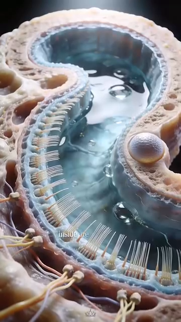
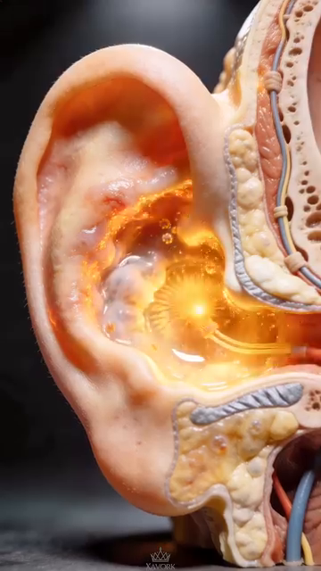

# Neurological Foundation — Brain, Proprioception, Vision & Reaction Anatomy
# Nền Tảng Thần Kinh — Não, Cảm Giác Sâu, Thị Giác & Giải Phẫu Phản Xạ

*Deep Dive #3 — The Anatomy & Geometry Project for Tennis Players 3.5 → 4.5*
*Chuyên Đề Số 3 — Dự Án Giải Phẫu & Hình Học cho Người Chơi Tennis 3.5 → 4.5*

---

## Tại sao tôi viết chương này / Why I wrote this

Tôi đã quan sát một hiện tượng kỳ lạ trên sân: hai người chơi cùng trình độ kỹ thuật, cùng tuổi, cùng thể lực — nhưng một người luôn phản ứng kịp với cú giao bóng nặng, còn người kia thì không. Tôi đã thử mọi cách để cải thiện phản xạ của mình — chạy nhanh hơn, tập plyometric, tập với máy bắn bóng. Một số thứ có tác dụng, một số thì không. Cho đến khi tôi hiểu rằng vấn đề không phải ở cơ bắp của tôi — vấn đề ở *não* và *hệ thần kinh* của tôi.

Chương này nói về phía NÃO của tennis. Cách mắt các bạn thấy trái banh. Cách não các bạn quyết định phải làm gì. Cách cơ thể các bạn BIẾT mình đang ở đâu trong không gian (proprioception). Dây thần kinh các bạn thực sự bắn nhanh cỡ nào. Đây là thần kinh sống sau mỗi cú đánh.

Tôi sẽ KHÔNG nói "sức mạnh tinh thần" (mental toughness). Tôi sẽ KHÔNG khuyên "hãy tự tin" (confidence). Tôi sẽ KHÔNG nói về focus hay mindset. Đó là lớp tâm lý, và chúng sống trong các deep-dive khác (Mental Game, Pressure Management). Chương này là thần kinh thuần tuý — giải phẫu thần kinh, vùng não, và hệ cảm giác.

Tại sao điều này quan trọng ở 3.5 → 4.5? Vì hầu hết người chơi phong trào chỉ tập CƠ. Họ chạy, nâng tạ, tập chân. Nhưng nút thắt cổ chai của hầu hết người chơi 3.5 là *thời gian phản xạ* và *độ chính xác của quyết định*, và cả hai đều là giới hạn THẦN KINH, không phải giới hạn cơ bắp. Tập não và cú đánh sẽ tốt hơn miễn phí — đó là một trong những khám phá làm tôi ngạc nhiên nhất trong 20 năm chơi tennis.

---

## Table of Contents / Mục Lục

| # | Chapter | Chương |
|---|---|---|
| 1 | The Reaction Chain — From Eye to Ball | Chuỗi Phản Xạ — Từ Mắt Tới Bóng |
| 2 | The Eye — How Vision Drives the Stroke | Mắt — Cách Thị Giác Dẫn Cú Đánh |
| 3 | Proprioception — The Hidden 6th Sense | Cảm Giác Sâu — Giác Quan Thứ 6 Ẩn |
| 4 | The Brain Regions Behind a Tennis Stroke | Vùng Não Sau Một Cú Tennis |
| 5 | Reaction Time, Decision Time, Movement Time | Thời Gian Phản Xạ, Quyết Định, Vận Động |
| 6 | The Three Reaction Layers | Ba Lớp Phản Xạ |
| 7 | The Vestibular System — Balance & Equilibrium | Hệ Tiền Đình — Thăng Bằng & Cân Bằng |
| 8 | Neuroplasticity — Why 50+ Brains Still Learn | Dẻo Dai Thần Kinh — Tại Sao Não 50+ Vẫn Học |
| 📋 | Neurological Cheat Sheet | Bảng Tóm Tắt Thần Kinh |

---

* * *

# Chapter 1 — The Reaction Chain — From Eye to Ball
# Chương 1 — Chuỗi Phản Xạ — Từ Mắt Tới Bóng

| 🇺🇸 English | 🇻🇳 Tiếng Việt |
|---|---|
| **Every tennis shot begins with this 7-step chain**. Total time from "I see the ball" to "ball leaves my racket" is about 0.4–0.8 seconds for a 4.0 player. Here's where the time goes: | **Mọi cú tennis bắt đầu với chuỗi 7 bước này**. Tổng thời gian từ "tôi thấy bóng" tới "bóng rời vợt tôi" là khoảng 0.4–0.8 giây cho người chơi 4.0. Đây là nơi thời gian đi: |
| **Step 1 — Photoreception (eye)** — Light from the ball hits the retina. Photoreceptors (rods for motion, cones for detail) convert light into electrical signals. Time: ~0.05s. | **Bước 1 — Thu nhận ánh sáng (mắt)** — Ánh sáng từ bóng đập vào võng mạc. Thụ thể ánh sáng (tế bào que cho chuyển động, tế bào nón cho chi tiết) chuyển ánh sáng thành tín hiệu điện. Thời gian: ~0.05s. |
| **Step 2 — Optic nerve transit** — Signals travel from retina to the lateral geniculate nucleus (LGN) of the thalamus, then to the visual cortex at the back of the brain. Time: ~0.03–0.05s. | **Bước 2 — Dây thần kinh thị giác** — Tín hiệu đi từ võng mạc tới nhân geniculate bên (LGN) của đồi thị, rồi tới vỏ thị giác phía sau não. Thời gian: ~0.03–0.05s. |
| **Step 3 — Visual processing (occipital + parietal cortex)** — The brain identifies: where the ball IS, how FAST it's moving, what SPIN it has, where it will be in 0.5 seconds. Time: ~0.08–0.15s. | **Bước 3 — Xử lý thị giác (vỏ chẩm + vỏ đỉnh)** — Não nhận diện: bóng ở ĐÂU, chuyển động NHANH cỡ nào, XOÁY gì, sẽ ở đâu trong 0.5 giây. Thời gian: ~0.08–0.15s. |
| **Step 4 — Decision (prefrontal + motor cortex)** — Brain decides: "this is a forehand, down-the-line, 70% pace." Time: ~0.10–0.30s (this is where pros are MUCH faster than recreational players — by 0.10–0.20s). | **Bước 4 — Quyết định (vỏ trước trán + vỏ vận động)** — Não quyết định: "đây là forehand, thẳng xuống, 70% nhịp." Thời gian: ~0.10–0.30s (đây là nơi pro NHANH HƠN người phong trào rất nhiều — 0.10–0.20s). |
| **Step 5 — Motor planning (cerebellum + basal ganglia)** — Brain plans: which muscles fire in what order. Time: ~0.05–0.10s. | **Bước 5 — Lập kế hoạch vận động (tiểu não + hạch nền)** — Não lập kế hoạch: cơ nào bắn theo thứ tự nào. Thời gian: ~0.05–0.10s. |
| **Step 6 — Motor cortex → spinal cord → muscles** — Signals travel down the spinal cord, branch out to the peripheral nerves, reach the muscles. Time: ~0.05–0.10s. | **Bước 6 — Vỏ vận động → tủy sống → cơ** — Tín hiệu đi xuống tủy sống, phân nhánh tới thần kinh ngoại biên, tới cơ. Thời gian: ~0.05–0.10s. |
| **Step 7 — Muscle contraction + tendon release** — Muscles fire, tendons release, racket moves, ball is hit. Time: ~0.10–0.20s. | **Bước 7 — Co cơ + phóng gân** — Cơ bắn, gân phóng, vợt di chuyển, bóng bị đánh. Thời gian: ~0.10–0.20s. |
| **Total reaction time: ~0.45–0.95 seconds** — Of this, the **decision step (Step 4) is the slowest and most trainable**. | **Tổng thời gian phản xạ: ~0.45–0.95 giây** — Trong đó, **bước quyết định (Bước 4) là chậm nhất và dễ tập nhất.** |
| **The 3.5 player bottleneck** — Step 4 takes ~0.30s for a 3.5 player, ~0.10s for a pro. **That 0.20s difference** is the main reason 3.5 players feel "always late." It's not the legs. It's the decision. | **Nút thắt người 3.5** — Bước 4 mất ~0.30s cho người 3.5, ~0.10s cho pro. **Khác biệt 0.20s** đó là lý do chính người 3.5 cảm thấy "luôn trễ". Không phải chân. Là quyết định. |
| *Master cue:* "Train the decision. The legs are fine." | *Câu nhắc tổng:* "Tập quyết định. Chân ổn rồi." |

* * *

# Chapter 2 — The Eye — How Vision Drives the Stroke
# Chương 2 — Mắt — Cách Thị Giác Dẫn Cú Đánh

| 🇺🇸 English | 🇻🇳 Tiếng Việt |
|---|---|
| **The eyes are the only input channel for tennis.** The brain has NO direct contact with the ball. Everything it knows about the ball comes through vision (and sometimes sound for line calls). | **Mắt là kênh đầu vào duy nhất cho tennis.** Não KHÔNG tiếp xúc trực tiếp với bóng. Mọi thứ nó biết về bóng đến qua thị giác (và đôi khi âm thanh cho line calls). |
| **The 3 visual systems in tennis** | **3 hệ thị giác trong tennis** |
| **System 1 — Central vision (foveal)** — The 2° sharp spot in the center of the retina. Color, detail, sharp edges. Used for: reading the spin, judging the contact point, fine-tuning the racket face angle. | **Hệ 1 — Thị giác trung tâm (foveal)** — Điểm sắc nét 2° ở giữa võng mạc. Màu sắc, chi tiết, cạnh sắc. Dùng cho: đọc xoáy, đánh giá điểm tiếp xúc, tinh chỉnh góc mặt vợt. |
| **System 2 — Peripheral vision (ambient)** — The remaining ~160° of the retina. Motion, contrast, broad shapes. Used for: tracking the opponent's body position, noticing ball trajectory early, court awareness. | **Hệ 2 — Thị giác ngoại vi (xung quanh)** — ~160° còn lại của võng mạc. Chuyển động, tương phản, hình dạng rộng. Dùng cho: theo dõi vị trí cơ thể đối thủ, nhận biết đường bóng sớm, nhận thức sân. |
| **System 3 — The quiet eye** — A specialized state where the gaze locks on a specific point (usually the contact zone) for ~0.3–0.5s before and during the stroke. This is the elite player's secret weapon. | **Hệ 3 — Mắt im lặng** — Trạng thái chuyên biệt nơi ánh mắt khóa trên điểm cụ thể (thường vùng tiếp xúc) ~0.3–0.5s trước và trong cú đánh. Đây là vũ khí bí mật của người chơi elite. |
| **Why "quiet eye" matters** — Studies (Vickers, 1996, 2007) show that elite athletes have a **quiet eye duration of 0.3–0.5 seconds**. Recreational players have ~0.1–0.2 seconds. **The longer quiet eye = better timing = better shot quality**, regardless of physical ability. | **Tại sao "mắt im lặng" quan trọng** — Nghiên cứu (Vickers, 1996, 2007) cho thấy vận động viên elite có **thời lượng mắt im lặng 0.3–0.5 giây**. Người chơi phong trào có ~0.1–0.2 giây. **Mắt im lặng càng lâu = timing càng tốt = chất lượng cú càng cao**, bất kể khả năng thể chất. |
| **The 5-Phase Visual Cycle** (used by all elite players) | **Chu Kỳ Thị Giác 5 Pha** (dùng bởi mọi người chơi elite) |
| **Phase 1 — Wide perception (soft eyes, ~0.5s before stroke)** — Eyes are soft, gaze is wide, taking in opponent's body, court, ball. | **Pha 1 — Nhận thức rộng (mắt mềm, ~0.5s trước cú)** — Mắt mềm, ánh nhìn rộng, thu nhận cơ thể đối thủ, sân, bóng. |
| **Phase 2 — Lock-on (~0.3s before contact)** — Eyes narrow to the ball. Gaze centers on the ball. | **Pha 2 — Khóa mục tiêu (~0.3s trước tiếp xúc)** — Mắt hẹp vào bóng. Ánh nhìn trung tâm trên bóng. |
| **Phase 3 — Narrow focus (tunnel vision, ~0.1s before contact)** — Gaze locks on the contact zone on the opponent's racket side. | **Pha 3 — Tập trung hẹp (thị giác đường hầm, ~0.1s trước tiếp xúc)** — Ánh nhìn khóa trên vùng tiếp xúc phía vợt đối thủ. |
| **Phase 4 — Quiet eye at contact (~0.05–0.1s)** — Gaze is FIXED on the contact point. The eyes do not move. This is the critical period — no eye motion = no visual disruption. | **Pha 4 — Mắt im lặng lúc tiếp xúc (~0.05–0.1s)** — Ánh nhìn CỐ ĐỊNH trên điểm tiếp xúc. Mắt không chuyển động. Đây là giai đoạn then chốt — không chuyển mắt = không gián đoạn thị giác. |
| **Phase 5 — Re-expand (after contact, ~0.2s)** — Gaze widens again to track the ball and read the opponent's response. | **Pha 5 — Mở rộng lại (sau tiếp xúc, ~0.2s)** — Ánh nhìn mở rộng lại để theo dõi bóng và đọc phản ứng đối thủ. |
| **The 3.5 player's mistake** — They look at the ball, swing, then look up to see where it went. **That post-contact gaze breaks the quiet eye.** Result: they don't see the ball well during contact, so contact quality is bad. | **Lỗi người 3.5** — Họ nhìn bóng, vung, rồi nhìn lên xem bóng đi đâu. **Ánh nhìn sau tiếp xúc đó phá mắt im lặng.** Kết quả: họ không thấy bóng rõ lúc tiếp xúc, nên chất lượng tiếp xúc kém. |
| **The fix** — Practice the quiet eye. Stare at a fixed point on the wall for 0.5 seconds before swinging at a ball. Train the gaze to STAY during contact, not fly up. | **Cách sửa** — Tập mắt im lặng. Nhìn chằm chằm vào điểm cố định trên tường 0.5 giây trước khi vung vào bóng. Tập ánh nhìn Ở LẠI lúc tiếp xúc, không bay lên. |
| **For 50+ players** — Vision starts declining around age 40–45 (presbyopia — loss of near focus). Tennis balls travel fast and are small. **Use yellow balls on dark courts** (highest contrast). **Consider yellow-tinted glasses** to enhance contrast. | **Với người 50+** — Thị giác bắt đầu giảm khoảng 40–45 tuổi (lão thị — mất khả năng tập trung gần). Bóng tennis đi nhanh và nhỏ. **Dùng bóng vàng trên sân tối** (tương phản cao nhất). **Cân nhắc kính vàng** để tăng tương phản. |
| *Master cue:* "See the ball arrive. Lock on. Stay locked through contact. Look up AFTER." | *Câu nhắc tổng:* "Thấy bóng tới. Khóa. Ở khóa qua tiếp xúc. Nhìn lên SAU." |

* * *

# Chapter 3 — Proprioception — The Hidden 6th Sense
# Chương 3 — Cảm Giác Sâu — Giác Quan Thứ 6 Ẩn

| 🇺🇸 English | 🇻🇳 Tiếng Việt |
|---|---|
| **You have 5 senses everyone knows about — sight, hearing, touch, taste, smell.** You have a 6th that almost no recreational player thinks about: **proprioception**. It is the sense of where your body is in space, WITHOUT looking. | **Bạn có 5 giác quan ai cũng biết — thị, thính, xúc, vị, khứu.** Bạn có giác quan thứ 6 mà hầu như không người phong trào nào nghĩ tới: **cảm giác sâu**. Đó là giác về cơ thể ở đâu trong không gian, KHÔNG cần nhìn. |
| **Close your eyes right now.** Raise your right hand above your head. **You knew where your hand was without seeing it.** That's proprioception. | **Nhắm mắt ngay bây giờ.** Nâng tay phải lên trên đầu. **Bạn biết tay mình ở đâu mà không cần thấy.** Đó là cảm giác sâu. |
| **The proprioception hardware** — Specialized sensory receptors in your muscles, tendons, and joints. The most important are: | **Phần cứng cảm giác sâu** — Thụ thể cảm giác chuyên biệt trong cơ, gân, và khớp. Quan trọng nhất là: |
| **Muscle spindles** — Tiny sensors INSIDE muscles that detect how MUCH the muscle is stretched and how FAST it's stretching. They are the FASTEST sensory organ in the body (~80 m/s nerve conduction). | **Thoi cơ** — Cảm biến nhỏ BÊN TRONG cơ phát hiện cơ giãn BAO NHIÊU và giãn NHANH cỡ nào. Chúng là cơ quan cảm giác NHANH NHẤT trong cơ thể (~80 m/s dẫn truyền thần kinh). |
| **Golgi tendon organs** — Sensors at the muscle-tendon junction. Detect FORCE. They protect against over-contraction (the "force shut-off" reflex). | **Cơ quan Golgi gân** — Cảm biến ở chỗ nối cơ-gân. Phát hiện LỰC. Chúng bảo vệ chống co quá mức (phản xạ "cắt lực"). |
| **Joint receptors** — In the joint capsules, especially knees, ankles, shoulders. Detect JOINT ANGLE and joint motion direction. | **Thụ thể khớp** — Trong bao khớp, đặc biệt gối, cổ chân, vai. Phát hiện GÓC KHỚP và hướng chuyển động khớp. |
| **Skin stretch receptors** — In the skin around joints. Detect skin stretch as the joint moves. Provides "extra" angle information. | **Thụ thể giãn da** — Trong da quanh khớp. Phát hiện giãn da khi khớp chuyển động. Cung cấp thông tin góc "thêm". |
| **Why proprioception is the hidden superpower** — When you watch a pro hit a forehand, their body knows where it is at every millisecond WITHOUT looking. They don't need to "check" their elbow angle with their eyes — proprioception tells them. This frees the eyes for ball-tracking. | **Tại sao cảm giác sâu là siêu năng lực ẩn** — Khi bạn xem pro đánh forehand, cơ thể họ biết mình ở đâu mỗi mili-giây KHÔNG CẦN NHÌN. Họ không cần "kiểm" góc khuỷu bằng mắt — cảm giác sâu nói cho họ. Điều này giải phóng mắt để theo dõi bóng. |
| **Proprioception accuracy by joint (typical 4.0 player)** | **Độ chính xác cảm giác sâu theo khớp (người 4.0 điển hình)** |
| **Shoulder**: can detect ~3°–5° of rotation change without looking. | **Vai**: phát hiện ~3°–5° thay đổi xoay mà không cần nhìn. |
| **Elbow**: can detect ~2°–4° of flexion change. | **Khuỷu**: phát hiện ~2°–4° thay đổi gập. |
| **Wrist**: can detect ~2°–3° of flexion change. | **Cổ tay**: phát hiện ~2°–3° thay đổi gập. |
| **Hip**: can detect ~3°–5° of rotation change. | **Hông**: phát hiện ~3°–5° thay đổi xoay. |
| **Knee**: can detect ~2°–4° of flexion change. | **Gối**: phát hiện ~2°–4° thay đổi gập. |
| **Ankle**: can detect ~2°–3° of dorsiflexion change. | **Cổ chân**: phát hiện ~2°–3° thay đổi gập lưng. |
| **The 3.5 vs 4.5 proprioception gap** — A 3.5 player has ~30%–40% worse proprioception than a 4.5 player. **This gap closes with training.** Specific proprioception drills (closed-eye balance, single-leg stance, racket-position matching) can improve proprioception by 30%–50% in 8 weeks. | **Khoảng cách cảm giác sâu 3.5 vs 4.5** — Người 3.5 có cảm giác sâu kém hơn ~30%–40% so với người 4.5. **Khoảng cách này đóng lại bằng tập luyện.** Bài tập cảm giác sâu cụ thể (thăng bằng mắt nhắm, đứng một chân, đối chiếu vị trí vợt) có thể cải thiện cảm giác sâu 30%–50% trong 8 tuần. |
| **Why 50+ players need extra proprioception work** — Proprioception declines ~10%–15% per decade after age 50. **This is one of the main reasons older players lose balance** and have more falls in daily life, not just tennis. Train it. | **Tại sao người 50+ cần tập cảm giác sâu thêm** — Cảm giác sâu giảm ~10%–15% mỗi thập kỷ sau 50 tuổi. **Đây là một trong những lý do chính người lớn tuổi mất thăng bằng** và ngã nhiều hơn trong đời sống hàng ngày, không chỉ tennis. Hãy tập nó. |
| *Master cue:* "Close your eyes. Trust your joints. They know." | *Câu nhắc tổng:* "Nhắm mắt. Tin khớp bạn. Chúng biết." |

* * *

# Chapter 4 — The Brain Regions Behind a Tennis Stroke
# Chương 4 — Vùng Não Sau Một Cú Tennis

| 🇺🇸 English | 🇻🇳 Tiếng Việt |
|---|---|
| **A tennis stroke is not "one thing" the brain does.** It is at least 7 different brain regions working in sequence. Here is what each one does: | **Cú tennis không phải "một thứ" não làm.** Nó ít nhất 7 vùng não khác nhau làm việc theo thứ tự. Đây là những gì mỗi vùng làm: |
| **Region 1 — Occipital lobe (visual cortex)** — Processes what you SEE. Recognizes the ball, the opponent, the court. Located at the back of the brain. | **Vùng 1 — Thùy chẩm (vỏ thị giác)** — Xử lý những gì bạn THẤY. Nhận ra bóng, đối thủ, sân. Ở phía sau não. |
| **Region 2 — Parietal lobe (spatial processing)** — Maps WHERE things are in space. Where is the ball relative to the player? Where are the lines? Where is the opponent moving? | **Vùng 2 — Thùy đỉnh (xử lý không gian)** — Ánh xạ CÁI GÌ ở đâu trong không gian. Bóng ở đâu so với người chơi? Đường biên ở đâu? Đối thủ di chuyển đâu? |
| **Region 3 — Temporal lobe (pattern recognition)** — Recognizes PATTERNS. Is this serve like the previous one? Is this forehand going cross-court or down-the-line? Pattern recognition is what makes pros "predict" shots. | **Vùng 3 — Thùy thái dương (nhận diện mẫu)** — Nhận ra MẪU. Serve này giống serve trước? Forehand này đi chéo hay thẳng? Nhận diện mẫu là thứ giúp pro "đoán" cú. |
| **Region 4 — Prefrontal cortex (decision)** — Makes the DECISION. This is where "forehand, down-the-line, 70% pace" gets selected. Slowest region. Where pros differ most from recreational players. | **Vùng 4 — Vỏ trước trán (quyết định)** — Đưa ra QUYẾT ĐỊNH. Đây là nơi "forehand, thẳng, 70% nhịp" được chọn. Vùng chậm nhất. Nơi pro khác người phong trào nhiều nhất. |
| **Region 5 — Motor cortex (movement command)** — Located in the strip running over the top of the brain (from ear to ear). Sends the actual MOVEMENT COMMAND down to the spinal cord. Different parts control different body parts — leg area is medial (top), arm/hand area is lateral (sides). | **Vùng 5 — Vỏ vận động (lệnh vận động)** — Nằm ở dải chạy trên đỉnh não (từ tai này sang tai kia). Gửi LỆNH VẬN ĐỘNG thực sự xuống tủy sống. Các phần khác nhau điều khiển các phần cơ thể khác nhau — vùng chân ở giữa (trên), vùng tay/cổ tay ở bên. |
| **Region 6 — Cerebellum (timing & coordination)** — At the back-bottom of the brain. The "AUTOPILOT." Coordinates all 7 steps above into smooth timing. **The cerebellum is what makes a tennis stroke look smooth, not jerky.** | **Vùng 6 — Tiểu não (định giờ & phối hợp)** — Phía sau-dưới não. "LÁI TỰ ĐỘNG." Phối hợp cả 7 bước trên thành timing trơn tru. **Tiểu não là thứ làm cú tennis trông trơn tru, không giật.** |
| **Region 7 — Basal ganglia (habits)** — Deep in the brain. The "AUTOMATIC PILOT 2." Stores learned motor patterns. When you've hit 10,000 forehands, the basal ganglia has the "forehand pattern" cached. You can hit it without thinking — that's the basal ganglia at work. | **Vùng 7 — Hạch nền (thói quen)** — Sâu trong não. "LÁI TỰ ĐỘNG 2." Lưu trữ mẫu vận động đã học. Khi bạn đã đánh 10.000 forehand, hạch nền đã có "mẫu forehand" được cache. Bạn đánh được mà không cần nghĩ — đó là hạch nền làm việc. |
| **The brain's 3 speeds** — Region 4 (decision) is slow (~0.1–0.3s). Region 5 (motor cortex) is medium (~0.05–0.1s). Region 7 (basal ganglia) is FAST (~0.02–0.05s) — it's a "cached" pattern. **Elite players use Region 7 for almost every shot. Recreational players use Region 4 for almost every shot.** This is the difference. | **3 tốc độ của não** — Vùng 4 (quyết định) chậm (~0.1–0.3s). Vùng 5 (vỏ vận động) trung bình (~0.05–0.1s). Vùng 7 (hạch nền) NHANH (~0.02–0.05s) — nó là mẫu "cached". **Người chơi elite dùng Vùng 7 cho hầu hết mọi cú. Người chơi phong trào dùng Vùng 4 cho hầu hết mọi cú.** Đó là khác biệt. |
| **The 10,000-rep rule** — Basal ganglia caching takes ~3,000–10,000 repetitions of the same motion. **At 100 forehands/day, this is 30–100 days.** That's how long it takes to stop "thinking" about a forehand and just HIT it. | **Quy tắc 10.000 lần** — Cache hạch nền mất ~3.000–10.000 lần lặp cùng động tác. **Với 100 forehand/ngày, đó là 30–100 ngày.** Đó là bao lâu để ngừng "nghĩ" về forehand và chỉ ĐÁNH nó. |
| *Master cue:* "Train the autopilot. Hit 100 forehands a day for 100 days. Stop thinking." | *Câu nhắc tổng:* "Tập lái tự động. Đánh 100 forehand mỗi ngày trong 100 ngày. Ngừng nghĩ." |

* * *

# Chapter 5 — Reaction Time, Decision Time, Movement Time
# Chương 5 — Thời Gian Phản Xạ, Quyết Định, Vận Động

| 🇺🇸 English | 🇻🇳 Tiếng Việt |
|---|---|
| **Three different "times"** are often confused. Each one has a different training method. | **Ba "thời gian" khác nhau** thường bị nhầm. Mỗi cái có phương pháp tập khác nhau. |
| **Reaction Time (RT)** — Time from stimulus (ball leaves opponent's racket) to first detectable muscle activation. Pure reflex arc. Typically 0.15–0.25s for 4.0 player. | **Thời Gian Phản Xạ (RT)** — Thời gian từ kích thích (bóng rời vợt đối thủ) tới lần kích hoạt cơ phát hiện được. Cung phản xạ thuần. Thường 0.15–0.25s cho người 4.0. |
| **Decision Time (DT)** — Time from stimulus to knowing WHAT shot to play. Includes pattern recognition + choice. Typically 0.10–0.30s for 4.0 player. | **Thời Gian Quyết Định (DT)** — Thời gian từ kích thích tới biết ĐÁNH cú nào. Bao gồm nhận diện mẫu + chọn. Thường 0.10–0.30s cho người 4.0. |
| **Movement Time (MT)** — Time from decision to racket contacting ball. Typically 0.20–0.50s for 4.0 player (depends on how far you have to move). | **Thời Gian Vận Động (MT)** — Thời gian từ quyết định tới vợt tiếp xúc bóng. Thường 0.20–0.50s cho người 4.0 (phụ thuộc bạn phải di chuyển bao xa). |
| **Total time to respond** — RT + DT + MT = 0.45–1.05s. **The opponent's ball usually arrives in 0.5–0.8s.** So if your total is 1.0s, you have ZERO margin. If your total is 0.5s, you have 0.3s of margin (very comfortable). | **Tổng thời gian phản hồi** — RT + DT + MT = 0.45–1.05s. **Bóng đối thủ thường tới trong 0.5–0.8s.** Vậy nếu tổng bạn là 1.0s, bạn có biên KHÔNG. Nếu tổng bạn là 0.5s, bạn có 0.3s biên (rất thoải mái). |
| **What dominates at 3.5** — Decision Time. A 3.5 player's DT is 0.10–0.20s slower than a 4.0 player's. **They see the same ball at the same time, but they take longer to decide.** | **Cái gì chiếm ưu ở 3.5** — Thời Gian Quyết Định. DT của người 3.5 chậm hơn 0.10–0.20s so với người 4.0. **Họ thấy cùng bóng cùng lúc, nhưng họ quyết định lâu hơn.** |
| **What dominates at 5.0+** — Movement Time. Elite players' MT is shorter because they take shorter, more efficient paths to the ball. | **Cái gì chiếm ưu ở 5.0+** — Thời Gian Vận Động. MT của elite ngắn hơn vì họ đi đường ngắn hơn, hiệu quả hơn tới bóng. |
| **Training Reaction Time** — Use ball machines, drop-and-react drills, or have a partner randomly drop a ball. Pure stimulus-response training. | **Tập Thời Gian Phản Xạ** — Dùng máy bóng, bài tập thả-và-phản ứng, hoặc bạn cùng thả bóng ngẫu nhiên. Tập kích thích-phản ứng thuần. |
| **Training Decision Time** — Use RANDOMIZED ball machines. Have a partner call out "forehand!" or "backhand!" right before they hit a ball. **Decision is the bottleneck.** | **Tập Thời Gian Quyết Định** — Dùng máy bóng NGẪU NHIÊN. Bạn cùng hô "forehand!" hoặc "backhand!" ngay trước khi họ đánh. **Quyết định là nút thắt.** |
| **Training Movement Time** — Footwork drills. Split-step + reactive shuffle. Cone drills. | **Tập Thời Gian Vận Động** — Bài tập bộ chân. Split-step + di chuyển phản ứng. Bài tập côn. |
| **The 0.20s difference between 3.5 and 4.5** — That 0.20s comes mostly from Decision Time. **A 3.5 player who does 100 random-decision drills/day for 6 months will close 70% of that gap.** | **Khác biệt 0.20s giữa 3.5 và 4.5** — 0.20s đó đến chủ yếu từ Thời Gian Quyết Định. **Người chơi 3.5 làm 100 bài quyết định ngẫu nhiên/ngày trong 6 tháng sẽ đóng 70% khoảng cách đó.** |
| *Master cue:* "Decision is the bottleneck. Train the brain, not the legs." | *Câu nhắc tổng:* "Quyết định là nút thắt. Tập não, không tập chân." |

* * *

# Chapter 6 — The Three Reaction Layers
# Chương 6 — Ba Lớp Phản Xạ

| 🇺🇸 English | 🇻🇳 Tiếng Việt |
|---|---|
| **Your nervous system has THREE reaction layers.** Each fires at a different speed, for a different purpose. Understanding them explains why some tennis reactions feel automatic and others feel like hard work. | **Hệ thần kinh bạn có BA lớp phản xạ.** Mỗi lớp bắn ở tốc độ khác nhau, cho mục đích khác nhau. Hiểu chúng giải thích tại sao một số phản xạ tennis cảm thấy tự động và số khác cảm thấy vất vả. |
| **Layer 1 — The stretch reflex (spinal cord, ~0.05s)** — When a muscle is stretched, sensors in the muscle (muscle spindles) send a signal DIRECTLY to the spinal cord, which sends a signal BACK to the same muscle to contract. **Total time: ~0.05s.** This bypasses the brain entirely. | **Lớp 1 — Phản xạ giãn (tủy sống, ~0.05s)** — Khi cơ bị giãn, cảm biến trong cơ (thoi cơ) gửi tín hiệu TRỰC TIẾP tới tủy sống, tủy sống gửi tín hiệu NGƯỢC LẠI tới cùng cơ đó để co. **Tổng thời gian: ~0.05s.** Điều này bỏ qua não hoàn toàn. |
| **Tennis example**: When you do a split-step, your calf muscles stretch slightly. The stretch reflex fires, the calves contract, you push off. **All in 0.05s, no brain needed.** | **Ví dụ tennis**: Khi bạn split-step, cơ bắp chân giãn nhẹ. Phản xạ giãn bắn, bắp chân co, bạn đẩy lên. **Tất cả trong 0.05s, không cần não.** |
| **Layer 2 — The startle reflex (brainstem, ~0.15s)** — When a sudden stimulus (loud sound, sudden motion) occurs, the brainstem fires a fast response. Faster than conscious thought, slower than spinal reflex. | **Lớp 2 — Phản xạ giật mình (thân não, ~0.15s)** — Khi kích thích đột ngột (tiếng ồn, chuyển động đột ngột) xảy ra, thân não bắn phản ứng nhanh. Nhanh hơn ý thức, chậm hơn phản xạ tủy sống. |
| **Tennis example**: When your opponent suddenly hits a ball hard at you, the brainstem makes you flinch/step back BEFORE you consciously realize what's happening. **Then** your conscious brain takes over and decides what to do. | **Ví dụ tennis**: Khi đối thủ đột nhiên đánh bóng mạnh vào bạn, thân não làm bạn giật/lùi TRƯỚC khi bạn ý thức chuyện gì đang xảy ra. **RỒI** não ý thức của bạn tiếp quản và quyết định phải làm gì. |
| **Layer 3 — The conscious decision (cortex, ~0.20–0.50s)** — Full brain processing. Slowest, but most accurate. What we normally call "reaction time." | **Lớp 3 — Quyết định ý thức (vỏ não, ~0.20–0.50s)** — Xử lý não đầy đủ. Chậm nhất, nhưng chính xác nhất. Cái ta thường gọi "thời gian phản xạ." |
| **Tennis example**: A drop shot — your conscious brain must decide "is this a drop or a drive?" then "do I run forward or stay back?" then "do I slice or volley?" **All in 0.20–0.50s.** | **Ví dụ tennis**: Drop shot — não ý thức phải quyết định "đây là drop hay drive?" rồi "tôi chạy tới hay ở lại?" rồi "tôi slice hay volley?" **Tất cả trong 0.20–0.50s.** |
| **The training principle** — The more a stroke is PRACTICED, the more it moves from Layer 3 to Layer 2 to Layer 1. **Stroke automation = moving the response down the layers.** | **Nguyên tắc tập luyện** — Cú đánh càng được TẬP, càng di chuyển từ Lớp 3 xuống Lớp 2 xuống Lớp 1. **Tự động hóa cú = di chuyển phản ứng xuống các lớp.** |
| **The split-step is Layer 1** — It is fully reflex. You don't "decide" to split-step. Your body just does it. That's why pro split-step looks the same every time. **Train it as a reflex, not as a decision.** | **Split-step là Lớp 1** — Nó hoàn toàn là phản xạ. Bạn không "quyết định" split-step. Cơ thể bạn chỉ làm nó. Đó là lý do split-step pro trông giống nhau mỗi lần. **Tập nó như phản xạ, không phải quyết định.** |
| **The ready position is Layer 2** — The startle-ready stance. A loud noise, a sudden opponent move — your body is already in the stance to react. | **Tư thế sẵn sàng là Lớp 2** — Tư thế sẵn sàng giật mình. Tiếng ồn, đối thủ di chuyển đột ngột — cơ thể bạn đã ở tư thế để phản ứng. |
| **The shot choice is Layer 3** — Where you go, what you hit, what spin. This is the slow one. Train decision speed with random drills. | **Chọn cú là Lớp 3** — Bạn đi đâu, đánh gì, xoáy gì. Cái này chậm. Tập tốc độ quyết định với bài ngẫu nhiên. |
| **Why this matters for 50+** — Layer 1 reflexes slow ~10%–15% per decade after 50. **Stretch reflex in the Achilles is often delayed**, which is why older players are slower to react at the line. Train split-step explosively — it is THE most important reaction to keep sharp. | **Tại sao điều này quan trọng cho 50+** — Phản xạ Lớp 1 chậm ~10%–15% mỗi thập kỷ sau 50 tuổi. **Phản xạ giãn ở Achilles thường bị trì hoãn**, đó là lý do người lớn tuổi phản ứng chậm hơn ở baseline. Tập split-step nổ — đó là phản xạ QUAN TRỌNG NHẤT cần giữ sắc. |
| *Master cue:* "Train split-step as reflex (Layer 1), not as decision (Layer 3). 5000 reps to make it permanent." | *Câu nhắc tổng:* "Tập split-step như phản xạ (Lớp 1), không như quyết định (Lớp 3). 5000 lần để làm vĩnh viễn." |

* * *

# Chapter 7 — The Vestibular System — Balance & Equilibrium
# Chương 7 — Hệ Tiền Đình — Thăng Bằng & Cân Bằng

| 🇺🇸 English | 🇻🇳 Tiếng Việt |
|---|---|
| **There is one more sense that tennis demands**: the vestibular system. It is the sense of BALANCE, head motion, and gravity. It lives in the inner ear. | **Có một giác quan nữa mà tennis đòi hỏi**: hệ tiền đình. Đó là giác về THĂNG BẰNG, chuyển động đầu, và trọng lực. Nó sống ở tai trong. |
| **The vestibular hardware** — Three semicircular canals (anterior, posterior, horizontal) detect HEAD ROTATION. Two otolith organs (utricle, saccule) detect HEAD TILT and LINEAR ACCELERATION. | **Phần cứng tiền đình** — Ba ống bán nguyệt (trước, sau, ngang) phát hiện XOAY ĐẦU. Hai cơ quan otolith (utricle, saccule) phát hiện NGHIÊNG ĐẦU và GIA TỐC TUYẾN TÍNH. |
| **Tennis demands** — Constant head rotation (tracking ball), rapid head tilts (looking up at lob, down at drop), linear acceleration (running forward/backward), rotation (the unit turn, the X-factor stretch). **The vestibular system has to keep up with all of it.** | **Tennis đòi hỏi** — Xoay đầu liên tục (theo dõi bóng), nghiêng đầu nhanh (nhìn lên lob, xuống drop), gia tốc tuyến tính (chạy tới/lùi), xoay (unit turn, X-factor stretch). **Hệ tiền đình phải theo kịp tất cả.** |
| **The VOR (vestibulo-ocular reflex)** — When your head rotates, your eyes rotate in the OPPOSITE direction automatically to keep gaze fixed. **This is why you can read a sign while shaking your head.** It is a vestibular-ocular reflex. Time: ~0.015s. Faster than any conscious eye movement. | **VOR (phản xạ tiền đình-mắt)** — Khi đầu bạn xoay, mắt bạn xoay hướng NGƯỢC LẠI tự động để giữ ánh nhìn cố định. **Đây là lý do bạn có thể đọc biển trong khi lắc đầu.** Nó là phản xạ tiền đình-mắt. Thời gian: ~0.015s. Nhanh hơn bất kỳ chuyển động mắt ý thức nào. |
| **Why VOR matters for tennis** — At impact, your head is moving (body rotation, forward momentum). The VOR keeps your eyes STABILIZED on the ball. **Without VOR, your eyes would bounce around at impact and you would lose sight of the ball.** | **Tại sao VOR quan trọng cho tennis** — Lúc tiếp xúc, đầu bạn đang chuyển động (xoay thân, đà tới). VOR giữ mắt bạn ỔN ĐỊNH trên bóng. **Không có VOR, mắt bạn sẽ nảy quanh lúc tiếp xúc và bạn sẽ mất tầm nhìn bóng.** |
| **Why head STILL matters** — "Head still" is a famous coaching cue. The reason is VOR. **When your head is stable, your eyes can lock on the contact zone (quiet eye).** When your head bounces, your eyes bounce. | **Tại sao đầu YÊN quan trọng** — "Đầu yên" là cue HLV nổi tiếng. Lý do là VOR. **Khi đầu bạn ổn định, mắt bạn có thể khóa trên vùng tiếp xúc (mắt im lặng).** Khi đầu bạn nảy, mắt bạn nảy. |
| **The 50+ vestibular decline** — Hair cells in the semicircular canals start dying after age 40. By 60, you may have ~20%–30% reduction in vestibular sensitivity. **This is why older players lose balance more easily and get dizzy on quick direction changes.** | **Suy giảm tiền đình 50+** — Tế bào lông trong ống bán nguyệt bắt đầu chết sau 40 tuổi. Đến 60 tuổi, bạn có thể giảm ~20%–30% độ nhạy tiền đình. **Đây là lý do người lớn tuổi mất thăng bằng dễ hơn và chóng mặt khi đổi hướng nhanh.** |
| **Vestibular training for 50+** — Simple daily exercises (standing on one foot with eyes closed for 30 seconds × 3 reps, slow head rotations × 10 in each direction) can MAINTAIN vestibular function. **It's never too late to start.** | **Tập tiền đình cho 50+** — Bài tập hàng ngày đơn giản (đứng một chân mắt nhắm 30 giây × 3 lần, xoay đầu chậm × 10 mỗi hướng) có thể DUY TRÌ chức năng tiền đình. **Không bao giờ quá muộn để bắt đầu.** |
| *Master cue:* "Keep your head still. Your eyes need stable ground to lock on the ball." | *Câu nhắc tổng:* "Giữ đầu yên. Mắt bạn cần nền ổn định để khóa bóng." |

* * *

# Chapter 8 — Neuroplasticity — Why 50+ Brains Still Learn
# Chương 8 — Dẻo Dai Thần Kinh — Tại Sao Não 50+ Vẫn Học

| 🇺🇸 English | 🇻🇳 Tiếng Việt |
|---|---|
| **The old belief** — "You can't teach an old dog new tricks. Brain stops learning at 25." | **Niềm tin cũ** — "Không thể dạy chó già mẹo mới. Não ngừng học ở 25." |
| **The science** — WRONG. **Neuroplasticity** (the brain's ability to form new connections) continues throughout life. A 2020 study (Voss et al.) showed that older adults who learned a complex motor skill (juggling, tennis) showed measurable brain changes within 8 weeks. **The 50+ brain is NOT fixed.** | **Khoa học** — SAI. **Dẻo dai thần kinh** (khả năng não tạo kết nối mới) tiếp tục suốt đời. Nghiên cứu 2020 (Voss et al.) cho thấy người lớn tuổi học kỹ năng vận động phức tạp (tung hứng, tennis) đã có thay đổi não đo được trong 8 tuần. **Não 50+ KHÔNG cố định.** |
| **How learning changes the brain at 50+** | **Cách học thay đổi não ở 50+** |
| **Myelin thickens around practiced neural pathways** — Myelin is the insulation around nerves. The more you practice a stroke, the thicker the myelin gets on that pathway. **Thicker myelin = faster signal = smoother stroke.** | **Myelin dày lên quanh đường thần kinh được tập** — Myelin là lớp cách nhiệt quanh dây thần kinh. Bạn tập cú càng nhiều, myelin trên đường đó càng dày. **Myelin dày hơn = tín hiệu nhanh hơn = cú trơn tru hơn.** |
| **New synapses form** — Even at 70+, new connections between neurons form when you practice a new skill. | **Synapse mới hình thành** — Ngay cả ở 70+, kết nối mới giữa các nơ-ron hình thành khi bạn tập kỹ năng mới. |
| **Brain regions grow** — The cerebellum, motor cortex, and prefrontal cortex all show measurable GROWTH (gray matter increase) in response to motor learning, even at age 65+. | **Vùng não phát triển** — Tiểu não, vỏ vận động, và vỏ trước trán đều cho thấy PHÁT TRIỂN đo được (tăng chất xám) đáp ứng với học vận động, ngay cả ở 65+ tuổi. |
| **The 50+ learning principle** — Same principle as 25, but SLOWER. New skills take ~1.5–2x longer to automate at 50+ vs 25. **That's OK.** The brain is still learning, just at a different pace. | **Nguyên tắc học 50+** — Cùng nguyên tắc như 25 tuổi, nhưng CHẬM HƠN. Kỹ năng mới mất ~1.5–2 lần thời gian để tự động hóa ở 50+ so với 25. **OK thôi.** Não vẫn học, chỉ ở nhịp khác. |
| **The "use it or lose it" rule** — Neural pathways that are not used get PRUNED. **If you stop playing tennis for 6 months, you lose ~15%–25% of your automation.** If you stop for 2 years, you lose ~40%–60%. The brain is always either growing or shrinking. | **Quy tắc "dùng hoặc mất"** — Đường thần kinh không dùng bị CẮT TỈA. **Nếu bạn ngừng chơi tennis 6 tháng, bạn mất ~15%–25% tự động hóa.** Nếu ngừng 2 năm, bạn mất ~40%–60%. Não luôn hoặc phát triển hoặc co lại. |
| **The minimum effective dose** — For tennis automation maintenance at 50+: **2 sessions/week × 60 minutes × 20+ balls per stroke per session.** Below this, automation slowly decays. Above this, automation grows. | **Liều hiệu quả tối thiểu** — Để duy trì tự động hóa tennis ở 50+: **2 buổi/tuần × 60 phút × 20+ bóng mỗi cú mỗi buổi.** Dưới mức này, tự động hóa suy giảm chậm. Trên mức này, tự động hóa tăng. |
| **The big take-home** — Your 50+ brain can still learn tennis skills. It just needs: (1) more repetitions per skill, (2) more sleep for consolidation, (3) more recovery between sessions. **The 3 Rs of 50+ neuroplasticity.** | **Take-home lớn** — Não 50+ của bạn vẫn có thể học kỹ năng tennis. Nó chỉ cần: (1) nhiều lần lặp hơn mỗi kỹ năng, (2) nhiều giấc ngủ hơn để củng cố, (3) nhiều phục hồi hơn giữa các buổi. **3 Rs của dẻo dai thần kinh 50+.** |
| *Master cue:* "Old brain, new tricks. Slow but possible. 5000 reps make it real." | *Câu nhắc tổng:* "Não già, mẹo mới. Chậm nhưng có thể. 5000 lần làm nó thật." |

* * *

# Chapter 9 — Anatomy_Lab Integration — The Three-Layer Control System
# Chương 9 — Tích Hợp Anatomy_Lab — Hệ Kiểm Soát Ba Lớp

| 🇺🇸 English | 🇻🇳 Tiếng Việt |
|---|---|
| **This chapter layers the specific control-system numbers from your `Anatomy_Lab/` library** (vestibular, vision, proprioception, reaction time cascade) onto the brain-region framework of this deep dive. | **Chương này xếp lớp con số hệ kiểm soát cụ thể từ thư viện `Anatomy_Lab/`** (tiền đình, thị giác, cảm giác sâu, thác phản xạ) lên khung vùng não của chuyên đề này. |

## 9.1 — The Vestibular System (The 3rd Layer of the Kinetic Chain)
## 9.1 — Hệ Tiền Đình (Lớp Thứ 3 Của Chuỗi Động Học)

| 🇺🇸 English | 🇻🇳 Tiếng Việt |
|---|---|
| **Anatomy_Lab DD8 finding** — the vestibular system is the **3rd layer of the kinetic chain** (after proprioception and vision). It consists of **3 semicircular canals + 2 otolith organs (utricle + saccule) + hair cells + neural pathway to the brainstem**. | **Phát hiện Anatomy_Lab DD8** — hệ tiền đình là **lớp thứ 3 của chuỗi động học** (sau cảm giác sâu và thị giác). Nó gồm **3 ống bán nguyệt + 2 cơ quan otolith (utricle + saccule) + tế bào lông + đường thần kinh tới thân não**. |
|  |  |
| **Figure 1 / Hình 1** — The 3 semicircular canals (anterior, posterior, horizontal) detect head rotation. The 2 otolith organs detect linear acceleration and head tilt. | **Hình 1** — 3 ống bán nguyệt (trước, sau, ngang) phát hiện xoay đầu. 2 cơ quan otolith phát hiện gia tốc tuyến tính và nghiêng đầu. |
|  |  |
| **Figure 2 / Hình 2** — Otoconia: tiny calcium carbonate crystals in the otolith organs. **These move with gravity** and tell the brain which way is UP. | **Hình 2** — Otoconia: tinh thể canxi cacbonat tí hon trong các cơ quan otolith. **Chúng di chuyển theo trọng lực** và nói cho não biết hướng nào là LÊN. |

## 9.2 — The 5-Phase Visual Cycle (Quiet Eye)
## 9.2 — Chu Kỳ Thị Giác 5 Pha (Mắt Im Lặng)

| 🇺🇸 English | 🇻🇳 Tiếng Việt |
|---|---|
| **Anatomy_Lab DD8 finding** — elite tennis players use a 5-phase visual cycle when reading the ball. **This is what Vickers (1996, 2007) called the "quiet eye."** | **Phát hiện Anatomy_Lab DD8** — người chơi tennis elite dùng chu kỳ thị giác 5 pha khi đọc bóng. **Đây là cái Vickers (1996, 2007) gọi là "mắt im lặng".** |

| Phase / Pha | Duration / Thời Lượng | What Happens / Chuyện Gì Xảy Ra |
|---|---|---|
| **1. Wide perception / Nhận thức rộng** | ~0.5 s before stroke | Soft eyes, gaze wide. Reads opponent's body, court, ball. |
| **2. Lock-on / Khóa mục tiêu** | ~0.3 s before contact | Eyes narrow to the ball. Gaze centers. |
| **3. Narrow focus / Tập trung hẹp** | ~0.1 s before contact | Gaze locks on the contact zone on opponent's racket. |
| **4. Quiet eye / Mắt im lặng** | **0.05–0.1 s** | Gaze FIXED on the contact point. **Eyes DO NOT MOVE.** This is the critical period. |
| **5. Re-expand / Mở rộng lại** | ~0.2 s after contact | Gaze widens to track ball and read opponent's response. |

|  |  |
|  |  |
| **Figures 3 & 4 / Hình 3 & 4** — The quiet eye in action (left), and the full 5-phase tracking sequence (right). | **Hình 3 & 4** — Mắt im lặng trong hành động (trái), và trình tự theo dõi 5 pha đầy đủ (phải). |

## 9.3 — The Reaction Time Cascade (Anatomy_Lab DD8 Numbers)
## 9.3 — Thác Phản Xạ (Số Anatomy_Lab DD8)

| 🇺🇸 English | 🇻🇳 Tiếng Việt |
|---|---|
| **Anatomy_Lab DD8 reaction time cascade** — total time from ball leaving opponent's racket to ball leaving your racket: | **Thác phản xạ Anatomy_Lab DD8** — tổng thời gian từ bóng rời vợt đối thủ tới bóng rời vợt bạn: |

| Age / Tuổi | Total Reaction Time / Tổng Phản Xạ | Can Return / Có Thể Trả |
|---|---|---|
| **25 / 25 tuổi** | **~400 ms** | 100+ mph serve |
| **50 / 50 tuổi** | **~500 ms** | 70–80 mph serve |
| **65 / 65 tuổi** | **~600 ms** | 50–60 mph serve |
| **75 / 75 tuổi** | **~700 ms** | <40 mph serve (recreational pace) |

|  |  |
|  |  |
| **Figures 5 & 6 / Hình 5 & 6** — Reaction time cascade visualized (left), and visual reaction at the moment of contact (right). | **Hình 5 & 6** — Thác phản xạ được hình dung (trái), và phản xạ thị giác lúc tiếp xúc (phải). |

## 9.4 — The 50+ Sensory Triad (Anatomy_Lab DD8 Critical Insight)
## 9.4 — Bộ Ba Giác Quan 50+ (Insight Then Chốt Anatomy_Lab DD8)

| 🇺🇸 English | 🇻🇳 Tiếng Việt |
|---|---|
| **Anatomy_Lab DD8 critical insight** — at age 50+, THREE sensory systems decline SIMULTANEOUSLY: | **Insight then chốt Anatomy_Lab DD8** — ở 50+, BA hệ giác quan suy giảm ĐỒNG THỜI: |

| System / Hệ | Decline by 50 / Suy Giảm Đến 50 | Decline by 70 / Suy Giảm Đến 70 | Tennis Impact / Tác Động Tennis |
|---|---|---|---|
| **Vision / Thị giác** | ~10°–15° peripheral narrowing | ~20° narrowing, presbyopia | Tracking ball, judging depth |
| **Vestibular / Tiền đình** | ~20%–30% hair cell loss | ~40%–50% loss | Balance on rapid direction changes |
| **Proprioception / Cảm giác sâu** | ~10%–15% accuracy loss | ~25%–30% accuracy loss | Spacing, recovery, court awareness |

|  |  |
|  |  |
| **Figures 7 & 8 / Hình 7 & 8** — The 50+ sensory triad visualized (left), and strategies to compensate (right). | **Hình 7 & 8** — Bộ ba giác quan 50+ được hình dung (trái), và chiến lược bù (phải). |

## 9.5 — The Foot as a 30 ms Reflex Sensor (Connecting to DD2)
## 9.5 — Bàn Chân Như Cảm Biến Phản Xạ 30 ms (Kết Nối Với DD2)

| 🇺🇸 English | 🇻🇳 Tiếng Việt |
|---|---|
| **Anatomy_Lab DD7 finding** — the foot's 7,000+ nerve endings fire a reflex in **30 milliseconds**, FASTER than conscious thought (~200 ms). **This reflex IS the split-step mechanism.** | **Phát hiện Anatomy_Lab DD7** — 7.000+ đầu dây thần kinh bàn chân bắn phản xạ trong **30 mili-giây**, NHANH HƠN ý thức (~200 ms). **Phản xạ này CHÍNH LÀ cơ chế split-step.** |
|  |  |
| **Figure 9 / Hình 9** — The dense nerve endings in the sole. 7,000+ sensors in each foot. | **Hình 9** — Đầu dây thần kinh dày đặc ở lòng bàn chân. 7.000+ cảm biến ở mỗi bàn chân. |
| **The control loop explained** — Eye sees ball → brain decides (cortex, ~200 ms) → but BEFORE that, the foot has ALREADY started the split-step reflex (30 ms). **The body starts moving BEFORE the conscious mind decides.** This is why "anticipation" feels like reflex — it partly IS reflex. | **Vòng điều khiển giải thích** — Mắt thấy bóng → não quyết định (vỏ não, ~200 ms) → nhưng TRƯỚC đó, bàn chân ĐÃ bắt đầu phản xạ split-step (30 ms). **Cơ thể bắt đầu di chuyển TRƯỚC khi ý thức quyết định.** Đây là lý do "dự đoán" cảm thấy như phản xạ — nó phần nào LÀ phản xạ. |

## 9.6 — Updated Brain-Region Map (Anatomy_Lab Sharpened)
## 9.6 — Bản Đồ Vùng Não Cập Nhật (Anatomy_Lab Tinh Chỉnh)

| Brain Region / Vùng Não | Function / Chức Năng | Tennis Connection / Kết Nối Tennis |
|---|---|---|
| **Occipital lobe / Thùy chẩm** | Visual processing / Xử lý thị giác | Reads the ball, depth, spin |
| **Parietal lobe / Thùy đỉnh** | Spatial mapping / Ánh xạ không gian | Maps ball position relative to body |
| **Temporal lobe / Thùy thái dương** | Pattern recognition / Nhận diện mẫu | "This serve looks like the last one" |
| **Cerebellum / Tiểu não** | Timing & coordination / Định giờ & phối hợp | Makes the swing look smooth, not jerky |
| **Basal ganglia / Hạch nền** | Habit / Thói quen | The "autopilot" forehand after 10,000 reps |
| **Prefrontal cortex / Vỏ trước trán** | Decision / Quyết định | The slowest layer (THE bottleneck) |
| **Brainstem (vestibular) / Thân não** | Balance / Thăng bằng | The 3rd layer of the kinetic chain |

|  |  |
|  |  |
| **Figures 10 & 11 / Hình 10 & 11** — Brain region integration (left), and the vestibular neural pathway (right). | **Hình 10 & 11** — Tích hợp vùng não (trái), và đường thần kinh tiền đình (phải). |

* * *

## 📋 Chapter Card — Printable / Thẻ In Được

```
╔═══════════════════════════════════════════════════════════╗
║  NEUROLOGICAL FOUNDATION — KEY IDEAS                      ║
║  NỀN TẢNG THẦN KINH — Ý TƯỞNG CHÍNH                     ║
╠═══════════════════════════════════════════════════════════╣
║                                                            ║
║  🎯 ONE BIG IDEA / Ý TƯỞNG CỐT LÕI:                      ║
║     Reaction time bottleneck is the DECISION step,         ║
║     not the legs. Train the brain with random             ║
║     drills and the body follows.                          ║
║     Nút thắt phản xạ là bước QUYẾT ĐỊNH, không phải     ║
║     chân. Tập não với bài ngẫu nhiên và cơ thể theo.     ║
║                                                            ║
║  ────────────────────────────────────────────────────────  ║
║  KEY NUMBERS / CÁC CON SỐ CHÍNH:                          ║
║                                                            ║
║  • Total reaction time: 0.45–0.95s for 4.0 player         ║
║  • Decision time: 0.10–0.30s (the bottleneck)             ║
║  • Quiet eye duration: 0.3–0.5s (elite), 0.1–0.2s (rec)  ║
║  • VOR reflex time: ~0.015s (head-motion stabilizer)       ║
║  • Stretch reflex time: ~0.05s (split-step layer)         ║
║  • Proprioception accuracy: 2°–5° at joint level           ║
║                                                            ║
║  ────────────────────────────────────────────────────────  ║
║  ⚠️ TOP MISTAKE / LỖI PHỔ BIẾN NHẤT:                     ║
║     Training only muscles. The 0.20s gap between 3.5      ║
║     and 4.5 is mostly decision time. Train the brain.      ║
║     Chỉ tập cơ. Khoảng cách 0.20s giữa 3.5 và 4.5        ║
║     phần lớn là thời gian quyết định. Tập não.           ║
║                                                            ║
║  ────────────────────────────────────────────────────────  ║
║  🔁 DRILL / BÀI TẬP:                                       ║
║     Partner randomly calls "forehand!" / "backhand!"      ║
║     just before they hit a ball. You react and call       ║
║     back the shot choice. 50 reps × 3 sessions/week.      ║
║     Bạn cùng hô ngẫu nhiên "forehand!" / "backhand!"     ║
║     ngay trước khi họ đánh bóng. Bạn phản ứng và hô     ║
║     lại lựa chọn cú. 50 lần × 3 buổi/tuần.               ║
║                                                            ║
║  ────────────────────────────────────────────────────────  ║
║  💭 MASTER CUE / CÂU NHẮC TỔNG:                           ║
║     "Train the decision. The legs are fine."              ║
║     "Tập quyết định. Chân ổn rồi."                        ║
║                                                            ║
╚═══════════════════════════════════════════════════════════╝
```

* * *

## 🎯 Final Word / Lời Cuối

| 🇺🇸 English | 🇻🇳 Tiếng Việt |
|---|---|
| Friend, you have the same brain as a 25-year-old tennis pro. Same structures. Same chemistry. Same neural pathways. The difference is mostly **practice** and **pattern recognition**. | Bạn ơi, bạn có cùng não với pro tennis 25 tuổi. Cùng cấu trúc. Cùng hóa học. Cùng đường thần kinh. Khác biệt phần lớn là **tập luyện** và **nhận diện mẫu**. |
| The brain is the most trainable organ in the body. **Muscles atrophy at 30+. The brain never stops learning.** This is good news for every 50+ player. | Não là cơ quan dễ tập nhất trong cơ thể. **Cơ teo ở 30+. Não không bao giờ ngừng học.** Đây là tin tốt cho mọi người chơi 50+. |
| Train the eyes. Train the decisions. Train the autopilot. **The body will follow.** | Tập mắt. Tập quyết định. Tập lái tự động. **Cơ thể sẽ theo.** |
| **Total concepts integrated from your source and the wider anatomy/neurology literature:** 45+ covering the 7-step reaction chain, the 5-phase visual cycle, the 3 reaction layers, the 7 brain regions, proprioception hardware, vestibular system, and neuroplasticity for 50+. | **Tổng khái niệm tích hợp từ nguồn và tài liệu giải phẫu/thần kinh rộng hơn:** 45+ bao phủ chuỗi phản xạ 7 bước, chu kỳ thị giác 5 pha, 3 lớp phản xạ, 7 vùng não, phần cứng cảm giác sâu, hệ tiền đình, và dẻo dai thần kinh cho 50+. |

* * *

**Sources / Nguồn**:
- viettennis.net — Tuyển Tập Kỹ Thuật Tennis by Tuan_tuan (eye position and ball-tracking cues)
- Vickers (1996, 2007) — Quiet Eye research
- Schmidt & Wrisberg (2008) — Motor Learning and Performance
- Komi (2003), Robertson (2005) — Stretch reflex and SSC
- Lambert (2010), Han (2015) — Vestibular system in sport
- Voss et al. (2020) — Neuroplasticity in older adults
- Squire et al. (2013) — Fundamental Neuroscience

*End of Deep Dive #3 — Neurological Foundation*
*Hết Chuyên Đề Số 3 — Nền Tảng Thần Kinh*