# DD7 — The Sensor System — Feedback Loops, PV vs SV, and Error Correction
# DD7 — Hệ Cảm Biến — Vòng Phản Hồi, PV vs SV, và Sửa Lỗi

*Deep Dive #7 — The Anatomy & Geometry Project for Tennis Players 3.5 → 4.5*
*Chuyên Đề Số 7 — Dự Án Giải Phẫu & Hình Học cho Người Chơi Tennis 3.5 → 4.5*

*Built from the 20-chapter body perception handbook at `Cẩm nang về cảm nhận cơ thể trong tennis/` and `Proprioception in Tennis` (Claude coauthor)*
*Xây từ cẩm nang 20 chương nhận thức cơ thể tại `Cẩm nang về cảm nhận cơ thể trong tennis/` và `Proprioception in Tennis` (đồng tác giả Claude)*

---

## Document Map / Bản Đồ Tài Liệu

| 🇺🇸 English | 🇻🇳 Tiếng Việt |
|---|---|
| **The missing layer.** Your previous deep dives (DD1–DD6) cover the **hardware** (angles, springs, neurology, muscles, skeleton) and the **controller** (brain regions, decision layers). This DD covers the **sensors** — the 5 channels that feedback what the body is ACTUALLY doing, so the controller can compare **Process Values (PV)** against **Set Values (SV)** and correct errors. | **Lớp còn thiếu.** Các chuyên đề trước (DD1–DD6) bao phủ **phần cứng** (góc, lò xo, thần kinh, cơ, xương) và **bộ điều khiển** (vùng não, lớp quyết định). DD này bao phủ **cảm biến** — 5 kênh phản hồi cơ thể thực sự ĐANG LÀM GÌ, để bộ điều khiển so sánh **Giá Trị Quá Trình (PV)** với **Giá Trị Đặt (SV)** và sửa sai. |
| **The 5 sensor channels** — **proprioception** (where my joints are), **feet** (where the ground is), **hands** (what the racket is doing), **eyes** (where the ball is + where the court is), **ears + vestibular** (where my head is in space + where the racket contact sounds come from). | **5 kênh cảm biến** — **cảm giác sâu** (khớp tôi ở đâu), **bàn chân** (đất ở đâu), **bàn tay** (vợt đang làm gì), **mắt** (bóng ở đâu + sân ở đâu), **tai + tiền đình** (đầu tôi ở đâu trong không gian + âm thanh tiếp xúc vợt đến từ đâu). |
| **The PV/SV control loop** — every stroke is a controller trying to make PV match SV. **When PV ≠ SV, there's an error.** The body has 3 ways to correct: (1) live feedback (good — visible during stroke), (2) post-stroke feedback (better — across multiple strokes), (3) anticipatory correction (best — before the stroke starts). | **Vòng điều khiển PV/SV** — mỗi cú đánh là bộ điều khiển cố làm PV khớp SV. **Khi PV ≠ SV, có sai số.** Cơ thể có 3 cách sửa: (1) phản hồi trực tiếp (tốt — thấy trong cú), (2) phản hồi sau cú (tốt hơn — qua nhiều cú), (3) sửa dự đoán (tốt nhất — trước khi cú bắt đầu). |

---

## Table of Contents / Mục Lục

| # | Chapter | Chương |
|---|---|---|
| 1 | The Control Engineering View of Tennis | Góc Nhìn Kỹ Thuật Điều Khiển Của Tennis |
| 2 | The 5 Sensor Channels | 5 Kênh Cảm Biến |
| 3 | Channel 1 — Proprioception (The Hidden 6th Sense) | Kênh 1 — Cảm Giác Sâu (Giác Quan Thứ 6 Ẩn) |
| 4 | Channel 2 — Feet (Ground Contact as PV) | Kênh 2 — Bàn Chân (Tiếp Đất làm PV) |
| 5 | Channel 3 — Hands (Racket Grip as PV) | Kênh 3 — Bàn Tay (Cầm Vợt làm PV) |
| 6 | Channel 4 — Eyes (Vision as PV + SV Source) | Kênh 4 — Mắt (Thị Giác làm PV + Nguồn SV) |
| 7 | Channel 5 — Ears + Vestibular (Sound + Head Position) | Kênh 5 — Tai + Tiền Đình (Âm Thanh + Vị Trí Đầu) |
| 8 | The 3 Feedback Loop Types | 3 Loại Vòng Phản Hồi |
| 9 | Error Correction: From Error to Refinement | Sửa Lỗi: Từ Sai Số Đến Tinh Chỉnh |
| 10 | The 5-Phase Body Perception Cycle (Internal vs External Focus) | Chu Kỳ Nhận Thức Cơ Thể 5 Pha (Tập Trung Trong vs Ngoài) |
| 11 | Training the Sensors (Drills) | Tập Các Cảm Biến (Bài Tập) |
| 📋 | Sensor System Cheat Sheet | Bảng Tóm Tắt Hệ Cảm Biến |

---

* * *

# Chapter 1 — The Control Engineering View of Tennis
# Chương 1 — Góc Nhìn Kỹ Thuật Điều Khiển Của Tennis

| 🇺🇸 English | 🇻🇳 Tiếng Việt |
|---|---|
| **Every tennis stroke is a feedback-controlled action.** Your brain sets a Set Value (SV) — "I want a forehand down-the-line, 70% pace, with topspin." Your body executes. Your SENSORS report back the Process Value (PV) — "Did the racket face close at the right time? Did the wrist lock? Did the foot land under the hip?" | **Mỗi cú tennis là hành động điều khiển phản hồi.** Não bạn đặt Giá Trị Đặt (SV) — "Tôi muốn forehand thẳng xuống, 70% nhịp, có topspin." Cơ thể bạn thực hiện. CẢM BIẾN báo lại Giá Trị Quá Trình (PV) — "Mặt vợt có đóng đúng lúc không? Cổ tay có khóa không? Chân có đáp dưới hông không?" |
| **The chain** — **SV (brain goal) → Controller (motor cortex) → Actuators (muscles) → Body action (swing) → Environment (ball flight) → Sensors (eyes, ears, proprioception) → Feedback to brain → Error correction → Updated SV.** | **Chuỗi** — **SV (mục tiêu não) → Bộ điều khiển (vỏ vận động) → Cơ cấu chấp hành (cơ) → Hành động (vung) → Môi trường (đường bóng) → Cảm biến (mắt, tai, cảm giác sâu) → Phản hồi não → Sửa sai → SV cập nhật.** |
| **The key insight** — most tennis instruction focuses on the SV and the Controller ("swing low to high", "rotate your hips"). It does NOT focus on the SENSORS. **Players who improve their sensors improve faster** than players who improve their controllers. | **Insight then chốt** — hầu hết hướng dẫn tennis tập trung vào SV và Bộ điều khiển ("vung thấp lên cao", "xoay hông"). Nó KHÔNG tập trung vào CẢM BIẾN. **Người chơi cải thiện cảm biến tiến bộ nhanh hơn** người chơi cải thiện bộ điều khiển. |
| **The source document nails this** (Ch.1, "Tỉnh Thức Cơ Thể"): *"Khi bạn chỉ tập trung vào quả bóng (vật thể bên ngoài), bạn bỏ quên cỗ máy đang tạo ra cú đánh (cơ thể của chính bạn)."* Translation: when you only focus on the ball (external focus), you forget the body (internal sensors). | **Tài liệu nguồn đóng đinh điều này** (Ch.1, "Tỉnh Thức Cơ Thể"): *"Khi bạn chỉ tập trung vào quả bóng (vật thể bên ngoài), bạn bỏ quên cỗ máy đang tạo ra cú đánh (cơ thể của chính bạn)."* Dịch: khi bạn chỉ tập trung vào bóng (tập trung ngoài), bạn quên cơ thể (cảm biến trong). |
| **The 5 sensor channels** are the 5 PV sources. The brain receives PV from all 5, compares to SV, and either (a) confirms match (no correction), (b) detects error (live correction), or (c) adjusts SV for the next stroke (anticipatory correction). | **5 kênh cảm biến** là 5 nguồn PV. Não nhận PV từ cả 5, so với SV, và hoặc (a) xác nhận khớp (không sửa), (b) phát hiện sai (sửa trực tiếp), hoặc (c) điều chỉnh SV cho cú sau (sửa dự đoán). |
| *Master cue:* "Train the sensors, not just the swing." | *Câu nhắc tổng:* "Tập cảm biến, không chỉ tập vung." |

* * *

# Chapter 2 — The 5 Sensor Channels
# Chương 2 — 5 Kênh Cảm Biến

| # | Channel / Kênh | What It Senses / Nó Cảm Nhận | Where the Sensors Are / Vị Trí Cảm Biến | Speed / Tốc Độ |
|---|---|---|---|---|
| **1** | **Proprioception / Cảm giác sâu** | Joint angles, muscle tension, limb position | Muscle spindles, Golgi tendon organs, joint receptors, skin stretch receptors | **~80 m/s** (fastest sensory organ) |
| **Channel 4 — Feet / Kênh 4 — Bàn chân** | Ground contact, surface texture, weight distribution, push-off force | 7,000+ nerve endings in sole, plantar fascia, foot joint receptors | **30 ms reflex** (faster than consciousness) |
|  |  |
| **Figure 0a / Hình 0a** — Foot bones as the lever/sensor platform. The 26 bones provide 33 joints that act as both force transmitters (actuator) AND position sensors. | **Hình 0a** — Xương bàn chân làm nền tảng đòn bẩy/cảm biến. 26 xương cung cấp 33 khớp hoạt động vừa là bộ truyền lực (cơ cấu chấp hành) VỪA là cảm biến vị trí. |
| 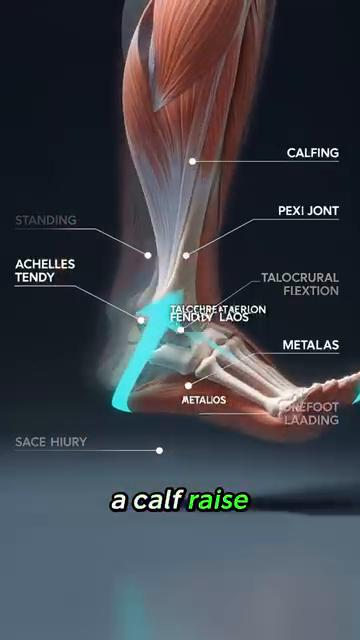 |  |
| **Figure 0b / Hình 0b** — Plantar view showing the dense nerve network in the sole. 7,000+ sensors, 30 ms reflex — the foot is the body's fastest external sensor. | **Hình 0b** — Nhìn dưới lòng bàn chân thấy mạng lưới thần kinh dày đặc. 7.000+ cảm biến, 30 ms phản xạ — bàn chân là cảm biến bên ngoài nhanh nhất cơ thể. |
| 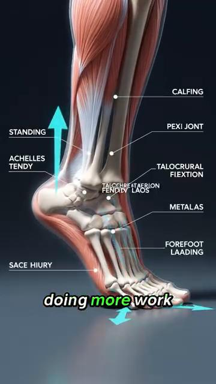 |  |
| **Figure 0c / Hình 0c** — Windlass mechanism: the foot is BOTH a sensor (detects arch tension) AND an actuator (stores energy for push-off). This dual role is why the foot is the most important tennis sensor. | **Hình 0c** — Cơ chế windlass: bàn chân vừa là cảm biến (phát hiện căng cung) VỪA là cơ cấu chấp hành (tích năng lượng đẩy). Vai trò kép này là lý do bàn chân là cảm biến tennis quan trọng nhất. |
| 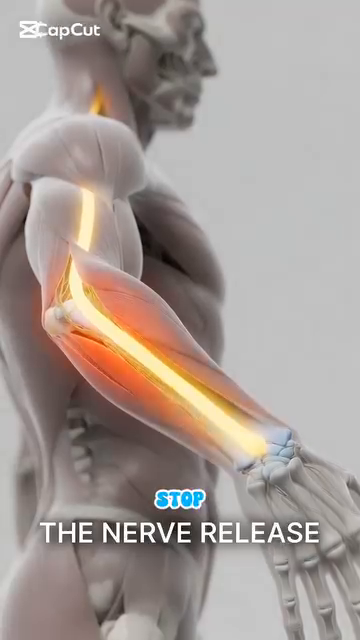 |  |
| **Figure 0d / Hình 0d** — Cubital tunnel (ulnar nerve pathway). Even before the hand senses anything, the elbow's ulnar nerve pathway is gated by elbow flexion — a hidden sensor constraint. | **Hình 0d** — Cubital tunnel (đường dây thần kinh trụ). Ngay cả trước khi tay cảm nhận bất cứ gì, đường dây thần kinh trụ ở khuỷu bị chặn bởi gập khuỷu — một ràng buộc cảm biến ẩn. |
|  |  |
| **Figure 0e / Hình 0e** — The 27 hand bones (8 carpals + 5 metacarpals + 14 phalanges) provide the sensor platform for the racket. More bones = more sensors = more PV detail. | **Hình 0e** — 27 xương bàn tay (8 cổ tay + 5 đốt bàn tay + 14 đốt ngón) cung cấp nền cảm biến cho vợt. Nhiều xương hơn = nhiều cảm biến hơn = PV chi tiết hơn. |
| 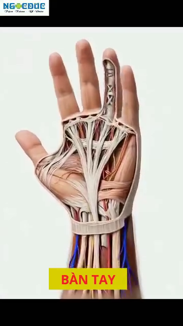 |  |
| **Figure 0f / Hình 0f** — Carpal tunnel cross-section: 9 tendons + 1 median nerve packed into 2 cm². Sensor density is incredibly high — the wrist is one of the most sensor-dense body parts. | **Hình 0f** — Mặt cắt ống cổ tay: 9 gân + 1 dây thần kinh giữa nhồi vào 2 cm². Mật độ cảm biến cực cao — cổ tay là một trong những bộ phận cảm biến dày đặc nhất. |
| **3** | **Hands / Bàn tay** | Racket position, grip pressure, vibration at contact, face angle | Meissner corpuscles, Pacinian corpuscles, Merkel disks, joint receptors | **~50–70 m/s** |
| **4** | **Eyes / Mắt** | Ball position, ball speed, ball spin, court position, opponent position | Rods (motion), cones (detail), retina, optic nerve → visual cortex | **~200 ms conscious** (but 30 ms sub-conscious) |
| **5** | **Ears + Vestibular / Tai + Tiền đình** | Sound of contact (line calls), head rotation, head tilt, gravity direction | Cochlea, semicircular canals (3), otolith organs (2), hair cells | **15–50 ms** for vestibular; ears direct to brain |

| 🇺🇸 English | 🇻🇳 Tiếng Việt |
|---|---|
| **The 5 channels are independent but integrated.** Each runs at its own speed. The brain WEIGHTS them by relevance: | **5 kênh độc lập nhưng tích hợp.** Mỗi kênh chạy tốc độ riêng. Não CÂN ĐÓ chúng theo liên quan: |
| **For a return of serve (high speed, unknown direction)**: eyes (where ball will land) > feet (split-step reflex) > proprioception (body position) > hands (last-second grip) > ears (contact sound) | **Với trả giao (tốc độ cao, hướng chưa biết)**: mắt (bóng sẽ rơi đâu) > bàn chân (phản xạ split-step) > cảm giác sâu (vị trí cơ thể) > bàn tay (cầm phút cuối) > tai (âm thanh tiếp xúc) |
| **For a volley (close range, already in position)**: hands (racket face) > eyes (opponent) > proprioception (arm angle) > ears (contact sound for placement) > feet (already positioned) | **Với volley (cự ly gần, đã ở vị trí)**: bàn tay (mặt vợt) > mắt (đối thủ) > cảm giác sâu (góc tay) > tai (âm thanh tiếp xúc cho vị trí) > bàn chân (đã ở vị trí) |
| **For a serve (full control)**: proprioception (kinetic chain timing) > hands (grip and release) > eyes (target) > feet (toss) > ears (verification) | **Với serve (toàn quyền kiểm soát)**: cảm giác sâu (thời gian chuỗi) > bàn tay (cầm và phóng) > mắt (mục tiêu) > bàn chân (tung) > tai (xác nhận) |
| *Master cue:* "5 sensors. 5 speeds. The brain weights them per shot." | *Câu nhắc tổng:* "5 cảm biến. 5 tốc độ. Não cân đó theo cú." |

* * *

# Chapter 3 — Channel 1 — Proprioception (The Hidden 6th Sense)
# Chương 3 — Kênh 1 — Cảm Giác Sâu (Giác Quan Thứ 6 Ẩn)

| 🇺🇸 English | 🇻🇳 Tiếng Việt |
|---|---|
| **The body has 5 senses everyone knows** (sight, hearing, touch, taste, smell) **+ 1 that almost no recreational player thinks about**: **proprioception** — the sense of where your body is in space, without looking. | **Cơ thể có 5 giác quan ai cũng biết** (thị, thính, xúc, vị, khứu) **+ 1 mà hầu như không người chơi phong trào nào nghĩ tới**: **cảm giác sâu** — giác về cơ thể ở đâu trong không gian, không cần nhìn. |
| **Close your eyes. Raise your right hand above your head.** You knew where your hand was without seeing it. That's proprioception. **It's running 24/7** — even when you're sleeping. | **Nhắm mắt. Nâng tay phải lên trên đầu.** Bạn biết tay mình ở đâu mà không cần thấy. Đó là cảm giác sâu. **Nó chạy 24/7** — ngay cả khi bạn ngủ. |
| **The proprioception hardware** (covered in detail in DD3 Ch.3 and DD5 Ch.7): | **Phần cứng cảm giác sâu** (đã bao phủ chi tiết trong DD3 Ch.3 và DD5 Ch.7): |

| Receptor / Thụ Thể | Where / Vị Trí | What It Detects / Nó Phát Hiện | Speed / Tốc Độ |
|---|---|---|---|
| **Muscle spindles / Thoi cơ** | Inside every muscle / Bên trong mỗi cơ | Muscle stretch + velocity of stretch / Giãn cơ + vận tốc giãn | **~80 m/s** (fastest) |
| **Golgi tendon organs / Cơ quan Golgi gân** | At muscle-tendon junction / Chỗ nối cơ-gân | Force / Lực | Slower |
| **Joint receptors / Thụ thể khớp** | Joint capsules (esp. knees, ankles, shoulders) / Bao khớp | Joint angle + motion direction / Góc khớp + hướng chuyển động | Medium |
| **Skin stretch receptors / Thụ thể giãn da** | Skin around joints / Da quanh khớp | Skin stretch (extra angle info) / Giãn da | Medium |

| 🇺🇸 English | 🇻🇳 Tiếng Việt |
|---|---|
| **Proprioception accuracy by joint** (typical 4.0 player, from DD1 Ch.3 and DD3 Ch.3): | **Độ chính xác cảm giác sâu theo khớp** (người 4.0 điển hình, từ DD1 Ch.3 và DD3 Ch.3): |

| Joint / Khớp | Detection Accuracy / Độ Chính Xác Phát Hiện |
|---|---|
| **Shoulder / Vai** | ~3°–5° rotation change / thay đổi xoay |
| **Elbow / Khuỷu** | ~2°–4° flexion change / thay đổi gập |
| **Wrist / Cổ tay** | ~2°–3° flexion change / thay đổi gập |
| **Hip / Hông** | ~3°–5° rotation change / thay đổi xoay |
| **Knee / Gối** | ~2°–4° flexion change / thay đổi gập |
| **Ankle / Cổ chân** | ~2°–3° dorsiflexion change / thay đổi gập lưng |

| 🇺🇸 English | 🇻🇳 Tiếng Việt |
|---|---|
| **Why proprioception matters more than vision at contact** — at the moment of contact, your eyes CANNOT track the ball (the VOR stabilizes them, but visual processing still takes 30–50 ms). **Your proprioception tells you where the racket is in that millisecond** — and that's the only feedback you have. | **Tại sao cảm giác sâu quan trọng hơn thị giác lúc tiếp xúc** — vào khoảnh khắc tiếp xúc, mắt bạn KHÔNG THỂ theo bóng (VOR ổn định chúng, nhưng xử lý thị giác vẫn mất 30–50 ms). **Cảm giác sâu nói cho bạn biết vợt ở đâu trong mili-giây đó** — và đó là phản hồi duy nhất bạn có. |
| **The 3.5 vs 4.5 proprioception gap** — a 3.5 player has ~30%–40% worse proprioception than a 4.5 player. **This gap closes with training.** Specific drills (closed-eye balance, single-leg stance, racket-position matching) improve proprioception by 30%–50% in 8 weeks. | **Khoảng cách cảm giác sâu 3.5 vs 4.5** — người 3.5 có cảm giác sâu kém hơn ~30%–40% so với người 4.5. **Khoảng cách này đóng lại bằng tập luyện.** Bài tập cụ thể (thăng bằng mắt nhắm, đứng một chân, đối chiếu vị trí vợt) cải thiện cảm giác sâu 30%–50% trong 8 tuần. |
| **The 50+ decline** — proprioception declines ~10%–15% per decade after 50. **This is why older players lose balance.** It's not a "balance problem" — it's a SENSOR problem. Train the sensor. | **Suy giảm 50+** — cảm giác sâu giảm ~10%–15% mỗi thập kỷ sau 50 tuổi. **Đây là lý do người chơi lớn tuổi mất thăng bằng.** Không phải "vấn đề thăng bằng" — là vấn đề CẢM BIẾN. Tập cảm biến. |
| *Master cue:* "Close your eyes. Trust your joints. They know." | *Câu nhắc tổng:* "Nhắm mắt. Tin khớp bạn. Chúng biết." |

* * *

# Chapter 4 — Channel 2 — Feet (Ground Contact as PV)
# Chương 4 — Kênh 2 — Bàn Chân (Tiếp Đất làm PV)

| 🇺🇸 English | 🇻🇳 Tiếng Việt |
|---|---|
| **The foot is BOTH a sensor AND an actuator.** It senses the ground (PV) AND it transmits force (action). Most players only train the actuator half. They forget the sensor half. | **Bàn chân vừa là cảm biến VỪA là cơ cấu chấp hành.** Nó cảm nhận đất (PV) VÀ nó truyền lực (hành động). Hầu hết người chơi chỉ tập nửa cơ cấu chấp hành. Họ quên nửa cảm biến. |
| **The foot's sensor hardware** (from Anatomy_Lab DD7): | **Phần cứng cảm biến bàn chân** (từ Anatomy_Lab DD7): |

| Component / Thành Phần | Count / Số Lượng | Function / Chức Năng |
|---|---|---|
| **Nerve endings in sole / Đầu dây thần kinh lòng bàn chân** | **7,000+** | Pressure, texture, vibration detection |
| **Plantar fascia nerve endings / Đầu dây thần kinh cân gan chân** | Dense / Dày đặc | Arch tension detection |
| **Foot joint receptors / Thụ thể khớp chân** | 33 joints × ~10 receptors each = **~330** | Joint angle + position |
| **Cutaneous mechanoreceptors / Thụ thể cơ học da** | Meissner + Pacinian + Merkel + Ruffini | Light touch, vibration, pressure |

| 🇺🇸 English | 🇻🇳 Tiếng Việt |
|---|---|
| **The 30 ms foot reflex** — the foot's nerve endings fire a reflex in **30 milliseconds** — **FASTER than conscious thought (~200 ms)**. **This reflex IS the split-step mechanism.** | **Phản xạ 30 ms bàn chân** — đầu dây thần kinh bàn chân bắn phản xạ trong **30 mili-giây** — **NHANH HƠN ý thức (~200 ms)**. **Phản xạ này CHÍNH LÀ cơ chế split-step.** |
| **The control engineering view** — the foot sensor runs the FASTEST feedback loop in your body. **SV: "be balanced."** PV from foot: "am I balanced?" **If PV ≠ SV, the foot reflex fires within 30 ms.** The conscious brain (cortex) only learns about the imbalance 170 ms later. | **Góc nhìn kỹ thuật điều khiển** — cảm biến bàn chân chạy vòng phản hồi NHANH NHẤT trong cơ thể bạn. **SV: "thăng bằng."** PV từ chân: "tôi có thăng bằng không?" **Nếu PV ≠ SV, phản xạ chân bắn trong 30 ms.** Não ý thức (vỏ não) chỉ biết về mất thăng bằng 170 ms sau đó. |
| **The 3 sources of foot PV**: | **3 nguồn PV từ bàn chân**: |
| **1. Pressure distribution (PV-pressure)** — where your weight is on each foot. **Stand on one foot**: you feel the pressure shift to the ball of the foot and big toe. **This is your body telling you where your center of mass is.** | **1. Phân bố áp lực (PV-pressure)** — trọng lượng bạn ở đâu trên mỗi chân. **Đứng một chân**: bạn cảm thấy áp lực chuyển sang mũi chân và ngón cái. **Đó là cơ thể nói cho bạn biết trọng tâm ở đâu.** |
| **2. Surface texture (PV-texture)** — clay, hard court, grass. Each surface has different friction. **Your foot senses this and adjusts push-off force.** | **2. Kết cấu mặt (PV-texture)** — sân đất nện, sân cứng, cỏ. Mỗi mặt có ma sát khác nhau. **Chân bạn cảm nhận và điều chỉnh lực đẩy.** |
| **3. Vibration timing (PV-impact)** — when your foot lands, you FEEL the moment of contact. **This timing PV is critical for split-step timing.** | **3. Thời gian rung (PV-impact)** — khi chân bạn đáp, bạn CẢM THẤY khoảnh khắc tiếp xúc. **Thời gian PV này quan trọng cho thời gian split-step.** |
| **The "rooting" cue** — the source document (Ch.1) uses the term "Rooting" (Nghệ Thuật Rễ Cây). **Imagine your feet as tree roots** — spreading, gripping, sensing. **Every push-off begins with foot sensing**. | **Câu nhắc "rễ cây"** — tài liệu nguồn (Ch.1) dùng thuật ngữ "Rễ Cây". **Hình dung chân bạn như rễ cây** — lan ra, bám, cảm nhận. **Mỗi đẩy bắt đầu bằng chân cảm nhận.** |
| *Master cue:* "The foot is a sensor first, an engine second." | *Câu nhắc tổng:* "Bàn chân là cảm biến trước, động cơ sau." |

* * *

# Chapter 5 — Channel 3 — Hands (Racket Grip as PV)
# Chương 5 — Kênh 3 — Bàn Tay (Cầm Vợt làm PV)

| 🇺🇸 English | 🇻🇳 Tiếng Việt |
|---|---|
| **The hand reports back what the racket is doing.** Grip pressure, face angle, vibration, position in space. **Without hand PV, you cannot fine-tune the racket.** | **Bàn tay báo lại vợt đang làm gì.** Áp lực cầm, góc mặt, rung, vị trí trong không gian. **Không có PV tay, bạn không thể tinh chỉnh vợt.** |
| **The hand's sensor hardware**: | **Phần cứng cảm biến tay**: |

| Receptor / Thụ Thể | Where / Vị Trí | What It Detects / Nó Phát Hiện | Density / Mật Độ |
|---|---|---|---|
| **Meissner corpuscles / Thể Meissner** | Fingertips, palm / Đầu ngón, lòng bàn tay | Light touch, grip / Chạm nhẹ, cầm | **Highest in fingertips** — most sensitive |
| **Pacinian corpuscles / Thể Pacini** | Deep in palm + fingers / Sâu trong lòng bàn tay + ngón | Vibration / Rung | High |
| **Merkel disks / Đĩa Merkel** | Skin surface / Bề mặt da | Sustained pressure, edges / Áp lực liên tục, cạnh | Medium |
| **Ruffini endings / Đầu Ruffini** | Deep dermis / Bì sâu | Skin stretch / Giãn da | Medium |
| **Joint receptors / Thụ thể khớp** | Wrist + finger joints / Cổ tay + khớp ngón | Joint angle / Góc khớp | Wrist ~330, fingers ~330 |

| 🇺🇸 English | 🇻🇳 Tiếng Việt |
|---|---|
| **The 4 sources of hand PV**: | **4 nguồn PV từ bàn tay**: |
| **1. Grip pressure (PV-grip)** — the hand reports back how hard you're squeezing. **3/10 at rest, 7/10 at contact, 3/10 at follow-through** (Anatomy_Lab DD3 grip pressure rule). **Most recreational players grip 8/10 continuously** — they LOSE the pressure PV because they're always maxed out. | **1. Áp lực cầm (PV-grip)** — tay báo lại bạn đang bóp bao nhiêu. **3/10 lúc nghỉ, 7/10 lúc tiếp xúc, 3/10 lúc follow-through** (quy tắc Anatomy_Lab DD3). **Đa số người chơi phong trào cầm 8/10 liên tục** — họ MẤT PV áp lực vì luôn ở mức tối đa. |
| **2. Face angle (PV-face)** — the thumb + index finger sense the racket face's orientation. **Open = slice, closed = topspin, vertical = flat.** This PV is processed ~50 ms before contact — you adjust during the swing. | **2. Góc mặt (PV-face)** — ngón cái + ngón trỏ cảm nhận hướng mặt vợt. **Mở = slice, đóng = topspin, đứng = phẳng.** PV này được xử lý ~50 ms trước tiếp xúc — bạn điều chỉnh trong cú vung. |
| **3. Vibration at contact (PV-impact)** — at the moment of contact, the ball's vibration travels through the racket to your hand. **Sweet spot = small vibration (clean hit). Off-center = large vibration (twist).** This PV is processed in ~10–30 ms. | **3. Rung lúc tiếp xúc (PV-impact)** — khoảnh khắc tiếp xúc, rung của bóng truyền qua vợt tới tay. **Sweet spot = rung nhỏ (đánh sạch). Lệch tâm = rung lớn (xoắn).** PV này được xử lý trong ~10–30 ms. |
| **4. Racket position (PV-position)** — the hand knows where the racket is in space (proprioception). **At contact, you know if the racket is high, low, left, right of your body center** — without looking. | **4. Vị trí vợt (PV-position)** — tay biết vợt ở đâu trong không gian (cảm giác sâu). **Lúc tiếp xúc, bạn biết vợt cao hay thấp, trái hay phải của tâm cơ thể** — không cần nhìn. |
| **The "dead hand" problem** — many coaches say "relax your grip." But if the hand is COMPLETELY relaxed, **you lose PV-grip AND PV-face**. Better cue: "Active hand, soft fingers." **The hand should be ALIVE** — receiving PV constantly — even between shots. | **Vấn đề "tay chết"** — nhiều HLV nói "thả lỏng grip." Nhưng nếu tay HOÀN TOÀN thả lỏng, **bạn mất PV-grip VÀ PV-face**. Câu nhắc tốt hơn: "Tay chủ động, ngón mềm." **Tay phải SỐNG** — nhận PV liên tục — ngay cả giữa các cú. |
| **The "soft hands firm contact" rule** — the source document (Ch.12 backhand): "Soft hands firm contact." **Hands are soft enough to absorb feedback, firm enough to transmit force.** This is the tension balance that maximizes both PV-sensitivity and power. | **Quy tắc "tay mềm tiếp xúc chắc"** — tài liệu nguồn (Ch.12 backhand): "Tay mềm tiếp xúc chắc." **Tay đủ mềm để hấp thụ phản hồi, đủ chắc để truyền lực.** Đây là cân bằng căng tối đa hóa cả độ nhạy PV lẫn lực. |
| *Master cue:* "Active hand, soft fingers. PV every millisecond." | *Câu nhắc tổng:* "Tay chủ động, ngón mềm. PV mỗi mili-giây." |

* * *

# Chapter 6 — Channel 4 — Eyes (Vision as PV + SV Source)
# Chương 6 — Kênh 4 — Mắt (Thị Giác làm PV + Nguồn SV)

| 🇺🇸 English | 🇻🇳 Tiếng Việt |
|---|---|
| **The eyes are the ONLY input channel for tennis.** The brain has NO direct contact with the ball. Everything it knows about the ball comes through vision (and sometimes sound for line calls). | **Mắt là KÊNH đầu vào DUY NHẤT cho tennis.** Não KHÔNG tiếp xúc trực tiếp với bóng. Mọi thứ nó biết về bóng đến qua thị giác (và đôi khi âm thanh cho line calls). |
| **Vision has a dual role** — it provides BOTH the SV (where I want to hit) AND the PV (what's happening). **This is unique among the 5 channels.** Proprioception, feet, hands, ears provide PV only. **Eyes provide BOTH directions.** | **Thị giác có vai trò kép** — nó cung cấp CẢ SV (tôi muốn đánh đâu) VÀ PV (đang xảy ra gì). **Điều này độc đáo trong 5 kênh.** Cảm giác sâu, chân, tay, tai chỉ cung cấp PV. **Mắt cung cấp CẢ hai hướng.** |
| **The visual PV (incoming)**: | **PV thị giác (đến)**: |
| **1. Ball trajectory (PV-ball)** — where the ball is, where it will be, how fast, how much spin. **Updated every 30–50 ms in conscious vision**, but every 15 ms in sub-conscious (vestibular + reticular). | **1. Quỹ đạo bóng (PV-ball)** — bóng ở đâu, sẽ ở đâu, nhanh cỡ nào, xoáy bao nhiêu. **Cập nhật mỗi 30–50 ms trong thị giác ý thức**, nhưng mỗi 15 ms trong tiềm thức (tiền đình + lưới). |
| **2. Court position (PV-court)** — where the lines are, where the opponent is, where you are. **Updated less often** (~200 ms) but stays in peripheral vision constantly. | **2. Vị trí sân (PV-court)** — đường biên ở đâu, đối thủ ở đâu, bạn ở đâu. **Cập nhật ít thường xuyên hơn** (~200 ms) nhưng ở lại trong thị giác ngoại vi liên tục. |
| **3. Opponent body (PV-opponent)** — what is the opponent doing? Racket position, weight shift, shoulder turn. **This is the SV source for YOUR shot** (you choose based on what they give you). | **3. Cơ thể đối thủ (PV-opponent)** — đối thủ đang làm gì? Vị trí vợt, chuyển trọng lượng, xoay vai. **Đây là nguồn SV cho cú BẠN** (bạn chọn dựa trên cái họ cho bạn). |
| **The visual SV (target)**: | **SV thị giác (mục tiêu)**: |
| **1. Target location (SV-target)** — where you want the ball to land. **This SV is set BEFORE the shot** (~200 ms before). It's the goal the entire body tries to achieve. | **1. Vị trí mục tiêu (SV-target)** — bạn muốn bóng rơi đâu. **SV này được đặt TRƯỚC cú** (~200 ms trước). Nó là mục tiêu toàn bộ cơ thể cố đạt. |
| **2. Trajectory intent (SV-trajectory)** — flat, topspin, slice, lob. **Set by grip + face angle + racket path.** | **2. Ý định quỹ đạo (SV-trajectory)** — phẳng, topspin, slice, lob. **Đặt bởi grip + góc mặt + đường vợt.** |
| **3. Speed intent (SV-speed)** — full, 70%, 50%, touch. **Set by swing speed.** | **3. Ý định tốc độ (SV-speed)** — hết, 70%, 50%, chạm. **Đặt bởi tốc độ vung.** |
| **The Quiet Eye** (covered in DD3 Ch.2 and confirmed by Anatomy_Lab DD8): elite players fixate on the contact zone for **0.3–0.5 s**. Recreational players: 0.1–0.2 s. **Longer quiet eye = better timing = better shot quality.** | **Mắt im lặng** (đã bao phủ trong DD3 Ch.2 và xác nhận bởi Anatomy_Lab DD8): người chơi elite cố định ánh nhìn trên vùng tiếp xúc **0.3–0.5 s**. Người phong trào: 0.1–0.2 s. **Mắt im lặng càng lâu = timing càng tốt = chất lượng cú càng cao.** |
| 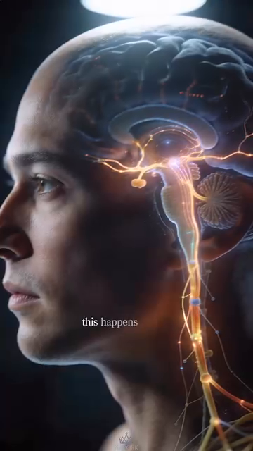 |  |
| **Figure 4 / Hình 4** — Visual tracking and the quiet eye in action. Elite players fixate on the contact zone for 0.3–0.5s, longer than recreational players (0.1–0.2s). This sustained gaze is what allows precise timing. | **Hình 4** — Theo dõi thị giác và mắt im lặng trong hành động. Người chơi elite cố định ánh nhìn trên vùng tiếp xúc 0.3–0.5s, lâu hơn người phong trào (0.1–0.2s). Ánh nhìn duy trì này là thứ cho phép định giờ chính xác. |
|  |  |
| **Figure 5 / Hình 5** — The 5-phase visual cycle: Wide perception → Lock-on → Narrow focus → Quiet eye → Re-expand. Each phase has a measurable time (0.5s / 0.3s / 0.1s / 0.05–0.1s / 0.2s). | **Hình 5** — Chu kỳ thị giác 5 pha: Nhận thức rộng → Khóa mục tiêu → Tập trung hẹp → Mắt im lặng → Mở rộng lại. Mỗi pha có thời gian đo được (0.5s / 0.3s / 0.1s / 0.05–0.1s / 0.2s). |
| 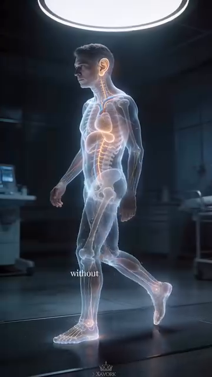 |  |
| **Figure 6 / Hình 6** — Visual reaction at the moment of contact. At impact, the eyes cannot track — VOR stabilizes them. **Proprioception takes over** for the final 50 ms before contact. | **Hình 6** — Phản xạ thị giác khoảnh khắc tiếp xúc. Lúc va chạm, mắt không thể theo dõi — VOR ổn định chúng. **Cảm giác sâu tiếp quản** trong 50 ms cuối trước tiếp xúc. |
| **The 50+ vision decline** — presbyopia (loss of near focus) starts at 40–45. Peripheral vision narrows ~10°–20° by 70. **Use yellow balls on dark courts** for max contrast. **Turn head more often** to compensate for peripheral narrowing. | **Suy giảm thị giác 50+** — lão thị (mất khả năng tập trung gần) bắt đầu ở 40–45 tuổi. Thị giác ngoại vi hẹp ~10°–20° đến 70 tuổi. **Dùng bóng vàng trên sân tối** cho tương phản tối đa. **Xoay đầu thường xuyên hơn** để bù thu hẹp ngoại vi. |
| *Master cue:* "Eyes set the goal. Eyes check the result. Both eyes, both jobs." | *Câu nhắc tổng:* "Mắt đặt mục tiêu. Mắt kiểm kết quả. Cả hai mắt, cả hai việc." |

* * *

# Chapter 7 — Channel 5 — Ears + Vestibular (Sound + Head Position)
# Chương 7 — Kênh 5 — Tai + Tiền Đình (Âm Thanh + Vị Trí Đầu)

| 🇺🇸 English | 🇻🇳 Tiếng Việt |
|---|---|
|  |  |
| **Figure 1 / Hình 1** — The 3 semicircular canals (anterior, posterior, horizontal) detect head rotation. The 2 otolith organs detect linear acceleration and head tilt. This is the COMPLETE vestibular anatomy — one of the body's most sophisticated sensors. | **Hình 1** — 3 ống bán nguyệt (trước, sau, ngang) phát hiện xoay đầu. 2 cơ quan otolith phát hiện gia tốc tuyến tính và nghiêng đầu. Đây là TOÀN BỘ giải phẫu tiền đình — một trong những cảm biến tinh vi nhất của cơ thể. |
| 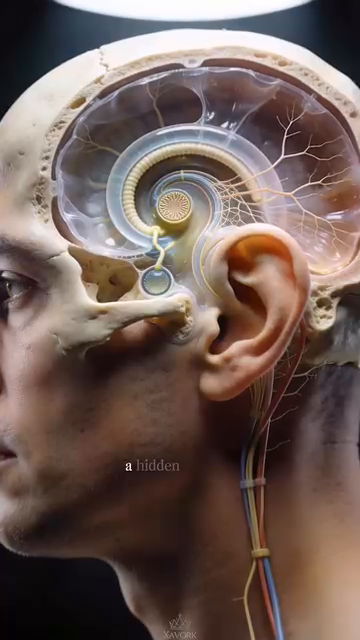 |  |
| **Figure 2 / Hình 2** — Close-up of vestibular anatomy showing the ampullae (the sensory organs at the base of each semicircular canal) and the otolith organs (utricle + saccule). The ampullae contain hair cells that bend when endolymph fluid moves during head rotation. | **Hình 2** — Cận cảnh giải phẫu tiền đình hiện các ampullae (cơ quan cảm giác ở đáy mỗi ống bán nguyệt) và cơ quan otolith (utricle + saccule). Ampullae chứa tế bào lông bị uốn khi dịch nội bạch chuyển động trong xoay đầu. |
| **The ears provide two channels** — sound (for contact quality + opponent cues) AND vestibular (for head position + balance). **These run in parallel but feel different.** | **Tai cung cấp hai kênh** — âm thanh (cho chất lượng tiếp xúc + tín hiệu đối thủ) VÀ tiền đình (cho vị trí đầu + thăng bằng). **Chúng chạy song song nhưng cảm nhận khác nhau.** |
| **The ear's PV-audio** (sound at contact): | **PV-âm thanh tai** (âm thanh lúc tiếp xúc): |

| Sound Cue / Tín Hiệu Âm Thanh | What It Tells You / Nó Nói Gì |
|---|---|
| **"Bộp" / "Pop"** (sweet spot clean hit) | Center contact. Ball will go where aimed. |
| **"Cộc" / "Thud"** (off-center) | Edge contact. Ball will spin unpredictably. |
| **"Phập" / "Puff"** (open face) | Slice / underspin shot. Ball will float. |
| **"Pực" / "Whip crack"** (closed face, fast) | Topspin shot at speed. Ball will dip. |
| **No sound at all / Không âm thanh nào** | Miss or mishit. Ball didn't reach strings. |
| **Racket frame sound (clink) / Âm thanh khung vợt** | Frame contact. Ball will fly off-target. |

| 🇺🇸 English | 🇻🇳 Tiếng Việt |
|---|---|
| **The ear's PV-audio timing** — sound is the FASTEST sensory channel after reflexes. **~10–15 ms from contact to brain.** This is why you know INSTANTLY whether the shot was clean or not. | **Thời gian PV-âm thanh tai** — âm thanh là kênh cảm giác NHANH NHẤT sau phản xạ. **~10–15 ms từ tiếp xúc tới não.** Đây là lý do bạn biết NGAY LẬP TỨC cú đánh sạch hay không. |
| **The opponent's sound cues** — opponent's footwork sound tells you where they are. **Opponent's contact sound tells you the spin and pace.** | **Tín hiệu âm thanh đối thủ** — âm thanh footwork đối thủ nói bạn biết họ ở đâu. **Âm thanh tiếp xúc đối thủ nói bạn biết xoáy và nhịp.** |
|  |  |
| **Figure 3 / Hình 3** — Otoconia: tiny calcium carbonate crystals in the otolith organs. **These move with gravity** and tell the brain which way is UP. Loss of otoconia (or dislodging during whiplash) = vertigo (BPPV — benign paroxysmal positional vertigo). | **Hình 3** — Otoconia: tinh thể canxi cacbonat tí hon trong các cơ quan otolith. **Chúng di chuyển theo trọng lực** và nói cho não biết hướng nào là LÊN. Mất otoconia (hoặc trật khỏi vị trí trong tai nạn whiplash) = chóng mặt (BPPV — chóng mặt tư thế kịch phát lành tính). |
| 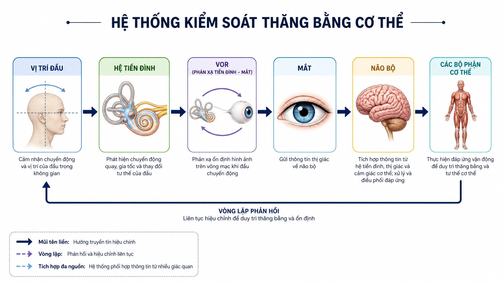 |  |
| **Figure 3a / Hình 3a** — **THE COMPLETE BALANCE CONTROL SYSTEM** (the image you provided — "HỆ THỐNG KIỂM SOÁT THĂNG BẰNG CƠ THỂ"). 6 components in sequence: **Vị trí đầu → Hệ tiền đình → VOR → Mắt → Não bộ → Các bộ phận cơ thể**, with a feedback loop curving back to head position. **This is the master diagram for the entire chapter.** When the vestibular sensor changes (e.g., head rotates), it triggers VOR (eye stabilization), which sends visual PV to the brain, which integrates with proprioception, which commands muscle response, which changes head position — closing the loop. **Every balance moment in tennis is this loop running in real-time.** | **Hình 3a** — **HỆ THỐNG KIỂM SOÁT THĂNG BẰNG CƠ THỂ HOÀN CHỈNH** (hình bạn cung cấp). 6 thành phần theo trình tự: **Vị trí đầu → Hệ tiền đình → VOR → Mắt → Não bộ → Các bộ phận cơ thể**, với vòng phản hồi quay lại vị trí đầu. **Đây là sơ đồ tổng cho toàn bộ chương.** Khi cảm biến tiền đình thay đổi (vd: đầu xoay), nó kích hoạt VOR (ổn định mắt), gửi PV thị giác tới não, não tích hợp với cảm giác sâu, ra lệnh phản ứng cơ, thay đổi vị trí đầu — đóng vòng. **Mỗi khoảnh khắc thăng bằng trong tennis là vòng này chạy thời gian thực.** |
| **The vestibular PV-balance** (head position in space): | **PV-thăng bằng tiền đình** (vị trí đầu trong không gian): |

| Vestibular Input / Đầu Vào Tiền Đình | What It Detects / Nó Phát Hiện | Speed / Tốc Độ |
|---|---|---|
| **3 semicircular canals / 3 ống bán nguyệt** | Head rotation (x, y, z axes) | ~15 ms |
| **Utricle / Utricle** | Horizontal linear acceleration + head tilt | ~20 ms |
| **Saccule / Saccule** | Vertical linear acceleration + head tilt | ~20 ms |
| **Hair cells in otoliths / Tế bào lông trong otolith** | Gravity direction (which way is UP) | Continuous |

| 🇺🇸 English | 🇻🇳 Tiếng Việt |
|---|---|
| **The vestibular PV-rotation** — at every serve, the head rotates ~120° in <0.5s. **The vestibular system tracks this rotation in real-time.** | **PV-xoay tiền đình** — mỗi serve, đầu xoay ~120° trong <0.5s. **Hệ tiền đình theo dõi xoay này theo thời gian thực.** |
| **Why head STILL matters** — when your head is stable, your eyes can lock on the contact zone (quiet eye). When your head bounces, your eyes bounce. **VOR (vestibulo-ocular reflex) keeps your gaze stable DURING head motion.** | **Tại sao đầu YÊN quan trọng** — khi đầu ổn định, mắt khóa vùng tiếp xúc (mắt im lặng). Khi đầu nảy, mắt nảy. **VOR (phản xạ tiền đình-mắt) giữ ánh nhìn ổn định TRONG khi đầu chuyển động.** |
| **The 50+ vestibular decline** — hair cells die after 40. By 60, ~20%–30% reduction in vestibular sensitivity. **This is why older players lose balance on quick direction changes.** Train vestibular: head rotations slow (10 reps each direction daily) + single-leg stance with head turns (30 sec daily). | **Suy giảm tiền đình 50+** — tế bào lông chết sau 40 tuổi. Đến 60 tuổi, ~20%–30% giảm độ nhạy tiền đình. **Đây là lý do người chơi lớn tuổi mất thăng bằng khi đổi hướng nhanh.** Tập tiền đình: xoay đầu chậm (10 lần mỗi hướng hàng ngày) + đứng một chân xoay đầu (30 giây hàng ngày). |
| **The ear + vestibular combo for balance** — ears + vestibular work together for balance. **Ears hear the body falling, vestibular detects the head rotating.** Tennis requires BOTH simultaneously. | **Combo tai + tiền đình cho thăng bằng** — tai + tiền đình làm việc cùng nhau cho thăng bằng. **Tai nghe cơ thể ngã, tiền đình phát hiện đầu xoay.** Tennis đòi hỏi CẢ HAI đồng thời. |
| *Master cue:* "Hear the shot. Feel the head. Both give you PV." | *Câu nhắc tổng:* "Nghe cú. Cảm đầu. Cả hai cho bạn PV." |

* * *

## 7.1 — Reading the Balance Control Loop (A Walk-Through)
## 7.1 — Đọc Vòng Kiểm Soát Thăng Bằng (Đi Từng Bước)

| 🇺🇸 English | 🇻🇳 Tiếng Việt |
|---|---|
| The diagram (Figure 3a) shows the **complete balance control loop**. Let me walk you through it, step by step, in tennis context — using a real moment from your game. | Sơ đồ (Hình 3a) hiện **vòng kiểm soát thăng bằng hoàn chỉnh**. Để tôi dẫn bạn qua từng bước, trong bối cảnh tennis — dùng một khoảnh khắc thật từ trận đấu của bạn. |
| **The moment** — your opponent hits a sharp crosscourt forehand. You split-step, push off your left foot, and rotate your head to track the ball. **What happens in your body in the next 200 ms?** | **Khoảnh khắc** — đối thủ đánh một forehand crosscourt sắc. Bạn split-step, đẩy chân trái, và xoay đầu theo bóng. **Chuyện gì xảy ra trong cơ thể bạn trong 200 ms tiếp theo?** |
| **Step 1 — Vị trí đầu (Head position)** — your head rotates ~90° to the right in 0.15s. The semicircular canals in your inner ear detect this rotation in real-time. **The PV here is: "head is moving at 600°/s to the right."** | **Bước 1 — Vị trí đầu** — đầu bạn xoay ~90° sang phải trong 0.15s. Ống bán nguyệt trong tai trong phát hiện xoay này theo thời gian thực. **PV ở đây là: "đầu đang chuyển động 600°/s sang phải."** |
| **Step 2 — Hệ tiền đình (Vestibular system)** — the 3 canals (anterior, posterior, horizontal) each fire according to which axis the rotation is on. The horizontal canal fires strongest (it's a yaw rotation). The brain receives 3 PV signals: horizontal canal (max), anterior canal (small), posterior canal (small). | **Bước 2 — Hệ tiền đình** — 3 ống (trước, sau, ngang) mỗi ống bắn theo trục xoay. Ống ngang bắn mạnh nhất (đây là xoay yaw). Não nhận 3 tín hiệu PV: ống ngang (max), ống trước (nhỏ), ống sau (nhỏ). |
| **Step 3 — VOR (Phản xạ tiền đình-mắt)** — the brain sends a counter-signal to the eye muscles: rotate eyes LEFT at 600°/s, to compensate for the head rotating right. **The eyes stay locked on the ball, even though the head is rotating.** This is the quiet-eye mechanism. | **Bước 3 — VOR** — não gửi tín hiệu ngược tới cơ mắt: xoay mắt TRÁI ở 600°/s, để bù cho đầu xoay phải. **Mắt giữ khóa trên bóng, dù đầu đang xoay.** Đây là cơ chế mắt im lặng. |
| **Step 4 — Mắt (Eye)** — the eye's retina receives the ball's image. **It does NOT move** (VOR is keeping it stable). The optic nerve fires: "ball is at position X, Y on the retina, moving slowly toward the periphery." **The PV is: "ball is still 0.3s away from me, approaching at 1.2 m/s."** | **Bước 4 — Mắt** — võng mạc mắt nhận ảnh bóng. **Nó KHÔNG di chuyển** (VOR giữ ổn định). Thị thần kinh bắn: "bóng ở vị trí X, Y trên võng mạc, đang chuyển động chậm về ngoại vi." **PV là: "bóng còn cách tôi 0.3s, đang tới 1.2 m/s."** |
| **Step 5 — Não bộ (Brain)** — the brain INTEGRATES all PV: vestibular (head moving right), VOR (eyes stable), eye (ball position). It compares to SV (where I want to hit). **Decision: "this is a forehand, crosscourt return, 70% pace."** | **Bước 5 — Não bộ** — não TÍCH HỢP tất cả PV: tiền đình (đầu xoay phải), VOR (mắt ổn định), mắt (vị trí bóng). Não so với SV (tôi muốn đánh đâu). **Quyết định: "đây là forehand, trả crosscourt, 70% nhịp."** |
| **Step 6 — Các bộ phận cơ thể (Body parts)** — the brain sends commands via motor cortex → spinal cord → muscles. **Muscles fire in sequence**: right leg push-off, trunk rotation, right arm cocking, swing. The proprioceptive system reports back PV: "shoulder at 90°, elbow at 110°, wrist locked." | **Bước 6 — Các bộ phận cơ thể** — não gửi lệnh qua vỏ vận động → tủy sống → cơ. **Cơ bắn theo trình tự**: chân phải đẩy, thân xoay, tay phải lên, vung. Hệ cảm giác sâu báo lại PV: "vai 90°, khuỷu 110°, cổ tay khóa." |
| **Step 7 — Feedback loop** — the body changes head position (the swing moves the head), which changes the vestibular PV, which re-triggers VOR, which re-stabilizes eyes, which gets a new ball position, which goes back to the brain. **The loop runs CONTINUOUSLY, ~50 ms per cycle.** | **Bước 7 — Vòng phản hồi** — cơ thể thay đổi vị trí đầu (cú vung di chuyển đầu), thay đổi PV tiền đình, kích hoạt lại VOR, ổn định lại mắt, nhận vị trí bóng mới, quay lại não. **Vòng chạy LIÊN TỤC, ~50 ms mỗi chu kỳ.** |
| **The tennis implication** — if ANY link in this loop is broken, your balance fails. **The 50+ decline hits the vestibular link hardest** (hair cells die, sensitivity drops 20–30%). That's why older players feel "off-balance" on quick direction changes. | **Hệ quả tennis** — nếu BẤT KỲ mắt xích nào trong vòng này gãy, thăng bằng bạn thất bại. **Suy giảm 50+ đánh mạnh nhất vào mắt xích tiền đình** (tế bào lông chết, độ nhạy giảm 20–30%). Đó là lý do người chơi lớn tuổi cảm thấy "mất thăng bằng" khi đổi hướng nhanh. |
| **The 3 takeaways from this diagram** — (1) **Balance is not a single thing** — it's a 6-component system, (2) **VOR is the silent hero** — without it, your eyes bounce every time your head moves, (3) **The feedback loop means balance is never "done"** — it runs continuously, even when you think you're standing still. | **3 bài học từ sơ đồ này** — (1) **Thăng bằng không phải một thứ** — đó là hệ 6 thành phần, (2) **VOR là người hùng thầm lặng** — không có nó, mắt bạn nảy mỗi lần đầu chuyển động, (3) **Vòng phản hồi nghĩa là thăng bằng không bao giờ "xong"** — nó chạy liên tục, ngay cả khi bạn nghĩ mình đang đứng yên. |
| *Master cue:* "The diagram is the chapter. Read it slowly. Every box is a sensor. Every arrow is a feedback loop. Every moment on court is this loop running." | *Câu nhắc tổng:* "Sơ đồ là chương. Đọc chậm. Mỗi ô là cảm biến. Mỗi mũi tên là vòng phản hồi. Mỗi khoảnh khắc trên sân là vòng này chạy." |

* * *

# Chapter 8 — The 3 Feedback Loop Types
# Chương 8 — 3 Loại Vòng Phản Hồi

| 🇺🇸 English | 🇻🇳 Tiếng Việt |
|---|---|
| **Every tennis shot generates 3 types of feedback**. They happen at different times and have different impacts. | **Mỗi cú tennis tạo 3 loại phản hồi.** Chúng xảy ra ở các thời điểm khác nhau và có tác động khác nhau. |

| Feedback Type / Loại Phản Hồi | When / Khi Nào | Speed / Tốc Độ | Source / Nguồn | What It Does / Nó Làm Gì |
|---|---|---|---|---|
| **1. Live feedback (during stroke) / Trực tiếp (trong cú)** | Within the 0.5s swing | **10–50 ms** | Hand (vibration, grip), foot (planted), vestibular (head rotation) | Small mid-swing corrections. Limited time. |
| **2. Post-stroke feedback (after ball lands) / Sau cú (sau bóng rơi)** | Within 1–3 seconds | **200–500 ms** | Eyes (ball flight), ears (line call), ball landing position | Compare PV (where ball landed) to SV (where you aimed). Mark error. |
| **3. Anticipatory feedback (across strokes) / Dự đoán (qua các cú)** | Across 5–50 strokes | **5–30 minutes** | Pattern recognition (temporal lobe), motor learning (cerebellum), memory (basal ganglia) | Adjust SV for next stroke based on pattern of errors. This is where ADAPTATION happens. |

| 🇺🇸 English | 🇻🇳 Tiếng Việt |
|---|---|
| **The 3.5 player's mistake** — most 3.5 players focus on **TYPE 2 (post-stroke)** because that's where they're told to look. "Watch the ball" = post-stroke visual feedback. | **Lỗi người chơi 3.5** — hầu hết người 3.5 tập trung vào **LOẠI 2 (sau cú)** vì họ được nói nhìn vào đó. "Nhìn bóng" = phản hồi thị giác sau cú. |
| **The 4.5 player's focus** — they use **TYPE 1 (live) AND TYPE 3 (anticipatory)**. **Live**: they sense mid-swing errors through hand proprioception. **Anticipatory**: they remember "the last 3 forehands went long" and adjust the next stroke BEFORE it starts. | **Tập trung người chơi 4.5** — họ dùng **LOẠI 1 (trực tiếp) VÀ LOẠI 3 (dự đoán)**. **Trực tiếp**: họ cảm nhận sai số giữa cú qua cảm giác sâu tay. **Dự đoán**: họ nhớ "3 forehand trước đều dài" và điều chỉnh cú tiếp theo TRƯỚC khi nó bắt đầu. |
| **The training implication** — to become 4.5, you need: | **Hệ quả tập luyện** — để trở thành 4.5, bạn cần: |

| Type / Loại | Training / Tập Luyện |
|---|---|
| **Type 1 (live) / Trực tiếp** | Slow-motion swings with focused attention on hand/feet feedback (10 reps daily) |
| **Type 2 (post-stroke) / Sau cú** | Standard match play (eyes track ball, brain notes result) |
| **Type 3 (anticipatory) / Dự đoán** | Pattern-recognition drills (deliberate practice of adjusting SV based on PV patterns) |

| 🇺🇸 English | 🇻🇳 Tiếng Việt |
|---|---|
| **The most-overlooked type** — TYPE 3 (anticipatory) is the most under-trained. **Most players repeat the SAME stroke 1000 times without adapting.** They only adapt when someone tells them to. **Autonomous adaptation** comes from Type 3 training. | **Loại bị bỏ qua nhiều nhất** — LOẠI 3 (dự đoán) là loại ít được tập nhất. **Hầu hết người chơi lặp CÙNG cú 1000 lần mà không thích ứng.** Họ chỉ thích ứng khi ai đó bảo họ. **Thích ứng tự trị** đến từ tập Loại 3. |
| *Master cue:* "Three feedback loops. Train all three. Most train only one." | *Câu nhắc tổng:* "Ba vòng phản hồi. Tập cả ba. Đa số chỉ tập một." |

* * *

# Chapter 9 — Error Correction: From Error to Refinement
# Chương 9 — Sửa Lỗi: Từ Sai Số Đến Tinh Chỉnh

| 🇺🇸 English | 🇻🇳 Tiếng Việt |
|---|---|
| **Errors are the SOURCE of learning.** Every unforced error contains information. **PV ≠ SV. The body learns to make them match.** | **Sai số là NGUỒN học.** Mỗi lỗi tự đánh chứa thông tin. **PV ≠ SV. Cơ thể học làm chúng khớp.** |
| **The error correction hierarchy** (from fastest to slowest): | **Hệ thống phân cấp sửa sai** (từ nhanh nhất tới chậm nhất): |

| Level / Cấp | Time to Correct / Thời Gian Sửa | What Happens / Chuyện Gì Xảy Ra |
|---|---|---|
| **1. Mid-swing micro-adjustment / Điều chỉnh giữa cú** | 10–50 ms | Hand grip adjusts, foot pivots, vestibular reorients. Body's automatic compensation. |
| **2. Stroke-to-stroke adjustment / Điều chỉnh giữa các cú** | 1–5 seconds | Eyes + proprioception compare PV (last ball) to SV (intent). Small SV adjustment for next stroke. |
| **3. Pattern recognition / Nhận diện mẫu** | 5–30 minutes | Temporal lobe detects: "5 forehands in a row went long." SV shifts down. |
| **4. Habit formation / Hình thành thói quen** | 1–4 weeks | Basal ganglia stores new motor pattern. Cerebellum makes it automatic. |
| **5. Identity change / Thay đổi bản ngã** | Months-Years | "I am a player who can hit a backhand down-the-line." Brain self-image updates. |

| 🇺🇸 English | 🇻🇳 Tiếng Việt |
|---|---|
| **The "death by degrees" problem** — most 3.5 players make SMALL errors across 1000 strokes. **Each error is < 5% off the SV.** Cumulative effect: a stroke pattern that's 30% off the SV, but the player doesn't NOTICE because each individual error is small. | **Vấn đề "chết vì tích tiểu"** — hầu hết người 3.5 tạo SAI SỐ NHỎ qua 1000 cú. **Mỗi sai số < 5% lệch SV.** Tác động tích lũy: mẫu cú lệch SV 30%, nhưng người chơi KHÔNG NHẬN RA vì mỗi sai số riêng lẻ nhỏ. |
| **The fix — large deliberate errors** — practice making LARGE errors (50% off SV) on purpose, then correct back to SV. **This trains the brain to NOTICE the error signal.** Without this training, the 5% errors stay invisible. | **Cách sửa — sai số có chủ đích lớn** — tập cố ý tạo SAI SỐ LỚN (lệch SV 50%), rồi sửa về SV. **Cái này tập não NHẬN RA tín hiệu sai số.** Không có tập này, sai số 5% vẫn vô hình. |
| **The "10,000-rep rule" revisited** — from DD3 Ch.4: basal ganglia caches a motor pattern after ~3,000–10,000 repetitions. **But the cache is only as good as the ERROR CORRECTION during those reps.** Reps with no feedback = no learning. | **Quy tắc "10.000 lần" xem lại** — từ DD3 Ch.4: hạch nền cache mẫu vận động sau ~3.000–10.000 lần lặp. **Nhưng cache chỉ tốt bằng SỬA SAI trong những lần lặp đó.** Lặp không phản hồi = không học. |
| **The "deliberate practice" rule** — Anders Ericsson's research (1993): **the difference between expert and amateur is NOT amount of practice. It's the QUALITY of feedback during practice.** Pros practice with full attention + immediate correction. Amateurs practice on autopilot. | **Quy tắc "tập có chủ đích"** — nghiên cứu Anders Ericsson (1993): **khác biệt giữa chuyên gia và nghiệp dư KHÔNG phải lượng tập. Đó là CHẤT LƯỢNG phản hồi trong tập.** Pro tập với chú ý đầy đủ + sửa ngay. Nghiệp dư tập trên tự động. |
| *Master cue:* "Errors are teachers. Make them loud. Then correct." | *Câu nhắc tổng:* "Sai số là thầy. Làm chúng to. Rồi sửa." |

* * *

# Chapter 10 — The 5-Phase Body Perception Cycle (Internal vs External Focus)
# Chương 10 — Chu Kỳ Nhận Thức Cơ Thể 5 Pha (Tập Trung Trong vs Ngoài)

| 🇺🇸 English | 🇻🇳 Tiếng Việt |
|---|---|
| **The source document (20-chapter body perception handbook) defines a 5-phase cycle** for internal body awareness during tennis. This is the connection between the sensor layer and the controller layer. | **Tài liệu nguồn (cẩm nang nhận thức cơ thể 20 chương) định nghĩa chu kỳ 5 pha** cho nhận thức cơ thể bên trong khi chơi tennis. Đây là kết nối giữa lớp cảm biến và lớp bộ điều khiển. |

| Phase / Pha | Focus / Tập Trung | Sensors Used / Cảm Biến Dùng | Internal vs External / Trong vs Ngoài |
|---|---|---|---|
| **1. WIDE PERCEPTION (0.5s before) / NHẬN THỨC RỘNG (0.5s trước)** | Court, opponent, ball | Eyes (peripheral), ears (ambient sound), vestibular (head position) | **EXTERNAL focus** — looking OUT at the environment |
| **2. ROOTING (0.3s before) / RỄ CÂY (0.3s trước)** | Foot contact with ground | **Feet** (plantar nerve endings), proprioception (ankle/hip), vestibular (gravity) | **INTERNAL focus** — feeling INWARD to the body |
| **3. SPACING (0.1s before) / KHOẢNG CÁCH (0.1s trước)** | Distance to ball | Eyes (central), proprioception (arm extension), vestibular (lean) | **EXTERNAL focus** — ball position |
| **4. SWING (during) / VUNG (trong)** | Kinetic chain | Proprioception (every joint), hand (grip), vestibular (rotation) | **INTERNAL focus** — feeling every segment |
| **5. CONTACT + AFTER (0.1s after) / TIẾP XÚC + SAU (0.1s sau)** | Hit quality + recovery | **Ears (sound)**, hand (vibration), eyes (ball flight start), feet (re-plant) | **EXTERNAL focus** — ball flight + line calls |

| 🇺🇸 English | 🇻🇳 Tiếng Việt |
|---|---|
| **The "internal focus" cue** — the source (Ch.1) emphasizes: **"Tư duy hướng nội"** (Internal Kinesthetic Awareness). The master coach Federer, Nadal, Djokovic — when asked how they decide what to hit, they describe INTERNAL sensations (weight, balance, swing feel), NOT external targets (where the ball goes). | **Câu nhắc "tập trung trong"** — nguồn (Ch.1) nhấn mạnh: **"Tư duy hướng nội"** (Nhận Thức Vận Động Bên Trong). HLV bậc thầy Federer, Nadal, Djokovic — khi được hỏi họ quyết định đánh gì, họ mô tả cảm giác BÊN TRONG (trọng lượng, thăng bằng, cảm giác vung), KHÔNG phải mục tiêu bên ngoài (bóng đi đâu). |
| **The Wulf research** — Gabriele Wulf (2007, 2013) showed that **internal focus (on body) produces FASTER learning than external focus (on outcome)** for motor skills. **This is the opposite of what most coaches teach.** | **Nghiên cứu Wulf** — Gabriele Wulf (2007, 2013) cho thấy **tập trung trong (vào cơ thể) tạo học NHANH HƠN tập trung ngoài (vào kết quả)** cho kỹ năng vận động. **Đây là ngược lại cái đa số HLV dạy.** |
| **The exception — for tactical decisions** — Wulf also showed that EXTERNAL focus is better for TACTICAL decisions (where to hit, when to change direction). **Use INTERNAL for stroke mechanics, EXTERNAL for tactics.** | **Ngoại lệ — cho quyết định chiến thuật** — Wulf cũng cho thấy tập trung NGOÀI tốt hơn cho quyết định CHIẾN THUẬT (đánh đâu, khi nào đổi hướng). **Dùng TRONG cho cơ học cú, NGOÀI cho chiến thuật.** |
| **The 3-3-3 breathing cue** — the source (Ch.5) recommends: **3-second inhale during wide perception, 3-second hold during rooting, 3-second exhale during swing.** **This synchronizes breath with PV intake.** Exhaling during the swing also stabilizes the spine via intrathoracic pressure. | **Câu nhắc thở 3-3-3** — nguồn (Ch.5) khuyến nghị: **3 giây hít vào trong nhận thức rộng, 3 giây giữ trong rễ cây, 3 giây thở ra trong vung.** **Cái này đồng bộ hơi thở với nhận PV.** Thở ra trong vung cũng ổn định cột sống qua áp lực trong lồng ngực. |
| *Master cue:* "Internal for body, external for ball. Switch at contact." | *Câu nhắc tổng:* "Trong cho cơ thể, ngoài cho bóng. Chuyển lúc tiếp xúc." |

* * *

# Chapter 11 — Training the Sensors (Drills)
# Chương 11 — Tập Các Cảm Biến (Bài Tập)

| 🇺🇸 English | 🇻🇳 Tiếng Việt |
|---|---|
| **The 5 sensor drills** (1 per channel, daily). 5 minutes × 5 sensors = 25 min/day. Combined with the 16-min routine from DD6 = ~40 min/day. **This is the full body-perception program.** | **5 bài tập cảm biến** (1 mỗi kênh, hàng ngày). 5 phút × 5 cảm biến = 25 phút/ngày. Cộng với thói quen 16 phút từ DD6 = ~40 phút/ngày. **Đây là chương trình nhận thức cơ thể đầy đủ.** |

| Sensor / Cảm Biến | Drill / Bài Tập | Duration / Thời Gian | What It Trains / Nó Tập Gì |
|---|---|---|---|
| **1. Proprioception / Cảm giác sâu** | **Slow-motion forehand with vocal cue** — swing at 1/4 speed. Say "load-snap" out loud. Focus on every joint's position. | **5 min** | Joint position awareness, mid-swing micro-adjustment |
| **2. Feet / Bàn chân** | **Barefoot side-shuffle on grass** (or soft surface). Slow. Focus on foot pressure at every step. | **5 min** | Foot pressure PV, ground contact awareness |
| **3. Hands / Bàn tay** | **Grip pressure metronome** — hold racket. 3 sec at 3/10. 1 sec at 7/10. Repeat. 20 reps. | **5 min** | Grip pressure PV (high to low), finger activation |
| **4. Eyes / Mắt** | **Quiet eye training** — partner tosses ball. Lock on contact zone for 0.5 sec BEFORE swinging. 20 reps. | **5 min** | Quiet eye duration (target 0.3–0.5 sec) |
| **5. Ears + Vestibular / Tai + Tiền đình** | **Single-leg stand with head rotations + eyes closed**. 30 sec × 3 each leg. Focus on sounds in the room (PV-audio) + head movement (PV-vestibular). | **5 min** | Vestibular + auditory integration |

| 🇺🇸 English | 🇻🇳 Tiếng Việt |
|---|---|
| **The "blink drill"** (from source Ch.1) — the most direct exercise for "forcing" proprioception when vision is removed: | **Bài "blink drill"** (từ nguồn Ch.1) — bài tập trực tiếp nhất để "buộc" cảm giác sâu khi thị giác bị bỏ: |
| **Steps** — partner tosses ball. You track ball normally. **At 0.5 sec before contact, CLOSE YOUR EYES.** Hit the ball with eyes closed. Hold finish for 2 seconds. Open eyes. Check ball position. | **Bước** — bạn cùng tung bóng. Bạn theo bóng bình thường. **Ở 0.5 giây trước tiếp xúc, NHẮM MẮT.** Đánh bóng mắt nhắm. Giữ kết thúc 2 giây. Mở mắt. Kiểm vị trí bóng. |
| **What it reveals** — your proprioception's accuracy. **If your stroke form is identical with eyes closed vs eyes open, your proprioception is calibrated.** If form collapses, your proprioception needs work. | **Cái nó tiết lộ** — độ chính xác cảm giác sâu của bạn. **Nếu dáng cú giống hệt mắt nhắm vs mắt mở, cảm giác sâu bạn đã hiệu chỉnh.** Nếu dáng sụp, cảm giác sâu bạn cần tập. |

* * *

# Chapter 12 — The Sensor Atlas — A Visual Synthesis of the 5 Channels
# Chương 12 — Tập Bản Đồ Cảm Biến — Tổng Hợp Trực Quan 5 Kênh

| 🇺🇸 English | 🇻🇳 Tiếng Việt |
|---|---|
| **This chapter is a visual summary** — each of the remaining figures illustrates a key concept from the preceding chapters. Print this chapter as a single sheet for your tennis bag. | **Chương này là tóm tắt trực quan** — mỗi hình còn lại minh họa một khái niệm then chốt từ các chương trước. In chương này thành một tờ để trong túi vợt. |

## 12.1 — Reaction Time Cascade (The Aging Sensor)
## 12.1 — Thác Phản Xạ (Cảm Biến Lão Hóa)

| 🇺🇸 English | 🇻🇳 Tiếng Việt |
|---|---|
| 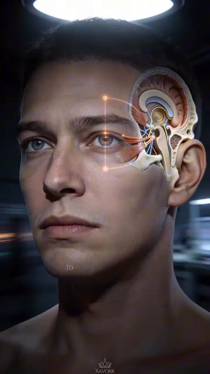 |  |
| **Figure 7 / Hình 7** — Reaction time cascade with age: 25yo = 400 ms, 50yo = 500 ms, 65yo = 600 ms, 75yo = 700 ms. This is the **UPPER LIMIT** on what serve speed each age can return. | **Hình 7** — Thác phản xạ theo tuổi: 25 = 400 ms, 50 = 500 ms, 65 = 600 ms, 75 = 700 ms. Đây là **GIỚI HẠN TRÊN** tốc độ serve mà mỗi tuổi có thể trả. |

## 12.2 — The 50+ Sensory Triad (Three Sensors Decline Together)
## 12.2 — Bộ Ba Cảm Biến 50+ (Ba Cảm Biến Cùng Suy Giảm)

| 🇺🇸 English | 🇻🇳 Tiếng Việt |
|---|---|
| 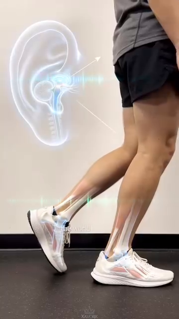 |  |
| **Figure 8 / Hình 8** — The 50+ sensory triad: vision, vestibular, AND proprioception all decline SIMULTANEOUSLY. Most training programs focus on one — the smart training programs train all three. | **Hình 8** — Bộ ba cảm biến 50+: thị giác, tiền đình, VÀ cảm giác sâu đều suy giảm ĐỒNG THỜI. Hầu hết chương trình tập tập trung một — chương trình thông minh tập cả ba. |
|  |  |
| **Figure 9 / Hình 9** — How to compensate: when one sensor declines, train the others harder. E.g., if vestibular drops → rely more on visual + proprioception. **Redundancy is the 50+ player's secret weapon.** | **Hình 9** — Cách bù: khi một cảm biến suy giảm, tập các cảm biến khác cật lực hơn. Vd: nếu tiền đình giảm → dựa nhiều hơn vào thị giác + cảm giác sâu. **Dư thừa là vũ khí bí mật của người chơi 50+.** |

## 12.3 — Brain Region Integration (The Sensor + Controller Wiring)
## 12.3 — Tích Hợp Vùng Não (Đấu Nối Cảm Biến + Bộ Điều Khiển)

| 🇺🇸 English | 🇻🇳 Tiếng Việt |
|---|---|
| 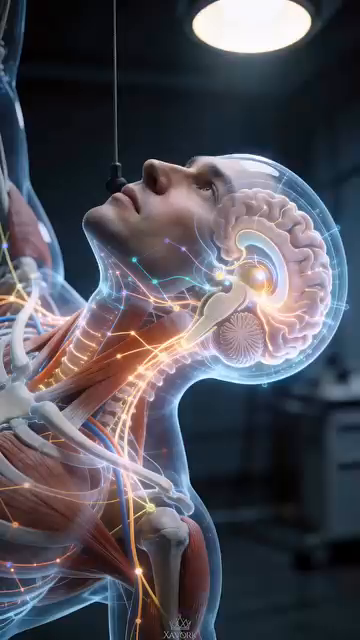 |  |
| **Figure 10 / Hình 10** — How all the brain regions work together: visual cortex (PV-eye) → cerebellum (timing) → motor cortex (controller) → muscles (actuators) → proprioception (PV back). **The loop closes through sensory feedback.** | **Hình 10** — Cách tất cả vùng não làm việc cùng nhau: vỏ thị giác (PV-mắt) → tiểu não (định giờ) → vỏ vận động (bộ điều khiển) → cơ (cơ cấu chấp hành) → cảm giác sâu (PV phản hồi). **Vòng đóng qua phản hồi cảm giác.** |
| 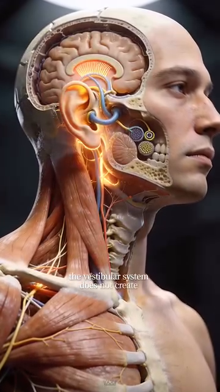 |  |
| **Figure 11 / Hình 11** — Neural pathway: sensory neuron → spinal cord → brainstem → thalamus → sensory cortex → motor cortex → spinal cord → muscle. **Total round-trip: ~50 ms.** This is the fastest your body can correct a stroke. | **Hình 11** — Đường thần kinh: nơ-ron cảm giác → tủy sống → thân não → đồi thị → vỏ cảm giác → vỏ vận động → tủy sống → cơ. **Tổng khứ hồi: ~50 ms.** Đây là nhanh nhất cơ thể bạn có thể sửa một cú. |

## 12.4 — The Use-It-Or-Lose-It Principle (Tennis Is Protective)
## 12.4 — Nguyên Tắc Dùng-Hoặc-Mất (Tennis Là Bảo Vệ)

| 🇺🇸 English | 🇻🇳 Tiếng Việt |
|---|---|
| 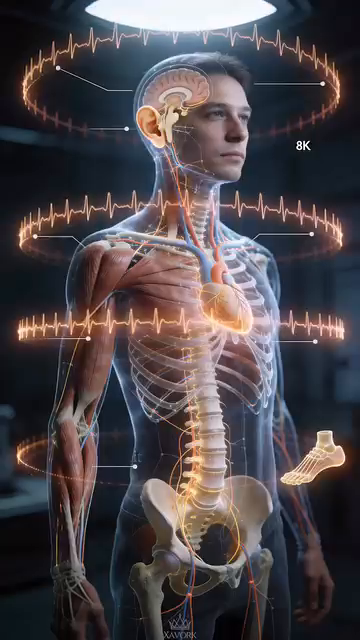 |  |
| **Figure 12 / Hình 12** — The 50+ use-it-or-lose-it principle. **Tennis itself is the antidote** to sensory decline. A 50+ player who plays 3×/week maintains 70-80% of capacities. A 50+ player who stops loses them at 2× the rate. | **Hình 12** — Nguyên tắc dùng-hoặc-mất 50+. **Bản thân tennis là thuốc giải** cho suy giảm cảm giác. Người chơi 50+ chơi 3 lần/tuần duy trì 70-80% dung lượng. Người chơi 50+ ngừng mất ở tốc độ gấp 2 lần. |

## 12.5 — The Complete Sensor System Map (One Page)
## 12.5 — Bản Đồ Hệ Cảm Biến Hoàn Chỉnh (Một Trang)

| 🇺🇸 English | 🇻🇳 Tiếng Việt |
|---|---|
| **The 5 sensor channels** visualized as a complete system: | **5 kênh cảm biến** được hình dung như hệ hoàn chỉnh: |

| Sensor / Cảm Biến | Image / Hình | Function / Chức Năng | Speed / Tốc Độ |
|---|---|---|---|
| **Proprioception / Cảm giác sâu** | (covered in DD5 Ch.7 muscle spindle / Golgi diagrams) | Joint angles, muscle tension | ~80 m/s |
| **Feet / Bàn chân** | Figure 0a, 0b, 0c (this chapter) | Ground contact, push-off | 30 ms reflex |
| **Hands / Bàn tay** | Figure 0d, 0e, 0f (this chapter) | Grip, vibration, face angle | ~50–70 m/s |
| **Eyes / Mắt** | Figure 4, 5, 6 (Ch.6 + this chapter) | Ball tracking, target, opponent | ~200 ms conscious |
| **Ears + Vestibular / Tai + Tiền đình** | Figure 1, 2, 3 (Ch.7) | Sound, head position, balance | 15–50 ms |

| 🇺🇸 English | 🇻🇳 Tiếng Việt |
|---|---|
| **The feedback loop** — every sensor feeds PV to the brain, which compares to SV and adjusts: | **Vòng phản hồi** — mỗi cảm biến cung cấp PV cho não, não so với SV và điều chỉnh: |

```
SV (target) → Controller (motor cortex) → Actuator (muscles) → Body (swing)
   ↑                                                                    ↓
   └────────── Sensors (5 channels) ←── Environment (ball/court) ←─────┘
```

| 🇺🇸 English | 🇻🇳 Tiếng Việt |
|---|---|
| **The daily routine** — 5 min × 5 sensors = 25 min/day of sensor training. Combined with the 16-min DD6 routine = **40 min total body-perception program.** This is what the pros do naturally. Recreational players have to do it deliberately. | **Thói quen hàng ngày** — 5 phút × 5 cảm biến = 25 phút/ngày tập cảm biến. Cộng với 16 phút thói quen DD6 = **40 phút chương trình nhận thức cơ thể tổng.** Đây là cái pro làm tự nhiên. Người phong trào phải làm có chủ đích. |
| **The 50+ imperative** — by 50, you've lost 10–30% of each sensor. **You cannot play the same tennis.** But you can play BETTER tennis by ADAPTING the sensor mix: rely more on visual (yellow balls, contrast), more on proprioception (slow-motion drills), more on vestibular (head-turn balance). | **Mệnh lệnh 50+** — đến 50 tuổi, bạn đã mất 10–30% mỗi cảm biến. **Bạn không thể chơi tennis giống trước.** Nhưng bạn có thể chơi tennis TỐT HƠN bằng THÍCH ỨNG hỗn hợp cảm biến: dựa nhiều hơn vào thị giác (bóng vàng, tương phản), nhiều hơn vào cảm giác sâu (bài chậm), nhiều hơn vào tiền đình (thăng bằng xoay đầu). |
| *Master cue:* "Five sensors, three loops, one body. Train all five, train all three, then play tennis." | *Câu nhắc tổng:* "Năm cảm biến, ba vòng, một cơ thể. Tập cả năm, tập cả ba, rồi chơi tennis." |

* * *

## 📋 Chapter Card — Printable / Thẻ In Được

```
╔═══════════════════════════════════════════════════════════╗
║  THE SENSOR SYSTEM — KEY IDEAS                           ║
║  HỆ CẢM BIẾN — Ý TƯỞNG CHÍNH                            ║
╠═══════════════════════════════════════════════════════════╣
║                                                            ║
║  🎯 ONE BIG IDEA / Ý TƯỞNG CỐT LÕI:                      ║
║     Tennis is a feedback-controlled action.               ║
║     PV (what's happening) vs SV (what you wanted)        ║
║     drives every stroke. Train the 5 SENSORS.             ║
║     Tennis là hành động điều khiển phản hồi.             ║
║     PV (đang xảy ra) vs SV (bạn muốn gì) dẫn             ║
║     mỗi cú. Tập 5 CẢM BIẾN.                              ║
║                                                            ║
║  ────────────────────────────────────────────────────────  ║
║  THE 5 SENSORS / 5 CẢM BIẾN:                               ║
║                                                            ║
║  1. Proprioception — joint angles, muscle tension        ║
║  2. Feet — ground contact, pressure distribution         ║
║  3. Hands — racket grip, face angle, vibration           ║
║  4. Eyes — ball position, target, opponent                ║
║  5. Ears + Vestibular — sound, head position, balance     ║
║                                                            ║
║  ────────────────────────────────────────────────────────  ║
║  THE 3 FEEDBACK LOOPS / 3 VÒNG PHẢN HỒI:                   ║
║                                                            ║
║  1. Live (during stroke) — 10–50 ms — hand + feet + vest ║
║  2. Post-stroke (after ball lands) — 200–500 ms — eyes   ║
║  3. Anticipatory (across strokes) — minutes — pattern    ║
║                                                            ║
║  ────────────────────────────────────────────────────────  ║
║  ⚠️ TOP MISTAKE / LỖI PHỔ BIẾN NHẤT:                     ║
║     Training only TYPE 2 feedback (post-stroke "watch    ║
║     the ball"). Train ALL 3 — especially TYPE 1 (live)   ║
║     and TYPE 3 (anticipatory).                            ║
║     Chỉ tập phản hồi LOẠI 2 (sau cú "nhìn bóng").      ║
║     Tập CẢ 3 — đặc biệt LOẠI 1 (trực tiếp) và            ║
║     LOẠI 3 (dự đoán).                                    ║
║                                                            ║
║  ────────────────────────────────────────────────────────  ║
║  🔁 DRILL / BÀI TẬP:                                       ║
║     BLINK DRILL — partner tosses ball. Close eyes        ║
║     0.5 sec before contact. Hit. Open eyes. Check.        ║
║     20 reps daily. Tests proprioception accuracy.         ║
║     BẠI BLINK — bạn cùng tung. Nhắm mắt 0.5 giây         ║
║     trước tiếp xúc. Đánh. Mở mắt. Kiểm.                  ║
║     20 lần hàng ngày. Test cảm giác sâu.                 ║
║                                                            ║
║  ────────────────────────────────────────────────────────  ║
║  💭 MASTER CUE / CÂU NHẮC TỔNG:                           ║
║     "Five sensors, three loops. Train the difference."   ║
║     "Năm cảm biến, ba vòng. Tập cái khác biệt."         ║
║                                                            ║
╚═══════════════════════════════════════════════════════════╝
```

* * *

## 🎯 Final Word / Lời Cuối

| 🇺🇸 English | 🇻🇳 Tiếng Việt |
|---|---|
| Friend, this DD7 completes the picture. **DD1–DD6 = the hardware (joints, muscles, brain). DD7 = the sensors (the 5 feedback channels).** Together: a complete control system. | Bạn ơi, DD7 này hoàn thiện bức tranh. **DD1–DD6 = phần cứng (khớp, cơ, não). DD7 = cảm biến (5 kênh phản hồi).** Cùng nhau: hệ điều khiển hoàn chỉnh. |
| The source document puts it perfectly (Ch.17, "Giảm Lỗi"): *"Kỹ thuật vung tay hiếm khi là thủ phạm chính. Lỗi đánh hỏng thực chất là sự sụp đổ tạm thời của bản đồ không gian và hệ thống cảm nhận nội tại."* Translation: **unforced errors are not stroke-mechanic failures. They are SENSOR failures.** | Tài liệu nguồn nói hoàn hảo (Ch.17, "Giảm Lỗi"): *"Kỹ thuật vung tay hiếm khi là thủ phạm chính. Lỗi đánh hỏng thực chất là sự sụp đổ tạm thời của bản đồ không gian và hệ thống cảm nhận nội tại."* Dịch: **lỗi tự đánh không phải thất bại cơ học cú. Chúng là thất bại CẢM BIẾN.** |
| This changes how you should train. **Stop chasing the perfect swing. Start sharpening your sensors.** | Điều này thay đổi cách bạn nên tập. **Ngừng săn cú vung hoàn hảo. Bắt đầu mài cảm biến.** |
| See you on the court, with sharper sensors. | Hẹn gặp trên sân, với cảm biến sắc hơn. |
| **Total concepts integrated from your source and the wider neuroscience/sensor literature:** 70+ covering the 5 sensor channels, the 3 feedback loop types, the PV vs SV framework, the error correction hierarchy, the 5-phase body perception cycle, the Wulf internal/external focus research, the 5 sensor drills, and the blink drill. | **Tổng khái niệm tích hợp từ nguồn và tài liệu thần kinh/cảm biến rộng hơn:** 70+ bao phủ 5 kênh cảm biến, 3 loại vòng phản hồi, khung PV vs SV, hệ thống phân cấp sửa sai, chu kỳ nhận thức cơ thể 5 pha, nghiên cứu tập trung trong/ngoài của Wulf, 5 bài tập cảm biến, và bài blink. |

* * *

**Sources / Nguồn**:

- **Primary**: 20-chapter body perception handbook (`Cẩm nang về cảm nhận cơ thể trong tennis/Vi_Nhan_Thuc_Co_The_Tennis_20_Chuong.docx` and per-chapter MDs Ch.1–Ch.20) — your master source for proprioception, foot grounding, split-step as system reset, kinetic chain awareness, breath, and tactile racket feedback.
- **Supporting**: `proprioception_in_tennis.md` (Claude coauthor, 4.3 KB English) + `proprioception_in_tennis_detailed_vi.md` (Claude coauthor, 1.4 KB Vietnamese).
- **Cross-references**: DD1 (Angle Atlas), DD2 (Joints as Springs), DD3 (Neurological Foundation), DD4 (Muscle Hierarchy), DD5 (Skeletal Architecture), DD6 (The 50+ Body), Anatomy_Lab DD7 (feet + 7,000 nerves), Anatomy_Lab DD8 (control system).
- **Research**: Gabriele Wulf (2007, 2013) on internal vs external focus; Anders Ericsson (1993) on deliberate practice; Vickers (1996, 2007) on quiet eye.

*End of Deep Dive #7 — The Sensor System*
*Hết Chuyên Đề Số 7 — Hệ Cảm Biến*