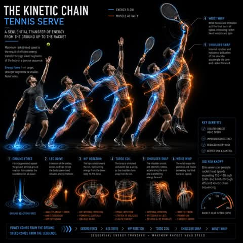

# A new tool to analyze the player's stroke technique.

**📅 Thứ Sáu 29/05/2026 10:27**

A new tool to analyze the player's stroke technique.

https://tennisbio-r4vnufqh.manus.space/

Key Features:

## Show the theory of a tennis stroke production with details on the spacing and racket angle management.

## Professional Stroke Analysis Added

Each section now includes:

**Lens 1 (Geometry):** Four-phase breakdown with contact height, distance, and positioning details
**Lens 2 (Compatibility):** Grip mechanics analysis showing natural face angle production without compensation
**Lens 3 (Kinetic Chain):** Millisecond-by-millisecond sequencing from ground connection to racket head whip
**Lens 4 (Swing Path):** Detailed mechanics of topspin production with brush contact analysis
**Lens 5 (Margin):** Tolerance parameters showing how elite strokes absorb errors

Each analysis includes specific measurements, timing data, and key takeaways for coaching application.

---

1. **Add Interactive Measurement Tool:** Create overlays showing specific angles (elbow angle, hip-shoulder separation, racket face angle) that users can toggle on/off to visualize biomechanical parameters.

2. **Build Common Mistakes Library:** Add a section comparing correct vs incorrect execution for each lens, highlighting where compensatory movements occur and their consequences.

3. **Create Coaching Checklist:** Generate downloadable PDF checklists for each analytical lens that coaches can use during on-court analysis sessions with players.

## Interactive Measurement Tool

I've added a comprehensive interactive biomechanical measurement tool featuring six toggleable overlays with color-coded visualizations. Users can select stroke types (forehand/backhand/serve) and toggle individual measurements on/off to see elbow angle, hip-shoulder separation, racket face angle, arm extension, knee bend, and contact height displayed on an SVG player figure. Includes optimal measurement ranges for elite execution and Show/Hide All functionality.

---

## Stroke Comparison Mode: Enable side-by-side visualization of two different strokes simultaneously, with synchronized overlay toggling to compare biomechanical differences between forehand and backhand, or professional vs amateur execution.

**Create Measurement Recording Tool:** Allow coaches to input their own player's measurements and see how they compare against the optimal ranges, with visual indicators (green/yellow/red) showing if values are within, near, or outside acceptable ranges.

**Build PDF Export for Analysis:** Generate downloadable reports showing selected measurement overlays with annotations, allowing coaches to create personalized analysis documents for player feedback and progress tracking.

Stroke Comparison Mode Implemented

Added a comprehensive side-by-side stroke comparison tool with dual SVG visualizations, synchronized measurement overlays, and a detailed comparison table. Users can select any combination of strokes (forehand/backhand/serve, elite/amateur) and toggle overlays to display simultaneously on both figures. The comparison table shows measurements with color-coded differences, and analysis insights explain key biomechanical distinctions between strokes.

