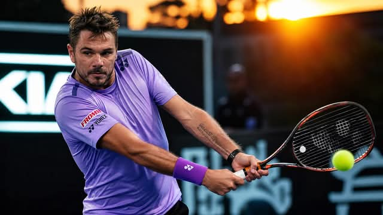

# Comprehensive Biomechanical Analysis of the "Effortless Strike System"

**📅 Thứ Bảy 30/05/2026 08:43**

Comprehensive Biomechanical Analysis of the "Effortless Strike System"

Introduction
This report provides a comprehensive biomechanical analysis of the user's personal "Effortless Strike System" for tennis, integrating principles of neurological control theory, structural setpoints, and kinetic chain mechanics. The user's notes reveal a sophisticated understanding of tennis technique, moving beyond conventional instruction to a holistic system focused on structural integrity, efficient force transfer, and cognitive automation. This analysis will deconstruct the system's core tenets, compare them against established biomechanical and neurological models, and offer insights for further refinement and application.

Foundational Concepts
Kinetic Chain Principles
The user's system implicitly leverages several key kinetic chain principles, emphasizing the proximal-to-distal sequencing of power generation and transfer. The concept of the racquet as an extension of the arm, and the body rotating around the spine, aligns with the idea that power originates from larger, more powerful muscle groups (legs, hips, core) and transfers efficiently to smaller, more agile segments (arm, wrist, racket) [1]. The instruction to "whip instead of push" directly reflects the goal of maximizing racket head speed through sequential acceleration rather than brute force.

Tensegrity in Tennis Biomechanics
The user's emphasis on "ALWAYS HAVE TENSION BETWEEN ADJACENT JOINTS" (hip, shoulder, elbow, wrist, and racket) strongly resonates with the concept of tensegrity[2]. Tensegrity, a portmanteau of "tensional integrity," describes structural principles where discontinuous compressive elements are balanced by continuous tensional elements, creating a stable yet flexible system. In the human body, bones act as compressive elements, while muscles, tendons, ligaments, and fascia provide continuous tension. The user's 
instruction to "press" and "press racquet head down" suggests a deliberate pre-loading of the fascial and muscular system to store elastic energy, which is then released through rotation, rather than relying solely on muscular contraction. This creates a stable yet dynamic structure, allowing for efficient energy transfer and responsiveness [2].

The 45-Degree Plane and BIC Contact Point
The user's concept of the "45° SWING" and aiming for the "BIC (Bottom Inside Corner)" at contact aligns with advanced tennis biomechanics, particularly the "Nonlinear Tennis" system proposed by Jack Broudy [3]. The 45-degree angle is described as the bisection of the horizontal and vertical planes, representing a point of optimal control and power. By aligning the body and racket to this plane, the player can achieve a consistent and efficient contact point without actively "steering" the ball. The instruction to move "forward & to the left side of the ball" for a right-handed player further supports the idea of positioning the body to naturally meet the ball within this optimal 45-degree plane, facilitating an inside-to-outside, low-to-high swing path for topspin [3].

Structural Setpoints
The user's notes highlight several critical structural setpoints, though not explicitly named as such. These can be mapped to the framework provided in the structural-setpoints-guide.md.

Ready Position: The Foundation of Tensegrity
The detailed description of the "Ready Position" (Vietnamese: "Đầu ngang cao, xương sống thẳng, ngực và vai nhô ra trước, hông và mông lùi ra sau, chân hơi khuỵu") directly corresponds to the foundational setpoints of Neutral Spine and Deep Hip Flexion (Tọa Kua) [4]. The instruction to "compress against the back" when loading further reinforces the concept of engaging the posterior chain and creating a stable, pre-loaded structure ready for dynamic movement. This athletic posture ensures spinal alignment, loads elastic energy in the hips, and lowers the center of gravity for stability and responsiveness [4].

The Left Arm: Steering Wheel and Frame
The user repeatedly emphasizes the role of the non-dominant (left) arm, describing it as "high to anchor" in the run-around forehand, and forming a "frame / plane" with the shoulders in the open stance. This aligns with the Non-Dominant Arm Position setpoint, which highlights its role in reducing the moment of inertia for faster torso rotation, creating counter-rotation for energy transfer, and maintaining spinal stability [4]. The left arm acts as a crucial counterbalance and a proprioceptive anchor, allowing the hitting shoulder to rotate efficiently and preventing the player from "arming" the shot.

Grip Force Pairs: Hand Tensegrity
The user's detailed breakdown of grip mechanics, particularly the "force pairs" in the Continental and Semi-Western grips, demonstrates an intuitive understanding of hand tensegrity. Instead of merely describing where to place knuckles, the user identifies active forces (e.g., "thumb presses down from the top, three fingers lift from below" for Continental; "index drives, others counter" for Semi-Western). This ensures a stable racket face at contact, allowing the racket to become an integrated extension of the arm, consistent with the "long axis in line with the arm" principle [4].

Neurological Control Breakdown
The user's philosophy, particularly the statement that the "brain will be freed from the stroke execution details to analyze, strategize and control the match's momentum," directly reflects the concept of motor skill automation within the neurological control framework [1].

From Conscious Intent to Automated Execution
Initially, learning a stroke involves Layer 1 (High-Level Intent) and Layer 2 (Execution & Refinement), where conscious attention is paid to grip, body position, and swing path. However, the user's system aims to shift these details to Layer 3 (Automated Patterns), where Central Pattern Generators (CPGs) and learned motor programs in the spinal cord generate basic rhythmic movements (like torso rotation and arm extension) without direct cortical input. This frees up the higher brain centers (Prefrontal & Motor Cortex) to focus on Layer 1 (Intent) – tactical planning, opponent analysis, and match strategy – rather than the mechanics of the stroke itself [1].

Sensorimotor Feedback for Refinement
While the goal is automation, Layer 4 (Sensorimotor Feedback) remains crucial. The continuous real-time monitoring of body position, movement, and balance through proprioceptors and the vestibular system allows for subtle, unconscious adjustments. The user's emphasis on "tension between adjacent joints" and the "feel" of the racket becoming one with the arm enhances proprioceptive feedback, enabling the body to self-correct and refine movements without conscious intervention [1].

Performance Variations and Common Errors
Grip Variations and Their Biomechanical Implications
The user's analysis of Continental and Semi-Western grips, focusing on force pairs, provides a functional understanding of how different grips facilitate different shot types. The Continental grip, with its balanced force application, is ideal for volleys, slices, and serves where a stable, firm racket face is paramount. The Semi-Western grip, with its driving and resisting forces, enables the lag and whip necessary for heavy topspin forehands, where the racket face naturally closes through rotation [4].

Common Errors and "Watch-Outs"
The user identifies several potential pitfalls in their own system, which align with common errors in tennis biomechanics:

• Over-reliance on "pulling the racquet into the body CoG": While intended to keep contact connected, it can lead to pulling in too early, hindering extension through the contact point. The correct application involves setting the hand close during preparation and then extending out through contact [4].
    • Over-equalizing forces in the Semi-Western grip: Excessive resistance can lead to a stiff wrist, negating the desired "whip" effect. A balance, perhaps 70% driving force and 30% resistance, is crucial to maintain fluidity and racket head speed [4].
    • Misinterpretation of "Always press the racquet head down": While beneficial for creating tension and pre-loading, overdoing it can lock the wrist and inhibit the whip. A "light press" is key to maintaining dynamic tension without rigidity [4].
    • Inaccurate contact point for high balls: The "BIC" concept is highly effective for low-to-mid balls. For high balls, the contact point will naturally be closer to the back-center of the ball, assuming height adjustment comes from leg drive rather than hand manipulation [3].

Training Framework
Based on the user's "Effortless Strike System" and the biomechanical principles discussed, a training framework can be developed to optimize skill acquisition and performance.

Phase 1: Foundational Tensegrity and Ready Position
Focus on establishing the core structural setpoints:
    • Neutral Spine and Tọa Kua: Practice the ready position, emphasizing hip hinge, straight spine, and engagement of the posterior chain. Use cues like "sit back into your hips as if settling into a chair, but keep your torso upright" [4].
    • Joint Tension: Develop the "tension between adjacent joints" feel through slow, deliberate movements, ensuring no loose links in the kinetic chain. This builds proprioceptive awareness of the body as a connected unit.

Phase 2: Grip Mechanics and Force Application
    • Grip Force Pairs: Practice the specific force applications for Continental and Semi-Western grips, focusing on the balance between driving and resisting forces to stabilize the racket face. Use drills that isolate hand and forearm movements to feel the whip effect.
    • Non-Dominant Arm Integration: Incorporate drills that emphasize the role of the left arm in setting the frame, anchoring, and counterbalancing, especially during unit turn and rotation.

Phase 3: Rotational Power and the 45-Degree Plane
    • Torso Rotation: Focus on generating power primarily through torso rotation, with the arm extending naturally. Use drills that minimize arm-only swinging and emphasize the body's rotational axis.
    • 45-Degree Alignment: Practice positioning the body to meet the ball within the 45-degree plane, allowing the racket to travel on its natural low-to-high path. Use visual cues to aim for the BIC contact point, adjusting body height with the legs rather than manipulating the racket face.

Phase 4: Automation and Tactical Focus
    • Repetition and Feedback: Engage in high-repetition drills to ingrain the correct motor patterns, allowing the stroke mechanics to shift from conscious control to automated patterns. Utilize external feedback (e.g., video analysis) to refine technique without over-thinking during play.
    • Strategic Play: Once mechanics are automated, shift cognitive focus to tactical decision-making, court awareness, and opponent analysis, leveraging the "freed brain" for match control.

Conclusion
The user's "Effortless Strike System" represents a sophisticated, integrated approach to tennis biomechanics. By intuitively combining principles of tensegrity, kinetic chain sequencing, and neurological automation, the system aims to create a powerful, efficient, and cognitively unburdened stroke. The detailed analysis of grip force pairs, the emphasis on joint tension, and the understanding of the 45-degree plane and BIC contact point demonstrate a deep, functional understanding of tennis movement. Further refinement through structured training, focusing on foundational setpoints and progressive automation, can help unlock the full potential of this insightful system.

References
[1] Kandel, E. R., Schwartz, J. H., & Jessell, T. M. (2013). Principles of Neural Science (5th ed.). McGraw-Hill. (Referenced from neurological-control-framework.md)
[2] Thomas Myers - Tensegrity Applied to Human Biomechanics. (n.d.). Retrieved fromhttps://www.youtube.com/watch?v=xzX-PeU_MTo [3] Broudy, J. W. (n.d.). The 45 degree Angle: It’s Role in The Secret Game. TennisOne. Retrieved from https://tennisone.tennisplayer.net/content/Theories/theories.broudy/broudy.p.4/broudy.p.4.php [4] Structural Setpoints Guide for Tennis Biomechanics. (n.d.). (Referenced from structural-setpoints-guide.md)

==========================================

Phân Tích Cơ Sinh Học Toàn Diện Hệ Thống "Đánh Không Tốn Sức" (Effortless Strike System)

Giới Thiệu
Báo cáo này cung cấp phân tích cơ sinh học toàn diện về "Hệ Thống Đánh Không Tốn Sức" cá nhân của người dùng trong quần vợt, tích hợp các nguyên tắc lý thuyết kiểm soát thần kinh, các điểm đặt cấu trúc (structural setpoints) và cơ chế chuỗi động học (kinetic chain). Các ghi chú của người dùng cho thấy sự hiểu biết sâu sắc về kỹ thuật quần vợt, vượt ra ngoài hướng dẫn thông thường để tạo thành một hệ thống toàn diện tập trung vào tính toàn vẹn cấu trúc, truyền lực hiệu quả và tự động hóa nhận thức. Phân tích này sẽ giải mã các nguyên lý cốt lõi của hệ thống, so sánh chúng với các mô hình cơ sinh học và thần kinh đã được thiết lập, đồng thời đưa ra những hiểu biết sâu sắc để tinh chỉnh và ứng dụng thêm.

Các Khái Niệm Nền Tảng
Nguyên Lý Chuỗi Động Học (Kinetic Chain Principles)
Hệ thống của người dùng ngầm tận dụng một số nguyên tắc chuỗi động học quan trọng, nhấn mạnh trình tự từ gần đến xa (proximal-to-distal sequencing) của việc tạo và truyền lực. Khái niệm vợt là một phần mở rộng của cánh tay, và cơ thể xoay quanh cột sống, phù hợp với ý tưởng rằng lực bắt nguồn từ các nhóm cơ lớn hơn, mạnh hơn (chân, hông, cơ lõi) và truyền hiệu quả đến các phân đoạn nhỏ hơn, linh hoạt hơn (cánh tay, cổ tay, vợt) [1]. Hướng dẫn "quật roi thay vì đẩy" phản ánh trực tiếp mục tiêu tối đa hóa tốc độ đầu vợt thông qua gia tốc tuần tự thay vì dùng sức mạnh thô bạo.

Tính Toàn Vẹn Căng (Tensegrity) trong Cơ Sinh Học Quần Vợt
Người dùng nhấn mạnh "LUÔN CÓ SỰ CĂNG GIỮA CÁC KHỚP KỀ NHAU" (hông, vai, khuỷu tay, cổ tay và vợt) cộng hưởng mạnh mẽ với khái niệm tensegrity [2]. Tensegrity, một từ ghép của "tensional integrity" (tính toàn vẹn căng), mô tả các nguyên tắc cấu trúc trong đó các yếu tố nén không liên tục được cân bằng bởi các yếu tố căng liên tục, tạo ra một hệ thống ổn định nhưng linh hoạt. Trong cơ thể người, xương đóng vai trò là yếu tố nén, trong khi cơ bắp, gân, dây chằng và cân mạc cung cấp lực căng liên tục. Hướng dẫn của người dùng về việc "ấn" và "ấn đầu vợt xuống" cho thấy sự tải trước có chủ ý của hệ thống cân mạc và cơ bắp để lưu trữ năng lượng đàn hồi, sau đó được giải phóng thông qua chuyển động xoay, thay vì chỉ dựa vào sự co cơ. Điều này tạo ra một cấu trúc ổn định nhưng năng động, cho phép truyền năng lượng hiệu quả và khả năng phản ứng [2].

Mặt Phẳng 45 Độ và Điểm Tiếp Xúc BIC
Khái niệm "VUNG VỢT 45°" và nhắm vào "BIC (Góc Dưới Bên Trong)" tại điểm tiếp xúc của người dùng phù hợp với cơ sinh học quần vợt tiên tiến, đặc biệt là hệ thống "Quần Vợt Phi Tuyến" (Nonlinear Tennis) do Jack Broudy đề xuất [3]. Góc 45 độ được mô tả là đường phân giác của mặt phẳng ngang và dọc, đại diện cho một điểm kiểm soát và lực tối ưu. Bằng cách căn chỉnh cơ thể và vợt theo mặt phẳng này, người chơi có thể đạt được điểm tiếp xúc nhất quán và hiệu quả mà không cần chủ động "điều khiển" bóng. Hướng dẫn di chuyển "tiến lên & sang bên trái của bóng" đối với người chơi thuận tay phải càng hỗ trợ ý tưởng định vị cơ thể để tự nhiên gặp bóng trong mặt phẳng 45 độ tối ưu này, tạo điều kiện cho đường vung vợt từ trong ra ngoài, từ thấp đến cao để tạo xoáy lên (topspin) [3].

Các Điểm Đặt Cấu Trúc (Structural Setpoints)
Các ghi chú của người dùng làm nổi bật một số điểm đặt cấu trúc quan trọng, mặc dù không được đặt tên rõ ràng như vậy. Chúng có thể được ánh xạ vào khuôn khổ được cung cấp trong structural-setpoints-guide.md.

Tư Thế Chuẩn Bị (Ready Position): Nền Tảng của Tensegrity
Mô tả chi tiết về "Tư Thế Chuẩn Bị" (tiếng Việt: "Đầu ngang cao, xương sống thẳng, ngực và vai nhô ra trước, hông và mông lùi ra sau, chân hơi khuỵu") tương ứng trực tiếp với các điểm đặt nền tảng của Cột Sống Trung Tính (Neutral Spine) và Gập Hông Sâu (Deep Hip Flexion - Tọa Kua) [4]. Hướng dẫn "nén vào lưng" khi tải lực càng củng cố khái niệm kích hoạt chuỗi sau và tạo ra một cấu trúc ổn định, được tải trước sẵn sàng cho chuyển động năng động. Tư thế thể thao này đảm bảo căn chỉnh cột sống, tải năng lượng đàn hồi ở hông và hạ thấp trọng tâm để ổn định và phản ứng [4].

Cánh Tay Trái: Vô Lăng và Khung
Người dùng liên tục nhấn mạnh vai trò của cánh tay không thuận (trái), mô tả nó là "neo cao" trong cú thuận tay chạy vòng và tạo thành một "khung / mặt phẳng" với vai trong tư thế mở. Điều này phù hợp với điểm đặt Vị Trí Cánh Tay Không Thuận (Non-Dominant Arm Position), làm nổi bật vai trò của nó trong việc giảm mô men quán tính để xoay thân nhanh hơn, tạo ra phản xoay để truyền năng lượng và duy trì sự ổn định của cột sống [4]. Cánh tay trái đóng vai trò là đối trọng quan trọng và điểm neo cảm thụ bản thể, cho phép vai đánh xoay hiệu quả và ngăn người chơi "dùng sức cánh tay" để đánh bóng.

Cặp Lực Cầm Vợt: Tensegrity Bàn Tay
Phân tích chi tiết của người dùng về cơ chế cầm vợt, đặc biệt là "cặp lực" trong các kiểu cầm Continental và Semi-Western, thể hiện sự hiểu biết trực quan về tensegrity của bàn tay. Thay vì chỉ mô tả vị trí đặt các khớp ngón tay, người dùng xác định các lực tác động (ví dụ: "ngón cái ấn xuống từ trên, ba ngón tay nâng lên từ dưới" đối với Continental; "ngón trỏ dẫn động, các ngón khác đối trọng" đối với Semi-Western). Điều này đảm bảo mặt vợt ổn định tại điểm tiếp xúc, cho phép vợt trở thành một phần mở rộng tích hợp của cánh tay, phù hợp với nguyên tắc "trục dài thẳng hàng với cánh tay" [4].

Phân Tích Kiểm Soát Thần Kinh
Triết lý của người dùng, đặc biệt là tuyên bố rằng "bộ não sẽ được giải phóng khỏi các chi tiết thực hiện cú đánh để phân tích, lập chiến lược và kiểm soát động lực trận đấu," phản ánh trực tiếp khái niệm tự động hóa kỹ năng vận động trong khuôn khổ kiểm soát thần kinh [1].

Từ Ý Định Có Ý Thức đến Thực Hiện Tự Động
Ban đầu, việc học một cú đánh liên quan đến Lớp 1 (Ý Định Cấp Cao) và Lớp 2 (Thực Hiện & Tinh Chỉnh), nơi sự chú ý có ý thức được dành cho cách cầm vợt, vị trí cơ thể và đường vung vợt. Tuy nhiên, hệ thống của người dùng nhằm mục đích chuyển các chi tiết này sang Lớp 3 (Các Mẫu Tự Động), nơi các Bộ Tạo Mẫu Trung Tâm (CPG) và các chương trình vận động đã học trong tủy sống tạo ra các chuyển động nhịp điệu cơ bản (như xoay thân và duỗi cánh tay) mà không cần đầu vào trực tiếp từ vỏ não. Điều này giải phóng các trung tâm não cao hơn (Vỏ Não Trước Trán & Vỏ Não Vận Động) để tập trung vào Lớp 1 (Ý Định) – lập kế hoạch chiến thuật, phân tích đối thủ và chiến lược trận đấu – thay vì cơ chế của chính cú đánh [1].

Phản Hồi Cảm Giác Vận Động để Tinh Chỉnh
Mặc dù mục tiêu là tự động hóa, Lớp 4 (Phản Hồi Cảm Giác Vận Động) vẫn rất quan trọng. Việc theo dõi liên tục, theo thời gian thực về vị trí cơ thể, chuyển động và thăng bằng thông qua các thụ thể cảm thụ bản thể và hệ thống tiền đình cho phép điều chỉnh tinh tế, vô thức. Việc người dùng nhấn mạnh "sự căng giữa các khớp kề nhau" và "cảm giác" vợt trở thành một thể thống nhất với cánh tay giúp tăng cường phản hồi cảm giác bản thể, cho phép cơ thể tự điều chỉnh và tinh chỉnh chuyển động mà không cần sự can thiệp có ý thức [1].

Các Biến Thể Hiệu Suất và Lỗi Thường Gặp
Các Biến Thể Cầm Vợt và Ý Nghĩa Cơ Sinh Học của Chúng
Phân tích của người dùng về các kiểu cầm Continental và Semi-Western, tập trung vào các cặp lực, cung cấp sự hiểu biết chức năng về cách các kiểu cầm khác nhau tạo điều kiện cho các loại cú đánh khác nhau. Kiểu cầm Continental, với việc áp dụng lực cân bằng, lý tưởng cho các cú vô lê, cắt bóng và giao bóng, nơi mặt vợt ổn định, chắc chắn là tối quan trọng. Kiểu cầm Semi-Western, với các lực dẫn động và đối trọng, cho phép tạo độ trễ và hiệu ứng quật roi cần thiết cho các cú thuận tay xoáy lên mạnh, nơi mặt vợt tự nhiên đóng lại thông qua chuyển động xoay [4].

Các Lỗi Thường Gặp và "Những Điều Cần Lưu Ý"
Người dùng xác định một số cạm bẫy tiềm ẩn trong hệ thống của riêng họ, phù hợp với các lỗi thường gặp trong cơ sinh học quần vợt:

• Quá phụ thuộc vào việc "kéo vợt vào trọng tâm cơ thể (CoG)": Mặc dù nhằm mục đích giữ điểm tiếp xúc được kết nối, nhưng nó có thể dẫn đến việc kéo vào quá sớm, cản trở việc duỗi thẳng qua điểm tiếp xúc. Ứng dụng đúng đắn bao gồm việc đặt bàn tay gần trọng tâm trong quá trình chuẩn bị và sau đó duỗi ra qua điểm tiếp xúc [4].
    • Quá cân bằng lực trong kiểu cầm Semi-Western: Sự đối trọng quá mức có thể dẫn đến cổ tay cứng, làm mất đi hiệu ứng "quật roi" mong muốn. Sự cân bằng, có lẽ 70% lực dẫn động và 30% lực đối trọng, là rất quan trọng để duy trì sự linh hoạt và tốc độ đầu vợt [4].
    • Hiểu sai về "Luôn ấn đầu vợt xuống": Mặc dù có lợi cho việc tạo độ căng và tải trước, nhưng việc lạm dụng có thể làm cứng cổ tay và ức chế hiệu ứng quật roi. Một "lực ấn nhẹ" là chìa khóa để duy trì độ căng động mà không bị cứng nhắc [4].
    • Điểm tiếp xúc không chính xác cho bóng cao: Khái niệm "BIC" rất hiệu quả cho bóng thấp đến trung bình. Đối với bóng cao, điểm tiếp xúc tự nhiên sẽ gần tâm sau của bóng hơn, giả sử việc điều chỉnh độ cao đến từ lực đẩy của chân chứ không phải thao tác bằng tay [3].

Khung Huấn Luyện
Dựa trên "Hệ Thống Đánh Không Tốn Sức" của người dùng và các nguyên tắc cơ sinh học đã thảo luận, một khung huấn luyện có thể được phát triển để tối ưu hóa việc tiếp thu kỹ năng và hiệu suất.

Giai Đoạn 1: Tensegrity Nền Tảng và Tư Thế Chuẩn Bị
Tập trung vào việc thiết lập các điểm đặt cấu trúc cốt lõi:
    • Cột Sống Trung Tính và Tọa Kua: Thực hành tư thế chuẩn bị, nhấn mạnh gập hông, cột sống thẳng và kích hoạt chuỗi sau. Sử dụng các tín hiệu như "ngồi lùi vào hông như thể đang ngồi vào ghế, nhưng giữ thân thẳng đứng" [4].
    • Độ Căng Khớp: Phát triển cảm giác "độ căng giữa các khớp kề nhau" thông qua các chuyển động chậm, có chủ ý, đảm bảo không có liên kết lỏng lẻo trong chuỗi động học. Điều này xây dựng nhận thức cảm thụ bản thể về cơ thể như một đơn vị kết nối.

Giai Đoạn 2: Cơ Chế Cầm Vợt và Áp Dụng Lực
    • Cặp Lực Cầm Vợt: Thực hành các ứng dụng lực cụ thể cho các kiểu cầm Continental và Semi-Western, tập trung vào sự cân bằng giữa các lực dẫn động và đối trọng để ổn định mặt vợt. Sử dụng các bài tập cô lập chuyển động của bàn tay và cẳng tay để cảm nhận hiệu ứng quật roi.
    • Tích Hợp Cánh Tay Không Thuận: Kết hợp các bài tập nhấn mạnh vai trò của cánh tay trái trong việc thiết lập khung, neo và đối trọng, đặc biệt trong quá trình xoay người và xoay thân.

Giai Đoạn 3: Lực Xoay và Mặt Phẳng 45 Độ
    • Xoay Thân: Tập trung vào việc tạo lực chủ yếu thông qua xoay thân, với cánh tay duỗi ra tự nhiên. Sử dụng các bài tập giảm thiểu việc chỉ vung cánh tay và nhấn mạnh trục xoay của cơ thể.
    • Căn Chỉnh 45 Độ: Thực hành định vị cơ thể để gặp bóng trong mặt phẳng 45 độ, cho phép vợt di chuyển trên đường từ thấp đến cao tự nhiên của nó. Sử dụng các tín hiệu trực quan để nhắm vào điểm tiếp xúc BIC, điều chỉnh độ cao cơ thể bằng chân thay vì thao tác mặt vợt.

Giai Đoạn 4: Tự Động Hóa và Tập Trung Chiến Thuật
    • Lặp Lại và Phản Hồi: Tham gia vào các bài tập lặp lại cao để ghi nhớ các mẫu vận động chính xác, cho phép cơ chế cú đánh chuyển từ kiểm soát có ý thức sang các mẫu tự động. Sử dụng phản hồi bên ngoài (ví dụ: phân tích video) để tinh chỉnh kỹ thuật mà không cần suy nghĩ quá nhiều trong khi chơi.
    • Chơi Chiến Lược: Khi cơ chế đã được tự động hóa, chuyển trọng tâm nhận thức sang việc ra quyết định chiến thuật, nhận thức sân đấu và phân tích đối thủ, tận dụng "bộ não được giải phóng" để kiểm soát trận đấu.

Kết Luận
Hệ thống "Đánh Không Tốn Sức" của người dùng đại diện cho một cách tiếp cận tinh vi, tích hợp đối với cơ sinh học quần vợt. Bằng cách kết hợp trực giác các nguyên tắc tensegrity, trình tự chuỗi động học và tự động hóa thần kinh, hệ thống nhằm mục đích tạo ra một cú đánh mạnh mẽ, hiệu quả và không bị gánh nặng nhận thức. Phân tích chi tiết về các cặp lực cầm vợt, sự nhấn mạnh vào độ căng khớp và sự hiểu biết về mặt phẳng 45 độ và điểm tiếp xúc BIC thể hiện sự hiểu biết sâu sắc, chức năng về chuyển động quần vợt. Việc tinh chỉnh thêm thông qua huấn luyện có cấu trúc, tập trung vào các điểm đặt nền tảng và tự động hóa lũy tiến, có thể giúp khai thác toàn bộ tiềm năng của hệ thống sâu sắc này.

Tài Liệu Tham Khảo
[1] Kandel, E. R., Schwartz, J. H., & Jessell, T. M. (2013). Principles of Neural Science (5th ed.). McGraw-Hill. (Tham khảo từ neurological-control-framework.md)
[2] Thomas Myers - Tensegrity Applied to Human Biomechanics. (n.d.). Truy cập từhttps://www.youtube.com/watch?v=xzX-PeU_MTo [3] Broudy, J. W. (n.d.). The 45 degree Angle: It’s Role in The Secret Game. TennisOne. Truy cập từ https://tennisone.tennisplayer.net/content/Theories/theories.broudy/broudy.p.4/broudy.p.4.php [4] Structural Setpoints Guide for Tennis Biomechanics. (n.d.). (Tham khảo từ structural-setpoints-guide.md)

