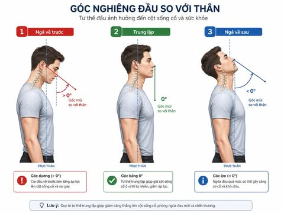

# HEAD POSITION IN POSTURAL CONTROL MECHANISMS

**📅 Thứ Hai 01/06/2026 05:20**

HEAD POSITION IN POSTURAL CONTROL MECHANISMS 
https://balancemanual-bp673ycd.manus.space/

The human balance system is a complex network that integrates sensory signals to maintain the Center of Gravity (COG) over the base of support. Head position serves as a strategic "node" in this network, as it houses the primary sensory organs: the vestibular system and the visual system.

DOWNLOAD PDF FILE HERE: https://drive.google.com/file/d/1gi2bJYBSZBizMkyxd-IRzLIFdOdOzSk-/view?usp=sharing

GIỮ VỊ TRÍ ĐẦU TRONG CÂN BẰNG CƠ THỂ

Hướng dẫn này cung cấp một cái nhìn sâu sắc và toàn diện về mối quan hệ phức tạp giữa vị trí đầu và khả năng duy trì thăng bằng của cơ thể. Dựa trên các nguyên lý khoa học về hệ thống tiền đình, phản xạ tiền đình-mắt (VOR) và cơ chế tích hợp cảm giác của não bộ, tài liệu này sẽ phân tích cách thức mà góc nghiêng của đầu ảnh hưởng đến các tín hiệu cảm giác, quyết định tư thế và phản ứng vận động của cơ thể. Mục tiêu là trang bị cho người đọc kiến thức chuyên sâu để tối ưu hóa thăng bằng trong các hoạt động thể thao, phục hồi chức năng và cuộc sống hàng ngày.

https://drive.google.com/file/d/1X7KyJg6r-a2H27GoMS8bmXA7DE_FRCMA/view?usp=sharing

