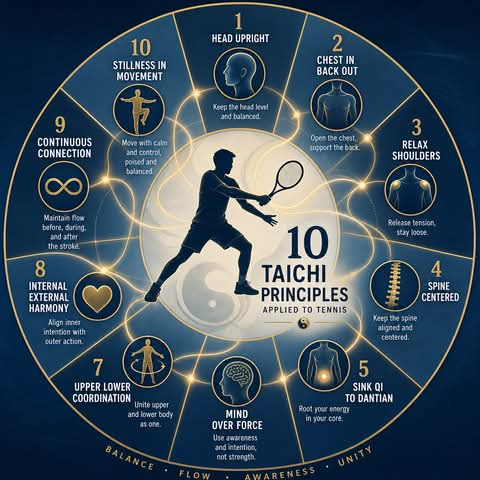

# THÁI CỰC QUYỀN VÀ TENNIS:

**📅 Thứ Hai 01/06/2026 07:09**

THÁI CỰC QUYỀN VÀ TENNIS:

Thái Cực Quyền phát triển từ triết học Đạo gia và được truyền tụng qua nhiều thế hệ, với dòng họ Dương (Yang Family) là một trong những trường phái nổi tiếng nhất. Khác với các môn võ ngoại phát như Thiếu Lâm tập trung vào sức mạnh thô bạo, Thái Cực Quyền nhấn mạnh:

- Sự mềm mại và uyển chuyển (softness and fluidity)
- Khí lực và nội lực (internal energy and power)
- Cân bằng giữa động và tĩnh (balance between movement and stillness)
- Hài hòa giữa nội và ngoại (harmony between internal and external)

Những nguyên lý này không chỉ áp dụng cho võ thuật mà còn có giá trị sâu sắc cho các môn thể thao hiện đại như tennis.

1. Tại Sao Thái Cực Quyền Liên Quan Đến Tennis?

Tennis là một môn thể thao yêu cầu:
- Chính xác cao - cần kiểm soát tinh tế của chuyển động
- Sức mạnh hiệu quả - không phải sức mạnh tuyệt đối mà là sức mạnh được truyền tải hiệu quả
- Tính linh hoạt - phải thích ứng nhanh chóng với các tình huống khác nhau
- Sự ổn định - duy trì cân bằng trong các chuyển động nhanh chóng

Thái Cực Quyền cung cấp một khung lý thuyết để tối ưu hóa tất cả những yếu tố này thông qua hiểu biết sâu sắc về kiểm soát thần kinh-cơ sinh học.

2. Phân tích 10 yếu tố quan trọng trong Thái Cực Quyền và áp dụng vào tennis.

1. Hư Linh Đỉnh Kình: Đầu phải ngay thẳng, tinh thần tập trung, không gồng cứng cổ. Điều này giúp khí huyết lưu thông, tinh thần minh mẫn.
2. Hàm Hung Bạt Bối: Ngực hơi hóp vào, lưng hơi ưỡn ra. Giúp khí trầm xuống đan điền, tăng cường sức mạnh và sự ổn định.
3. Trầm Kiên Trụy Trửu: Vai buông lỏng, khuỷu tay chùng xuống. Tránh gồng vai, giúp khí lực truyền xuống cánh tay một cách tự nhiên.
4. Vĩ Lư Trung Chính: Xương cụt thẳng hàng, giữ cho cột sống thẳng. Đảm bảo sự cân bằng và ổn định của toàn thân.
5. Khí Trầm Đan Điền: Khí lực tập trung vào vùng đan điền (bụng dưới). Giúp tăng cường nội lực và sự vững chãi.
6. Ý Dụng Bất Dụng Lực: Dùng ý dẫn dắt động tác, không dùng sức thô bạo. Điều này tạo ra sự mềm mại, liên tục và sức mạnh tiềm ẩn.
7. Thượng Hạ Tương Tùy: Các bộ phận trên và dưới cơ thể phải phối hợp nhịp nhàng. Tay động, eo động, chân động, mắt thần cũng động theo, tạo thành một chỉnh thể thống nhất.
8. Nội Ngoại Tương Hợp: Tinh thần và động tác phải hòa hợp. Tâm ý khai hợp cùng với tay chân, tạo thành
sự thống nhất giữa nội và ngoại.
9. Tương Liên Bất Đoạn: Các động tác phải liên tục, không ngừng nghỉ, như dòng nước chảy, kéo tơ. Điều này tạo ra sự liền mạch và sức mạnh tiềm ẩn.
10. Động Trung Cần Tỉnh: Trong động có tĩnh, trong tĩnh có động. Dù đang di chuyển nhưng tinh thần vẫn phải tĩnh tại, chậm rãi, giúp hô hấp sâu và dài lâu.

Trang web động chuyên về ứng dụng Taichi vào Tennis: https://tennistaichi-hxvvcz5i.manus.space/

Tải Sách hướng dẫn tập Thái Cực Quyền từ link này:
https://drive.google.com/file/d/1bnFlDCx1DAffldL-HlkmNDuIOIDD1Gsj/view?usp=sharing

