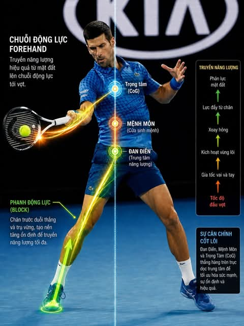

# Updated Tennis Future Lab Podcast Series.

**📅 Thứ Hai 01/06/2026 10:10**

Updated Tennis Future Lab Podcast Series.

** Season 12 - Tennis techniques analysis”

Episode 1: Automate your forehand with tensegrity:
https://rss.com/podcasts/the-power-of-now/2876327

Episode 2: Momentum in tennis - The physics of the pull-in paradox 
https://rss.com/podcasts/the-power-of-now/2876496

Episode 3: The Physics of the Dynamic Radius Forehand 
https://rss.com/podcasts/the-power-of-now/2876511

Episode 4: Why locked arms kill tennis power 
https://rss.com/podcasts/the-power-of-now/2876617

Episode 5: Elite Tennis Split Step Biomechanics 
https://rss.com/podcasts/the-power-of-now/2876645

Episode 6: The One-Handed Backhand Is a Whip
https://rss.com/podcasts/the-power-of-now/2876699

** Season 11 - Tennis posture analysis”

Episode 1: Why stopping creates effortless tennis power: https://rss.com/podcasts/the-power-of-now/2876156

Episode 2: How head position locks your knees: https://rss.com/podcasts/the-power-of-now/2876162

Episode 3: How Head Position Controls Your Balance:
https://rss.com/podcasts/the-power-of-now/2876173

Episode 4: Better Tennis Volleys with Tai Chi: 
https://rss.com/podcasts/the-power-of-now/2876194

Episode 5: Hit Harder with the C Shape Spring: 
https://rss.com/podcasts/the-power-of-now/2876206

Episode 6: Tennis Power Is Released Not Created: 
https://rss.com/podcasts/the-power-of-now/2876239

