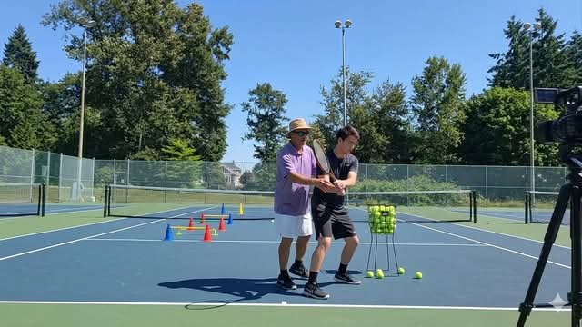

# Đường Bóng Và Tĩnh Lặng - Phần II

**📅 Thứ Tư 03/06/2026 06:48**

Đường Bóng Và Tĩnh Lặng - Phần II
Câu chuyện giữa Thầy An và người học trò Hải
---

(Họ bắt đầu tập với bóng thật. Thầy An feed bóng từ giỏ, Hải đánh từng quả. Tiếng bóng chạm vợt vang lên đều đặn trong buổi sáng yên tĩnh. Sau khoảng mười lăm phút,Thầy An dừng lại.)

Thầy An: Con cho Thầy xem cuốn sổ một chút.
(Hải lấy ra.Thầy An mở ra, lướt qua vài trang. Trang nào cũng chi chít chữ, mũi tên, sơ đồ. Ông đọc một lúc, không nói gì, rồi đưa lại.)
Thầy An: Tất cả những thứ trong này đều đúng.
Hải: (thoáng vui) Dạ, con nghiên cứu rất kỹ...
Thầy An: Tất cả đều đúng. Và tất cả đều không giúp ích gì cho con lúc bóng đang bay về phía con với tốc độ một trăm km một giờ.
Hải: (khựng lại) Ý Thầy là...
Thầy An: Ý Thầy là bóng không chờ con đọc ghi chép. Bóng không quan tâm con hiểu bao nhiêu lý thuyết. Bóng chỉ hỏi một câu duy nhất, và nó hỏi trong vòng chưa đến nửa giây: Con có ở đây không?
(Hải nhìn xuống cuốn sổ trong tay. Rồi nhìn ra sân. Rồi nhìn lên bầu trời xanh một thoáng, như vô tình.)
Hải: Thầy muốn nói con đang không... ở đây?
Thầy An: Con đang ở trong đầu con. Đó là một nơi khác hoàn toàn.

(Họ nghỉ giải lao ngắn.Thầy An ngồi xuống ghế băng bên cạnh sân, rót nước từ bình giữ nhiệt. Hải ngồi xuống bên cạnh, cuốn sổ vẫn cầm trong tay nhưng không mở ra. Phía trên đầu, vài đám mây trắng trôi qua chậm rãi, không vội vàng.)
Hải: Thầy ơi, con tập bốn năm rồi. Con xem video, đọc sách, đăng ký các khóa online. Con ghi chép rất cẩn thận. Nhưng con cảm giác mình đang giậm chân tại chỗ từ hơn một năm nay. Con không hiểu tại sao.
Thầy An: Con có nhớ lần đầu tiên con cầm vợt không?
Hải: Nhớ. Con chẳng biết gì cả. Đánh loạn xạ, bóng ra ngoài hết.
Thầy An: Nhưng con có vui không?
Hải: (dừng lại, nhớ lại) Vui lắm. Con cười suốt buổi đó dù đánh dở tệ.
Thầy An: Và bây giờ con đánh tốt hơn nhiều. Nhưng con có vui như vậy không?
(Câu hỏi đơn giản như viên đá ném xuống giếng. Hải nghe thấy tiếng vang vọng lên từ đâu đó sâu bên trong.)
Hải: (thành thật) Không. Bây giờ con hay bực bội hơn. Mỗi lần đánh hỏng là con tức với bản thân.
Thầy An: Vì sao?
Hải: Vì con biết lý thuyết. Con biết mình phải làm gì. Mà vẫn hỏng. Cảm giác đó tệ hơn là không biết gì.
Thầy An: Đúng vậy. Đó chính là cái bẫy. Kiến thức lý thuyết tạo ra khoảng cách giữa cái con biết phải làm và cái con thực sự đang làm. Khoảng cách đó, nếu không được xử lý đúng, sẽ trở thành nguồn gốc của sự bực bội liên tục.
Hải: Thì phải làm sao để xóa khoảng cách đó?
Thầy An: Không xóa. Đi qua.

Hải: Đi qua là sao, Thầy?
Thầy An: (nhìn ra sân một lúc trước khi trả lời) Con có biết Federer tập forehand bao nhiêu lần trong sự nghiệp không?
Hải: Hàng triệu lần chắc.
Thầy An: Hàng chục triệu. Và ở một thời điểm nào đó, forehand của anh ta ngừng là kỹ thuật. Nó trở thành một phần của hơi thở. Anh ta không nghĩ về điểm tiếp xúc khi đánh. Anh ta chỉ đánh. Vì tất cả những triệu lần lặp đi lặp lại đó đã chuyển kiến thức từ đầu óc xuống tay, từ tay xuống xương, từ xương vào phản xạ. Đó là hành trình. Không có đường tắt.
Hải: Nhưng con không có hàng chục triệu lần đó.
Thầy An: Không. Nhưng con có thể làm cho mỗi lần tập có giá trị gấp mười lần bình thường, hoặc bằng một phần mười. Tùy con chọn.
Hải: Tùy vào điều gì?
Thầy An: Tùy vào con có thật sự ở trên sân hay không. Hay con chỉ đang mang cơ thể ra sân trong khi tâm trí đang so sánh từng cú đánh với cuốn sổ trong đầu.

(Họ quay lại tập. Lần này Thầy An feed bóng chậm hơn, không nói gì. Tiếng bóng, tiếng vợt, tiếng gió nhẹ qua hàng cây bên ngoài sân. Hải đánh một hồi, rồi tự nhiên dừng lại.)
Hải: Thầy ơi, có điều kỳ lạ. Con vừa đánh một quả forehand mà con không nghĩ gì cả. Bóng vào rất sạch, rất đúng chỗ con muốn. Nhưng con không biết mình đã làm gì.
Thầy An: (nhặt thêm bóng vào giỏ, bình thản) Ừ.
Hải: Đó là... cái Thầy đang nói đến không?
Thầy An: Gần đúng. Đó là cửa ngõ. Chưa phải bên trong.
Hải: Sự khác biệt là gì?
Thầy An: Lần đó con không nghĩ, nhưng vì bất ngờ. Cơ thể hành động trước khi đầu óc kịp chen vào. Trí tuệ đích thực trong tennis là khi điều đó không còn là bất ngờ nữa. Khi không suy nghĩ là trạng thái bình thường, không phải ngoại lệ.
Hải: Bình thường không suy nghĩ? Nghe có vẻ... không thể.
Thầy An: Không phải không suy nghĩ gì cả. Mà là suy nghĩ không cản trở. Như nước chảy qua cống thông, không bị tắc nghẽn. Người Nhật gọi trạng thái đó là Mushin, tâm không kẹt. Con đang chơi tennis mà tâm trí đang kẹt trong cuốn sổ tay.
---

