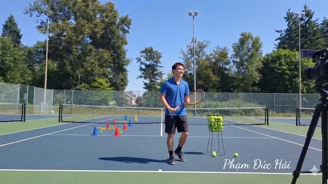

# Đường Bóng Và Tĩnh Lặng - Phần III

**📅 Thứ Tư 03/06/2026 06:54**

Đường Bóng Và Tĩnh Lặng - Phần III
Câu chuyện giữa Thầy An và người học trò Hải

----------------------------------------------------------
(Nắng đã lên cao hơn. Bóng hai người trên mặt sân ngắn dần lại. Hải ngồi xuống, uống nước, mặt có vẻ suy nghĩ nhiều hơn mệt mỏi.)

Hải: Thầy ơi, con muốn hỏi thật lòng. Con đang làm sai ở đâu? Không phải kỹ thuật. Mà cách con học.
Thầy An: (ngồi xuống đối diện, không vội trả lời) Con học tennis như học lập trình.
Hải: (khựng lại vì câu đó chạm đúng chỗ) Ý Thầy là...
Thầy An: Trong lập trình, nếu con viết đúng code, máy tính luôn luôn cho ra đúng kết quả. Mỗi lần, không ngoại lệ. Con đang cố áp dụng logic đó vào tennis. Con nghĩ nếu con nhớ đúng đủ quy tắc và thực thi chúng đúng thứ tự, bóng sẽ đi đúng chỗ mỗi lần.
Hải: Không phải vậy sao?
Thầy An: Tennis không phải máy tính. Bóng xoáy khác nhau mỗi lần. Mặt sân thay đổi. Gió thổi. Cơ thể con hôm nay không giống hôm qua. Đối thủ phản ứng theo cách không dự đoán trước được. Đây là hệ thống sống, không phải hệ thống tĩnh. Mà hệ thống sống thì không vận hành bằng code cứng nhắc. Nó vận hành bằng khả năng cảm nhận và thích ứng theo thời gian thực.
Hải: (thở dài) Bốn năm nay con đang cố compile một chương trình chạy trong một môi trường mà môi trường đó không bao giờ đứng yên đủ lâu để compile xong.
Thầy An: (nhìn Hải với ánh mắt hài lòng) Con tự nói ra được điều đó. Thầy không cần giải thích thêm.

Hải: Nhưng Thầy ơi, nếu không dùng kiến thức lý thuyết thì dùng gì? Chẳng lẽ chỉ ra sân đánh lung tung?
Thầy An: Có sự khác biệt lớn giữa đánh lung tung và đánh với sự chú ý trọn vẹn. (ông đứng dậy, ra giữa sân, cầm một quả bóng) Con nhìn quả bóng này đi.
(Hải nhìn.)
An: Con đang thấy gì?
Hải: Quả bóng vàng. Lông trắng. Có chữ Wilson.
Thầy An: (tung bóng lên, nhìn nó rơi xuống) Lần sau con nhìn bóng bay về phía mình trong lúc đánh, con thấy gì?
Hải: (suy nghĩ) Con thấy... con nghĩ về nơi mình sẽ đánh trả. Và về kỹ thuật mình cần dùng.
Thầy An: Con không thấy bóng. Con thấy kế hoạch. (dừng lại để câu đó thấm) Thử làm thế này. Buổi tập tới, mỗi khi bóng bay về phía con, thay vì nghĩ về kỹ thuật, con chỉ chú ý quan sát đường xoay của bóng. Bóng xoáy topspin hay slice? Nhanh hay chậm? Nảy cao hay thấp? Chỉ quan sát. Cơ thể con sẽ tự biết phải làm gì, nếu con cho nó cơ hội.
Hải: Con sẽ thử. Nhưng con chưa chắc tin vào điều đó.
Thầy An: Tốt. Đừng tin. Cứ thử. Tin hay không tin không quan trọng bằng trải nghiệm thực tế.

(Buổi sáng đã vào giữa ngày. Nắng thứ Bảy trải dài trên sân, vài người chơi khác bắt đầu ra sân bên cạnh, tiếng bóng đập vào mặt sân vang lên đều đặn. Hải nhìn họ một lúc.)
Hải: Thầy ơi, con thấy người đàn ông đánh ở sân số ba kia. Ông ta đánh không đẹp gì, kỹ thuật có nhiều chỗ sai theo sách, nhưng bóng ông ta đánh rất khó chịu. Con đã từng đánh với ông ta. Tại sao vậy?
Thầy An: (nhìn sang) Vì ông ta đang chơi tennis. Con đang chơi sách.
Hải: (im lặng một lúc) Câu đó nặng lắm Thầy.
Thầy An: Sự thật hay nặng hay nhẹ tùy thuộc vào việc con sẵn sàng nghe hay không. Nếu con sẵn sàng, nó nhẹ. Nếu con kháng cự, nó nặng như đá.
Hải: Con sẵn sàng. Mà thật ra con đã ngờ điều này từ lâu, chỉ không dám nhìn thẳng vào.
Thầy An: Đó là bước đầu tiên thật sự quan trọng. Không phải học thêm kỹ thuật mới. Mà là dám nhìn thẳng vào điều mình đang né tránh.

Hải: Thầy ơi, vậy từ giờ con phải làm gì? Bỏ hết ghi chép đi?
Thầy An: Không cần bỏ. Nhưng hãy thay đổi thứ tự. Trước đây con học lý thuyết trước rồi mang ra sân cố thực thi. Từ giờ hãy ra sân trước, đánh với sự chú ý trọn vẹn, rồi sau khi về nhà mới đọc lý thuyết. Khi đó lý thuyết sẽ giải thích những gì cơ thể con vừa trải nghiệm, thay vì chỉ huy cơ thể làm theo một kịch bản chưa có cảm giác thực.
Hải: Học từ trong ra ngoài, không phải từ ngoài vào trong.
Thầy An: Đúng vậy. Kỹ thuật đúng sẽ được cơ thể nhận ra khi con đọc về nó, thay vì bị cưỡng ép vào cơ thể từ bên ngoài. Sự nhận ra đó ngấm sâu hơn rất nhiều so với sự ghi nhớ.
Hải: Tại sao Thầy không nói điều này từ đầu?
Thầy An: (khẽ cười) Thầy đã nói. Nhiều lần. Nhưng hôm nay là lần đầu tiên con nghe.

(Hải im lặng. Một đám mây trắng trôi qua che bớt nắng một thoáng, rồi lại trôi đi. Anh nhìn lên bầu trời một lúc, ánh mắt khác với lúc đến, ít bận rộn hơn.)
Hải: Thầy ơi, con muốn hỏi một điều mà con biết là không có câu trả lời gọn ghẽ. Thầy có bao giờ... hết yêu tennis không?
Thầy An: (dừng lại, nhìn Hải với ánh mắt nghiêm túc) Có. Một lần. Khi Thầy bắt đầu coi tennis là công cụ để chứng minh bản thân. Thay vì là cuộc trò chuyện với bóng, với sân, với đối thủ. Khi đó mỗi buổi tập trở thành một bài thi. Và Thầy ghét thi.
Hải: Thầy tìm lại được tình yêu đó như thế nào?
Thầy An: Thầy thua một trận đấu rất tệ, trước người mà Thầy lẽ ra phải thắng dễ dàng. Sau trận đó Thầy ngồi một mình ở sân, trời tối, không ai còn ở đó nữa. Và Thầy bắt đầu đánh bóng vào tường, một mình, không có đối thủ, không có tỷ số. Đánh một tiếng đồng hồ. Đến một lúc nào đó Thầy nhận ra mình đang cười. Không biết từ lúc nào.
Hải: (nhỏ giọng) Tiếng bóng vào tường.
Thầy An: Đúng. Tiếng đó không phán xét. Không so sánh. Không đòi hỏi. Chỉ phản hồi trung thực những gì con gửi vào. Đó là người thầy tốt nhất Thầy từng có.

(Hải cầm vợt, chuẩn bị ra về. Anh nhìn cuốn sổ tay lần cuối, rồi bỏ vào túi vợt, kéo dây khóa lại không vội vàng.)
Hải: Thầy ơi, hôm nay con đến với đầu đầy câu trả lời. Con ra về với... (nhìn xuống bàn tay trống) nhiều câu hỏi hơn.
An: Câu hỏi tốt hay câu hỏi xấu?
Hải: (suy nghĩ một chút) Câu hỏi nhẹ hơn. Trước đây câu hỏi của con toàn là "tại sao mình chưa đủ giỏi." Bây giờ câu hỏi là "mình đang thật sự cảm nhận gì khi đánh bóng." Khác nhau lạ lắm Thầy.
Thầy An: Câu hỏi đầu nhìn vào khoảng cách giữa con và đích đến. Câu hỏi sau nhìn vào khoảnh khắc con đang đứng. Một cái tạo ra lo lắng. Một cái tạo ra chú ý. Chỉ có chú ý mới dẫn đến tiến bộ thật sự.

Hải đi ra cổng sân. Anh dừng lại một giây, quay nhìn lại mặt sân trong nắng thứ Bảy đang lên cao, những vạch trắng sáng rõ, bầu trời xanh nguyên một màu không gợn.
Anh nghĩ đến bốn năm cầm vợt. Hàng trăm buổi tập. Hàng trăm trang ghi chép.
Và lần đầu tiên, anh không cảm thấy tiếc vì những điều đó. Chúng là những gì cần phải có để anh đứng ở đây, vào buổi sáng này, nghe được điều mình cần nghe.
Trên đường về, anh không bật podcast tennis. Không mở YouTube. Chỉ lái xe trong im lặng, nghe tiếng động cơ, nghe tiếng gió qua cửa sổ, nhìn những đám mây trắng trôi trên nền trời xanh.
Và trong im lặng đó, lạ thay, anh bắt đầu cảm nhận lại được điều gì đó mà anh tưởng đã mất từ lâu.
Cái cảm giác muốn ra sân.
Không phải để tập. Chỉ để chơi.

"Người ta không thể dạy bất cứ điều gì cho ai. Người ta chỉ có thể giúp họ tìm thấy những gì đã có sẵn bên trong."

Và trên sân tennis dưới bầu trời xanh buổi sáng thứ Bảy, người thầy tốt nhất không phải là người nói nhiều nhất. Mà là người biết im lặng đúng lúc để tiếng bóng lên tiếng thay.

